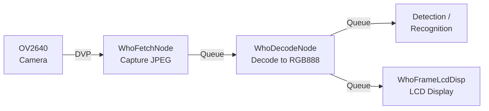

## Assignment 2: Camera sensor introduction

Before running any AI model, it is important to understand how the camera works on the ESP32-S3-EYE. In this assignment you will learn about the OV2640 sensor, the key configuration parameters, and how ESP-WHO builds an asynchronous capture pipeline on top of the camera driver. You will then run a live camera preview to verify that everything is working before adding inference in later assignments.

---

## The OV2640 sensor

The ESP32-S3-EYE uses the **OV2640** image sensor from OmniVision. It is a 2-megapixel sensor connected to the ESP32-S3 via the DVP (Digital Video Port) interface.

| Parameter | Value |
|-----------|-------|
| Resolution | Up to 1600x1200 (UXGA) |
| Field of view | 66.5° |
| Interface | DVP (8-bit parallel) |
| Output formats | JPEG, RGB565, YUV422, Grayscale |
| Lens size | 1/4" |

### Choosing a resolution

The OV2640 supports a wide range of output resolutions. For AI applications, higher resolution means more detail but also more memory usage and slower inference. In practice, vision models on the ESP32-S3 are trained on small inputs, so capturing at a lower resolution is both faster and sufficient.

| Frame size | Resolution | Typical use |
|------------|------------|-------------|
| QQVGA | 160x120 | Very constrained memory |
| QVGA | 320x240 | Face detection, gesture recognition |
| HVGA | 480x320 | Face recognition, object detection |
| VGA | 640x480 | Higher accuracy, more memory required |
| UXGA | 1600x1200 | Full sensor resolution, not suitable for real-time AI |

> [!TIP]
> ESP-WHO examples for the ESP32-S3-EYE use **HVGA (480x320)** by default. This gives a good balance between image quality and processing speed.

### Choosing a pixel format

The OV2640 can output frames in several pixel formats. The format you choose affects memory usage, bus bandwidth, and how frames need to be processed before being fed to a model.

| Format | Description | Used for |
|--------|-------------|----------|
| JPEG | Compressed image | Camera capture (reduces bus bandwidth) |
| RGB565 | 16-bit color, 2 bytes per pixel | Direct display |
| RGB888 | 24-bit color, 3 bytes per pixel | Model inference input |
| YUV422 | Luminance + chrominance | Some detection models |
| Grayscale | 8-bit luminance only | Simple detection tasks |

In ESP-WHO, the camera always captures in **JPEG** format. The compressed frame is then decoded into **RGB888** by a separate pipeline node before being passed to the detection model. This approach keeps the DVP bus load low and allows higher frame rates.

---

## The ESP-WHO camera pipeline

ESP-WHO uses an asynchronous, node-based pipeline to capture and prepare frames. Each node runs as a FreeRTOS task and passes frames to the next node via a queue.



### Pipeline nodes

**WhoFetchNode** is the entry point of the pipeline. It captures raw JPEG frames from the camera driver and places them in a ring buffer. It runs continuously on one core, independent of inference.

**WhoDecodeNode** receives a JPEG frame from `WhoFetchNode` and decodes it into the pixel format required by the model (typically RGB888). Decoding happens in software on the ESP32-S3.

**WhoFrameLcdDisp** takes the decoded frame, draws any detection overlays (bounding boxes, labels), and renders the result on the ST7789 LCD display via LVGL.

The key benefit of this design is that the camera keeps capturing at full speed regardless of how long inference takes on any given frame.

---

## Step 1: Run the camera display example

Before adding AI, let's verify that the camera is working correctly by running the ESP-BSP camera display example. This example streams live video from the OV2640 directly to the LCD display, with no inference involved.

Navigate to the example:

```bash
cd esp-bsp/examples/display_camera_video
```

Configure and build for the ESP32-S3-EYE:

```bash
idf.py -DSDKCONFIG_DEFAULTS=sdkconfig.bsp.esp32_s3_eye set-target esp32s3
idf.py build
```

Flash and monitor:

```bash
idf.py -p <PORT> flash monitor
```

> [!NOTE]
> Replace `<PORT>` with the serial port your ESP32-S3-EYE is connected to. On Linux it is typically `/dev/ttyUSB0` or `/dev/ttyACM0`, on macOS `/dev/cu.usbmodem*`, and on Windows `COM3` or similar.

You should see a live camera feed on the 1.3" LCD display. Point the camera at different objects and check that the image is clear and well-exposed.

---

## Step 2: Inspect the camera configuration

Open the example's main source file and look at how the camera is initialized through the BSP:

```c
#include "bsp/esp32_s3_eye.h"

bsp_camera_config_t camera_config = {
    .frame_size = FRAMESIZE_HVGA,    // 480x320
    .pixel_format = PIXFORMAT_JPEG,
    .jpeg_quality = 12,              // 0-63, lower = better quality
    .fb_count = 2,
};

bsp_camera_init(&camera_config);
```

The BSP handles all pin assignments for the OV2640 automatically. You only need to choose the resolution, format, JPEG quality, and number of frame buffers.

### Frame buffer count

| fb_count | Behavior |
|----------|----------|
| 1 | Driver waits for VSYNC before each capture. Lower CPU load, lower frame rate. |
| 2+ | Continuous DMA mode. Higher frame rate, more memory used. Recommended for JPEG. |

For ESP-WHO examples, `fb_count = 2` is the default to maximize throughput.

---

## Exercise: Match the camera resolution to the LCD

The LCD on the ESP32-S3-EYE is **240x240 pixels**. The default camera output in the BSP example is typically larger (QVGA 320x240 or HVGA 480x320), so the example scales the image to fit using aspect-ratio fitting. In this exercise, you will explicitly set the capture resolution closer to the LCD size to reduce memory usage and DVP bus traffic.

### Background

The example uses the V4L2 API to configure the camera. Resolution is set by calling `VIDIOC_S_FMT` with the desired width and height. Open `main/app_video.c` and look at the `app_video_open()` function:

```c
// Current: only changes pixel format, keeps sensor-default resolution
if (init_fmt != APP_VIDEO_FMT_DRIVER_DEFAULT &&
    default_format.fmt.pix.pixelformat != (uint32_t)init_fmt) {
    struct v4l2_format format = {
        .type = type,
        .fmt.pix.width  = default_format.fmt.pix.width,   // keeps default
        .fmt.pix.height = default_format.fmt.pix.height,  // keeps default
        .fmt.pix.pixelformat = init_fmt,
    };
    ioctl(fd, VIDIOC_S_FMT, &format);
}
```

### Task

Modify `app_video_open()` to request a 320x240 (QVGA) resolution, which matches the height of the LCD and reduces the frame buffer size compared to HVGA:

```c
// After the existing VIDIOC_G_FMT call, add:
struct v4l2_format format = {
    .type = type,
    .fmt.pix.width       = 320,
    .fmt.pix.height      = 240,
    .fmt.pix.pixelformat = default_format.fmt.pix.pixelformat,
};

if (ioctl(fd, VIDIOC_S_FMT, &format) != 0) {
    ESP_LOGW(TAG, "Could not set resolution, keeping sensor default");
}
```

> [!NOTE]
> The OV2640 supports standard resolutions such as QQVGA (160x120), QVGA (320x240), HVGA (480x320), and VGA (640x480). Setting an arbitrary resolution may result in the driver rounding to the nearest supported size.

### Build and observe

Rebuild and flash:

```bash
idf.py build flash monitor
```

In the serial monitor output you should see the negotiated resolution printed by `app_video_open`:

```
width=320 height=240
```

Observe the live preview on the LCD. With the smaller frame size, the image is centered on the 240x240 display with minimal letterboxing on the sides.

### Questions to consider

- How does lowering the resolution affect the frame rate? Watch the serial log for any timing information.
- What trade-off are you making between image detail and processing speed?
- Why is capturing at a resolution close to the LCD size useful when no AI inference is running, but the same reasoning may not apply once you add face detection?

---

## What you learned

In this assignment you:

- Learned about the OV2640 sensor capabilities and the resolution/format trade-offs for AI applications
- Understood how ESP-WHO's node-based asynchronous pipeline separates capture, decoding, and inference
- Ran a live camera preview on the ESP32-S3-EYE to verify the hardware is working

## Next step

Now that the camera is working, it is time to add the first AI model. In the next assignment you will run face detection in real time using ESP-WHO.

[Assignment 3: ESP-WHO - Working with face detection](../assignment-3)
