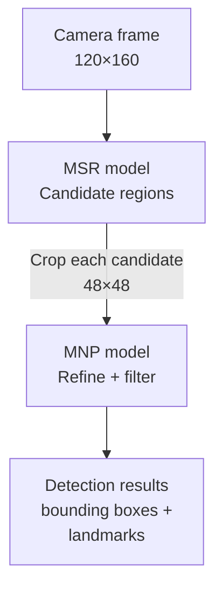

## Assignment 2: ESP-WHO - Working with face detection

In this assignment you will run the ESP-WHO face detection and recognition example on the ESP32-S3-EYE, explore how the face detection model works, and then modify the application to light up the onboard LED whenever a face is detected in the camera frame.

> [!NOTE]
> ESP-WHO uses a two-step approach: **face detection** locates faces in a frame and returns bounding boxes, then **face recognition** identifies whose face it is. This assignment covers **face detection only**. Recognition will be added in Assignment 3.

---

## The face detection model

ESP-WHO uses the `HumanFaceDetect` class from [ESP-DL](https://github.com/espressif/esp-dl/tree/master/models/human_face_detect) as its detection backend. Three model variants are available, selectable via `menuconfig`:

| Model | Type | Input size | Latency on ESP32-S3 | mAP50-95 |
|-------|------|------------|---------------|----------|
| `MSR_S8_V1` + `MNP_S8_V1` (default) | Two-stage | 120×160, then 48×48 per candidate | ~37 ms | 0.367 |
| `ESPDET_PICO_224_224_FACE` | One-stage | 224×224 | ~132 ms | 0.504 |
| `ESPDET_PICO_416_416_FACE` | One-stage | 416×416 | ~437 ms | 0.598 |

**mAP50-95** (Mean Average Precision at IoU thresholds from 0.50 to 0.95) is the standard accuracy metric for object detection models. It measures how well a model localizes and classifies objects across a range of overlap thresholds between predicted and ground-truth bounding boxes. A higher value means more accurate detections — the one-stage models score higher because they process a larger input and apply a single, more precise network, while the two-stage default trades some accuracy for significantly lower latency.

All three models use **8-bit quantization** and run entirely on the ESP32-S3's CPU using the ESP-DL inference engine.

### How the two-stage default model works

The default `MSRMNP_S8_V1` runs two lightweight neural networks in sequence:

1. **MSR (Multi-Scale Regression)** receives the full camera frame downscaled to 120×160 and quickly scans it to produce a list of candidate face regions. This stage is fast but intentionally imprecise — its job is to filter out most of the background.

2. **MNP (Multi-level Non-Maximum suppression and Pooling)** takes each candidate region, crops and resizes it to 48×48, and makes a more precise judgement on whether it actually contains a face. This stage refines the bounding box and filters out false positives.

This cascade design keeps the overall latency low: MSR takes ~33 ms for the whole frame on ESP32-S3, and MNP adds only ~6 ms per surviving candidate. In practice, when one face is in frame, the total detection time is around 37–40 ms per frame.



### Detection result structure

Each detected face produces a `dl::detect::result_t` entry containing:

- **Bounding box** (`box[4]`): `[x1, y1, x2, y2]` in pixel coordinates relative to the input frame.
- **Confidence score** (`score`): A float between 0.0 and 1.0. Only results above the threshold (default 0.5) are returned.
- **Keypoints** (`keypoint[10]`): Five facial landmarks — left eye, right eye, nose tip, left mouth corner, right mouth corner — each as an `(x, y)` pair. These are used later by the recognition model to align the face crop before extracting features.

```cpp
// One result per detected face
for (const auto &face : result.det_res) {
    ESP_LOGI(TAG, "box: [%d, %d, %d, %d], score: %.2f",
             face.box[0], face.box[1], face.box[2], face.box[3],
             face.score);
}
```

---

## Step 1: Run the face recognition example

Navigate to the face recognition example:

```bash
cd esp-who/examples/human_face_recognition
```

Configure for the ESP32-S3-EYE:

```bash
idf.py -DSDKCONFIG_DEFAULTS=sdkconfig.bsp.esp32_s3_eye set-target esp32s3
```

Build and flash:

```bash
idf.py build flash monitor
```

> [!TIP]
> If you get a build error such as `'led_indicator_handle_t' was not declared in this scope`, open `main/app_main.cpp` and add the missing BSP include at the top of the file:
> ```cpp
> #include "bsp/esp32_s3_eye.h"
> ```
> Then rebuild.

You should see the live camera stream on the LCD. Point the camera at your face and a **red bounding box** will appear around it.

### Button controls

The ESP32-S3-EYE has physical buttons that control the recognition workflow:

| Button | Action |
|--------|--------|
| UP+ | Enroll the currently detected face (assigns a new ID) |
| PLAY | Run recognition (match current face against enrolled faces) |
| DOWN- | Delete the last enrolled face |

At this stage, just observe face **detection** — the red bounding box appearing and tracking your face. You do not need to enroll or recognize yet.

---

## Step 2: Understand the detection callback

Open `components/who_app/who_recognition_app/who_recognition_app_lcd.hpp`. You will see that `WhoRecognitionAppLCD` exposes two virtual callbacks:

```cpp
class WhoRecognitionAppLCD : public WhoRecognitionAppBase {
public:
    ...
protected:
    virtual void detect_result_cb(const detect::WhoDetect::result_t &result);
    virtual void recognition_result_cb(const std::string &result);
    ...
};
```

The `detect_result_cb()` is called after every inference cycle, regardless of whether a face was found. The `result` parameter contains:

```cpp
struct result_t {
    std::list<dl::detect::result_t> det_res;  // one entry per detected face
    dl::image::img_t img;                      // the frame that was analyzed
    struct timeval timestamp;
};
```

If `det_res` is empty, no face was detected. If it has one or more entries, that many faces are visible in the frame.

---

## Exercise: Light up the LED on face detection

The ESP32-S3-EYE has a green LED on GPIO3, already initialized by the example in `app_main.cpp`:

```cpp
#ifdef BSP_BOARD_ESP32_S3_EYE
    ESP_ERROR_CHECK(bsp_leds_init());
    ESP_ERROR_CHECK(bsp_led_set(BSP_LED_GREEN, false));
#endif
```

> [!NOTE]
> `bsp_leds_init()` and `bsp_led_set(BSP_LED_GREEN, ...)` are the LED API used by the BSP version pinned in the ESP-WHO repository. The current standalone ESP-BSP uses a newer `led_indicator`-based API (`bsp_led_indicator_create()`). Since you are building inside the ESP-WHO project, which manages its own BSP dependency version, the code above will compile correctly without any changes.

Your task is to turn this LED on when at least one face is detected, and off when no face is visible.

### Task: Subclass WhoRecognitionAppLCD

Add the `FaceDetectLED` subclass directly inside `main/app_main.cpp`, above `app_main()`. There is no need to create a separate header file since this class is only used in one place:

```cpp
#include "frame_cap_pipeline.hpp"
#include "who_recognition_app_lcd.hpp"
#include "who_recognition_app_term.hpp"
#include "who_spiflash_fatfs.hpp"
#include "bsp/esp32_s3_eye.h"   // add this for LED API

using namespace who::frame_cap;
using namespace who::app;
using namespace who::detect;

// Subclass defined in the same file — no header needed for a single-use class
class FaceDetectLED : public WhoRecognitionAppLCD {
public:
    FaceDetectLED(WhoFrameCap *frame_cap)
        : WhoRecognitionAppLCD(frame_cap) {}

protected:
    void detect_result_cb(const WhoDetect::result_t &result) override
    {
        // Call the base class to keep bounding boxes on the display
        WhoRecognitionAppLCD::detect_result_cb(result);

        // Turn the LED on when at least one face is detected
        bool face_found = !result.det_res.empty();
        bsp_led_set(BSP_LED_GREEN, face_found);
    }
};

extern "C" void app_main(void)
{
    vTaskPrioritySet(xTaskGetCurrentTaskHandle(), 5);
#if CONFIG_DB_FATFS_FLASH
    ESP_ERROR_CHECK(fatfs_flash_mount());
#elif CONFIG_DB_SPIFFS
    ESP_ERROR_CHECK(bsp_spiffs_mount());
#endif
#if CONFIG_DB_FATFS_SDCARD || CONFIG_HUMAN_FACE_DETECT_MODEL_IN_SDCARD || CONFIG_HUMAN_FACE_FEAT_MODEL_IN_SDCARD
    ESP_ERROR_CHECK(bsp_sdcard_mount());
#endif

#ifdef BSP_BOARD_ESP32_S3_EYE
    ESP_ERROR_CHECK(bsp_leds_init());
    ESP_ERROR_CHECK(bsp_led_set(BSP_LED_GREEN, false));
#endif

#if CONFIG_IDF_TARGET_ESP32S3
    auto frame_cap = get_dvp_frame_cap_pipeline();
#elif CONFIG_IDF_TARGET_ESP32P4
    auto frame_cap = get_mipi_csi_frame_cap_pipeline();
#endif
    auto recognition_app = new FaceDetectLED(frame_cap);  // only this line changes
    recognition_app->run();
}
```

### Build and test

Rebuild and flash:

```bash
idf.py build flash monitor
```

> [!NOTE]
> You may see `E dl::recognition::DataBase: Failed to open db` on the first boot. This is expected: the file `/spiflash/face.db` does not exist yet, so the recognizer creates a fresh empty database. Face detection works normally and the message disappears on subsequent boots.

Point the camera at your face. The green LED should turn on as soon as the bounding box appears, and turn off when you move out of frame.

> [!TIP]
> If the LED flickers, it is because the detection result alternates between empty and non-empty on borderline frames. This is normal behavior. In a real application you would add hysteresis (for example, only turn the LED off after N consecutive frames with no detection).

---

## What you learned

In this assignment you:

- Ran the ESP-WHO face recognition example and understood the two-stage pipeline (detect then recognize)
- Explored how `detect_result_cb()` exposes per-frame detection results
- Extended the application by subclassing `WhoRecognitionAppLCD` directly inside `app_main.cpp` to add LED feedback on face detection, without modifying the framework or creating extra files

## Next step

Now that you can detect faces, the next assignment goes further and adds face enrollment and recognition.

[Assignment 3: Face recognition with ESP-WHO](../assignment-3)
