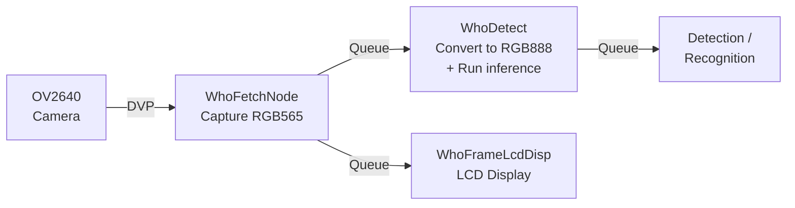

## Assignment 2: Camera sensor introduction

Every vision AI application starts with a camera. The quality, resolution, and format of the captured frame directly affect what the model sees and how accurately it can reason about it. Before writing a single line of inference code, it is worth understanding what the camera on the ESP32-S3-EYE can do, how it communicates with the chip, and how ESP-WHO turns a raw sensor into a stream of frames ready for AI processing.

Before running any AI model, it is important to understand how the camera works on the ESP32-S3-EYE. In this assignment you will learn about the OV2640 sensor, the key configuration parameters, and how ESP-WHO builds an asynchronous capture pipeline on top of the camera driver. You will then run a live camera preview to verify that everything is working before adding inference in later assignments.

---

## The OV2640 sensor

The ESP32-S3-EYE uses the **OV2640** image sensor from OmniVision. It is a 2-megapixel sensor connected to the ESP32-S3 via the DVP (Digital Video Port) interface.

| Parameter | Value |
|-----------|-------|
| Resolution | Up to 1600x1200 (UXGA) |
| Field of view | 66.5° |
| Interface | DVP (8-bit parallel) |
| Output formats | JPEG, RGB565, YUV422, Grayscale |
| Lens size | 1/4" |

### Choosing a resolution

The OV2640 supports a wide range of output resolutions. For AI applications, higher resolution means more detail but also more memory usage and slower inference. In practice, vision models on the ESP32-S3 are trained on small inputs, so capturing at a lower resolution is both faster and sufficient.

| Frame size | Resolution | Typical use |
|------------|------------|-------------|
| QQVGA | 160x120 | Very constrained memory |
| QVGA | 320x240 | Face detection, gesture recognition |
| HVGA | 480x320 | Face recognition, object detection |
| VGA | 640x480 | Higher accuracy, more memory required |
| UXGA | 1600x1200 | Full sensor resolution, not suitable for real-time AI |

> [!TIP]
> ESP-WHO examples for the ESP32-S3-EYE use **HVGA (480x320)** by default. This gives a good balance between image quality and processing speed.

### Choosing a pixel format

The OV2640 can output frames in several pixel formats. The format you choose affects memory usage, bus bandwidth, and how frames need to be processed before being fed to a model.

| Format | Description | Used for |
|--------|-------------|----------|
| JPEG | Compressed image | Bandwidth-efficient capture (not the default in ESP-WHO on ESP32-S3) |
| RGB565 | 16-bit color, 2 bytes per pixel | Default capture format in ESP-WHO; direct display |
| RGB888 | 24-bit color, 3 bytes per pixel | Model inference input (converted from RGB565 in the pipeline) |
| YUV422 | Luminance + chrominance | Some detection models |
| Grayscale | 8-bit luminance only | Simple detection tasks |

In ESP-WHO on the ESP32-S3-EYE, the camera captures frames in **RGB565** format directly via the V4L2 API. This avoids the overhead of JPEG compression and software decoding on the CPU. Before being passed to a detection model, the pipeline converts the RGB565 frame to **RGB888**, which is the format expected by ESP-DL inference models.

---

## The ESP-WHO camera pipeline

ESP-WHO uses an asynchronous, node-based pipeline to capture and prepare frames. Each node runs as a FreeRTOS task and passes frames to the next node via a queue.



### Pipeline nodes

**WhoFetchNode** is the entry point of the pipeline. It captures raw RGB565 frames from the camera driver via the V4L2 interface and places them in a queue. It runs continuously on one core, independent of inference.

**WhoDetect** receives an RGB565 frame, converts it to RGB888 in memory (the format expected by ESP-DL models), and runs inference. The conversion happens before inference on the ESP32-S3.

**WhoFrameLcdDisp** takes the decoded frame, draws any detection overlays (bounding boxes, labels), and renders the result on the ST7789 LCD display via LVGL.

The key benefit of this design is that the camera keeps capturing at full speed regardless of how long inference takes on any given frame.

---

## Step 1: Run the camera display example

Before adding AI, let's verify that the camera is working correctly by running the ESP-BSP camera display example. This example streams live video from the OV2640 directly to the LCD display, with no inference involved.

Create the project using the IDF component manager:

```bash
idf.py create-project-from-example "espressif/esp32_s3_eye=6.0.0:display_camera_video"
```

This downloads the example from the ESP Component Registry and creates a new `display_camera_video` directory with all dependencies configured. Navigate into it:

```bash
cd display_camera_video
```

Set the target, build, and flash:

```bash
idf.py set-target esp32s3
idf.py build flash monitor
```

You should see a live camera feed on the 1.3" LCD display. Point the camera at different objects and check that the image is clear and well-exposed.

---

## Step 2: Inspect the camera configuration

Open the example's main source file and look at how the camera is initialized through the BSP:

```c
#include "bsp/esp32_s3_eye.h"

bsp_camera_config_t camera_config = {
    .frame_size = FRAMESIZE_HVGA,    // 480x320
    .pixel_format = PIXFORMAT_JPEG,
    .jpeg_quality = 12,              // 0-63, lower = better quality
    .fb_count = 2,
};

bsp_camera_init(&camera_config);
```

The BSP handles all pin assignments for the OV2640 automatically. You only need to choose the resolution, format, JPEG quality, and number of frame buffers.

### Frame buffer count

| fb_count | Behavior |
|----------|----------|
| 1 | Driver waits for VSYNC before each capture. Lower CPU load, lower frame rate. |
| 2+ | Continuous DMA mode. Higher frame rate, more memory used. Recommended for JPEG. |

For ESP-WHO examples, `fb_count = 2` is the default to maximize throughput.

---

## Step 3: Getting a camera frame

Once the camera is running, frames are retrieved using the V4L2 **dequeue / requeue** cycle. The driver manages a ring of frame buffers and signals when a new frame is ready.

### Where frames are stored

All frame buffers are allocated in **PSRAM** (the 8 MB Octal PSRAM on the ESP32-S3-EYE). The internal SRAM (512 KB) is far too small — a single QVGA RGB565 frame already occupies 320 × 240 × 2 = **150 KB**. With two buffers at HVGA, that is approximately 600 KB in PSRAM. The DMA engine writes each captured frame directly into PSRAM, then the V4L2 driver marks it as ready for the application.

### The dequeue / requeue cycle

The complete flow to read a frame from the V4L2 camera driver looks like this:

```c
#include <fcntl.h>
#include <sys/ioctl.h>
#include <sys/mmap.h>
#include <linux/videodev2.h>
#include "esp_log.h"

static const char *TAG = "camera";

// 1. Open the DVP camera device (registered by BSP on initialisation)
int fd = open("/dev/video2", O_RDWR);
assert(fd >= 0);

// 2. Request two memory-mapped buffers from the driver
struct v4l2_requestbuffers req = {
    .count  = 2,
    .type   = V4L2_BUF_TYPE_VIDEO_CAPTURE,
    .memory = V4L2_MEMORY_MMAP,
};
ioctl(fd, VIDIOC_REQBUFS, &req);

// 3. Map each buffer into the application address space and enqueue it
void *buf_ptrs[2];
for (int i = 0; i < 2; i++) {
    struct v4l2_buffer buf = {
        .index  = i,
        .type   = V4L2_BUF_TYPE_VIDEO_CAPTURE,
        .memory = V4L2_MEMORY_MMAP,
    };
    ioctl(fd, VIDIOC_QUERYBUF, &buf);

    // mmap maps the driver-allocated PSRAM buffer into the application's
    // virtual address space — no copy, zero overhead
    buf_ptrs[i] = mmap(NULL, buf.length, PROT_READ | PROT_WRITE,
                        MAP_SHARED, fd, buf.m.offset);

    ioctl(fd, VIDIOC_QBUF, &buf);   // hand the buffer back to the driver
}

// 4. Start the capture stream
int type = V4L2_BUF_TYPE_VIDEO_CAPTURE;
ioctl(fd, VIDIOC_STREAMON, &type);

// 5. Capture loop: dequeue → read → requeue
while (true) {
    struct v4l2_buffer buf = {
        .type   = V4L2_BUF_TYPE_VIDEO_CAPTURE,
        .memory = V4L2_MEMORY_MMAP,
    };

    // Block until the driver has a completed frame ready
    ioctl(fd, VIDIOC_DQBUF, &buf);

    // buf.index     → which buffer slot (0 or 1)
    // buf.bytesused → actual number of bytes written by the sensor
    uint8_t *frame = (uint8_t *)buf_ptrs[buf.index];
    size_t   size  = buf.bytesused;

    // The frame is now in PSRAM at `frame`, RGB565, size bytes long.
    // Example: read the first pixel (top-left corner)
    uint16_t pixel_rgb565 = ((uint16_t)frame[0] << 8) | frame[1];
    ESP_LOGI(TAG, "Top-left pixel (RGB565): 0x%04X  frame size: %u bytes",
             pixel_rgb565, size);

    // Return the buffer to the driver for the next capture
    ioctl(fd, VIDIOC_QBUF, &buf);
}
```

The key points:

- **`VIDIOC_REQBUFS`** allocates the frame buffers in the driver. The driver places them in PSRAM automatically on the ESP32-S3-EYE.
- **`mmap`** maps each PSRAM buffer directly into the application's address space. There is no copy — `frame` is a pointer straight into PSRAM.
- **`VIDIOC_DQBUF`** blocks until a new frame is available, then returns its index and size.
- **`VIDIOC_QBUF`** hands the buffer back so the driver can fill it with the next frame. If you forget to requeue, the driver stalls.

> [!NOTE]
> In the `display_camera_video` example, all of this setup is handled by the `app_video` helper functions inside `main/app_video.c`. You do not need to write this boilerplate yourself — it is shown here to explain what is happening underneath the helper API.

The application must requeue every buffer promptly. If all buffers are held by the application, the driver stalls and no new frames are captured.

### Is the frame format ready for ESP-WHO?

Not directly. The frame captured here is in **RGB565** (16-bit, 2 bytes per pixel). ESP-DL inference models expect **RGB888** (24-bit, 3 bytes per pixel). When you move to ESP-WHO in Assignment 3, the framework handles this conversion internally — `WhoDetect` converts each RGB565 frame to RGB888 before passing it to the model. For the display-only example in this assignment, the RGB565 frame is sent straight to the ST7789 LCD, which natively accepts RGB565 and requires no conversion.

| Destination | Accepts RGB565 directly? | Notes |
|-------------|:------------------------:|-------|
| ST7789 LCD | Yes | Native format, no conversion needed |
| ESP-DL model | No | Requires RGB888; ESP-WHO converts internally |

---

## Exercise: Match the camera resolution to the LCD

The LCD on the ESP32-S3-EYE is **240x240 pixels**. The default camera output in the BSP example is typically larger (QVGA 320x240 or HVGA 480x320), so the example scales the image to fit using aspect-ratio fitting. In this exercise, you will explicitly set the capture resolution closer to the LCD size to reduce memory usage and DVP bus traffic.

### Background

The example uses the V4L2 API to configure the camera. Resolution is set by calling `VIDIOC_S_FMT` with the desired width and height.

`ioctl(fd, VIDIOC_S_FMT, &format)` is a standard POSIX system call used to control device drivers:

- **`fd`** — the file descriptor returned by `open("/dev/video2", O_RDWR)`. It represents the open camera device.
- **`VIDIOC_S_FMT`** — the request code. `S` stands for *set*; this tells the driver to apply the format described in the third argument. The complementary call `VIDIOC_G_FMT` (*get*) reads the current format without changing it.
- **`&format`** — a pointer to a `struct v4l2_format` that specifies the desired capture type, pixel format, width, and height. The driver may round the values to the nearest supported size and writes the negotiated result back into the same struct.

Open `main/app_video.c` and look at the `app_video_open()` function:

```c
// Current: only changes pixel format, keeps sensor-default resolution
if (init_fmt != APP_VIDEO_FMT_DRIVER_DEFAULT &&
    default_format.fmt.pix.pixelformat != (uint32_t)init_fmt) {
    struct v4l2_format format = {
        .type = type,
        .fmt.pix.width  = default_format.fmt.pix.width,   // keeps default
        .fmt.pix.height = default_format.fmt.pix.height,  // keeps default
        .fmt.pix.pixelformat = init_fmt,
    };
    ioctl(fd, VIDIOC_S_FMT, &format);
}
```

### Task

Modify `app_video_open()` to request a 320x240 (QVGA) resolution, which matches the height of the LCD and reduces the frame buffer size compared to HVGA:

```c
// After the existing VIDIOC_G_FMT call, add:
struct v4l2_format format = {
    .type = type,
    .fmt.pix.width       = 320,
    .fmt.pix.height      = 240,
    .fmt.pix.pixelformat = default_format.fmt.pix.pixelformat,
};

if (ioctl(fd, VIDIOC_S_FMT, &format) != 0) {
    ESP_LOGW(TAG, "Could not set resolution, keeping sensor default");
}
```

> [!NOTE]
> The OV2640 supports standard resolutions such as QQVGA (160x120), QVGA (320x240), HVGA (480x320), and VGA (640x480). Setting an arbitrary resolution may result in the driver rounding to the nearest supported size.

### Build and observe

Rebuild and flash:

```bash
idf.py build flash monitor
```

In the serial monitor output you should see the negotiated resolution printed by `app_video_open`:

```
width=320 height=240
```

Observe the live preview on the LCD. With the smaller frame size, the image is centered on the 240x240 display with minimal letterboxing on the sides.

### Questions to consider

- How does lowering the resolution affect the frame rate? Watch the serial log for any timing information.
- What trade-off are you making between image detail and processing speed?
- Why is capturing at a resolution close to the LCD size useful when no AI inference is running, but the same reasoning may not apply once you add face detection?

---

## What you learned

In this assignment you:

- Learned about the OV2640 sensor capabilities and the resolution/format trade-offs for AI applications
- Understood how ESP-WHO's node-based asynchronous pipeline separates capture, decoding, and inference
- Learned how the V4L2 dequeue/requeue cycle works and that frame buffers are stored in PSRAM
- Understood why RGB565 frames from the camera are not directly ready for inference and how ESP-WHO bridges that gap
- Ran a live camera preview on the ESP32-S3-EYE to verify the hardware is working

## Next step

Now that the camera is working, it is time to add the first AI model. In the next assignment you will run face detection in real time using ESP-WHO.

[Assignment 3: ESP-WHO - Working with face detection](../assignment-3)
