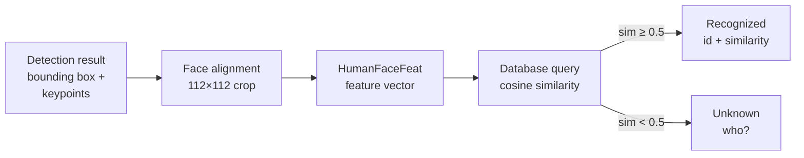

## Assignment 3: Face recognition with ESP-WHO

In the previous assignment you ran face **detection**, which locates faces in a frame and returns bounding boxes. In this assignment you will go one step further and use face **recognition**, which identifies *whose* face it is by comparing it against enrolled faces stored in a database.

By the end of this assignment you will have enrolled your own face, verified that the system recognizes you, and modified the application so the green LED only lights up when a **known** face is recognized.

---

## How face recognition works

Recognition builds directly on top of detection. Once the detection model finds a face and returns its bounding box and five facial landmarks, the recognition model uses those landmarks to:

1. **Align the face** — the keypoints are used to geometrically normalize the face crop so that the eyes and mouth are always at the same position in the 112×112 input image. This makes the feature vector independent of head tilt and position.
2. **Extract a feature vector** — the aligned crop is passed through a feature extraction network that produces a compact, fixed-length vector representing the unique characteristics of that face.
3. **Compare against the database** — the feature vector is compared against all enrolled vectors using cosine similarity. If the closest match is above the similarity threshold (default 0.5), the face is considered recognized.



---

## The recognition model

ESP-WHO uses the `HumanFaceFeat` class from [ESP-DL](https://github.com/espressif/esp-dl/tree/master/models/human_face_recognition) for feature extraction. Two model variants are available:

| Model | Params | GFLOPs | Latency on ESP32-S3 | TAR@FAR=1E-4 on IJB-C |
|-------|--------|--------|---------------|------------------------|
| `MFN_S8_V1` (default) | 1.2 M | 0.46 | ~255 ms | 90.03% |
| `MBF_S8_V1` | 3.4 M | 0.90 | ~1073 ms | 93.94% |

Both models take a **112×112 RGB** aligned face crop as input and produce a feature vector that is stored in the face database. The `MFN_S8_V1` model is the default for the ESP32-S3-EYE because it fits comfortably in flash and runs in under 300 ms, while `MBF_S8_V1` offers higher accuracy at the cost of much longer inference time.

> [!NOTE]
> The TAR@FAR metric measures how often a genuine match is accepted (True Accept Rate) at a fixed rate of false accepts (1 in 10,000). A value of 90% means 9 out of 10 genuine pairs are correctly matched at that operating point.

### The face database

The database is a file stored in the onboard flash filesystem (FATFS or SPIFFS, configured via `menuconfig`). Each enrolled face is saved as a feature vector alongside an auto-incremented integer ID. The database persists across reboots — enrolled faces are not lost when you power cycle the board.

The recognizer always picks the **largest detected face** when multiple faces are in frame, both for enrollment and recognition.

---

## Step 1: Enroll your face

Navigate to the same `human_face_recognition` project from Assignment 2, build and flash:

```bash
cd esp-who/examples/human_face_recognition
idf.py build flash monitor
```

With the board running and the camera pointed at your face:

1. Make sure the bounding box is visible on the LCD (face detected).
2. Press the **UP+** button to enroll. The LCD will show `id: 1 enrolled.`
3. Enroll 2–3 more times from slightly different angles for better coverage.

> [!TIP]
> For best results, enroll in the same lighting conditions you will use for recognition. The model is sensitive to extreme lighting changes.

---

## Step 2: Recognize your face

1. With your face in frame and the bounding box visible, press **PLAY**.
2. The LCD will show either `id: 1, sim: 0.XX` (recognized) or `who?` (not recognized).
3. Try moving your head slightly, adjusting your distance, or covering part of your face to see how the similarity score changes.

If recognition fails consistently, enroll again with more samples or try reducing the distance to the camera.

> [!TIP]
> The default similarity threshold is **0.5**. A score above 0.5 means the system considers the face a match. You can lower this threshold to make recognition more permissive, or raise it to require a closer match. The threshold is set in `HumanFaceRecognizer` and can be changed via menuconfig or in code.

### Try with another participant

Ask a fellow workshop participant to stand in front of the camera and press **PLAY**. The system has never seen their face, so the LCD shows `who?`.

Now enroll their face:

1. Ask them to look at the camera.
2. Press **UP+** to enroll. The LCD will show `id: 2 enrolled.`
3. Enroll 2–3 more times from slightly different angles.

Press **PLAY** while their face is in frame. The system should return `id: 2, sim: 0.XX`. Switch back to your own face and press **PLAY** to confirm you are still recognized as `id: 1`.

> [!NOTE]
> Each enrolled face gets a unique incremental ID. The recognizer always matches against **all** enrolled IDs and returns the one with the highest similarity above the threshold. Press **DOWN-** to delete enrolled faces one by one if you want to start fresh.

After completing the exercise below, come back and repeat this test — the LED will now light up automatically for enrolled faces without pressing PLAY.

---

## Step 3: Understand the recognition callback

Open `components/who_recognition/who_recognition.cpp` and look at how the recognition result is generated:

```cpp
if (ret.empty()) {
    m_recognition_result_cb("who?");
} else {
    m_recognition_result_cb(std::format("id: {}, sim: {:.2f}", ret[0].id, ret[0].similarity));
}
```

The `recognition_result_cb` in `WhoRecognitionAppLCD` receives this string and displays it on the LCD. In your subclass from Assignment 2, you can override this callback to add custom behavior.

The recognition result `ret` is a `std::vector<dl::recognition::result_t>`. Each entry has:

- `id` — the integer ID assigned when the face was enrolled.
- `similarity` — a float between 0.0 and 1.0. Higher means a closer match.

---

## Step 4: LED feedback for recognized faces

In Assignment 2, the green LED turned on whenever **any** face was detected. In this exercise you will change that so the LED only turns on when a face is **recognized** (matched against the database). An unknown face — detected but not enrolled — leaves the LED off.

This is a simple model for an access control scenario: the LED indicates "person is known", not just "person is present".

### Task: Extend FaceDetectLED with recognition awareness

> [!NOTE]
> You are still working inside the `esp-who/examples/human_face_recognition` project. The LED API used here (`bsp_leds_init()`, `bsp_led_set(BSP_LED_GREEN, ...)`) is compatible with the BSP version pinned by ESP-WHO. See the note in Assignment 2 for details.

Open `main/app_main.cpp` and update the `FaceDetectLED` class by also overriding `recognition_result_cb()` and triggering recognition automatically from `detect_result_cb()`:

```cpp
class FaceDetectLED : public WhoRecognitionAppLCD {
public:
    FaceDetectLED(WhoFrameCap *frame_cap)
        : WhoRecognitionAppLCD(frame_cap) {}

protected:
    // Called every frame with detection results
    void detect_result_cb(const WhoDetect::result_t &result) override
    {
        WhoRecognitionAppLCD::detect_result_cb(result);

        if (result.det_res.empty()) {
            // No face in frame — turn LED off immediately
            bsp_led_set(BSP_LED_GREEN, false);
        } else {
            // Face detected — trigger recognition automatically without a button press
            xEventGroupSetBits(m_recognition->get_recognition_task()->get_event_group(),
                               who::recognition::WhoRecognitionCore::RECOGNIZE);
        }
    }

    // Called automatically on every frame where a face is recognized
    void recognition_result_cb(const std::string &result) override
    {
        WhoRecognitionAppLCD::recognition_result_cb(result);

        // result is either "who?" or "id: X, sim: Y.YY"
        bool recognized = (result.find("id:") != std::string::npos);
        bsp_led_set(BSP_LED_GREEN, recognized);
    }
};
```

### How it works

| Callback | Trigger | LED action |
|----------|---------|------------|
| `detect_result_cb` — no face | every frame | LED off immediately |
| `detect_result_cb` — face present | every frame | fires `RECOGNIZE` event on recognition task |
| `recognition_result_cb` — `"who?"` | next captured frame | LED off |
| `recognition_result_cb` — `"id: X, sim: Y"` | next captured frame | LED on |

Setting the `RECOGNIZE` event bit on the recognition task's event group is the same mechanism the PLAY button uses internally. When `detect_result_cb` fires the event, the recognition task picks it up on the next available frame, runs inference, and calls `recognition_result_cb` with the result — all without any button interaction.

### Build and test

Rebuild and flash:

```bash
idf.py build flash monitor
```

> [!NOTE]
> You may see `E dl::recognition::DataBase: Failed to open db` on the first boot after flashing. This is expected: the file `/spiflash/face.db` does not exist yet, so the recognizer creates a fresh empty database and the message disappears on subsequent boots. The application works normally despite this message.

Test the following scenarios and observe the LED:

1. **No face in frame** — LED off immediately.
2. **Unknown face in frame** — LED stays off (recognition runs automatically and returns `who?`).
3. **Enrolled face in frame** — LED turns on within one frame after recognition completes.
4. **Enrolled face leaves frame** — LED turns off immediately on the next detect frame.

### Questions to consider

- What happens if you enroll multiple people? Does the LED turn on for all of them?
- How does the similarity score change when you wear glasses, change lighting, or tilt your head?
- Recognition takes ~255 ms per frame on ESP32-S3. Does the LED feel responsive enough for a real access control scenario?

---

## What you learned

In this assignment you:

- Understood how face recognition builds on detection by using facial keypoints to align faces and extract feature vectors
- Learned the difference between `MFN_S8_V1` (fast, default) and `MBF_S8_V1` (accurate, slower) recognition models
- Enrolled your own face and verified recognition using the physical buttons on the original example
- Extended the application so the LED responds automatically — lighting up for enrolled faces and staying off for unknowns, by firing the `RECOGNIZE` event from `detect_result_cb` on every frame where a face is present

## Next step

[Assignment 4: Raw Camera Frames for Custom Applications](../assignment-4)

[Return to the workshop main page](/workshops/edge-ai-with-esp32-s3/)
