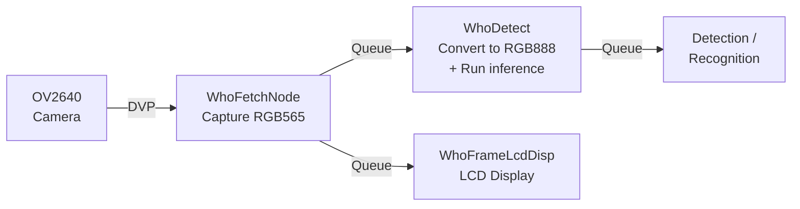
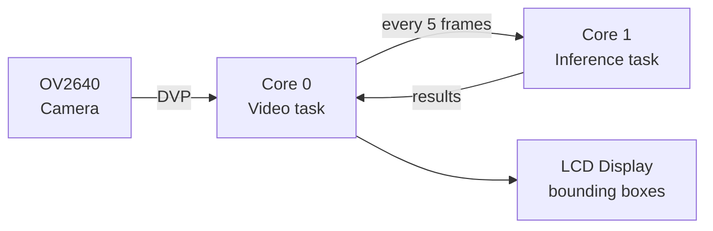

## Assignment 4: Raw Camera Frames for Custom Applications

ESP-WHO is a convenient framework, but not every application needs it. When building a custom inference pipeline, integrating a third-party model, or processing frames in a way that ESP-WHO does not support, you need direct access to the raw camera frames without the task scaffolding, display integration, or pipeline abstractions that ESP-WHO adds.

In this assignment you will learn how to capture raw frames from the OV2640 sensor using ESP-IDF and the BSP directly, without involving ESP-WHO at all. You will understand the key camera parameters such as resolution, pixel format, and frame timing, and see how to access frame buffers in your own application code. This is the foundation for any custom vision application that needs full control over how frames are acquired and consumed.

---

## The OV2640 sensor

The ESP32-S3-EYE uses the **OV2640** image sensor from OmniVision. It is a 2-megapixel sensor connected to the ESP32-S3 via the DVP (Digital Video Port) interface.

| Parameter | Value |
|-----------|-------|
| Resolution | Up to 1600x1200 (UXGA) |
| Field of view | 66.5° |
| Interface | DVP (8-bit parallel) |
| Output formats | JPEG, RGB565, YUV422, Grayscale |
| Lens size | 1/4" |

### Choosing a resolution

The OV2640 supports a wide range of output resolutions. For AI applications, higher resolution means more detail but also more memory usage and slower inference. In practice, vision models on the ESP32-S3 are trained on small inputs, so capturing at a lower resolution is both faster and sufficient.

| Frame size | Resolution | Typical use |
|------------|------------|-------------|
| QQVGA | 160x120 | Very constrained memory |
| QVGA | 320x240 | Face detection, gesture recognition |
| HVGA | 480x320 | Face recognition, object detection |
| VGA | 640x480 | Higher accuracy, more memory required |
| UXGA | 1600x1200 | Full sensor resolution, not suitable for real-time AI |

> [!TIP]
> ESP-WHO examples for the ESP32-S3-EYE use **HVGA (480x320)** by default. This gives a good balance between image quality and processing speed.

### Choosing a pixel format

The OV2640 can output frames in several pixel formats. The format you choose affects memory usage, bus bandwidth, and how frames need to be processed before being fed to a model.

| Format | Description | Used for |
|--------|-------------|----------|
| JPEG | Compressed image | Transmitting frames over a network or saving to SD card. Not used for real-time inference in ESP-WHO because software decoding adds CPU overhead |
| RGB565 | 16-bit color, 2 bytes per pixel | Default capture format in ESP-WHO. Raw frames are captured in RGB565 and sent directly to the LCD display without conversion |
| RGB888 | 24-bit color, 3 bytes per pixel | Input format expected by ESP-DL inference models. The pipeline converts each captured RGB565 frame to RGB888 before passing it to the detector |
| YUV422 | Luminance + chrominance, 2 bytes per pixel | Detection models that operate on the luminance (Y) channel only, avoiding a full color conversion. Useful when model accuracy on grayscale-equivalent data is acceptable |
| Grayscale | 8-bit luminance only, 1 byte per pixel | Single-channel detection tasks where color information is not needed. Halves the memory footprint compared to RGB565 and reduces inference input size |

In ESP-WHO on the ESP32-S3-EYE, the camera captures frames in **RGB565** format directly via the V4L2 API. This avoids the overhead of JPEG compression and software decoding on the CPU. Before being passed to a detection model, the pipeline converts the RGB565 frame to **RGB888**, which is the format expected by ESP-DL inference models.

---

## The ESP-WHO camera pipeline

ESP-WHO uses an asynchronous, node-based pipeline to capture and prepare frames. Each node runs as a FreeRTOS task and passes frames to the next node via a queue.



### Pipeline nodes

**WhoFetchNode** is the entry point of the pipeline. It captures raw RGB565 frames from the camera driver via the V4L2 interface and places them in a queue. It runs continuously on one core, independent of inference.

**WhoDetect** receives an RGB565 frame, converts it to RGB888 in memory (the format expected by ESP-DL models), and runs inference. The conversion happens before inference on the ESP32-S3.

**WhoFrameLcdDisp** takes the decoded frame, draws any detection overlays (bounding boxes, labels), and renders the result on the ST7789 LCD display via LVGL.

The key benefit of this design is that the camera keeps capturing at full speed regardless of how long inference takes on any given frame.

---

## Step 1: Run the camera display example

Before adding AI, let's verify that the camera is working correctly by running the ESP-BSP camera display example. This example streams live video from the OV2640 directly to the LCD display, with no inference involved.

Create the project using the IDF component manager:

```bash
idf.py create-project-from-example "espressif/esp32_s3_eye=6.0.0:display_camera_video"
```

> [!TIP]
> If you get a `FileNotFoundError` for `idf_component.yml`, it means the ESP-WHO environment hook (`IDF_EXTRA_ACTIONS_PATH`) is still active in your shell and is intercepting the command. Unset it first, then retry:
> ```bash
> unset IDF_EXTRA_ACTIONS_PATH
> idf.py create-project-from-example "espressif/esp32_s3_eye=6.0.0:display_camera_video"
> ```

This downloads the example from the ESP Component Registry and creates a new `display_camera_video` directory with all dependencies configured. Navigate into it:

```bash
cd display_camera_video
```

Set the target, build, and flash:

```bash
idf.py -DSDKCONFIG_DEFAULTS=sdkconfig.bsp.esp32_s3_eye set-target esp32s3
idf.py build flash monitor
```

You should see a live camera feed on the 1.3" LCD display at around **30 FPS**. Point the camera at different objects and check that the image is clear and well-exposed.

---

## Step 2: Add ESP-DL face detection

Now that the camera is working, you will add real-time face detection to the same project. The approach keeps the camera running at full speed by separating the work across both cores of the ESP32-S3:



- **Core 0 — video task**: captures frames, scales them using the PPA hardware accelerator, overlays bounding boxes from the latest inference result, and updates the LCD.
- **Core 1 — inference task**: receives a frame snapshot, converts RGB565 to RGB888, runs the `HumanFaceDetect` model, and writes the results back.

The two tasks communicate through a semaphore and a mutex, so the display never waits for inference to complete.

### Step 2.1: Add the face detection component

Add the `espressif/human_face_detect` dependency to `main/idf_component.yml`:

```yaml
dependencies:
  esp32_s3_eye:
    version: '*'
  espressif/human_face_detect:
    version: '*'
description: BSP Display and camera example with ESP-DL inference
```

### Step 2.2: Create the ESP-DL abstraction layer

Create `main/app_dl.hpp`:

```cpp
#pragma once

#include "esp_err.h"
#include "dl_image_define.hpp"
#include "dl_detect_define.hpp"
#include <list>

esp_err_t app_dl_init(void);
const std::list<dl::detect::result_t> &app_dl_run(dl::image::img_t &img);
void app_dl_deinit(void);
```

Create `main/app_dl.cpp`:

```cpp
#include "app_dl.hpp"
#include "esp_log.h"

static const char *TAG = "app_dl";
static const std::list<dl::detect::result_t> s_empty;

#if CONFIG_APP_DL_TASK_HUMAN_FACE_DETECT
#include "human_face_detect.hpp"

static HumanFaceDetect *s_model = nullptr;

esp_err_t app_dl_init(void)
{
    s_model = new HumanFaceDetect();
    ESP_LOGI(TAG, "Human Face Detection ready");
    return ESP_OK;
}

const std::list<dl::detect::result_t> &app_dl_run(dl::image::img_t &img)
{
    return s_model ? s_model->run(img) : s_empty;
}

void app_dl_deinit(void)
{
    delete s_model;
    s_model = nullptr;
}

#else
esp_err_t app_dl_init(void)
{
    ESP_LOGW(TAG, "No ESP-DL task selected — choose one in menuconfig.");
    return ESP_OK;
}
const std::list<dl::detect::result_t> &app_dl_run(dl::image::img_t &img) { (void)img; return s_empty; }
void app_dl_deinit(void) {}
#endif
```

### Step 2.3: Add a Kconfig option

Create `main/Kconfig.projbuild` to allow selecting the model from `menuconfig`:

```kconfig
menu "App DL Configuration"

    choice APP_DL_TASK
        prompt "ESP-DL Inference Task"
        default APP_DL_TASK_HUMAN_FACE_DETECT

        config APP_DL_TASK_HUMAN_FACE_DETECT
            bool "Human Face Detection"
            help
                Detects human faces and draws bounding boxes with facial
                landmark keypoints overlaid on the live camera stream.

    endchoice

endmenu
```

### Step 2.4: Update CMakeLists.txt

Add `app_dl.cpp` to the source list in `main/CMakeLists.txt`:

```cmake
idf_component_register(SRCS "main.cpp" "app_video.c" "app_dl.cpp"
                    INCLUDE_DIRS ".")
```

### Step 2.5: Replace main.cpp

Replace the contents of `main/main.cpp` with the dual-core inference version below. The key additions over the original camera example are:

- `inference_task()` running on Core 1: converts RGB565 to RGB888 and calls `app_dl_run()`
- `camera_frame_cb()` updated to trigger inference every 5 frames and overlay bounding boxes
- A PSRAM snapshot buffer for inference and a PSRAM stack for the inference task

```cpp
#include <stdio.h>
#include <string.h>
#include <algorithm>
#include <inttypes.h>
#include "sdkconfig.h"
#include "bsp/esp-bsp.h"
#include "esp_err.h"
#include "esp_log.h"
#include <fcntl.h>
#include <unistd.h>
#include <sys/ioctl.h>
#include <linux/videodev2.h>
#include "esp_private/esp_cache_private.h"
#include "freertos/FreeRTOS.h"
#include "freertos/task.h"
#include "freertos/semphr.h"
#include "app_video.h"
#include "app_dl.hpp"
#include "dl_image_draw.hpp"

#define NUM_BUFS                2
#define ALIGN_UP(n, a)          (((n) + ((a) - 1)) & ~((a) - 1))
#define INFERENCE_TASK_STACK    (64 * 1024)
#define INFERENCE_TASK_PRIORITY (5)

static const char *TAG = "example";

static size_t    s_cache_line  = 0;
static lv_obj_t *s_canvas      = NULL;
static uint8_t  *s_disp_buf[NUM_BUFS];
static uint32_t  s_disp_buf_size = 0;

static uint8_t  *s_infer_buf    = NULL;
static uint8_t  *s_infer_rgb888 = NULL;
static uint32_t  s_infer_w      = 0;
static uint32_t  s_infer_h      = 0;

static SemaphoreHandle_t s_infer_trigger = NULL;
static SemaphoreHandle_t s_result_mutex  = NULL;
static std::list<dl::detect::result_t> s_results;

static const std::vector<uint8_t> COLOR_BOX = {0x07, 0xE0};   /* green RGB565 */
static const std::vector<uint8_t> COLOR_KP  = {0xF8, 0x00};   /* red   RGB565 */

/* Core 1: convert RGB565 → RGB888 and run inference */
static void inference_task(void *arg)
{
    while (1) {
        xSemaphoreTake(s_infer_trigger, portMAX_DELAY);

        const uint16_t *src = reinterpret_cast<const uint16_t *>(s_infer_buf);
        uint8_t        *dst = s_infer_rgb888;
        for (uint32_t i = 0; i < s_infer_w * s_infer_h; i++, src++, dst += 3) {
            uint16_t p = *src;
            dst[0] = ((p >> 11) & 0x1F) << 3;
            dst[1] = ((p >>  5) & 0x3F) << 2;
            dst[2] = ( p        & 0x1F) << 3;
        }

        dl::image::img_t img = {
            .data     = s_infer_rgb888,
            .width    = (uint16_t)s_infer_w,
            .height   = (uint16_t)s_infer_h,
            .pix_type = dl::image::DL_IMAGE_PIX_TYPE_RGB888,
        };

        const auto &raw = app_dl_run(img);

        xSemaphoreTake(s_result_mutex, portMAX_DELAY);
        s_results = raw;
        xSemaphoreGive(s_result_mutex);

        for (const auto &r : raw) {
            ESP_LOGI(TAG, "Detected: score=%.2f  box=[%d, %d, %d, %d]",
                     r.score, r.box[0], r.box[1], r.box[2], r.box[3]);
        }
    }
}

/* Core 0: frame callback — trigger inference every 5 frames, overlay results */
static void camera_frame_cb(uint8_t *camera_buf, uint8_t buf_index,
                            uint32_t width, uint32_t height, size_t len)
{
    static uint32_t s_frame = 0;
    ++s_frame;

    uint32_t out_w   = width;
    uint32_t out_h   = height;
    uint8_t *out_buf = camera_buf;

    if (s_frame % 5 == 0) {
        memcpy(s_infer_buf, out_buf, out_w * out_h * 2);
        s_infer_w = out_w;
        s_infer_h = out_h;
        xSemaphoreGive(s_infer_trigger);
    }

    if (xSemaphoreTake(s_result_mutex, 0) == pdTRUE) {
        dl::image::img_t disp = {
            .data     = out_buf,
            .width    = (uint16_t)out_w,
            .height   = (uint16_t)out_h,
            .pix_type = dl::image::DL_IMAGE_PIX_TYPE_RGB565BE,
        };
        for (const auto &res : s_results) {
            int x1 = std::max(0,              res.box[0]);
            int y1 = std::max(0,              res.box[1]);
            int x2 = std::min((int)out_w - 1, res.box[2]);
            int y2 = std::min((int)out_h - 1, res.box[3]);
            if (x2 > x1 && y2 > y1)
                dl::image::draw_hollow_rectangle(disp, x1, y1, x2, y2, COLOR_BOX, 2);
            for (size_t k = 0; k + 1 < res.keypoint.size(); k += 2) {
                int kx = res.keypoint[k], ky = res.keypoint[k + 1];
                if (kx > 0 && kx < (int)out_w && ky > 0 && ky < (int)out_h)
                    dl::image::draw_point(disp, kx, ky, COLOR_KP, 3);
            }
        }
        xSemaphoreGive(s_result_mutex);
    }

    bsp_display_lock(0);
    lv_canvas_set_buffer(s_canvas, out_buf, out_w, out_h, LV_COLOR_FORMAT_RGB565);
    lv_obj_center(s_canvas);
    lv_obj_invalidate(s_canvas);
    bsp_display_unlock();
}

extern "C" void app_main(void)
{
    bsp_display_start();
    bsp_display_backlight_on();
    bsp_camera_start(NULL);

    ESP_ERROR_CHECK(app_dl_init());
    ESP_ERROR_CHECK(esp_cache_get_alignment(MALLOC_CAP_SPIRAM, &s_cache_line));

    s_disp_buf_size = ALIGN_UP(BSP_LCD_H_RES * BSP_LCD_V_RES * 2, s_cache_line);
    for (int i = 0; i < NUM_BUFS; i++) {
        s_disp_buf[i] = static_cast<uint8_t *>(
            heap_caps_aligned_calloc(s_cache_line, 1, s_disp_buf_size, MALLOC_CAP_SPIRAM));
        ESP_ERROR_CHECK(s_disp_buf[i] ? ESP_OK : ESP_ERR_NO_MEM);
    }

    s_infer_buf = static_cast<uint8_t *>(
        heap_caps_aligned_calloc(s_cache_line, 1, s_disp_buf_size, MALLOC_CAP_SPIRAM));
    s_infer_rgb888 = static_cast<uint8_t *>(
        heap_caps_malloc(BSP_LCD_H_RES * BSP_LCD_V_RES * 3, MALLOC_CAP_SPIRAM));
    ESP_ERROR_CHECK((s_infer_buf && s_infer_rgb888) ? ESP_OK : ESP_ERR_NO_MEM);

    s_infer_trigger = xSemaphoreCreateBinary();
    s_result_mutex  = xSemaphoreCreateMutex();

    bsp_display_lock(0);
    s_canvas = lv_canvas_create(lv_scr_act());
    lv_canvas_set_buffer(s_canvas, s_disp_buf[0], BSP_LCD_H_RES, BSP_LCD_V_RES, LV_COLOR_FORMAT_RGB565);
    lv_obj_center(s_canvas);
    bsp_display_unlock();

    int fd = app_video_open(BSP_CAMERA_DEVICE, APP_VIDEO_FMT_RGB565);
    ESP_ERROR_CHECK(fd < 0 ? ESP_FAIL : ESP_OK);
    ESP_ERROR_CHECK(app_video_set_bufs(fd, NUM_BUFS, NULL));
    ESP_ERROR_CHECK(app_video_register_frame_operation_cb(camera_frame_cb));

    StackType_t  *stack = static_cast<StackType_t *>(
        heap_caps_malloc(INFERENCE_TASK_STACK, MALLOC_CAP_SPIRAM | MALLOC_CAP_8BIT));
    StaticTask_t *tcb   = static_cast<StaticTask_t *>(
        heap_caps_malloc(sizeof(StaticTask_t), MALLOC_CAP_INTERNAL | MALLOC_CAP_8BIT));
    ESP_ERROR_CHECK((stack && tcb) ? ESP_OK : ESP_ERR_NO_MEM);
    xTaskCreateStaticPinnedToCore(inference_task, "inference",
                                  INFERENCE_TASK_STACK, NULL,
                                  INFERENCE_TASK_PRIORITY, stack, tcb, 1);

    ESP_ERROR_CHECK(app_video_stream_task_start(fd, 0));
    ESP_LOGI(TAG, "Camera + ESP-DL face detection running.");
}
```

### Step 2.6: Add a custom partition table

The default partition table does not have a `storage` partition for model data. Create `partitions.csv` in the project root:

```csv
# Name,     Type,  SubType,  Offset,    Size,     Flags
nvs,        data,  nvs,      0x9000,    0x5000,
phy_init,   data,  phy,      0xe000,    0x1000,
factory,    app,   factory,  0x10000,   0x300000,
storage,    data,  spiffs,   0x310000,  0xF0000,
```

Then add the following lines to `sdkconfig.bsp.esp32_s3_eye` to enable it:

```
CONFIG_PARTITION_TABLE_CUSTOM=y
CONFIG_PARTITION_TABLE_CUSTOM_FILENAME="partitions.csv"
```

Apply the updated defaults by reconfiguring:

```bash
idf.py -DSDKCONFIG_DEFAULTS=sdkconfig.bsp.esp32_s3_eye reconfigure
```

### Step 2.7: Build and flash

```bash
idf.py build flash monitor
```

Point the camera at your face. You should see a **green bounding box** around the detected face, with **red keypoints** marking the eyes, nose, and mouth corners. Detection results are also printed to the serial monitor:

```
I (xxxx) example: Detected: score=0.89  box=[45, 30, 180, 200]
```

---

## How the camera frame reaches inference

The camera outputs frames in **RGB565** format (2 bytes per pixel, big-endian). ESP-DL's `HumanFaceDetect` model, however, requires **RGB888** (3 bytes per pixel). A conversion step is therefore mandatory before inference can run.

The dual-core pipeline handles this without stalling the display:

| Step | Where | What happens |
|------|--------|--------------|
| 1. Capture | Core 0 — `camera_frame_cb()` | Every 5th frame is snapshot-copied (`memcpy`) into `s_infer_buf` (PSRAM). The other frames go straight to the LVGL canvas for smooth display. |
| 2. Convert | Core 1 — `inference_task()` | The RGB565 snapshot is unpacked to RGB888 pixel by pixel and stored in `s_infer_rgb888`. |
| 3. Infer | Core 1 — `app_dl_run()` | An `dl::image::img_t` struct wraps the RGB888 buffer with its dimensions and pixel type, then the model runs on it. |
| 4. Results | Core 0 — next `camera_frame_cb()` | Detection boxes are read from `s_results` under a mutex and drawn on the live frame before it is sent to the display. |

The `memcpy` snapshot decouples the two cores: Core 0 never waits for inference to complete, and Core 1 always has a stable copy of the frame to work on.


Skipping every 4 out of 5 frames is a deliberate trade-off. The `HumanFaceDetect` model takes longer than a single 30 FPS frame interval to run on the ESP32-S3, so throttling inference prevents the camera pipeline from backing up.


Because the model is fully encapsulated behind `app_dl_init()` / `app_dl_run()` / `app_dl_deinit()`, the same dual-core architecture works with any ESP-DL model. To swap in a different task — such as hand gesture recognition or object detection — you only need to change the implementation inside `app_dl.cpp` and update the `Kconfig.projbuild` menu. The camera capture, format conversion, and display pipeline remain unchanged.

---

## What you learned

In this assignment you:

- Learned about the OV2640 sensor capabilities and the resolution and format trade-offs for AI applications
- Understood how the camera pipeline separates capture, format conversion, and inference across two CPU cores
- Integrated ESP-DL `HumanFaceDetect` directly into a camera application without using ESP-WHO
- Observed how bounding boxes and facial keypoints are drawn on live camera frames using `dl_image_draw`

## Next step

Now that you understand the camera pipeline and have run face detection directly with ESP-DL, the next assignment extends this with hand gesture recognition from live camera frames.

[Assignment 5: Hand gesture recognition with ESP-DL](../assignment-5)
