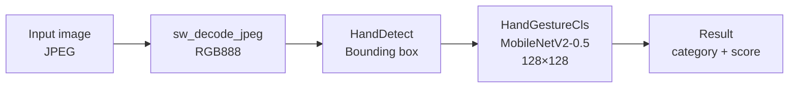

## Assignment 5: Hand gesture recognition with ESP-DL

In the previous assignments you used **ESP-WHO**, which provides a high-level pipeline for camera capture, face detection, and recognition. In this assignment you will work with **ESP-DL directly**, without the ESP-WHO framework, to understand how to use a model as a standalone component in your own application.

The model you will use is a hand gesture classifier that recognises 10 distinct hand gestures. Rather than reading from the live camera, this example embeds a test JPEG image directly in flash and runs inference on it once at startup. This keeps the setup simple and lets you focus entirely on the inference pipeline itself.

> [!NOTE]
> Running inference on a static image is a deliberate simplification for learning purposes. In a real application, you would replace the embedded JPEG with a frame captured from the OV2640 camera. The `dl::image::img_t` tensor that the model receives is camera-agnostic — it only requires raw pixel data in RGB888 format and the image dimensions. Any source that can produce an `img_t`, whether a JPEG decoded from flash, a frame captured via the ESP-WHO pipeline, or a raw buffer from the camera driver, can be passed directly into `HandGestureRecognizer::recognize()`.

---

## The two-stage hand gesture pipeline

Like face recognition, hand gesture recognition uses two models in sequence:

1. **Hand detection** (`HandDetect`) — finds the hand in the image and returns a bounding box. This uses a lightweight detection model similar in design to the face detector from Assignment 3.
2. **Hand gesture classification** (`HandGestureCls`) — takes the detected hand region, resizes it to 128×128, and classifies it into one of 10 gesture categories.



### Supported gestures

The model was trained on gestures selected from the [HaGRID](https://github.com/hukenovs/hagrid) dataset and recognises 10 categories: "one", "two", "three", "four", "five", "like", "ok", "no_gesture", "call", and "dislike". The class `no_gesture` represents a natural hand state or any hand gesture that does not belong to the 9 predefined gestures.



### The classification model

The gesture classifier uses a **MobileNetV2-0.5** backbone — a lightweight convolutional neural network designed for mobile and embedded inference. The `0.5` refers to the width multiplier, which halves the number of channels throughout the network compared to the full MobileNetV2. This significantly reduces the model size and computation while retaining reasonable accuracy for a constrained set of gesture classes.

| Model | Input | Latency on ESP32-S3 | Latency on ESP32-P4 |
|-------|-------|---------------|---------------|
| `MOBILENETV2_0_5_S8_V1` | 128×128×3 | ~118 ms | ~28 ms |

The model uses 8-bit quantization and is stored in flash. The total flash usage for both the detection and classification models together is around 1.5 MB.

---

## Step 1: Create the project

Unlike the previous assignments that used examples from the ESP-WHO repository, this example comes directly from ESP-DL. Use the IDF component manager to create a new project from the example in one command:

```bash
idf.py create-project-from-example "espressif/esp-dl=3.3.8:hand_gesture_recognition"
```

> [!TIP]
> Version `3.3.8` is the version this workshop was validated against. You can omit the version pin (`"espressif/esp-dl:hand_gesture_recognition"`) to get the latest release, but API details may differ slightly from what is shown here.

This downloads the example from the ESP Component Registry, creates a new directory named `hand_gesture_recognition`, and sets up the `idf_component.yml` with the correct dependencies automatically.

Navigate into the new project:

```bash
cd hand_gesture_recognition
```

Open `main/idf_component.yml` and note the dependencies:

```yaml
dependencies:
  espressif/hand_gesture_recognition:
    version: "*"
  espressif/esp32_s3_eye_noglib:
    version: "*"
    rules:
      - if: "target == esp32s3"
```

The `hand_gesture_recognition` component brings in both the hand detection model and the gesture classification model. The `esp32_s3_eye_noglib` component is the BSP without LVGL — it is only needed here to provide BSP SD card functions if you choose to load the model from an SD card. For this assignment, models are stored in flash rodata, so the BSP dependency is used conditionally.

---

## Step 2: Build and flash

Set the target and build:

```bash
idf.py set-target esp32s3
idf.py build flash monitor
```

When the example runs, it decodes the embedded JPEG, detects the hand, classifies the gesture, and prints the result before returning from `app_main`:

```
I (1784) hand_gesture_recognition: category: one, score: 0.999960
I (1784) main_task: Returned from app_main()
```

The default bundled image shows a single raised index finger, so the expected output is `one` with a very high confidence score.

---

## Step 3: Understand the code

Open `main/app_main.cpp`:

```cpp
// 1. Load the embedded JPEG from flash
extern const uint8_t gesture_jpg_start[] asm("_binary_gesture_jpg_start");
extern const uint8_t gesture_jpg_end[]   asm("_binary_gesture_jpg_end");

dl::image::jpeg_img_t gesture_jpeg = {
    .data     = (void *)gesture_jpg_start,
    .data_len = (size_t)(gesture_jpg_end - gesture_jpg_start)
};

// 2. Decode JPEG to RGB888 tensor
auto gesture = dl::image::sw_decode_jpeg(gesture_jpeg, dl::image::DL_IMAGE_PIX_TYPE_RGB888);

// 3. Run the two-stage pipeline
HandDetect *hand_detect = new HandDetect();
auto hand_gesture_recognizer = new HandGestureRecognizer(HandGestureCls::MOBILENETV2_0_5_S8_V1);
std::vector<dl::cls::result_t> results = hand_gesture_recognizer->recognize(gesture, hand_detect->run(gesture));

// 4. Print results
for (const auto &res : results) {
    ESP_LOGI(TAG, "category: %s, score: %f", res.cat_name, res.score);
}
```

### Understanding the score

The `score` field in `dl::cls::result_t` is the **softmax probability** for the predicted class, expressed as a float between 0.0 and 1.0.

The MobileNetV2 classifier produces a raw output vector (logits) with one value per class — 10 values in this case. The softmax function converts those logits into a probability distribution: all 10 values become positive and sum to exactly 1.0. The class with the highest probability is returned as the result, and its probability is the `score`.

This means:

| Score range | Interpretation |
|-------------|---------------|
| 0.90 – 1.00 | Very high confidence. The image closely matches a single class. |
| 0.70 – 0.90 | Good confidence. The gesture is recognised but there is some ambiguity. |
| 0.50 – 0.70 | Low confidence. The model is uncertain, possibly due to lighting, angle, or partial occlusion. |
| Below 0.50 | Very low confidence. The gesture may not be in the training set, or the hand was not detected correctly. |

A score of 1.0 does not mean the model is infallible — it means the model has assigned almost all probability mass to one class. A well-lit, centred, clear gesture against a plain background will consistently score above 0.90. Poor lighting, motion blur, an unusual hand angle, or background clutter will all push the score down and increase the chance of misclassification.

The `no_gesture` class acts as a catch-all. When the model is uncertain and none of the 9 named gestures dominate, probability is spread across all classes and `no_gesture` may win by a small margin, often with a score below 0.60.

The image embedding works through CMake. Open `main/CMakeLists.txt`:

```cmake
file(GLOB embed_files "${PROJECT_DIR}/gestures/*.jpg")
idf_component_register(... EMBED_FILES ${embed_files})
```

Every `*.jpg` file placed in the `gestures/` folder is automatically embedded in flash as a binary symbol. The symbol name is derived from the filename: `gestures/gesture.jpg` becomes `_binary_gesture_jpg_start` / `_binary_gesture_jpg_end`.

---

## Exercise: Test different hand gestures

The default test image shows the `one` gesture. In this exercise you will replace it with images of other gestures and observe how the model responds.

### Prepare your test images

Take photos of your own hand in different gesture positions, or find reference images. Each image should:

- Show a single hand clearly against a plain background
- Be in JPEG format
- Be at least 128×128 pixels (larger is fine — the model resizes internally)
- Have good, even lighting and no motion blur

Name your images `gesture.jpg` (to replace the default) or use a new name like `gesture_two.jpg`, `gesture_like.jpg`, etc.

### Replace the default image

Copy your image into the `gestures/` folder inside the project, replacing the existing `gesture.jpg`:

```bash
cp /path/to/your/image.jpg hand_gesture_recognition/gestures/gesture.jpg
```

Rebuild and flash:

```bash
idf.py build flash monitor
```

Observe the output. Try the following gestures in sequence, replacing and reflashing for each:

| Your gesture | Expected label | Notes |
|--------------|----------------|-------|
| Index finger pointing up | `one` | Keep other fingers folded |
| V sign (index + middle) | `two` | Clear separation between the two fingers |
| Three fingers extended | `three` | Index, middle, and ring fingers up |
| Four fingers extended | `four` | All fingers except thumb |
| Open hand | `five` | Spread all five fingers wide |
| Thumbs up | `like` | Keep the thumb clearly visible |
| Thumbs down | `dislike` | Point the thumb downward |
| OK sign | `ok` | Form a clear circle with thumb and index |
| Shaka (thumb + pinky) | `call` | Fold the three middle fingers |
| Fist or random pose | `no_gesture` | Any pose outside the 9 named classes |

### Test with multiple images in one flash

Instead of reflashing for each gesture, you can add multiple images to the `gestures/` folder and modify `app_main.cpp` to iterate over them. Add a second image named `gesture2.jpg` to the folder, then update `app_main.cpp`:

```cpp
// Add this alongside the existing gesture declarations
extern const uint8_t gesture2_jpg_start[] asm("_binary_gesture2_jpg_start");
extern const uint8_t gesture2_jpg_end[]   asm("_binary_gesture2_jpg_end");

// After the first inference, run a second one
dl::image::jpeg_img_t gesture2_jpeg = {
    .data     = (void *)gesture2_jpg_start,
    .data_len = (size_t)(gesture2_jpg_end - gesture2_jpg_start)
};
auto gesture2 = dl::image::sw_decode_jpeg(gesture2_jpeg, dl::image::DL_IMAGE_PIX_TYPE_RGB888);
std::vector<dl::cls::result_t> results2 = hand_gesture_recognizer->recognize(gesture2, hand_detect->run(gesture2));
for (const auto &res : results2) {
    ESP_LOGI(TAG, "gesture2 -> category: %s, score: %f", res.cat_name, res.score);
}
heap_caps_free(gesture2.data);
```

Rebuild, flash, and you should see results for both images in the serial monitor.

> [!TIP]
> Each embedded JPEG takes up flash space equal to its file size. Keep images under 200 KB each to avoid running out of flash. You can check flash usage in the build output under `idf.py size`.

### Questions to consider

- How does the confidence score change when you rotate the hand slightly or change the background?
- What score does the model give for `no_gesture` when you show a fist or a gesture it was not trained on?
- What would need to change in the application to use the live camera feed instead of a static image?

---

## Extra exercise: Live gesture recognition from the camera

In this extra exercise you will replace the static embedded JPEG with live frames captured from the OV2640 camera using the **ESP-Video** component. The inference pipeline stays exactly the same — only the image source changes. Results will be printed to the serial monitor; no LCD is needed.

### Update the dependencies

Open `main/idf_component.yml` and add the ESP-Video component and the full BSP (which provides camera initialisation helpers):

```yaml
dependencies:
  espressif/hand_gesture_recognition:
    version: "*"
  espressif/esp_video:
    version: "*"
  espressif/esp32_s3_eye:
    version: "*"
    rules:
      - if: "target == esp32s3"
```

> [!NOTE]
> `esp32_s3_eye` replaces `esp32_s3_eye_noglib` here because the full BSP provides `bsp_camera_start()`, which initializes the OV2640 sensor and registers the V4L2 device node at `/dev/video2` (the DVP device path on ESP32-S3). If you prefer to keep the noglib variant, you can initialise `esp_video` directly using `esp_video_init()` with the DVP configuration and open `/dev/video2` yourself.

### Modify app_main.cpp

Replace the contents of `main/app_main.cpp` with the following:

```cpp
#include <fcntl.h>
#include <sys/ioctl.h>
#include <linux/videodev2.h>
#include "esp_log.h"
#include "freertos/FreeRTOS.h"
#include "freertos/task.h"
#include "bsp/esp32_s3_eye.h"
#include "dl_image_jpeg.hpp"
#include "hand_detect.hpp"
#include "hand_gesture_recognition.hpp"

static const char *TAG = "hand_gesture_recognition";

extern "C" void app_main(void)
{
    // Initialise the OV2640 camera through the BSP (registers the V4L2 device)
    bsp_camera_cfg_t cam_config = BSP_CAMERA_DEFAULT_CONFIG;
    ESP_ERROR_CHECK(bsp_camera_start(&cam_config));

    // Open the V4L2 DVP camera device (DVP is /dev/video2 on ESP32-S3)
    int fd = open("/dev/video2", O_RDWR);
    assert(fd >= 0);

    // Request JPEG output at QVGA resolution
    struct v4l2_format fmt = {};
    fmt.type                = V4L2_BUF_TYPE_VIDEO_CAPTURE;
    fmt.fmt.pix.width       = 320;
    fmt.fmt.pix.height      = 240;
    fmt.fmt.pix.pixelformat = V4L2_PIX_FMT_JPEG;
    ioctl(fd, VIDIOC_S_FMT, &fmt);

    // Request two frame buffers from the driver
    struct v4l2_requestbuffers req = {};
    req.count  = 2;
    req.type   = V4L2_BUF_TYPE_VIDEO_CAPTURE;
    req.memory = V4L2_MEMORY_USERPTR;
    ioctl(fd, VIDIOC_REQBUFS, &req);

    // Allocate user-space buffers and enqueue them
    const size_t buf_size = 320 * 240 * 2;
    void *buf_ptrs[2];
    for (int i = 0; i < 2; i++) {
        buf_ptrs[i] = heap_caps_malloc(buf_size, MALLOC_CAP_SPIRAM | MALLOC_CAP_8BIT);
        assert(buf_ptrs[i]);
        struct v4l2_buffer buf = {};
        buf.type      = V4L2_BUF_TYPE_VIDEO_CAPTURE;
        buf.memory    = V4L2_MEMORY_USERPTR;
        buf.index     = i;
        buf.m.userptr = (unsigned long)buf_ptrs[i];
        buf.length    = buf_size;
        ioctl(fd, VIDIOC_QBUF, &buf);
    }

    // Start the video stream
    int type = V4L2_BUF_TYPE_VIDEO_CAPTURE;
    ioctl(fd, VIDIOC_STREAMON, &type);

    // Create the inference objects once and reuse them across frames
    HandDetect *hand_detect = new HandDetect();
    HandGestureRecognizer *recognizer = new HandGestureRecognizer(
        HandGestureCls::MOBILENETV2_0_5_S8_V1);

    ESP_LOGI(TAG, "Camera ready — show your hand gestures!");

    while (true) {
        // Dequeue a captured frame
        struct v4l2_buffer buf = {};
        buf.type   = V4L2_BUF_TYPE_VIDEO_CAPTURE;
        buf.memory = V4L2_MEMORY_USERPTR;
        if (ioctl(fd, VIDIOC_DQBUF, &buf) != 0) {
            continue;
        }

        // Decode JPEG frame to RGB888
        dl::image::jpeg_img_t jpeg = {
            .data     = (void *)buf.m.userptr,
            .data_len = buf.bytesused,
        };
        auto img = dl::image::sw_decode_jpeg(jpeg, dl::image::DL_IMAGE_PIX_TYPE_RGB888);

        if (img.data) {
            // Run hand detection + gesture classification
            auto results = recognizer->recognize(img, hand_detect->run(img));
            for (const auto &res : results) {
                ESP_LOGI(TAG, "gesture: %s, score: %.3f", res.cat_name, res.score);
            }
            heap_caps_free(img.data);
        }

        // Return the buffer to the driver for the next capture
        ioctl(fd, VIDIOC_QBUF, &buf);

        // Limit to roughly 3 fps — inference takes ~120 ms, so no delay is needed
        // for rate control, but a small yield keeps the watchdog happy
        vTaskDelay(pdMS_TO_TICKS(10));
    }
}
```

### Build and flash

```bash
idf.py build flash monitor
```

Open a serial monitor and show your hand in front of the camera. You should see gesture labels printed continuously as each frame is processed:

```
I (3521) hand_gesture_recognition: gesture: like, score: 0.953
I (3892) hand_gesture_recognition: gesture: like, score: 0.971
I (4263) hand_gesture_recognition: gesture: five, score: 0.841
```

> [!TIP]
> If no gesture is printed, the hand detector may not be finding the hand. Make sure your hand fills a good portion of the frame and is well-lit. Moving closer to the camera usually helps.

> [!NOTE]
> The `sw_decode_jpeg` function decodes the JPEG in software on the ESP32-S3 CPU. This takes around 30–50 ms per frame at QVGA resolution. Combined with ~120 ms for inference, the effective throughput is roughly 2–3 frames per second on the ESP32-S3. This is enough to demonstrate real-time gesture detection without requiring any hardware accelerator.

---

## What you learned

In this assignment you:

- Used ESP-DL directly as a component, without the ESP-WHO framework, to run a complete two-stage inference pipeline
- Learned how JPEG images can be embedded in flash and decoded at runtime using `sw_decode_jpeg`
- Tested the `HandGestureCls` MobileNetV2-0.5 classifier against different hand gesture images and observed confidence scores
- Understood how the CMake `EMBED_FILES` mechanism links binary data directly into the firmware image
- Extended the example to capture live frames from the OV2640 camera via the ESP-Video V4L2 API and run continuous gesture inference

## Next step

[Assignment 6: ESP-DL - Object detection](../assignment-6)
