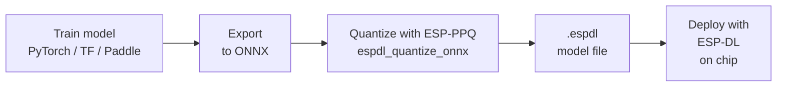

## Assignment 7: Going further

In this final assignment there are no build or flash steps. Instead you will explore two resources that extend what you have learned throughout the workshop: the full ESP-DL Model Zoo and how custom models are trained and quantized for ESP devices, and ESP-Vision, a Python-based platform that lets you prototype vision AI applications with just a few lines of code.

---

## The ESP-DL Model Zoo

All models that Espressif provides for ESP devices are published as open-source components in the ESP-DL repository and on the [ESP Component Registry](https://components.espressif.com). You have already used several of them during this workshop. The complete set is listed below.

| Model | Task | Supported chips | Registry |
|-------|------|-----------------|----------|
| [COCO Detect](https://github.com/espressif/esp-dl/tree/master/models/coco_detect) | Object detection — 80 COCO classes (YOLO11n) | ESP32-S3, ESP32-S31, ESP32-P4 | `espressif/coco_detect` |
| [COCO Pose](https://github.com/espressif/esp-dl/tree/master/models/coco_pose) | Human pose estimation — 17 keypoints (YOLO11n-Pose) | ESP32-S3, ESP32-S31, ESP32-P4 | `espressif/coco_pose` |
| [COCO Seg](https://github.com/espressif/esp-dl/tree/master/models/coco_seg) | Instance segmentation — 80 COCO classes (YOLO11n-Seg) | ESP32-S3, ESP32-S31, ESP32-P4 | `espressif/coco_seg` |
| [YOLO26](https://github.com/espressif/esp-dl/tree/master/models/yolo26) | Universal NMS-Free object detection — 80 COCO classes | ESP32-S3, ESP32-S31, ESP32-P4 | `espressif/yolo26` |
| [Human Face Detect](https://github.com/espressif/esp-dl/tree/master/models/human_face_detect) | Face detection with landmarks (MSR/MNP/ESPDet) | ESP32-S3, ESP32-S31, ESP32-P4 | `espressif/human_face_detect` |
| [Human Face Recognition](https://github.com/espressif/esp-dl/tree/master/models/human_face_recognition) | Face feature extraction and ID matching | ESP32-S3, ESP32-S31, ESP32-P4 | `espressif/human_face_recognition` |
| [Hand Detect](https://github.com/espressif/esp-dl/tree/master/models/hand_detect) | Real-time hand detection | ESP32-S3, ESP32-S31, ESP32-P4 | `espressif/hand_detect` |
| [Hand Gesture](https://github.com/espressif/esp-dl/tree/master/models/hand_gesture_recognition) | 10-class hand gesture classification | ESP32-S3, ESP32-S31, ESP32-P4 | `espressif/hand_gesture_recognition` |
| [Cat Detect](https://github.com/espressif/esp-dl/tree/master/models/cat_detect) | Lightweight cat detection (ESPDet-Pico) | ESP32-S3, ESP32-S31, ESP32-P4 | `espressif/cat_detect` |
| [Dog Detect](https://github.com/espressif/esp-dl/tree/master/models/dog_detect) | Lightweight dog detection (ESPDet-Pico) | ESP32-S3, ESP32-S31, ESP32-P4 | `espressif/dog_detect` |
| [Pedestrian Detect](https://github.com/espressif/esp-dl/tree/master/models/pedestrian_detect) | Pedestrian detection for surveillance | ESP32-S3, ESP32-S31, ESP32-P4 | `espressif/pedestrian_detect` |
| [Imagenet Cls](https://github.com/espressif/esp-dl/tree/master/models/imagenet_cls) | MobileNetV2 image classification — 1000 classes | ESP32-S3, ESP32-S31, ESP32-P4 | `espressif/imagenet_cls` |
| [Speaker Verification](https://github.com/espressif/esp-dl/tree/master/models/speaker_verification) | Voiceprint recognition and verification | ESP32-S31, ESP32-P4 | `espressif/speaker_verification` |
| [Motion Detect](https://github.com/espressif/esp-dl/tree/master/models/motion_detect) | Frame-to-frame motion change detection | All ESP32 | `espressif/motion_detect` |
| [Color Detect](https://github.com/espressif/esp-dl/tree/master/models/color_detect) | Color-based object tracking | All ESP32 | `espressif/color_detect` |

Every model in the table above is an ESP-IDF component. Adding one to your project takes a single line in `idf_component.yml` and a few lines of C++ — the same pattern you used throughout this workshop.

---

## Training and deploying a custom model

The models in the zoo cover many common tasks, but real products often need a model trained on a specific domain — your own objects, environments, or gesture vocabulary. ESP-DL supports deploying custom models through a quantization pipeline based on **ESP-PPQ**.

[ESP-PPQ](https://github.com/espressif/esp-ppq) is Espressif's quantization toolkit, built as an extension of the open-source PPQ framework. It takes a full-precision ONNX model and converts it into the 8-bit `.espdl` format that ESP-DL can load and execute on chip. ESP-PPQ handles graph optimization, operator fusion, calibration, and weight quantization — all in a single Python API call. It can be installed with:

```bash
pip install esp-ppq
```

### The workflow



**1. Train your model**

Train a standard neural network in any framework. ESP-PPQ has native support for PyTorch and ONNX. Models from TensorFlow, PaddlePaddle, and other frameworks must be converted to ONNX first using tools such as `tf2onnx` or `paddle2onnx`.

**2. Export to ONNX**

```python
# PyTorch example
import torch
torch.onnx.export(model, dummy_input, "model.onnx",
                  opset_version=11, input_names=["input"])
```

**3. Quantize with ESP-PPQ**

The default method is **Post Training Quantization (PTQ)**, which requires no retraining — only a small unlabeled calibration dataset (32–100 images) representative of the real input distribution.

```python
from espdl import espdl_quantize_onnx

quant_graph = espdl_quantize_onnx(
    onnx_import_file="model.onnx",
    espdl_export_file="model_s3.espdl",
    calib_dataloader=calib_loader,   # DataLoader wrapping your calibration images
    calib_steps=32,                  # number of calibration batches
    input_shape=[1, 3, 224, 224],    # must match the shape used during ONNX export
    target="esp32s3",                # esp32 | esp32s3 | esp32p4 | esp32s31
    num_of_bits=8,                   # INT8 quantization
    export_test_values=True,         # embed test vectors for on-chip accuracy verification
)
```

Key parameters to understand:

| Parameter | Effect |
|-----------|--------|
| `target` | Selects the quantization strategy (per-tensor vs per-channel) and rounding mode for the target chip. Must match the chip you will deploy on |
| `calib_steps` | Number of batches used for calibration. More steps give more stable scale estimates but increase quantization time |
| `export_test_values` | Embeds reference input/output tensors in the `.espdl` file so you can verify on-chip output matches the expected values during development |

Three files are produced after quantization:

| File | Purpose |
|------|---------|
| `model.espdl` | Binary model file — this is the only file needed on the device |
| `model.info` | Human-readable summary of the model graph, layer shapes, and quantized weight ranges — useful for debugging accuracy issues |
| `model.json` | Full quantization parameters in JSON — can be reloaded to skip recalibration or used for fine-tuning the quantization config |

**4. Load and run on device**

Once you have the `.espdl` file, deploy it with ESP-DL using the generic `dl::Model` class:

```cpp
#include "dl_model_base.hpp"
#include "dl_image_define.hpp"

dl::Model *model = new dl::Model("path/to/model.espdl",
                                  fbs::MODEL_LOCATION_IN_FLASH_PARTITION);
// Build input tensor, run forward pass
model->run(inputs, outputs);
```

### PTQ vs QAT

| Method | When to use | Accuracy loss |
|--------|------------|---------------|
| PTQ (Post Training Quantization) | Sufficient for most models with a good calibration set | Low to moderate |
| QAT (Quantization Aware Training) | When PTQ accuracy is not sufficient; requires retraining | Minimal |

PTQ is the default starting point. If the quantized model shows significant accuracy degradation compared to the full-precision version, switch to QAT by incorporating the quantization error into the training loss function.

### Quantization differences per chip

The quantization strategy varies by target. Set the `target` parameter in ESP-PPQ accordingly:

| Target | Quantization strategy | Rounding |
|--------|-----------------------|---------|
| ESP32 | Per-Tensor | ROUND_HALF_UP |
| ESP32-S3 | Per-Tensor | ROUND_HALF_UP |
| ESP32-P4 | Per-Channel (Conv, GEMM), Per-Tensor (others) | ROUND_HALF_EVEN |

> [!NOTE]
> `.espdl` files are target-specific and cannot be mixed between chip families. A model quantized for ESP32-S3 will produce incorrect results if run on an ESP32-P4.

For detailed tutorials and example scripts, see the [ESP-DL quantization documentation](https://docs.espressif.com/projects/esp-dl/en/latest/tutorials/how_to_quantize_model.html) and the [ESP-PPQ repository](https://github.com/espressif/esp-ppq).

---

## ESP-Vision



[ESP-Vision](https://vision.espressif.com/) is a Python-based platform that runs on top of ESP32 hardware and lets you build real-time vision AI applications with just a few lines of code — no C++, no toolchain, and no build system required. It is the fastest way to prototype an idea or demonstrate a concept on actual hardware.

### How it works

ESP-Vision provides a MicroPython-compatible runtime with a set of high-level modules:

| Module | What it does |
|--------|-------------|
| `sensor` | Camera control — set pixel format, resolution, capture frames |
| `image` | Image processing — draw, filter, colour tracking, QR codes, AprilTag |
| `display` | LCD output |
| `espdl` | Load and run `.espdl` models from the model zoo |
| `tflite` | Load and run TensorFlow Lite Micro models |

A complete object detection application that runs a YOLO11n detection loop on the ESP32-P4 looks like this:

```python
import espdl
import sensor
import time

sensor.reset()
sensor.set_pixformat(sensor.RGB565)
sensor.set_framesize(sensor.QVGA)
sensor.skip_frames(time=1000)

det = espdl.ESPDet("/sdcard/hand_det.espdl", score=0.5, nms=0.7)
while True:
    img = sensor.snapshot()
    for x, y, w, h, score, category in det.detect(img):
        img.draw_rectangle(x, y, w, h, color=(255, 0, 0), thickness=2)
        img.draw_string(x, max(0, y - 12), "%.2f:%d" % (score, category))
    img.flush()
```

### Supported boards

ESP-Vision runs on the following boards:

| Board | Chip | Supported modules |
|-------|------|------------------|
| ESP32-P4X-EYE | ESP32-P4 | sensor · image · display · espdl · tflite · h264 · rtsp · barcode |
| ESP32-P4-Function-EV-Board | ESP32-P4 | sensor · image · display · espdl · tflite · h264 · rtsp · barcode |
| ESP32-S3-EYE | ESP32-S3 | sensor · image · display · espdl · tflite · imageio |
| ESP32-S31-Korvo-1 | ESP32-S31 | sensor · image · display · espdl · tflite · imageio |

The ESP32-S3-EYE you have been using throughout this workshop is fully supported.

### Getting started

1. Go to [vision.espressif.com](https://vision.espressif.com/).
2. Click **Flash It Now** to install the ESP-Vision firmware on your board directly from the browser using Web Serial — no installation needed.
3. Open the **Web IDE** to write and run Python scripts in your browser.
4. Browse the model zoo on the site to download ready-to-use `.espdl` model files, copy them to an SD card, and load them with `espdl.ESPDet()` or `espdl.YOLO11()`.

### Model zoo

ESP-Vision ships with a curated set of ready-to-use models:

| Model | Task | Input | Size |
|-------|------|-------|------|
| ESPDet-Pico Face | Face detection | 224×224 RGB565 | 484 KB |
| ESPDet-Pico Hand | Hand detection | 224×224 RGB565 | 486 KB |
| ESPDet-Pico Cat | Cat detection | 224×224 RGB565 | 487 KB |
| ESPDet-Pico Dog | Dog detection | 224×224 RGB565 | 486 KB |
| ESPDet-Pico Cat & Dog | Cat and dog detection | 224×224 RGB565 | 561 KB |
| ESPDet-Pico Hardhat | Safety helmet detection | 320×320 RGB565 | 561 KB |
| YOLO11n COCO | 80-class object detection | 160×160 RGB565 | 2.7 MB |
| YOLO11n-Pose COCO | Human pose — 17 keypoints | 160×160 RGB565 | 3.0 MB |

All models use the same `.espdl` format you have been working with in this workshop, so any custom model you export with ESP-PPQ can be loaded by ESP-Vision without modification.

### AI-assisted development with MCP

ESP-Vision also exposes an [MCP server](https://mcp.vision.espressif.com) that connects to AI coding assistants. You can add it to Cursor, VS Code, Claude Code, or any MCP-compatible client to get context-aware assistance when writing ESP-Vision scripts:

```json
{
  "mcpServers": {
    "esp-vision-mcp": {
      "url": "https://mcp.vision.espressif.com"
    }
  }
}
```

---

## Thank you

You have reached the end of the workshop. Over the course of these assignments you have:

- Set up the development environment for ESP-WHO and ESP-DL
- Explored the OV2640 camera sensor and the ESP-Video V4L2 pipeline
- Run face detection and face recognition using ESP-WHO
- Used ESP-DL directly to run hand gesture classification and YOLO11 object detection on static images
- Learned how to quantize and deploy a custom model with ESP-PPQ

We hope this gives you a solid foundation for building your own Edge AI applications with Espressif hardware. If you have questions or feedback, feel free to open a discussion on the [developer portal repository](https://github.com/espressif/developer-portal/discussions).




