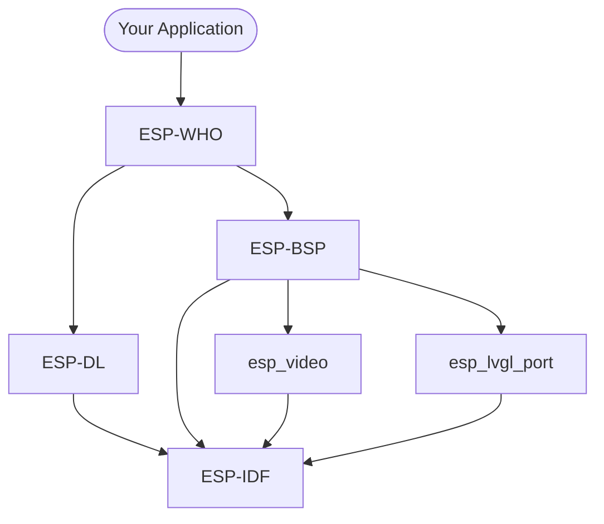

## Introduction to Edge-AI Vision

In many real-world applications, reacting to what a camera sees is a fundamental capability: a doorbell that recognizes a face, a robot that avoids obstacles, a factory line that spots defects, or a security system that detects motion. Traditionally, achieving this required sending raw image data to a cloud server for processing, adding latency, bandwidth costs, privacy exposure, and a hard dependency on network connectivity.

**Edge AI** moves the inference workload directly onto the device, processing sensor data locally without relying on the cloud. This approach unlocks a different class of applications:

- **Low latency:** decisions happen in milliseconds, not round-trip seconds
- **Privacy by design:** raw images never leave the device
- **Offline operation:** works without internet connectivity
- **Lower cost:** no cloud compute or data transfer fees at scale

### The challenge: constrained devices

Running a neural network model on a microcontroller is fundamentally different from running one on a server or even a smartphone. Embedded devices have strict constraints:

| Resource | Typical cloud server | ESP32-S3 |
|----------|---------------------|----------|
| CPU | Multi-core GHz | Dual-core 240 MHz |
| RAM | GB | 8 MB (+ 8 MB PSRAM) |
| Storage | TB | 8 MB flash |
| Power | Hundreds of watts | < 1 W |

This means that models must be carefully quantized, pruned, and optimized to fit within the available memory and run at a useful frame rate. Model weights are typically quantized from 32-bit floats to 8-bit integers (INT8), which reduces memory usage by 4x and allows faster arithmetic with minimal accuracy loss.

### Espressif SoCs for edge AI

Espressif offers several SoCs purpose-built for edge AI workloads. The table below compares the three most relevant ones for vision applications:

| Feature | ESP32-S3 | ESP32-P4 | ESP32-S31 |
|---------|----------|----------|-----------|
| CPU | 2x Xtensa LX7 @ 240 MHz | 2x RISC-V @ 400 MHz + LP core | 2x RISC-V @ 320 MHz + LP core |
| AI acceleration | 128-bit SIMD vector instructions | PIE + 128-bit SIMD (INT8 MAC fusion) | 128-bit SIMD (one core) |
| SRAM | 512 KB | 768 KB + 640 KB TCM | 512 KB |
| PSRAM support | 8 MB Octal | Up to 32 MB Octal | 250 MHz 8-bit DDR |
| Camera interface | DVP | DVP + MIPI-CSI (2-lane) | DVP (16-bit) |
| Display interface | RGB/SPI | RGB + MIPI-DSI | RGB + MIPI-DSI |
| Wi-Fi | Wi-Fi 4 | Wi-Fi 6 (via co-processor) | Wi-Fi 6 |
| Bluetooth | BT 5.0 LE | No | BT 5.4 LE + Classic |
| 802.15.4 | No | No | Thread + Zigbee |
| Hardware JPEG | No | Yes | Yes |
| 2D accelerator (PPA) | No | Yes | Yes |

#### ESP32-S3

The [ESP32-S3](https://www.espressif.com/en/products/socs/esp32-s3) is the SoC used in this workshop, via the ESP32-S3-EYE development board. It was designed with AI workloads in mind, adding **128-bit SIMD vector instructions** to the Xtensa LX7 core (see [PIE](https://documentation.espressif.com/esp32-s3_technical_reference_manual_en.pdf)). These instructions accelerate operations common in neural network inference, such as multiply-accumulate (MAC), dot products, and convolution. They are the hardware foundation that makes frameworks like ESP-DL practical on a microcontroller.

Key properties for vision AI:

- **Dual-core Xtensa LX7 at 240 MHz:** one core handles inference while the other manages peripherals and communication
- **128-bit SIMD vector instructions:** hardware-accelerated INT8 neural network operations with ~18x speedup over unoptimized code
- **8 MB Octal PSRAM:** enough to buffer camera frames and model activations simultaneously
- **DVP camera interface:** direct connection to image sensors like the OV2640
- **Wi-Fi + Bluetooth:** results can be reported wirelessly without a separate communication chip

#### ESP32-P4

The [ESP32-P4](https://www.espressif.com/en/products/socs/esp32-p4) is Espressif's current high-performance SoC for edge AI and rich HMI. Its dual-core RISC-V at 400 MHz, combined with **PIE (Processor Instruction Extensions)** that fuse multiply-accumulate-shift into a single cycle on INT8 vectors, delivers roughly **2.7-3x faster inference** than the ESP32-S3 for typical vision models.

Notable advantages for edge-AI vision:

- **MIPI-CSI camera input:** supports higher-resolution and higher-framerate image sensors
- **Up to 32 MB PSRAM:** headroom for larger models and higher-resolution frame buffers
- **Hardware JPEG codec and 2D PPA:** offloads image pre/post-processing from the CPU
- **768 KB on-chip SRAM:** reduces reliance on external memory for small intermediate buffers

#### ESP32-S31

The [ESP32-S31](https://www.espressif.com/en/products/socs/esp32-s31) is Espressif's newest connectivity-focused SoC, announced in 2026. It targets applications that combine edge AI with comprehensive wireless protocols, including Wi-Fi 6, Bluetooth 5.4 (LE + Classic), Thread, and Zigbee, all in a single SoC.

Notable properties:

- **128-bit SIMD on one RISC-V core:** accelerates INT8 inference with wide parallel data paths
- **Wi-Fi 6 + BT 5.4 + Thread + Zigbee:** ideal for smart home and industrial automation requiring multi-protocol connectivity
- **Hardware JPEG codec and 2D PPA:** same image processing acceleration as the ESP32-P4
- **Supported from ESP-IDF v6.1+**

> [!NOTE]
> This workshop uses the ESP32-S3-EYE, so all hands-on exercises target the ESP32-S3. The concepts, frameworks (ESP-WHO, ESP-DL), and model pipeline apply to ESP32-P4 and ESP32-S31 as well, with appropriate BSP and toolchain adjustments.

## Introduction to ESP-WHO

To help developers with vision applications such as face detection and recognition, pedestrian detection, and QR code recognition, Espressif has developed a framework for image processing that runs on ESP SoCs. ESP-WHO is built on top of [ESP-DL](#esp-dl), Espressif's neural network inference engine, which handles all model loading and execution. ESP-WHO adds the camera pipeline, display integration, and FreeRTOS task scaffolding on top of it.

An introduction article called [ESP-WHO: Get started](https://developer.espressif.com/blog/2026/05/esp-who-get-started/) was published recently and it is an excellent source for information about ESP-WHO.

In this workshop, we will go further than the article and deep-dive into vision for other applications.

### Supported hardware

ESP-WHO targets ESP SoCs with hardware AI acceleration and uses the BSP abstraction layer so that the same application code runs across supported boards without modification. The table below lists the supported development boards from Espressif:

| Development board | SoC | Camera interface | Notes |
|-------------------|-----|-----------------|-------|
| [ESP32-S3-EYE](https://github.com/espressif/esp-who/blob/master/docs/en/get-started/ESP32-S3-EYE_Getting_Started_Guide.md) | ESP32-S3 | DVP (OV2640) | Used in this workshop |
| [ESP32-S3-Korvo-2](https://docs.espressif.com/projects/esp-adf/en/latest/get-started/user-guide-esp32-s3-korvo-2.html) | ESP32-S3 | DVP (OV2640) | Audio-focused board with camera support |
| [ESP32-P4-Function-EV-Board](https://docs.espressif.com/projects/esp-dev-kits/en/latest/esp32p4/esp32-p4-function-ev-board/index.html) | ESP32-P4 | MIPI-CSI (SC2336) | High-performance board with MIPI camera |

### Features

ESP-WHO ships with ready-to-run examples that cover the most common vision AI use cases:

| Feature | Example | Description |
|---------|---------|-------------|
| Human face detection | `human_face_recognition` | Detects human faces in the camera frame and draws bounding boxes in real time |
| Human face recognition | `human_face_recognition` | Enrolls and recognizes individual faces, assigning IDs to known faces |
| Object detection | `object_detect` | Detects and classifies objects from the COCO dataset using a YOLO11-based model |
| QR code recognition | `qrcode_recognition` | Decodes QR codes captured by the camera |

Beyond the individual examples, ESP-WHO provides several framework-level capabilities:

- **ESP-DL powered inference:** all model execution in ESP-WHO goes through ESP-DL. ESP-DL handles model loading, memory placement, and hardware-accelerated INT8 inference — ESP-WHO builds its detection and recognition pipelines directly on top of it. The same models can also be used directly via the ESP-DL C++ API without going through ESP-WHO
- **Asynchronous pipeline:** the camera capture and model inference run on separate cores concurrently, maximizing frame throughput
- **LVGL integration:** results are rendered directly on the LCD display using the LVGL graphics library, with no extra glue code needed
- **BSP-based portability:** hardware differences between supported boards are fully abstracted. The same application code runs on the ESP32-S3-EYE, ESP32-P4-Function-EV-Board, and ESP32-S3-Korvo-2 by switching the BSP configuration
- **Pre-quantized model zoo:** face detection, face recognition, gesture recognition, and object detection models are provided by ESP-DL, pre-quantized and ready to load — either through ESP-WHO pipelines or directly via the ESP-DL API



### Architecture

ESP-WHO follows a layered architecture. Your application sits at the top, composed from ESP-WHO building-block components. These components depend on ESP-DL for inference and ESP-BSP for hardware abstraction. The BSP brings in the individual peripheral drivers, all sitting on top of ESP-IDF.



Each node in the diagram represents a distinct layer of the stack:

| Layer | Description |
|-------|-------------|
| **Your Application** | The code you write. It uses ESP-WHO components to build a vision pipeline, combining capture, inference, and display stages |
| **ESP-WHO** | A collection of composable C++ components that implement the vision pipeline stages — camera capture, model inference, face recognition, QR decoding, and display output |
| **ESP-DL** | Espressif's neural network inference engine. ESP-WHO delegates all model loading and execution to ESP-DL, which optimizes and runs `.espdl` models using SoC-specific SIMD instructions |
| **ESP-BSP** | Board Support Package that abstracts the hardware peripherals (camera, display, buttons, microphone) behind a unified API, making the application portable across supported boards |
| **esp_video** | Camera driver component from [ESP Video Components](#esp-video-components). Provides a V4L2-compatible API for the OV2640 sensor over DVP. The BSP initializes it and exposes camera access through BSP calls |
| **esp_lvgl_port** | LVGL integration layer. Manages the display task, flush callbacks, and touch input routing so that LVGL can render directly to the LCD |
| **ESP-IDF** | The foundation of the entire stack. Provides FreeRTOS, peripheral drivers, the HAL, and the build system that all other components are built on |

**ESP-WHO internal components:**

ESP-WHO is structured as a set of composable C++ components, each responsible for a single stage of the vision pipeline. They are designed to run as FreeRTOS tasks and communicate through queues, so individual stages can be combined or replaced without rewriting the whole application.

| Component | Role |
|-----------|------|
| `who_task` | Base FreeRTOS task abstraction used by all pipeline stages |
| `who_frame_cap` | Captures frames from the camera asynchronously via `who_cam` |
| `who_frame_lcd_disp` | Pushes frames with overlays to the LCD display |
| `who_detect` | Runs detection models on captured frames (face, pedestrian, object) |
| `who_recognition` | Extends detection with face enrollment and recognition |
| `who_qrcode` | Decodes QR codes from captured frames |
| `who_app` | Top-level orchestration that wires capture, inference, and display together |

**External dependencies:**

ESP-WHO relies on a set of Espressif-maintained components that are declared in the project's `idf_component.yml` and fetched automatically from the [ESP Component Registry](https://components.espressif.com) at build time.

| Component | Source | Role |
|-----------|--------|------|
| `esp-dl` | [espressif/esp-dl](https://github.com/espressif/esp-dl) | Neural network inference engine and model zoo |
| `esp32_s3_eye BSP` | [espressif/esp-bsp](https://github.com/espressif/esp-bsp) | Board hardware abstraction |
| `esp_video` | [espressif/esp-video-components](https://github.com/espressif/esp-video-components) | Camera driver (OV2640 via DVP) |
| `esp_lvgl_port` | [espressif/esp_lvgl_port](https://components.espressif.com/components/espressif/esp_lvgl_port) | LVGL integration for the ST7789 LCD |
| `button` | [espressif/button](https://components.espressif.com/components/espressif/button) | Function button driver |
| `esp_codec_dev` | [espressif/esp_codec_dev](https://components.espressif.com/components/espressif/esp_codec_dev) | MEMS microphone driver |
| `led_indicator` | [espressif/led_indicator](https://components.espressif.com/components/espressif/led_indicator) | LED status indicator |
| `ESP-IDF` | [espressif/esp-idf](https://github.com/espressif/esp-idf) | Foundation: FreeRTOS, peripheral drivers, HAL |

#### ESP-DL

[ESP-DL](https://github.com/espressif/esp-dl) is Espressif's lightweight neural network inference framework designed specifically for ESP SoCs. It provides the low-level engine that loads, optimizes, and runs AI models on the device, and is the foundation that ESP-WHO builds on for vision tasks.

Key capabilities:

- **`.espdl` model format:** a FlatBuffers-based format (similar to ONNX) optimized for embedded targets, with support for zero-copy deserialization to reduce startup time and RAM usage
- **Optimized operators:** common AI operators (Conv, DepthwiseConv, Gemm, Add, Mul, etc.) are implemented using SoC-specific SIMD/PIE instructions for maximum throughput
- **Static memory planner:** automatically places model layers into the optimal memory region (internal SRAM vs PSRAM) based on user-specified constraints
- **Dual-core scheduling:** computationally heavy operators (Conv2D, DepthwiseConv2D) are automatically split across both cores
- **8-bit LUT activations:** all activation functions except ReLU/PReLU are computed via an 8-bit look-up table, keeping inference latency flat regardless of activation complexity

The typical ESP-DL workflow is:

1. Train a model in PyTorch or TensorFlow
2. Export to ONNX
3. Quantize from FP32 to INT8 using **ESP-PPQ** (`pip install esp-ppq`), producing a `.espdl` file
4. Load and run the `.espdl` model on-device using the ESP-DL C++ API

ESP-DL ships with a **model zoo** of pre-trained and pre-quantized models ready to deploy, including face detection, face recognition, hand gesture recognition, and YOLO11-based object detection. All of these are used in this workshop.

> [!NOTE]
> ESP-WHO uses ESP-DL internally for all inference, but you are not required to use ESP-WHO to run models. The ESP-DL C++ API can be used directly in your application to load and run any `.espdl` model from the model zoo — or your own custom model — without the camera pipeline, display integration, or FreeRTOS task scaffolding that ESP-WHO adds. This is the approach used later in this workshop when building custom inference pipelines.



#### ESP-BSP

[ESP-BSP](https://github.com/espressif/esp-bsp) is Espressif's Board Support Package framework. It provides a unified hardware abstraction API that covers peripherals such as display, camera, microphone, buttons, SD card, and LEDs. With the BSP, you can write portable application code without managing low-level pin assignments and driver initialization manually.

For this workshop, the BSP component for the ESP32-S3-EYE is [`espressif/esp32_s3_eye`](https://components.espressif.com/components/espressif/esp32_s3_eye).

**Capabilities**

The table below lists the hardware capabilities exposed by the ESP32-S3-EYE BSP and the underlying components used:

| Capability | Available | Controller / Component | Version |
|------------|:---------:|------------------------|---------|
| Display | Yes | ST7789 / IDF | >=5.4 |
| LVGL port | Yes | [espressif/esp_lvgl_port](https://components.espressif.com/components/espressif/esp_lvgl_port) | ^2 |
| Touch | No | | |
| Buttons | Yes | [espressif/button](https://components.espressif.com/components/espressif/button) | ^4 |
| Audio mic | Yes | [espressif/esp_codec_dev](https://components.espressif.com/components/espressif/esp_codec_dev) | ~1.5 |
| SD card | Yes | IDF | >=5.4 |
| LED | Yes | IDF / [espressif/led_indicator](https://components.espressif.com/components/espressif/led_indicator) | >=5.4 ^2 |
| Camera | Yes | OV2640 / [espressif/esp_video](https://components.espressif.com/components/espressif/esp_video) | ~2.0 |
| Battery | No | | |
| IMU | No | | |

**Basic usage**

The BSP handles peripheral initialization through a clean API. Below are some common patterns:

**Display (LVGL):**

```c
#include "bsp/esp32_s3_eye.h"

bsp_display_start();
bsp_display_backlight_on();
```

**Camera:**

```c
bsp_camera_init(&camera_config);
```

**Buttons:**

```c
bsp_iot_button_create(buttons, NULL, BSP_BUTTON_NUM);
```

**SD card:**

```c
bsp_sdcard_mount();
// ... use SD card ...
bsp_sdcard_unmount();
```

**Compatible examples**

| Example | Description |
|---------|-------------|
| [Display](https://github.com/espressif/esp-bsp/tree/master/examples/display) | Show an image on screen with LVGL startup animation |
| [Camera](https://github.com/espressif/esp-bsp/tree/master/examples/display_camera_video) | Stream camera output to the display via LVGL |
| [LVGL Benchmark](https://github.com/espressif/esp-bsp/tree/master/examples/display_lvgl_benchmark) | Run LVGL benchmark tests |
| [LVGL Demos](https://github.com/espressif/esp-bsp/tree/master/examples/display_lvgl_demos) | Run the full LVGL demo player |

#### ESP Video Components

[esp-video-components](https://github.com/espressif/esp-video-components) is Espressif's collection of video-related components for ESP-IDF, covering camera capture, image signal processing, and video encoding. The most relevant component for this workshop is [`esp_video`](https://components.espressif.com/components/espressif/esp_video), which provides the camera driver used by the ESP32-S3-EYE BSP. Each component in the repository can be used independently — the BSP pulls in `esp_video` as its camera dependency, not the repository as a whole.

The key feature of esp-video-components is its **Linux V4L2-compatible API**, using the same `open()`, `ioctl()`, and buffer queue model used in Linux camera stacks. This makes it consistent across all supported interfaces (DVP, MIPI-CSI, SPI, USB) and all supported SoCs.

##### Key capabilities

- **V4L2-compatible API:** unified interface regardless of sensor or physical bus
- **ISP pipeline:** built-in image signal processing support (ESP32-P4)
- **H.264 hardware encoding:** high-speed video encoding (ESP32-P4)
- **Multi-camera support:** manage multiple sensors simultaneously
- **Broad SoC support:** ESP32-S3 (DVP), ESP32-P4 (DVP + MIPI-CSI), ESP32-S31 (DVP + MIPI-CSI), ESP32-C series (SPI)

For the ESP32-S3-EYE, `esp_video` operates over the DVP interface with the OV2640 sensor. Since the BSP handles initialization, you interact with the camera through BSP calls rather than the `esp_video` API directly in most ESP-WHO examples.



## AI capabilities of ESP32-S3-EYE

The [ESP32-S3-EYE](https://github.com/espressif/esp-who/blob/master/docs/en/get-started/ESP32-S3-EYE_Getting_Started_Guide.md) is a small-sized AI development board produced by Espressif. It is based on the ESP32-S3 SoC, featuring a 2-megapixel camera, a 1.3" LCD display, and a digital microphone for image recognition and audio processing.



##### Key features

| Feature | Details |
|---------|---------|
| SoC | ESP32-S3R8 (Wi-Fi + Bluetooth 5 LE, vector instructions for AI) |
| PSRAM | 8 MB Octal SPI PSRAM |
| Flash | 8 MB |
| Camera | OV2640, 2 MP, 66.5° FOV, up to 1600x1200 resolution |
| Display | 1.3" LCD, connected via SPI |
| Microphone | Digital I2S MEMS, 61 dB SNR, -26 dBFS sensitivity |
| Accelerometer | QMA7981 three-axis accelerometer |
| MicroSD slot | Yes |
| USB | Micro-USB (power + USB Serial/JTAG) |
| Battery | Optional Li-ion via soldering points (with charger IC) |

**Block diagram**

The block diagram below shows the main components of the ESP32-S3-EYE-MB main board v2.2 (left) and the ESP32-S3-EYE-SUB sub board (right).



**Main board components (ESP32-S3-EYE-MB)**



| No. | Component | Description |
|-----|-----------|-------------|
| 1 | Camera | OV2640, 2 MP, 66.5° FOV, max 1600x1200 |
| 2 | Module Power LED | Green LED that turns on when USB power is connected. Controlled via GPIO3 (open-drain). |
| 3 | Pin Headers | Connects to the sub board female headers |
| 4 | 5 V to 3.3 V LDO | Power regulator for the module |
| 5 | Digital Microphone | I2S MEMS, 61 dB SNR, -26 dBFS, 3.3 V |
| 6 | FPC Connector | Connects main board and sub board |
| 7 | Function Buttons | Six buttons, all configurable except RST |
| 8 | ESP32-S3-WROOM-1 | Module with ESP32-S3R8, 8 MB flash, 8 MB Octal PSRAM, Wi-Fi + BT 5 LE |
| 9 | MicroSD Card Slot | Expands storage capacity |
| 10 | 3.3 V to 1.5 V LDO | Power regulator for the camera |
| 11 | 3.3 V to 2.8 V LDO | Power regulator for the camera |
| 12 | USB Port | Micro-USB for 5 V power and communication via GPIO19/GPIO20 |
| 13 | Battery Soldering Points | For optional external Li-ion battery (>1000 mAh, 3.7 V) |
| 14 | Battery Charger Chip | ME4054BM5G-N, 1 A linear Li-ion charger |
| 15 | Battery Red LED | Charging status indicator |
| 16 | Accelerometer | QMA7981, three-axis, for screen rotation |

**Sub board components (ESP32-S3-EYE-SUB)**



| Component | Description |
|-----------|-------------|
| LCD Display | 1.3" display, connected to ESP32-S3 via SPI |
| Strapping Pins | Four strapping pins from the main board, usable as test points |
| Female Headers | Mounts onto the main board pin headers |
| LCD FPC Connector | Connects the sub board to the LCD display |
| LCD_RST | Test point for resetting the LCD display |

##### Resources

- [Getting Started Guide](https://github.com/espressif/esp-who/blob/master/docs/en/get-started/ESP32-S3-EYE_Getting_Started_Guide.md)
- [ESP32-S3 Datasheet](https://www.espressif.com/sites/default/files/documentation/esp32-s3_datasheet_en.pdf) (PDF)
- [ESP32-S3-WROOM-1 Datasheet](https://www.espressif.com/sites/default/files/documentation/esp32-s3-wroom-1_wroom-1u_datasheet_en.pdf) (PDF)
- [Main Board Schematic v2.2](https://dl.espressif.com/dl/schematics/SCH_ESP32-S3-EYE-MB_20211201_V2.2.pdf) (PDF)
- [Sub Board Schematic](https://dl.espressif.com/dl/schematics/SCH_ESP32-S3-EYE_SUB_V1.1_20210913.pdf) (PDF)

## Next step

After this introduction, it is time to get started and install the development environment.

[Assignment 1: Install ESP-IDF and ESP-WHO](../assignment-1)

[Return to the workshop main page](/workshops/edge-ai-with-esp32-s3/)
