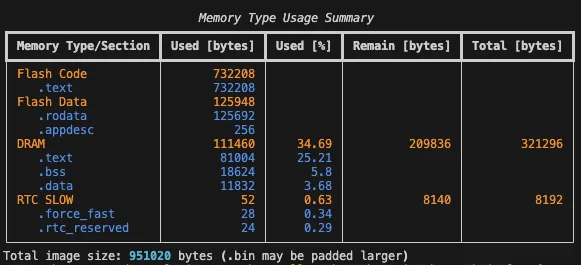

In this assignment, you will analyze the binary image size and optimize the memory footprint of your application.

## Assignment steps

We will:

1. Build the original project to spot any oversized or suspicious sections (e.g., .text, .data, .rodata) that may hide unoptimized code.
2. Change configuration to reduce it.
3. Rebuild the project to check the improvement.

### Build the original project

* `> ESP-IDF: Full Clean Project`
* `> ESP-IDF: Build Your Project`

You will get the summary table of Fig.1 for the binary image.
<!--  -->


#### Removing the logs

* Remove the logging output in the menuconfig 
   _if you don't remember how to do that, check [assignment 1.3](../assignment-1-3/)_
* `> ESP-IDF: Build Your Project`

<!--  -->


The binary size is 77kb less than before.

#### Certificate Bundle

* Open menuconfig: `> ESP-IDF: SDK Configuration Editor (menuconfig)`
* Uncheck `Certificate Bundle` &rarr; `Enable trusted root certificate bundle`
* `> ESP-IDF: Build Your Project`

<!--  -->


#### MQTT unused options

* Open menuconfig: `> ESP-IDF: SDK Configuration Editor (menuconfig)`
* Uncheck `ESP-MQTT Configurations` &rarr; `Enable MQTT over SSL`
* Uncheck `ESP-MQTT Configurations` &rarr; `Enable MQTT over Websocket`
* `> ESP-IDF: Build Your Project`

<!--  -->


We gained another 6.7kb.

## Conclusion

In this assignment, we saw how to check the size of our binary and how to use the menuconfig to removed unused options to improve the memory footprint of our application.

> Next step: [assignment 3.2](../assignment-3-2/)
