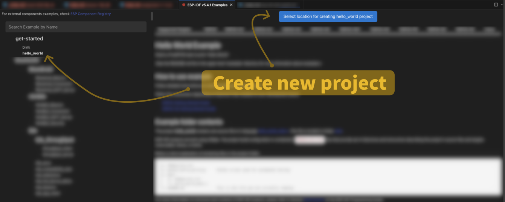
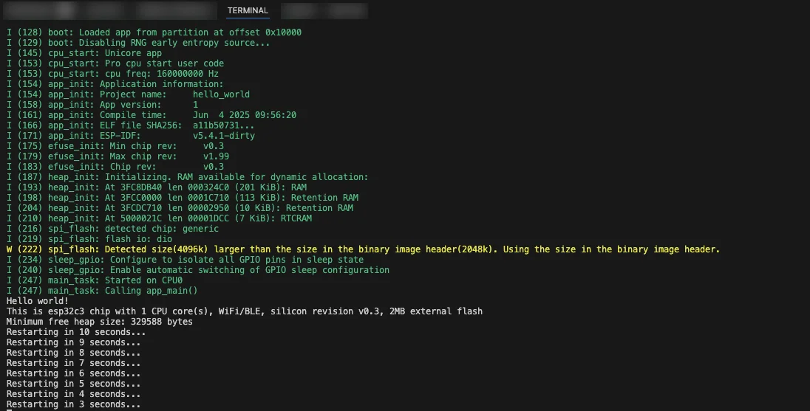

## Step 0: Install ESP-IDF Extension for VSCode

In this workshop, we'll be using VSCode extension. If you didn't install it yet, please follow [these instructions](https://docs.espressif.com/projects/vscode-esp-idf-extension/en/latest/).

To install ESP-IDF itself, there are two ways:

1. Through the extension configuration
2. Using the [ESP-IDF installation manager](https://docs.espressif.com/projects/idf-im-ui/en/latest/)

The second will soon become the standard way to manage ESP-IDF.

## Step 1: Create and test a project from an example

In this section, we will:

1. Create a new project from an example
2. Build the project
3. Flash and monitor

Please note that most commands in VSCode are executed through the __Command Palette__, which you can open by pressing `Ctrl`+`Shift`+`P` (or `Cmd`+`Shift`+`P`)


  In this guide, commands to enter in the __Command Palette__ are marked with the __symbol `>`__. Usually it is sufficient to type a few character of the command, then a dropdown menu will help you find the right one.


### Create a new project from an example

1. Open VSCode
2. `> ESP-IDF: Show Example Project`
3. (If asked) Choose the ESP-IDF version
4. Click on `get_started` &rarr; `hello_world`
5. Click on the button `Select Location for Creating `hello_world` Example` in the new tab.

<!--  -->


A new window will open with the following file structure:

<!--  -->


For now, you can ignore `.vscode`, `.devcontainer`, and `build` folder. You will work on the `hello_world_main.c` file.

### Build the project

To compile (_build_) your project, you first need to tell the compiler which core (called _target_) you are using. You can do it through the IDE as follows:

* `> ESP-IDF: Set Espressif Device Target`
* In the dropdown menu, choose `esp32c3` &rarr; `ESP32-C3 chip (via builtin USB-JTAG)`

Now you're ready to compile your project:
* `> ESP-IDF: Build Your Project`
   _You can also click on the small &#128295; icon located in the bottom bar_

A terminal tab will open at the bottom of your IDE and show the successful compilation and size of the compiled binary.

<!--  -->



If you have problems that are hard to debug, it is useful to do a full clean of your project by using the command `> ESP-IDF: Full clean project`.


### Flash and monitor

To see the firmware running, you need to store it on the device (_flash_) and then you need to read the output it emits on the serial port (_monitor_).

* Connect the board to your workstation
* Check that the device is recognized
* Note the name assigned to the Espressif device
   * On Windows, it starts with `COM`
   * On Linux/macOS, it starts with `tty` or `ttyUSB`

If you're having trouble, check the [Establish Serial Connection with ESP32 Guide](https://docs.espressif.com/projects/esp-idf/en/stable/esp32/get-started/establish-serial-connection.html#establish-serial-connection-with-esp32).

Now you can flash and monitor your device.

* `> ESP-IDF: Build, Flash and Start a Monitor on Your Device`

In the terminal, you should now see the `Hello World!` string and the countdown before the reset.

<!--  -->
<!--  -->



## Step 2: Change the output text

Identify the output string and change it to `Hello LED`.

## Conclusion

You can now create a new project and flash it on the board. In the next assignment, we'll consolidate this process.

### Next step
> Next assignment &rarr; [Assignment 1.2](../assignment-1-2/)
