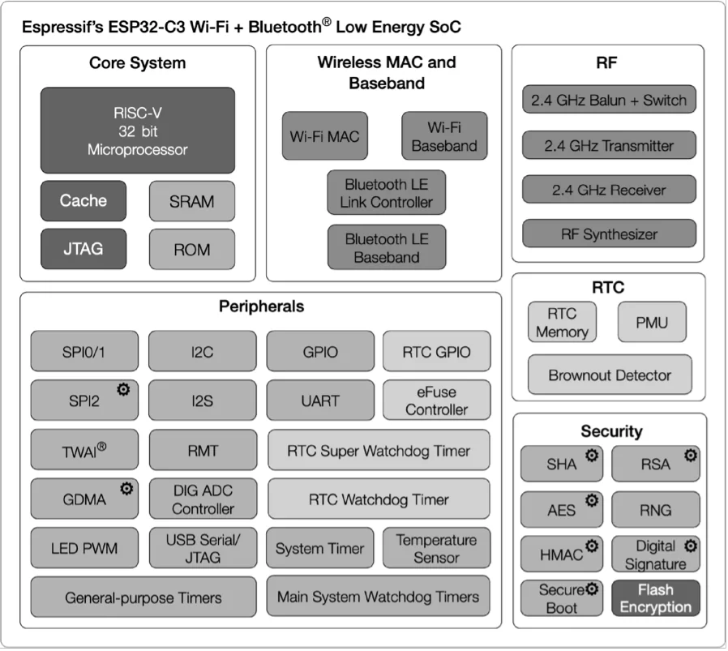
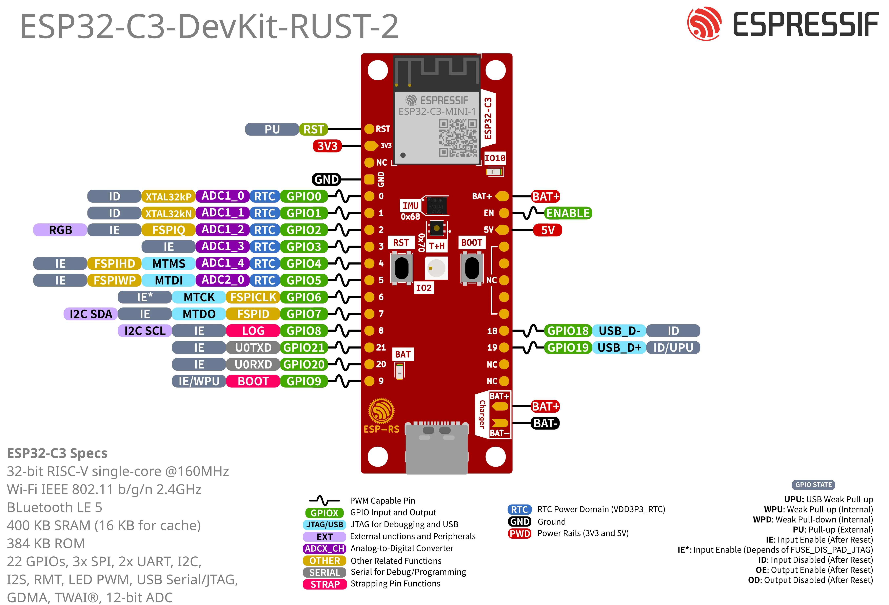

## ESP-IDF Introduction

The ESP-IDF (Espressif IoT Development Framework) is the official operating system and development framework for the Espressif Systems SoCs. It provides a comprehensive environment for building IoT applications with robust networking, security, and reliability features.

The ESP-IDF framework includes FreeRTOS, enabling developers to build real-time, multitasking applications. It provides a comprehensive set of libraries, tools, and documentation, serving as the foundation for development on Espressif devices.

ESP-IDF includes more than 400 examples, covering a wide range of use cases and helping developers quickly get started on their projects.

### Architecture

The ESP-IDF platform architecture is mainly divided into 3 layers:

- **ESP-IDF platform**
  - Contains the core components required and the operating system. Includes the FreeRTOS, drivers, build system, protocols, etc.
- **Middleware**
  - Adds new features to ESP-IDF, for example the audio framework and HMI. In this workshop, we won't use them.
- **AIoT Application**
  - Your application.

<!--  -->


All the necessary building blocks for your application will be included in the ESP-IDF platform.
ESP-IDF is constantly developing, growing, and improving; acquiring new features and supporting more Espressif cores.
Visit the ESP-IDF project on GitHub to get the updated list of supported versions and the maintenance period.



### Main ESP-IDF blocks

As mentioned, ESP-IDF is built on FreeRTOS and contains several libraries. The main libraries you will include in your projects are:

1. FreeRTOS (`freertos`): lightweight, real-time operating system kernel designed for embedded devices, providing multitasking capabilities through preemptive scheduling, task management, and inter-task communication.
2. Drivers (`esp_driver_xxx`): libraries for driving peripherals.
3. Protocols (`esp_http`, `esp-tls` etc.): libraries implementing protocols.

During the assignments, you will learn how to include both internal libraries provided by ESP-IDF and external libraries. ESP-IDF also offers a convenient system for managing external dependencies, known as components.

### Components

Components are packages that include libraries along with additional files for dependency management, metadata, and configuration.

They are used to add new features such as sensor drivers, communication protocols, board support packages, and other functionalities not included in ESP-IDF by default. Some components are already integrated into example projects, and ESP-IDF itself adopts the external component model to promote modularity.

Using components enhances maintainability and accelerates development by enabling code reuse and sharing across multiple projects.

If you want to create and publish your own component, we recommend that you watch the talk [DevCon23 - Developing, Publishing, and Maintaining Components for ESP-IDF](https://www.youtube.com/watch?v=D86gQ4knUnc) or read the [How to create an ESP-IDF component](https://developer.espressif.com/blog/2024/12/how-to-create-an-esp-idf-component/) article.



You can also find components by browsing our [ESP Registry](https://components.espressif.com) platform.

In [assignment 3.2](../assignment-3-2/), you will have a chance to create your own component and use it in your project.

### Frameworks

Also, ESP-IDF serves as the basis for several other frameworks, including:

- **Arduino for Espressif**
- **ESP-ADF** (Audio Development Framework): Designed for audio applications.
- **ESP-WHO** (AI Development Framework): Focused on face detection and recognition.
- **ESP-RainMaker**: Simplifies building connected devices with cloud capabilities.
- **ESP-Matter SDK**: Espressif's SDK for Matter is the official Matter development framework for ESP32 series SoCs.

To see all the supported frameworks, please visit our [GitHub organization page](https://github.com/espressif).

## ESP-IDF Development

In addition to libraries, ESP-IDF includes the necessary tools to compile, flash, and monitor your device.

You can develop applications for Espressif devices using any plain text editor, such as [Gedit](https://gedit-text-editor.org/) or [Notepad++](https://notepad-plus-plus.org/), by following the [manual installation guide](https://docs.espressif.com/projects/esp-idf/en/stable/esp32/get-started/index.html#manual-installation) provided in Espressif's documentation.

However, for this workshop, we will use an IDE (Integrated Development Environment) to streamline both development and setup. Espressif supports several IDEs, but we will focus on Visual Studio Code (VSCode). Espressif provides an official VSCode extension called [`ESP-IDF`](https://marketplace.visualstudio.com/items?itemName=espressif.esp-idf-extension), which enables you to develop, compile, flash, and debug your projects directly within the editor.

To give you an idea, the ESP-IDF VSCode Extension manages the toolchain and gives you some useful commands which we will use later, such as:

* `> ESP-IDF: Build Your Project`
* `> ESP-IDF: Set Espressif Device Target`
* `> ESP-IDF: Full clean project`

The character `>` indicates VSCode Command Palette, which can be opened by pressing `F1` or `Ctrl`+`Shift`+`P` (or `Cmd`+`Shift`+`P`).

All these commands are wrappers around the main `ESP-IDF` front-end tool which is [`idf.py`](https://docs.espressif.com/projects/esp-idf/en/latest/esp32/api-guides/tools/idf-py.html).

## Hardware used in this workshop

In this workshop we will use an [ESP32-C3 SoC](https://www.espressif.com/sites/default/files/documentation/esp32-c3_datasheet_en.pdf) based module, called [ESP32-C3-Mini-1-N4](https://www.espressif.com/sites/default/files/documentation/esp32-c3-mini-1_datasheet_en.pdf). You can spot the ESP32-C3-Mini-1-N4 on your workshop board (see Fig. 2). The ESP32-C3 SoC is under the ESP32-C3-Mini-1-N4 shield.



### ESP32-C3 SoC

ESP32-C3 is a highly-integrated SoC equipped with a 32-bit RISC-V processor, supporting 2.4 GHz Wi-Fi and Bluetooth LE connectivity. The functional block diagram for ESP32-C3 is shown in Figure 3.

<!--  -->


ESP32-C3 has the following features:

-   A 32-bit RISC-V single-core processor @ 160 MHz.

-   A __Wi-Fi subsystem__  
   _Supports Station mode, SoftAP mode, SoftAP + Station mode, and promiscuous mode._

-   A __Bluetooth LE subsystem__ 
   _Supports Bluetooth 5 and Bluetooth mesh._

-   __Integrated memory__ 
   _400 KB SRAM and 384 KB ROM on the chip, external flash connection capability_

-   __Security mechanisms__ 
   _Cryptographic hardware accelerators, encrypted flash, secure bootloader_

-   A __rich set of peripheral interfaces__  
    _The 22 programmable GPIOs can be configured flexibly to support LED PWM, UART, I2C, SPI, I2S, ADC, TWAI, RMT, and USB Serial/JTAG applications._

The ESP32-C3 series of chips has several variants, including the version with in-package SPI flash. You can find them on the [ESP32-C3 Series Comparison](https://www.espressif.com/sites/default/files/documentation/esp32-c3_datasheet_en.pdf#page=12) section of the datasheet. ESP8685 is a small package version of ESP32-C3.

<!-- __Table 5.1. ESP32-C3 series__

|MPN|Flash (MB)|Temp (℃)|Size (mm)|
|:---:|:---:|:---:|:---:|
|ESP32-C3|&ndash;|-40 ~ 105|QFN32 (5×5)|
|ESP32-C3-FN4|4|-40 ~ 85|QFN32 (5×5)|
|ESP32-C3-FH4|4|-40 ~ 105|QFN32 (5×5)|
|ESP32-C3-FH4AZ|4|-40 ~ 105|QFN32 (5×5)|
|ESP8685H2|2|-40 ~ 105|QFN32 (4×4)|
|ESP8685H4|4|-40 ~ 105|QFN32 (4×4)|

> 📌 **Note**
>
> - For ESP32-C3FH4AZ, ESP8685H2, and ESP8685H4, pins for flash connection are not bonded.
> - Nomenclature of ESP32-C3 series: **F** stands for in-package flash, **H**/**N** indicates the flash temperature, and **AZ** is other identification code. -->

### ESP32-C3-Mini-1-N4 Module

In addition to SoCs, Espressif offers modules, which integrate an SoC, additional flash, (optionally) PSRAM memory, and a PCB antenna or an antenna connector. The main advantage of modules is not only their ease of use but also a simplified certification process.

The module we will use is the ESP32-C3-MINI-1-N4. As the name suggests, it includes 4MB of flash. If you're curious about how to interpret the module part number, you can check the article [Espressif part numbers explained: A complete guide - Modules](https://developer.espressif.com/blog/2025/03/espressif-part-numbers-explained/) on the Espressif Developer Portal .

### ESP32-C3 Workshop board

<!--  -->


#### Board peripheral overview

__I2C peripheral__

This board includes the following peripherals over the I2C bus:

| Peripheral               | Part number | Reference                                                                                                      | Crate                                     | Address |
| ------------------------ | ----------- | -------------------------------------------------------------------------------------------------------------- | ----------------------------------------- | ------- |
| IMU                      | ICM-42670-P | [Datasheet](https://invensense.tdk.com/download-pdf/icm-42670-p-datasheet/)                                    | [Link](https://crates.io/crates/icm42670) | 0x68    |
| Temperature and Humidity | SHTC3       | [Datasheet](https://www.mouser.com/datasheet/2/682/Sensirion_04202018_HT_DS_SHTC3_Preliminiary_D2-1323493.pdf) | [Link](https://crates.io/crates/shtcx)    | 0x70    |

_I2C Bus Connection_

| Signal | GPIO   |
| ------ | ------ |
| SDA    | GPIO7 |
| SCL    | GPIO8  |

__GPIO__

The following devices are connected through GPIO:

| I/O Devices | GPIO  |
| ----------- | ----- |
| WS2812 LED  | GPIO2 |
| LED         | GPIO10 |
| Button/Boot | GPIO9 |

__Power supply__

* USB type-C (*no PD compatibility*).
* Li-Ion battery charger - MCP73831T-2ACI/OT, it charges up to 4.2V.
  * Recommendation: MCP73831T-2ACI/OT does not provide battery protection for over-current or over-discharge. For the battery (Li-Ion or Li-Po), it's recommended to use the ones with embedded protection.
  * Limitation: reading the battery voltage is not supported.

__Pin Layout__

_Left Side_

| Pin Number | Description  | SoC        |
| ---------- | ------------ | ---------- |
| 1          | Reset        | EN/CHIP_PU |
| 2          | 3V3          |            |
| 3          | N/C          |            |
| 4          | GND          |            |
| 5          | IO0/ADC1-0   | GPIO0      |
| 6          | IO1/ADC1-1   | GPIO1      |
| 7          | IO2/ADC1-2   | GPIO2      |
| 8          | IO3/ADC1-3   | GPIO3      |
| 9          | IO4/ADC2-0   | GPIO4      |
| 10         | IO5/ADC2-1   | GPIO5      |
| 11         | IO6/MTCK     | GPIO6      |
| 12         | IO7/MTDO/LED | GPIO7      |
| 13         | IO8/LOG      | GPIO8      |
| 14         | IO21/U0RXD   | GPIO21     |
| 15         | IO20/U0TXD   | GPIO20     |
| 16         | IO9/BOOT     | GPIO9      |

_Right Side_

| Pin Number | Description | SoC    |
| ---------- | ----------- | ------ |
| 1          | VBAT        |        |
| 2          | EN [1]      |        |
| 3          | VBUS [2]    |        |
| 4          | NC          |        |
| 5          | NC          |        |
| 6          | NC          |        |
| 7          | NC          |        |
| 8          | NC          |        |
| 9          | IO18/USB_D- | GPIO18 |
| 10         | IO19/USB_D+ | GPIO19 |
| 11         | IO8/SCL     | GPIO8  |
| 12         | IO10/SDA    | GPIO10 |

  * [1] Connected to LDO enable pin*
  * [2] Connected to USB 5V*

#### Schematics
You can find the board schematic on the [KiCad Libraries GitHub Repository](https://github.com/espressif/kicad-libraries).

## Conclusion

Now that we have a high-level overview of both hardware and firmware, we're ready to start the first assignment.

### Next Step
> Next Assignment &rarr; __[assignment 1.1](../assignment-1-1)__
