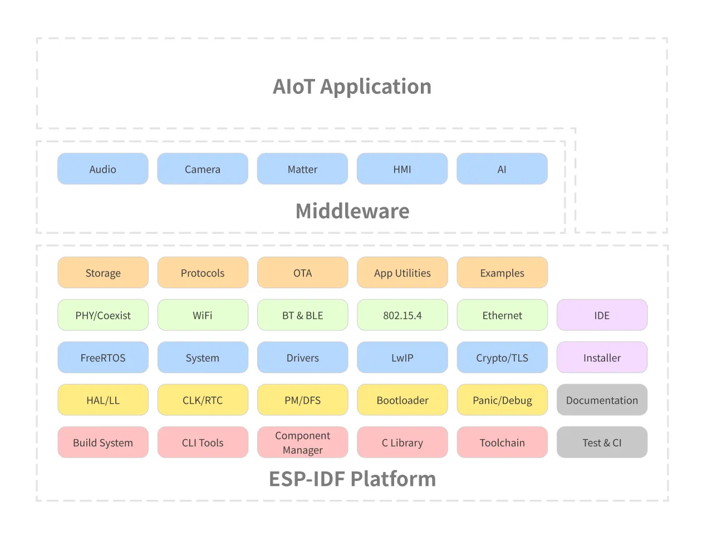
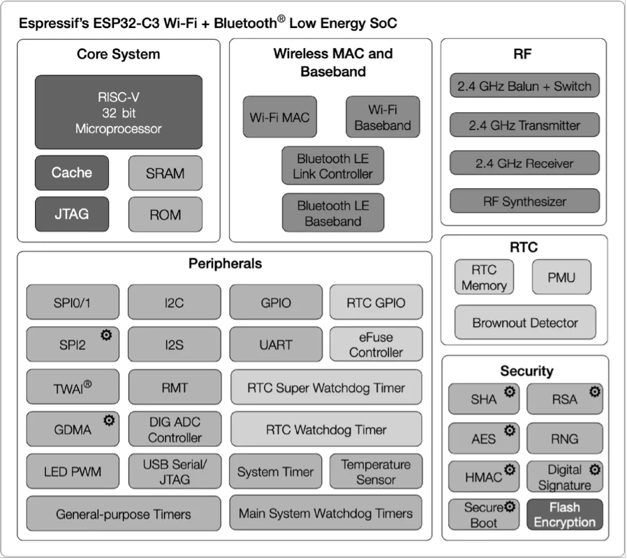
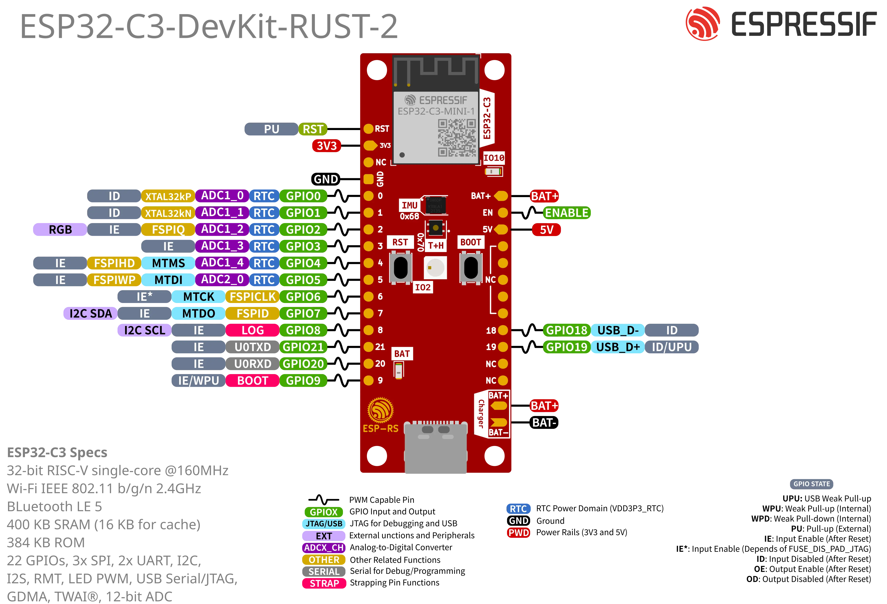

## ESP-IDF Introduction

The ESP-IDF (Espressif IoT Development Framework) is the official operating system and development framework for the Espressif Systems SoCs. It provides a comprehensive environment for building IoT applications with robust networking, security, and reliability features.

The ESP-IDF framework includes FreeRTOS, enabling developers to build real-time, multitasking applications. It provides a comprehensive set of libraries, tools, and documentation, serving as the foundation for development on Espressif devices.

ESP-IDF includes more than 400 examples, covering a wide range of use cases and helping developers quickly get started on their projects.

### Architecture

The ESP-IDF platform architecture is mainly divided into 3 layers:

- **ESP-IDF platform**
  - Contains the core components required and the operating system. Includes the FreeRTOS, drivers, build system, protocols, etc.
- **Middleware**
  - Adds new features to ESP-IDF, for example the audio framework and HMI. In this workshop, we won't use them.
- **AIoT Application**
  - Your application.

<!--  -->


All the necessary building blocks for your application will be included in the ESP-IDF platform.
ESP-IDF is constantly developing, growing, and improving; acquiring new features and supporting more Espressif cores.
Visit the ESP-IDF project on GitHub to get the updated list of supported versions and the maintenance period.



### Main ESP-IDF blocks

As mentioned, ESP-IDF is built on FreeRTOS and contains several libraries. The main libraries you will include in your projects are:

1. FreeRTOS (`freertos`): lightweight, real-time operating system kernel designed for embedded devices, providing multitasking capabilities through preemptive scheduling, task management, and inter-task communication.
2. Drivers (`esp_driver_xxx`): libraries for driving peripherals.
3. Protocols (`esp_http`, `esp-tls` etc.): libraries implementing protocols.

During the assignments, you will learn how to include both internal libraries provided by ESP-IDF and external libraries. ESP-IDF also offers a convenient system for managing external dependencies, known as components.

### Components

Components are packages that include libraries along with additional files for dependency management, metadata, and configuration.



They are used to add new features such as sensor drivers, communication protocols, board support packages, and other functionalities not included in ESP-IDF by default. Some components are already integrated into example projects, and ESP-IDF itself adopts the external component model to promote modularity.

Using components enhances maintainability and accelerates development by enabling code reuse and sharing across multiple projects.

If you want to create and publish your own component, we recommend that you watch the talk [DevCon23 - Developing, Publishing, and Maintaining Components for ESP-IDF](https://www.youtube.com/watch?v=D86gQ4knUnc) or read the [How to create an ESP-IDF component](https://developer.espressif.com/blog/2024/12/how-to-create-an-esp-idf-component/) article.



You can also find components by browsing our [ESP Registry](https://components.espressif.com) platform.

In [assignment 3.2](../assignment-3-2/), you will have a chance to create your own component and use it in your project.

### Frameworks

Also, ESP-IDF serves as the basis for several other frameworks, including:

- **Arduino for Espressif**
- **ESP-ADF** (Audio Development Framework): Designed for audio applications.
- **ESP-WHO** (AI Development Framework): Focused on face detection and recognition.
- **ESP-RainMaker**: Simplifies building connected devices with cloud capabilities.
- **ESP-Matter SDK**: Espressif's SDK for Matter is the official Matter development framework for ESP32 series SoCs.

To see all the supported frameworks, please visit our [GitHub organization page](https://github.com/espressif).

## ESP-IDF Development

In addition to libraries, ESP-IDF includes the necessary tools to compile, flash, and monitor your device.

You can develop applications for Espressif devices using any plain text editor, such as [Gedit](https://gedit-text-editor.org/) or [Notepad++](https://notepad-plus-plus.org/), by following the [manual installation guide](https://docs.espressif.com/projects/esp-idf/en/stable/esp32/get-started/index.html#manual-installation) provided in Espressif's documentation.

However, for this workshop, we will use an IDE (Integrated Development Environment) to streamline both development and setup. Espressif supports several IDEs, but we will focus on Visual Studio Code (VS Code). Espressif provides an official VS Code extension called [`ESP-IDF`](https://marketplace.visualstudio.com/items?itemName=espressif.esp-idf-extension), which enables you to develop, compile, flash, and debug your projects directly within the editor.

To give you an idea, the ESP-IDF VS Code Extension manages the toolchain and gives you some useful commands which we will use later, such as:

* `> ESP-IDF: Build Your Project`
* `> ESP-IDF: Set Espressif Device Target`
* `> ESP-IDF: Full clean project`

The character `>` indicates VS Code Command Palette, which can be opened by pressing `F1` or `Ctrl`+`Shift`+`P` (or `Cmd`+`Shift`+`P`).

All these commands are wrappers around the main `ESP-IDF` front-end tool which is [`idf.py`](https://docs.espressif.com/projects/esp-idf/en/latest/esp32/api-guides/tools/idf-py.html).

## Hardware used in this workshop

In this workshop, you will use a development kit (devKit) based on an Espressif SoC. Espressif SoCs are typically integrated as modules in final products. A development kit is a simple board that includes an Espressif module, the necessary supporting components, and easily accessible pins for prototyping.




      {}

  ### ESP32-C3 SoC

  [ESP32-C3 SoC](https://www.espressif.com/sites/default/files/documentation/esp32-c3_datasheet_en.pdf) is an SoC equipped with a 32-bit RISC-V processor, supporting 2.4 GHz Wi-Fi and Bluetooth LE connectivity. The functional block diagram for ESP32-C3 is shown below

  <!--  -->
  

  ESP32-C3 has the following features:

  -   32-bit RISC-V single-core processor @ 160 MHz.

  -   __Wi-Fi subsystem__  
    _Supports Station mode, SoftAP mode, SoftAP + Station mode, and promiscuous mode._

  -   __Bluetooth LE subsystem__ 
    _Supports Bluetooth 5 and Bluetooth mesh._

  -   __Integrated memory__ 
    _400 KB SRAM and 384 KB ROM on the chip, external flash connection capability_

  -   __Security mechanisms__ 
    _Cryptographic hardware accelerators, encrypted flash, secure bootloader_

  -   __Rich set of peripheral interfaces__  
      _The 22 programmable GPIOs can be configured flexibly to support LED PWM, UART, I2C, SPI, I2S, ADC, TWAI, RMT, and USB Serial/JTAG applications._

  The ESP32-C3 series of chips has several variants, including the version with in-package SPI flash. You can find them on the [ESP32-C3 Series Comparison](https://www.espressif.com/sites/default/files/documentation/esp32-c3_datasheet_en.pdf#page=12) section of the datasheet. ESP8685 is a small package version of ESP32-C3.

  ### ESP32-C3-Mini-1-N4 Module

  In addition to SoCs, Espressif offers modules, which integrate an SoC, additional flash, (optionally) PSRAM memory, and a PCB antenna or an antenna connector. The main advantage of modules is not only their ease of use but also a simplified certification process.

  The most common ESP32-C3 module is the ESP32-C3-MINI-1-N4. It includes 4MB of flash.

  ### ESP32-C3 DevKit

  <!--  -->
  

  #### Schematics
  You can find the board schematic on the [KiCad Libraries GitHub Repository](https://github.com/espressif/kicad-libraries).

      {}
      {}

  ### ESP32-S3 SoC

  [ESP32-S3 SoC](https://documentation.espressif.com/esp32-s3_datasheet_en.html) is a highly integrated SoC equipped with dual-core 32-bit Xtensa LX7 processors, supporting 2.4 GHz Wi-Fi and Bluetooth LE connectivity. The functional block diagram for ESP32-S3 is shown below.

  

  ESP32-S3 has the following features:

  -   Dual-core 32-bit Xtensa LX7 processors @ up to 240 MHz.

  -   A __Wi-Fi subsystem__  
    _Supports Station mode, SoftAP mode, SoftAP + Station mode, and promiscuous mode._

  -   A __Bluetooth LE subsystem__ 
    _Supports Bluetooth 5._

  -   __Integrated memory__ 
    _512 KB SRAM and 384 KB ROM on the chip, external flash and PSRAM connection capability_

  -   __Security mechanisms__ 
    _Cryptographic hardware accelerators, encrypted flash, secure bootloader, digital signature_

  -   A __rich set of peripheral interfaces__  
      _The 45 programmable GPIOs can be configured flexibly to support LED PWM, UART, I2C, SPI, I2S, ADC, DAC, TWAI, RMT, USB OTG, and USB Serial/JTAG applications._

  -   __AI acceleration__ 
    _Vector instructions for accelerating neural network computing and signal processing workloads._

  The ESP32-S3 series of chips has several variants, including versions with in-package SPI flash and PSRAM. You can find them in the [ESP32-S3 Series Comparison](https://www.espressif.com/sites/default/files/documentation/esp32-s3_datasheet_en.pdf#page=15) section of the datasheet.

  ### ESP32-S3-WROOM-1 Module

  In addition to SoCs, Espressif offers modules, which integrate an SoC, additional flash, (optionally) PSRAM memory, and a PCB antenna or an antenna connector. The main advantage of modules is not only their ease of use but also a simplified certification process.

  A common module is the [ESP32-S3-WROOM-1](https://www.espressif.com/sites/default/files/documentation/esp32-s3-wroom-1_wroom-1u_datasheet_en.pdf). Depending on the variant, it includes different configurations of flash and PSRAM.

  ### ESP32-S3 Development board

  

  #### Schematics
  You can find the board schematic on the [ESP32-S3-DevKitC-1 Documentation](https://docs.espressif.com/projects/esp-dev-kits/en/latest/esp32s3/esp32-s3-devkitc-1/user_guide_v1.0.html) page.

      {}
      {}

  ### ESP32-C61 SoC

  [ESP32-C61 SoC](https://documentation.espressif.com/esp32-c61_datasheet_en.html) is designed to deliver affordable Wi-Fi 6 connectivity, equipped with a 32-bit RISC-V processor, supporting 2.4 GHz Wi-Fi 6 and Bluetooth 5 (LE) connectivity. The functional block diagram for ESP32-C61 is shown below.

  

  ESP32-C61 has the following features:

  -   A 32-bit RISC-V single-core processor @ 160 MHz.

  -   A __Wi-Fi 6 subsystem__  
    _Supports 20 MHz bandwidth for 802.11ax mode with OFDMA and MU-MIMO, and 20/40 MHz bandwidth for 802.11b/g/n mode. Includes Target Wake Time for ultra-low power applications._

  -   A __Bluetooth LE subsystem__ 
    _Supports Bluetooth 5 (LE) with long-range operation through advertisement extension and coded PHY, and Bluetooth Mesh 1.1 protocol._

  -   __Integrated memory__ 
    _320 KB SRAM and 256 KB ROM on the chip, works with Quad SPI flash and supports in-package PSRAM with Quad SPI up to 120 MHz_

  -   __Security mechanisms__ 
    _Cryptographic hardware accelerators, secure boot, flash and PSRAM encryption, ECDSA-based digital signature peripheral, Trusted Execution Environment (TEE)_

  -   A __rich set of peripheral interfaces__  
      _Programmable GPIOs can be configured flexibly to support LED PWM, UART, I2C, SPI, I2S, ADC, LP IO, TWAI, RMT, and GDMA. Specialized peripherals include Event Task Matrix (ETM) and Analog Voltage Comparator._

  The ESP32-C61 series of chips has several variants with different configurations. You can find them in the [ESP32-C61 Series Comparison](https://www.espressif.com/sites/default/files/documentation/esp32-c61_datasheet_en.pdf) section of the datasheet.

  ### ESP32-C61-WROOM-1 Module

  In addition to SoCs, Espressif offers modules, which integrate an SoC, additional flash, (optionally) PSRAM memory, and a PCB antenna or an antenna connector. The main advantage of modules is not only their ease of use but also a simplified certification process.

  A common module is the [ESP32-C61-WROOM-1](https://www.espressif.com/sites/default/files/documentation/esp32-c61-wroom-1_datasheet_en.pdf). Depending on the variant, it includes different configurations of flash and PSRAM.

  ### ESP32-C61 Development board

  

  <!-- #### Schematics -- Still not available
  You can find the board schematic on the [ESP32-C61-DevKitC-1 Documentation](https://docs.espressif.com/projects/esp-dev-kits/en/latest/esp32c61/esp32-c61-devkitc-1/user_guide.html) page. -->

      {}


If you're curious about how to interpret the module part number, you can check the article [Espressif part numbers explained: A complete guide - Modules](https://developer.espressif.com/blog/2025/03/espressif-part-numbers-explained/) on the Espressif Developer Portal .

## Conclusion

Now that we have a high-level overview of both hardware and firmware, we're ready to start the first assignment.

### Next Step
> Next Assignment &rarr; __[assignment 1.1](../assignment-1-1)__

> Or [go back to navigation menu](../#agenda)
