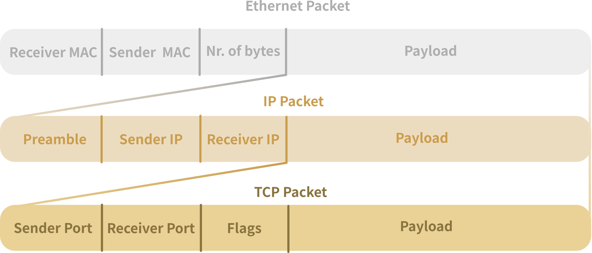

## Internet connectivity

Applications communicate over the internet using different protocols, many of which are build on top of other protocols forming a layered structure.

The __ISO/OSI model__ is a _conceptual_ framework that breaks down how data (like messages, videos, or web pages) travels across networks — including Wi-Fi and Ethernet — into __seven steps (layers)__. Each layer has its own job and uses specific __protocols__ (rules or languages for communication).

The **ISO/OSI model** is a *conceptual* framework that explains how data such as messages, videos, or web pages travels across networks like Wi-Fi or Ethernet. It organizes this process into seven *layers*, each with a specific role and associated *protocols* --- the rules that govern communication at that layer.

It is typically visualized like on Fig.1.
<!--  -->

Starting from the bottom, the layers are:
1. __Physical__ - This is the actual hardware: radio signals, antennas, and frequencies.<br>
   🔧 *Example: Wi-Fi, Ethernet*

2. __Data Link__ - Controls the direct connection between devices (like your laptop and router) and handles things like access to the wireless channel.<br>
   🔧 *Example: MAC (Media Access Control)*

3. __Network__ - Figures out how data gets from one network to another.<br>
   🔧 *Example: IP (Internet Protocol)*

4. __Transport__ - Makes sure data is delivered correctly and in the right order.<br>
   🔧 *Examples: TCP (Transmission Control Protocol), UDP (User Datagram Protocol)*

5. __Session__ - Manages and maintains connections between devices or applications.<br>
   🔧 *No single protocol in Wi-Fi, but session handling happens in apps using things like NetBIOS, SMB, or TLS*

6. __Presentation__ - Translates data so it's readable on both ends (like turning an encrypted message back into text).<br>
   🔧 *Examples: SSL/TLS (used for encryption), JPEG, MP3, ASCII*

7. __Application__ - What the user sees: websites, video calls, email, etc.<br>
   🔧 *Examples: HTTP (web), HTTPS (secure web), SMTP (email), FTP (file transfer), DNS (domain names)*


Some of the layers of this conceptual framework can me managed by a single protocol. For instance the Ethernet protocol takes care of both the physical and the data link layers.

Each layer passes its work to the next.
You can combine these layers as it usually happens. For instance the __MQTT__ protocol sits at the same level as HTTP. Both of them make use of the TCP/IP stack.

### Encapsulation

The combination of the layers is done through encapsulation.

Encapsulation is the process by which data is wrapped with protocol information at each layer of the network stack to facilitate proper transmission and delivery. In the context of a Wi-Fi network, application data is first encapsulated within a __TCP segment__, which provides reliable transport services. This TCP segment is then encapsulated within an __IP packet__, adding logical addressing and routing information necessary for delivery across networks. Finally, the IP packet is enclosed within a __Wi-Fi (IEEE 802.11) frame__ or an __Ethernet frame__, which handles the physical and data link layer functions for wireless communication. Each layer adds its own header (and sometimes trailer) to the data unit, enabling modular and efficient network communication.

A picture is worth more than a thousand words:
<!--  -->


Simply put, the whole content of the higher level is inside the _payload_ or _data_ field of the lower layer protocol.

## Connectivity in Espressif

Now that we have an understanding of the connectivity layers, let's explore which ones are supported by Espressif.

### Physical Layers

Espressif modules support three main physical layers, depending on the SoC:

1. **Wi-Fi**: Supported by all devices, it is used for connection to a router and then to the internet. It will be the focus of this workshop.
2. **BLE**: In IoT, it is mainly used for direct communication with a smartphone and for provisioning (i.e. setting up credentials).
3. **Thread/Zigbee**: IoT protocols that are used for __local__ machine-to-machine (M2M) communication based on mesh topology (many to many connection). To connect to the internet, a Thread-to-Wi-Fi bridge is required.


The Matter protocol utilizes all of these connectivity layers: BLE is used for provisioning, Thread enables low-power communication, and Wi-Fi is used for high-bandwidth data transfer.


In this workshop, we will focus on Wi-Fi only. Let's briefly review its topology.

#### Wi-Fi topology

In a Wi-Fi network, there are two main roles: __Access Point (AP)__ (usually called softAP in Espressif) and __Station (STA)__.

* The __Access Point (AP)__ is the central device (like a Wi-Fi router) that broadcasts the wireless network and connects stations to each other _and_ to external networks like the internet.
* A __Station (STA)__ is any device that connects to the AP. It can be a smartphone, laptop, or smart home device.

The AP manages the wireless medium, while STAs communicate __through__ the AP, not directly with each other (unless in ad hoc mode).
This setup forms a __basic infrastructure mode__ network, which is the most common type of Wi-Fi setup.

<!--  -->


Espressif's modules can function in both modes.
To connect to an AP, a station need the __SSID__ (router network name) and the password.

In the first part of the assignment, we will put the Espressif device in AP mode and use our smartphone to connect to it.

### Application layer protocols

In the Internet of Things (IoT), various communication protocols are used, with __MQTT__ and __HTTP__ being among the most common.
__MQTT__ is specifically designed for __machine-to-machine (M2M) communication__ and is widely used to manage networks of sensors and actuators, particularly in home automation systems due to its lightweight and efficient messaging model.

__HTTP__, on the other hand, is best known as the protocol behind the web, used to deliver HTML-based content. However, another major application of HTTP in IoT is for implementing __REST APIs__. These APIs are not intended for direct user interaction, but rather to be accessed by external applications or services.

For example, imagine a smart home web application that displays the status of various sensors in your house. Instead of connecting to each device individually, the application queries the __REST API__ exposed by a __sensor gateway__, which acts as a bridge between the devices and the user interface.

In this webinar, we will use HTTP to serve a simple HTML page and implement a REST API, so let's focus on these concepts.

## HTTP, HTML, and JSON: Serving Web Pages and Building REST APIs

HTTP can be used to serve HTML pages (like those viewed in web browsers) and structured data such as JSON, which is commonly used to implement REST APIs—mainly for communication between applications.

### HTTP Basics

__HTTP (Hypertext Transfer Protocol)__ is the foundation of communication on the web, based on a simple __client-server model__. In this model, the client (such as a web browser or application) sends a request to a server, which processes it and returns a response.

#### HTTP Requests

HTTP defines several request methods, each serving a specific purpose:

* __GET__ - Retrieve data from the server
* __POST__ - Send or create new data on the server
* __PUT__ - Update existing data
* __DELETE__ - Remove data

#### HTTP Responses

After receiving a request, the server sends an HTTP response, which includes a __status code__ to indicate the outcome. Common status codes include:

* __200 OK__ - The request was successful
* __201 Created__ - A new resource was successfully created (usually after a POST)
* __400 Bad Request__ - The server couldn't understand the request due to invalid syntax
* __401 Unauthorized__ - Authentication is required or has failed
* __404 Not Found__ - The requested resource does not exist
* __500 Internal Server Error__ - A general error occurred on the server

Modern applications and IoT systems often use __JSON (JavaScript Object Notation)__ to format and exchange data. This structured format is at the core of __REST APIs__, which allow clients to interact with server-side resources using standard HTTP methods.



### HTML: Web Pages

__HTML (HyperText Markup Language)__ is the standard language for creating web pages. With ESP-IDF, you can serve HTML pages directly from your embedded device using HTTP.

These HTML pages can be used to:

* Display real-time sensor readings
* Provide control interfaces (e.g., buttons or sliders to interact with GPIOs)
* Allow user configuration of network settings or parameters

A simple HTML page served by an ESP device might look like this:

```html
<!DOCTYPE html>
<html>
<head>
  <title>ESP Sensor Dashboard</title>
</head>
<body>
  <h1>Living Room Sensor</h1>
  <p>Temperature: 22.5°C</p>
  <p>Humidity: 60%</p>
</body>
</html>
```

Serving HTML content from your ESP device allows users to interact with it through any web browser, with no additional software required.

### JSON: REST API

__JSON__ is a lightweight, human-readable format used to represent structured data. It's ideal for web and IoT applications to exchange information between clients and servers.

A JSON object is made up of key-value pairs. Here's a simple example:

```json
{
  "temperature": 22.5,
  "humidity": 60,
  "sensor": "living_room"
}
```

In this case, the object represents a reading from a sensor in the living room.

#### REST API

A __REST API__ (Representational State Transfer Application Programming Interface) allows applications to interact with a server using standard __HTTP__ methods. It follows the client-server model, with the server usually responding with JSON-formatted data and an appropriate HTTP status code.

REST APIs organize access to resources through __routes__, or __URL paths__, which are typically human-readable and logically structured.

__Example REST API routes__:

* `GET /sensors` - Retrieve a list of all sensors
* `GET /sensors/42` - Retrieve data for sensor with ID 42
* `POST /sensors` - Create a new sensor
* `PUT /sensors/42` - Update sensor 42's settings
* `DELETE /sensors/42` - Delete sensor 42

This approach allows easy access and manipulation of data, making REST APIs ideal for modern web and IoT applications.

In the second part of this workshop, you will implement both a simple HTML page and a REST API using HTTP. These examples will help you understand how to serve web content and expose device data to external applications.

## Conclusion

This article introduced the layered structure of internet communication, focusing on the ISO/OSI model and its practical use in Wi-Fi networks. We explored how protocols like HTTP and MQTT operate within this framework, how encapsulation allows data to flow through the layers, and how REST APIs enable structured, JSON-based communication between devices and applications. These concepts form the foundation for building modern, connected IoT systems.

Now you have all the technical background to start the assignments.

### Next step

> Next assignment &rarr; __[Assignment 2.1](../assignment-2-1/)__
