## Introduction

In this guide, we'll walk you through setting up the development environment for projects based on the ESP-IDF toolchain.

We'll use the open-source IDE [VS Code](https://code.visualstudio.com/download) and the [ESP-IDF extension for VS Code](https://marketplace.visualstudio.com/items?itemName=espressif.esp-idf-extension), which allows you to configure the toolchain, build projects, and flash the memory of Espressif modules.

If you don't have an Espressif development kit available, you can still complete all the steps in this guide except for the last one.

<!-- 
The ESP-IDF framework can be demanding on system resources. The minimum recommended specifications are an Intel Core i7 (or equivalent) processor and 16 GB of RAM.
 -->

For the final step, you’ll need a physical board with an Espressif SoC, for example, the [ESP32-S3-DevKitC-1](https://docs.espressif.com/projects/esp-dev-kits/en/latest/esp32s3/esp32-s3-devkitc-1/user_guide_v1.0.html) or the [ESP32-S31-Function-CoreBoard-1](https://docs.espressif.com/projects/esp-dev-kits/en/latest/esp32s31/esp32-s31-function-coreboard-1/user_guide.html#hardware-reference).
<!-- the [ESP32-S3-DevKitC-1](https://docs.espressif.com/projects/esp-dev-kits/en/latest/esp32s3/esp32-s3-devkitc-1/user_guide_v1.0.html) -->
<!-- During the workshop, you’ll receive a board based on the `ESP32-S3`, the [`ESP32-S3-DevKitC-1`](). -->


The term **ESP-IDF** is used to refer to both the [toolchain itself](https://github.com/espressif/esp-idf?tab=readme-ov-file#espressif-iot-development-framework) and the [VS Code extension](https://github.com/espressif/vscode-esp-idf-extension?tab=readme-ov-file#esp-idf-extension-for-vs-code).
In this guide, we'll explicitly use *ESP-IDF toolchain* for the former and *ESP-IDF extension* for the latter.


The guide is divided into 5 parts:

1. Installing VS Code and prerequisites
2. Installing the ESP-IDF extension for VS Code
3. Configuring the ESP-IDF toolchain via Espressif Installation Manager (EIM)
4. Building the first project
5. Flashing the module

## 1. Installing VS Code and Prerequisites

This step depends on your operating system. Follow the appropriate guide below:

* 🐧 Linux: [Installing VS Code and prerequisites](./installation-linux/)
* 🪟 Windows: [Installing VS Code](./installation-windows/)
* 🍎 macOS: [Installing VS Code and prerequisites](./installation-macos/)


## 2. Installing the ESP-IDF Extension for VS Code

Once all prerequisites are installed, we can add the ESP-IDF extension to VS Code.
Using the **ESP-IDF extension**, we'll then install and configure the **ESP-IDF toolchain**.

* Open VS Code
* Click the Extensions icon (four squares) on the left
  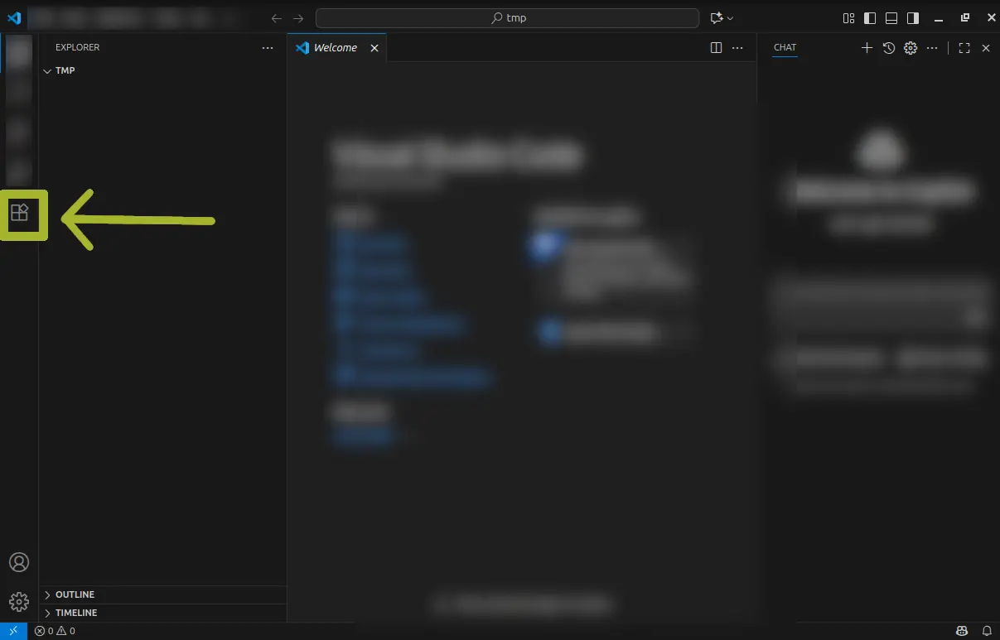
* In the search bar, type `esp-idf`
  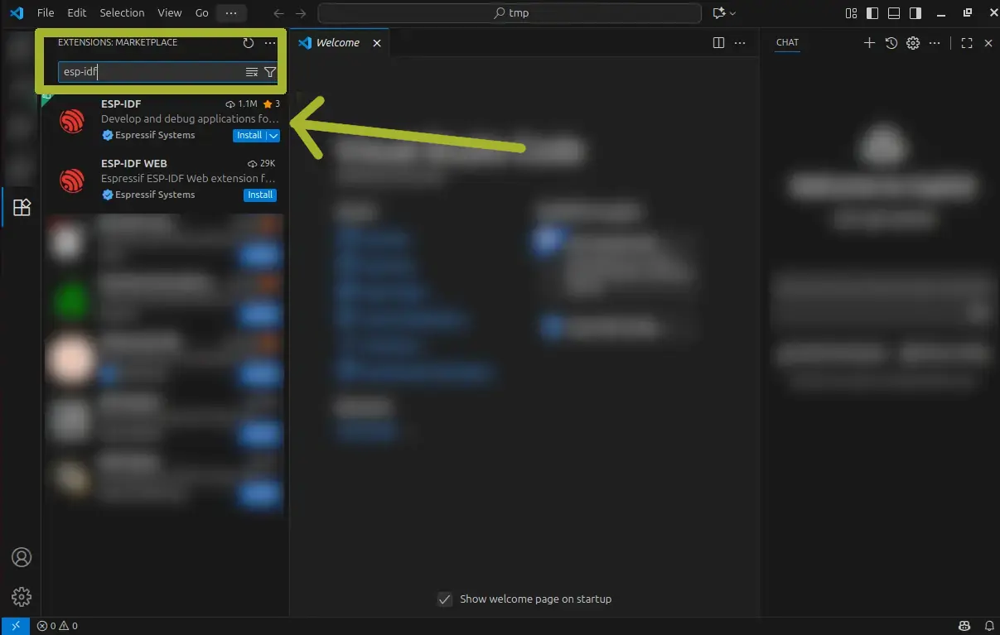
* Click “Install” on the first result, **ESP-IDF**

  * If prompted, click “Accept and Install”

After the installation, you may get the prompt in the configuration tab.
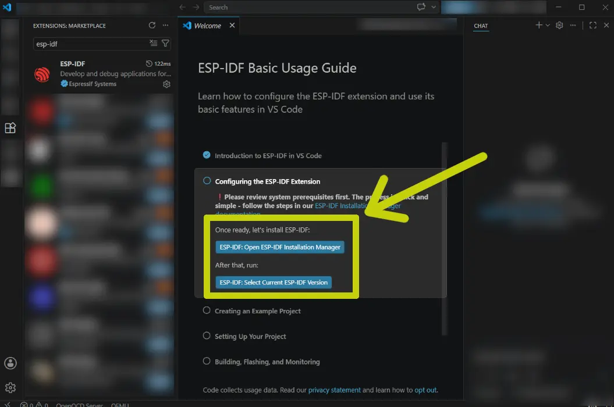

* If so, click it to jump to [Installation via EIM](./installation-eim-gui/#installation-via-eim)

## 3. Configuring the ESP-IDF Toolchain via EIM

Once the ESP-IDF extension is installed, we need to install the toolchain. This is done through the Espressif Installation Manager (`eim`).

There are two ways to install it: terminal (CLI) or graphical interface (GUI).

* 💻 CLI: Installation via terminal
  * 🐧 Linux: [eim installation guide](https://docs.espressif.com/projects/idf-im-ui/en/latest/#linux-installation-via-homebrew)
  * 🪟 Windows: [eim installation guide](https://docs.espressif.com/projects/idf-im-ui/en/latest/#windows-installation)
  * 🍎 macOS: [eim installation guide](https://docs.espressif.com/projects/idf-im-ui/en/latest/#macos-installation-via-homebrew)
* 🖼️ GUI: [Installation via graphical interface](./installation-eim-gui/)

## 4. Building the First Project

Now that the extension and toolchain are installed, it’s time to test building a project.
We’ll create a new project based on one of the examples included with the ESP-IDF toolchain.

### Create a Project from an Example

* Open the _Command Palette_ (`F1` or `CTRL+SHIFT+P`)
* Type `ESP-IDF: New Project` and select it

* In the dropdown menu, select the ESP-IDF version you installed

* In the `New Project` tab, expand the `ESP-IDF Examples` menu
  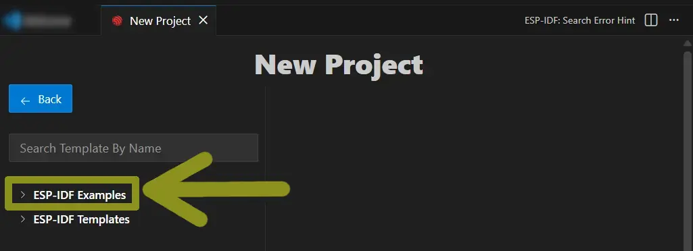

* Expand `get-started` and choose `hello_world`
* Click `Create project using template hello_world`
   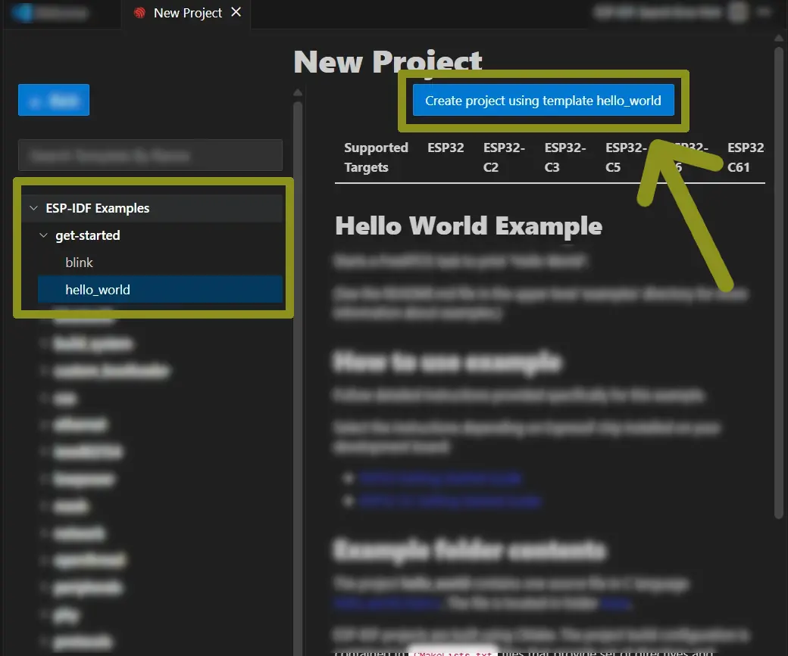
* In the project details, choose the Espressif SoC you will be using (you can change it later if required)
  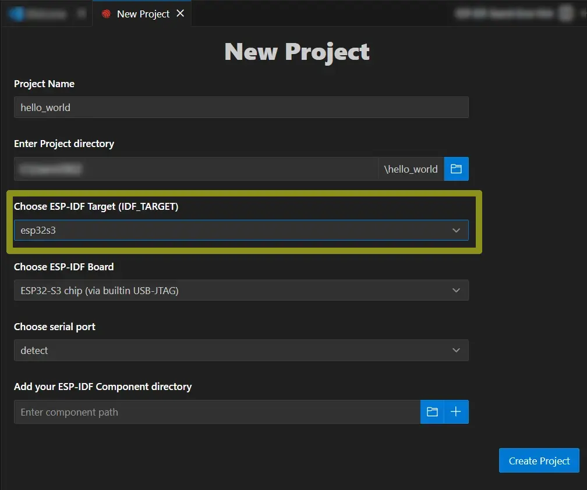

* In the next screen, click `Open project` to open a new VS Code window with the newly created project
  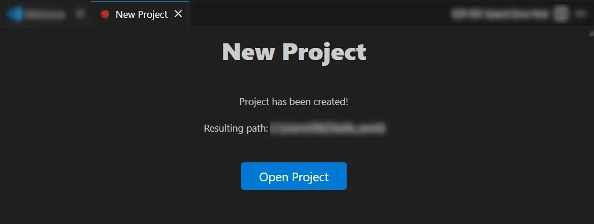

* You should now see the files for the `hello_world` example project in the right panel
  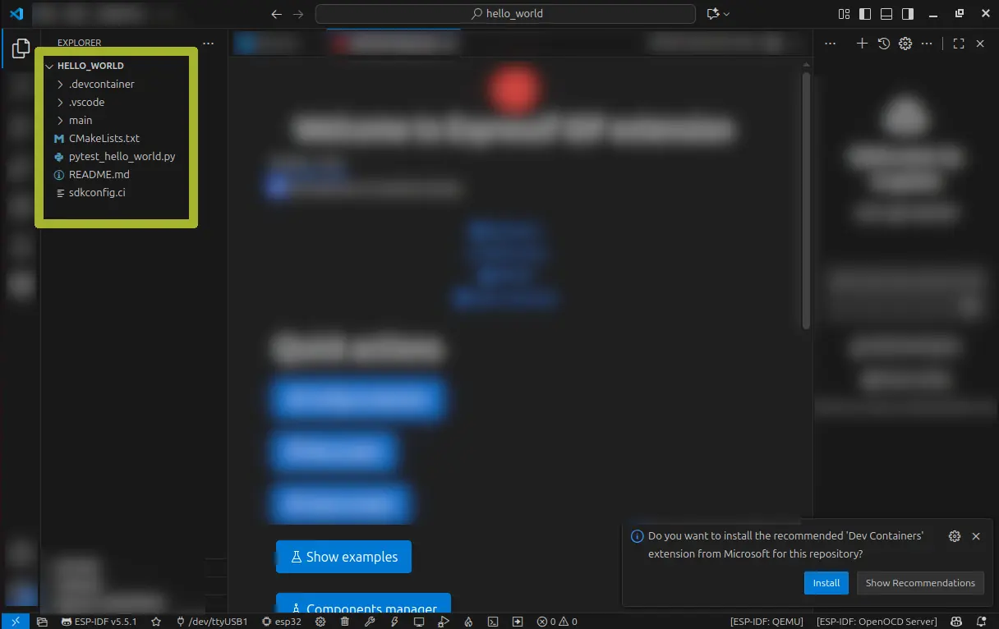


If you don’t see the files, make sure the first icon on the left (two overlapping sheets) is selected.


### Specify the Target

To build and flash the project to your Espressif module, you must tell the compiler which SoC you’re targeting.

In the previous step, we already chose the target, so no further steps are required.

However, if you need to change the target, you can:
<!-- In the workshop, we’ll use a board based on the ESP32-C3, so we’ll select that target. -->

<!-- 
If you have a different EVK available, select the corresponding target.
 -->

* Open the command palette (`F1` or `CTRL+SHIFT+P`) and type<br>
  `ESP-IDF: Set Espressif Device Target`
  <!-- 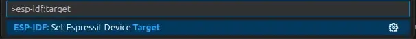
* From the dropdown → select `esp32s3`
  <!-- 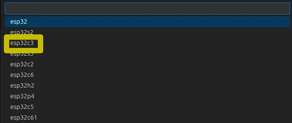 -->
* In the following dropdown → select `ESP32-S3 chip (via builtin USB-JTAG)`
  <!-- 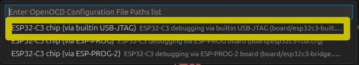 -->

### Build the Project

Now, let's build the project.

* Open the command palette (`F1` or `CTRL+SHIFT+P`)
* Type `ESP-IDF: Build Your Project`
  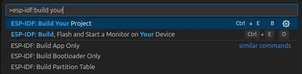
* A terminal will open at the bottom showing build messages
* When the build finishes, you’ll see the memory usage summary
  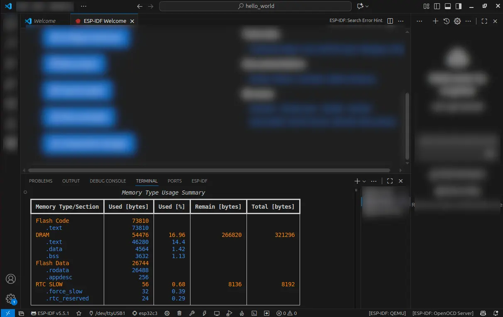

If you see the summary screen, both the toolchain and extension were installed correctly.

If you have an Espressif development board, proceed to the next section to verify USB connectivity.


## 5. Flashing the Module

Once the project is built, it’s time to flash the module.
The ESP-IDF extension for VS Code provides the command:
`> ESP-IDF: Flash (UART) Your Project`

However, the most commonly used command is:

```console
> ESP-IDF: Build, Flash and Start a Monitor on Your Device
```

This command not only builds and flashes the project to the device but also starts a serial monitor directly in the editor terminal.

To flash the module:

1. Select the port your development board is connected to
2. Run the command:
   `> ESP-IDF: Build, Flash and Start a Monitor on Your Device`


On Linux, you may need to add your user to the `dialout` group to access serial ports without administrator privileges:

```
sudo usermod -a -G dialout $USER
```

Remember to log out and log back in for the changes to take effect.


### Development board ports

Modern Espressif development boards usually have two USB ports, called `UART` and `USB` (see picture below).

1. The `UART` port is connected to the UART pins of the Espressif SoC via a USB&rarr;UART bridge chip.
2. The `USB` port is connected directly to the `D+` and `D-` pins of the Espressif SoC.

To program the module, connect your computer to the `UART` port.


### Select the port to which the development board is connected

* Connect the board to your computer via USB
* If VS Code is closed, reopen it and open your project folder
  * `File → Open Folder` or `File → Open Recent`
* Open the command palette and type:
  `> ESP-IDF: Select Port to Use (COM, tty, usbserial)`
  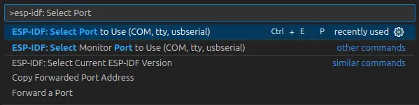
* Select the port (Silicon Labs – the USB/UART bridge on the development board)
  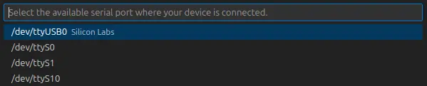
* The port name will now appear in the bottom status bar
  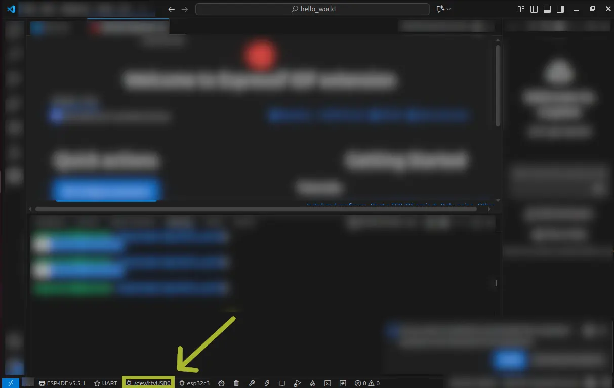


If your operating system doesn’t automatically detect the connected board, refer to the appropriate guide:

* 🪟 [Windows](https://docs.espressif.com/projects/esp-idf/en/stable/esp32/get-started/establish-serial-connection.html#check-port-on-windows)
* 🐧 [Linux](https://docs.espressif.com/projects/esp-idf/en/stable/esp32/get-started/establish-serial-connection.html#check-port-on-linux-and-macos)
* 🍎 [macOS](https://docs.espressif.com/projects/esp-idf/en/stable/esp32/get-started/establish-serial-connection.html#check-port-on-linux-and-macos)



On Windows, it may be necessary to install the drivers for the USB-UART Bridge (CP2101N). You can download the driver [here](https://www.silabs.com/software-and-tools/usb-to-uart-bridge-vcp-drivers?tab=downloads). After downloading, unzip the file and follow the installation steps using the [Device Manager procedure](https://woshub.com/manually-install-driver-windows/).


### Flash the Module and Start the Monitor

* Open the command palette and type:
  `> ESP-IDF: Build, Flash and Start a Monitor on Your Device`
  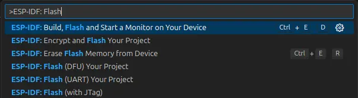
* From the dropdown → select `UART`
  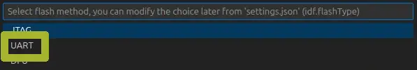
* Wait for the flashing process to complete and for the monitor to start
* In the terminal, you’ll see the boot messages and the “hello world!” output
  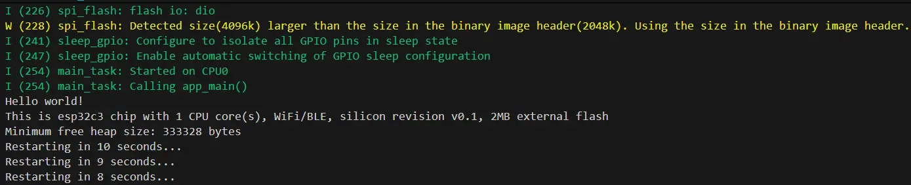

If you see the message in the terminal, your setup is working correctly and you're ready for the workshop and to start developing projects based on ESP-IDF.


## Conclusion

In this guide, we covered how to install VS Code, the ESP-IDF extension, and the ESP-IDF toolchain.
We also went through how to create, build, and flash a project to your development board.
Your development environment is now ready to use.
