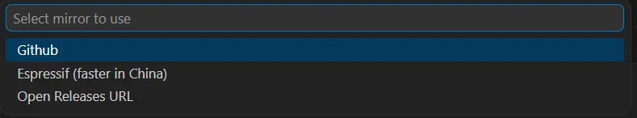
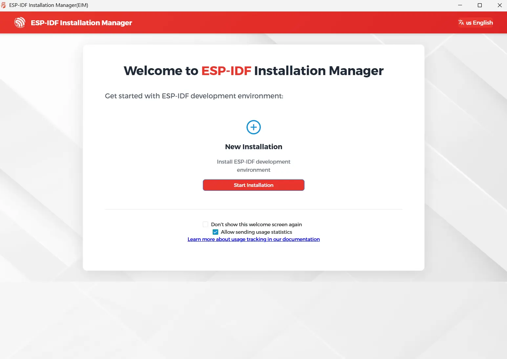
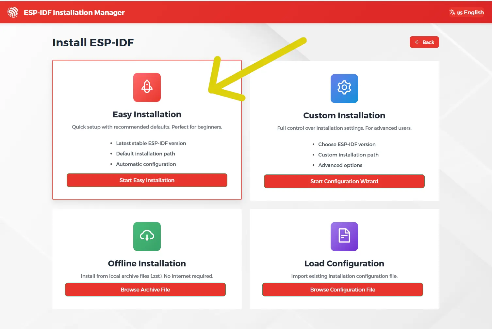
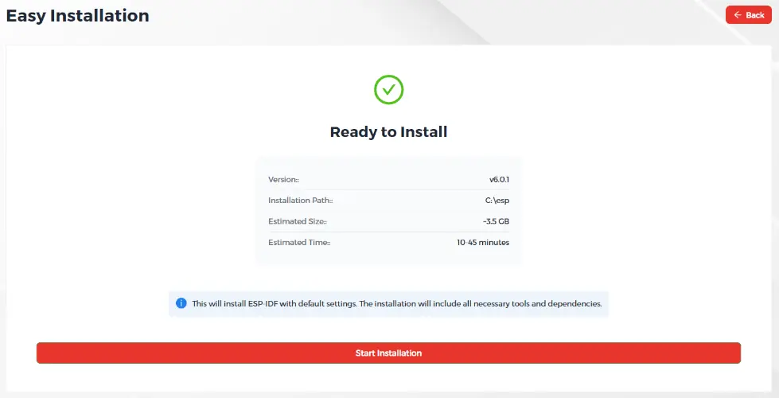
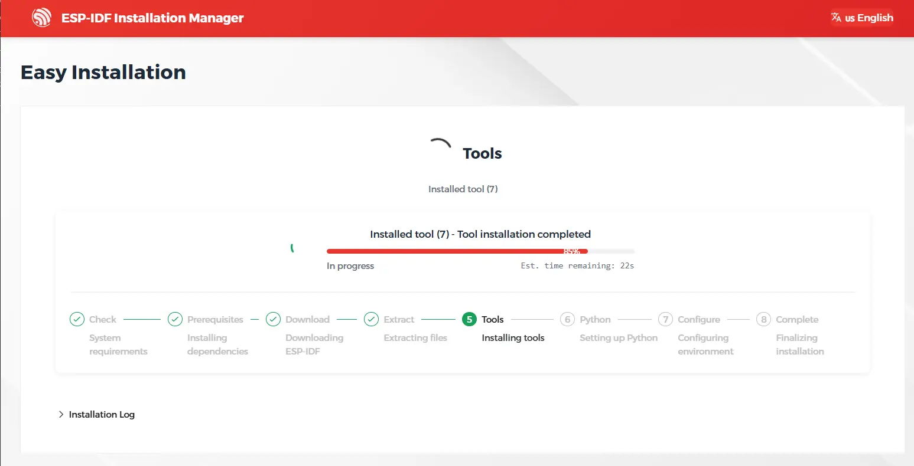
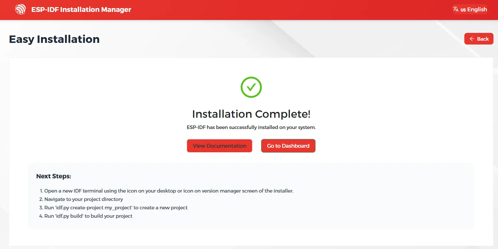
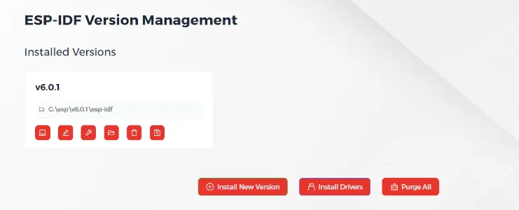

Once the ESP-IDF extension is installed, install the toolchain using the Installation Manager.

### Opening the Installation Manager via VS Code

After installation, you should see the configuration tab.


If the tab doesn't show up, open the _Command Palette_ (`F1`) and type
```bash
> ESP-IDF: Open ESP-IDF Installation Manager
```



### Installation via EIM

* When asked to choose a mirror, select `Github`<br>
  

* After a few seconds, the Installation Manager GUI will appear

* You'll be presented with a welcome screen. Click on `Start Installation`
   

* Click on `Easy Installation`<br>
   

* Choose the latest stable release (v6.0.1 as of today)
  

* Wait for the installation to finish. This will take some time. You can monitor the progress using the progress bar.
  

* Once finished, click on `Go to Dashboard` to verify the installation
  

* You should see `v6.0.1` among the installed versions
  

* You can now close the Espressif Installation Manager GUI

### Next steps
> Continue with the [next step](../#4-building-the-first-project).
