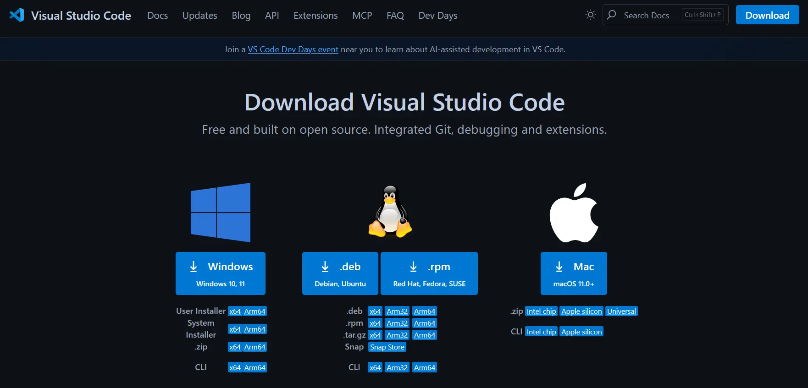
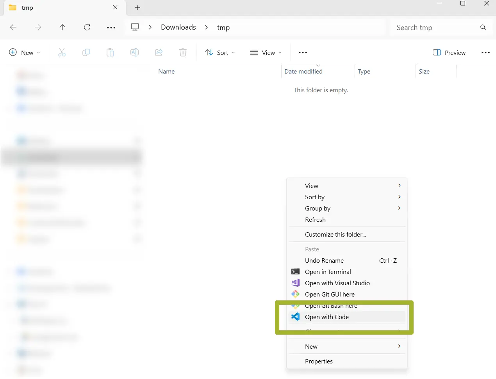

## VS Code Installation

* Go to the [VS Code download site](code.visualstudio.com/downloads)
* Download and install the Windows version
  


This guide uses Windows 11.


* Once the `.exe` file is downloaded, double-click it and follow the installation steps.

After installation, there are two ways to open VS Code:

1. Open VS Code from the Start menu
2. Open VS Code from a folder

Since it's often useful to open the editor directly from a folder, we'll use the second method.

#### Open VS Code from a Folder

* Create a new folder called `tmp`
* Right-click inside the folder in File Explorer
* From the menu, select `Show more options`
* Click on `Open with Code`
  
* You should now see the VS Code interface
  


VS Code may ask whether you trust the author of the folder. This is important when using `git` repositories, but for now it doesn’t matter. Click “Yes.”


## Installing Prerequisites

No additional prerequisites need to be installed. These will be handled automatically during the setup of the ESP-IDF extension.

## Next Steps

> Continue with the [next step](../#installing-the-esp-idf-extension-for-vs-code).
