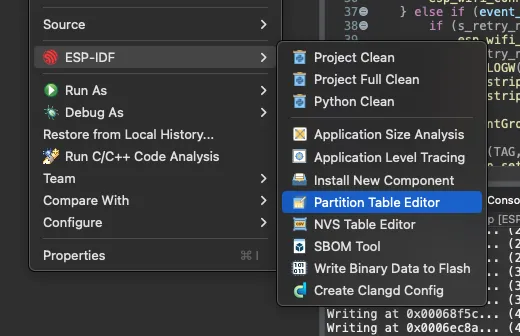
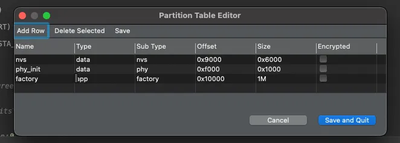
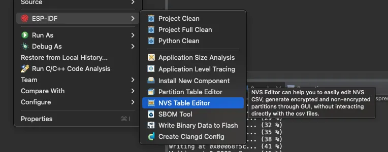
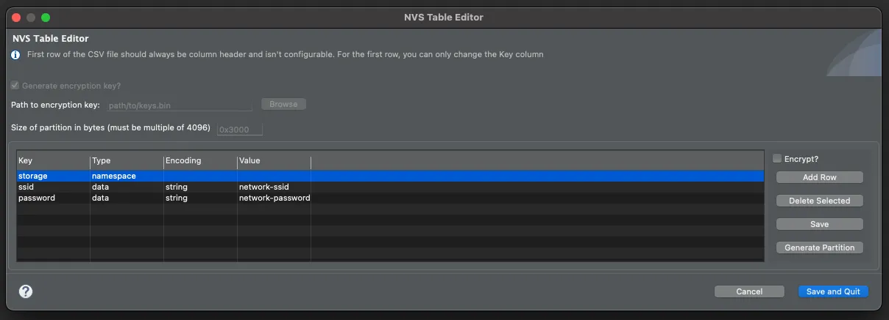

## Assignment 4: Try using NVS

As you can see from the last assignment, the Wi-Fi credentials were stored hard-coded. This is not the ideal solution for storing this kind of data, because mainly you can not change them easily, and, what is more important, this adds vulnerability to your project.

On this assignment, we will see how to store data to [Non-Volatile-Storage (NVS)](https://docs.espressif.com/projects/esp-idf/en/release-v5.2/esp32/api-reference/storage/nvs_flash.html). NVS is often called "emulated EEPROM", but the ESP32 does not have any embedded EEPROM, so NVS uses flash memory.


For this assignment, we will use the same project as we used in the previous assignment [Connect to Wi-Fi](../assignment-3/).


The NVS library was designed to store small key-value pairs, including `integer`, `string`, and `blob` types.

> String values are currently limited to 4000 bytes. This includes the null terminator. Blob values are limited to 508,000 bytes or 97.6% of the partition size - 4000 bytes, whichever is lower.

This library can be used to store several different configurations or values you will need to persist on the flash memory.

### Hands-on with NVS

For this hands-on, we will need to prepare a project for NVS, create the NVS data file with the Wi-Fi credentials, set the default values, add the NVS code, and change the example to read the Wi-Fi credentials from the NVS.

1. **Create the partition file**

To create the partition table file, use the Partition Table Editor from the Espressif-IDE. To open the editor, right-click on the project, `ESP-IDF` -> `Partition Table Editor`:


  


Leave the default values and click `Save and Quit`.


  


The default `partitions.csv` will be created with the following structure:

```text
# ESP-IDF Partition Table
# Name,   Type, SubType, Offset,  Size,   Flags
nvs,      data, nvs,     0x9000,  0x6000,
phy_init, data, phy,     0xf000,  0x1000,
factory,  app,  factory, 0x10000, 1M,
```

You can change later the partitions according to your needs.

2. **Create the NVS data file**

For the NVS editor, you will need to open the editor by going to `ESP-IDF` -> `NVS Table Editor`.


  


After that, add the namespace `storage` and the keys `SSID` and `password`, then click `Save and Quit`.


  


Set the `Size of partition in bytes` to `0x6000` (the same value as in the `partitions.csv` file) and add the following:

- **storage** type `namespace`,
- **ssid** type `data`, encoding `string` and value `network-ssid`
- **password** type `data`, encoding `string` and value `network-password`

> Please change the SSID and password values according to the workshop network or the network you will connect to.

After the NVS table is created, the file `nvs.csv` will be added to the project with the following content:

```text
key,type,encoding,value
storage,namespace,,
ssid,data,string,"network-ssid"
password,data,string,"network-password"

```

3. **Include the NVS code**

After the NVS initialization, the partition can be opened:

```c
    ESP_LOGI(TAG, "Opening Non-Volatile Storage (NVS) handle");
    nvs_handle_t my_handle;
    ret = nvs_open_from_partition("nvs", "storage", NVS_READWRITE, &my_handle);
    if (ret != ESP_OK) {
        ESP_LOGE(TAG, "Error (%s) opening NVS handle!\n", esp_err_to_name(ret));
        return;
    }
    ESP_LOGI(TAG, "The NVS handle successfully opened");
```

Then the values from the NVS can be read:

```c

char ssid[32];
char password[64];

esp_err_t get_wifi_credentials(void){

	esp_err_t err;

	ESP_LOGI(TAG, "Opening Non-Volatile Storage (NVS) handle");
    nvs_handle_t nvs_mem_handle;
    err = nvs_open_from_partition("nvs", "storage", NVS_READWRITE, &nvs_mem_handle);
    if (err != ESP_OK) {
		led_strip_set_pixel(led_strip, 0, 25, 0, 0);
    	led_strip_refresh(led_strip);
        ESP_LOGE(TAG, "Error (%s) opening NVS handle!\n", esp_err_to_name(err));
        return err;
    }
    ESP_LOGI(TAG, "The NVS handle successfully opened");

	size_t ssid_len = sizeof(ssid);
	size_t pass_len = sizeof(password);

    err = nvs_get_str(nvs_mem_handle, "ssid", ssid, &ssid_len);
    ESP_ERROR_CHECK(err);

    err = nvs_get_str(nvs_mem_handle, "password", password, &pass_len);
    ESP_ERROR_CHECK(err);

    nvs_close(nvs_mem_handle);
    return ESP_OK;
}
```

Now you need to change the Wi-Fi config to get the NVS values:

```c
    wifi_config_t wifi_config = {
        .sta = {
            .ssid = "",
            .password = "",
            .threshold.authmode = WIFI_AUTH_WPA2_WPA3_PSK,
            .sae_pwe_h2e = WPA3_SAE_PWE_BOTH,
            .sae_h2e_identifier = "",
        },
    };

    strncpy((char*)wifi_config.sta.ssid, ssid, sizeof(wifi_config.sta.ssid));
    strncpy((char*)wifi_config.sta.password, password, sizeof(wifi_config.sta.password));
```

Call the `get_wifi_credentials` before `wifi_init_sta` in the `app_main` function:

```c
ESP_ERROR_CHECK(get_wifi_credentials());
```

4. **Change the build to include the NVS**

Now you need to change the file `main/CMakeLists.txt` to add the `nvs_create_partition_image`.

```c
idf_component_register(
    SRCS main.c         # list the source files of this component
    INCLUDE_DIRS        # optional, add here public include directories
    PRIV_INCLUDE_DIRS   # optional, add here private include directories
    REQUIRES            # optional, list the public requirements (component names)
    PRIV_REQUIRES       # optional, list the private requirements
)
nvs_create_partition_image(nvs ../nvs.csv FLASH_IN_PROJECT)
```

5. **Change the default configuration file to change the SDKConfig**

If you do not have the file `sdkconfig.defaults`, create one in the same folder as the `sdkconfig` file and add the following configuration:

```c
CONFIG_PARTITION_TABLE_CUSTOM=y
CONFIG_PARTITION_TABLE_CUSTOM_FILENAME="partitions.csv"
CONFIG_PARTITION_TABLE_FILENAME="partitions.csv"
```

This will trigger the binary creation with the predefined values from the `nvs.csv` file.

Now you can handle and change the **SSID** and **password** as you prefer directly from the NVS.

#### Assignment Code

```c
#include <stdio.h>
#include "bsp/esp-bsp.h"
#include "led_indicator_blink_default.h"
#include "freertos/FreeRTOS.h"
#include "freertos/task.h"
#include "freertos/event_groups.h"
#include "esp_system.h"
#include "esp_wifi.h"
#include "esp_event.h"
#include "esp_log.h"
#include "nvs.h"
#include "nvs_flash.h"
#include "lwip/err.h"
#include "lwip/sys.h"

#define WIFI_CONNECTED_BIT BIT0
#define WIFI_FAIL_BIT      BIT1

char ssid[32];
char password[64];

static led_indicator_handle_t leds[BSP_LED_NUM];

static EventGroupHandle_t s_wifi_event_group;
static int s_retry_num = 0;

static const char *TAG = "workshop";

static void event_handler(void* arg, esp_event_base_t event_base,
                                int32_t event_id, void* event_data)
{
    if (event_base == WIFI_EVENT && event_id == WIFI_EVENT_STA_START) {
        esp_wifi_connect();
    } else if (event_base == WIFI_EVENT && event_id == WIFI_EVENT_STA_DISCONNECTED) {
        if (s_retry_num < 30) {
            esp_wifi_connect();
            s_retry_num++;
            ESP_LOGW(TAG, "Trying to connect to WiFi");
			led_indicator_set_rgb(leds[0], SET_IRGB(0, 0x0, 0x0, 0x20));
        } else {
            xEventGroupSetBits(s_wifi_event_group, WIFI_FAIL_BIT);
        }
        ESP_LOGE(TAG, "Failed to connect to WiFi");
		led_indicator_set_rgb(leds[0], SET_IRGB(0, 0x20, 0x0, 0x0));
    } else if (event_base == IP_EVENT && event_id == IP_EVENT_STA_GOT_IP) {
        ip_event_got_ip_t* event = (ip_event_got_ip_t*) event_data;
        ESP_LOGI(TAG, "got ip:" IPSTR, IP2STR(&event->ip_info.ip));
		led_indicator_set_rgb(leds[0], SET_IRGB(0, 0x0, 0x20, 0x0));
        s_retry_num = 0;
        xEventGroupSetBits(s_wifi_event_group, WIFI_CONNECTED_BIT);
    }
}

void wifi_init_sta(void)
{
    s_wifi_event_group = xEventGroupCreate();

    ESP_ERROR_CHECK(esp_netif_init());
    ESP_ERROR_CHECK(esp_event_loop_create_default());
    esp_netif_create_default_wifi_sta();

    wifi_init_config_t cfg = WIFI_INIT_CONFIG_DEFAULT();
    ESP_ERROR_CHECK(esp_wifi_init(&cfg));

    esp_event_handler_instance_t instance_any_id;
    esp_event_handler_instance_t instance_got_ip;
    ESP_ERROR_CHECK(esp_event_handler_instance_register(WIFI_EVENT,
            ESP_EVENT_ANY_ID,
            &event_handler,
            NULL,
            &instance_any_id));
    ESP_ERROR_CHECK(esp_event_handler_instance_register(IP_EVENT,
            IP_EVENT_STA_GOT_IP,
            &event_handler,
            NULL,
            &instance_got_ip));

	wifi_config_t wifi_config = {
        .sta = {
            .ssid = "",
            .password = "",
            .threshold.authmode = WIFI_AUTH_WPA2_WPA3_PSK,
            .sae_pwe_h2e = WPA3_SAE_PWE_BOTH,
            .sae_h2e_identifier = "",
        },
    };

    strncpy((char*)wifi_config.sta.ssid, ssid, sizeof(wifi_config.sta.ssid));
    strncpy((char*)wifi_config.sta.password, password, sizeof(wifi_config.sta.password));

    ESP_ERROR_CHECK(esp_wifi_set_mode(WIFI_MODE_STA) );
    ESP_ERROR_CHECK(esp_wifi_set_config(WIFI_IF_STA, &wifi_config) );
    ESP_ERROR_CHECK(esp_wifi_start() );

    EventBits_t bits = xEventGroupWaitBits(s_wifi_event_group,
            WIFI_CONNECTED_BIT | WIFI_FAIL_BIT,
            pdFALSE,
            pdFALSE,
            portMAX_DELAY);

    if (bits & WIFI_CONNECTED_BIT) {
        ESP_LOGI(TAG, "Connected!");
    } else if (bits & WIFI_FAIL_BIT) {
        ESP_LOGE(TAG, "Failed to connect!");
    }
}

esp_err_t get_wifi_credentials(void){

	esp_err_t err;

	ESP_LOGI(TAG, "Opening Non-Volatile Storage (NVS) handle");
    nvs_handle_t nvs_mem_handle;
    err = nvs_open_from_partition("nvs", "storage", NVS_READWRITE, &nvs_mem_handle);
    if (err != ESP_OK) {
        ESP_LOGE(TAG, "Error (%s) opening NVS handle!\n", esp_err_to_name(err));
        return err;
    }

    ESP_LOGI(TAG, "The NVS handle successfully opened");

	size_t ssid_len = sizeof(ssid);
	size_t pass_len = sizeof(password);

    err = nvs_get_str(nvs_mem_handle, "ssid", ssid, &ssid_len);
    ESP_ERROR_CHECK(err);

    err = nvs_get_str(nvs_mem_handle, "password", password, &pass_len);
    ESP_ERROR_CHECK(err);

    nvs_close(nvs_mem_handle);
    return ESP_OK;
}

void app_main(void)
{

    esp_err_t ret = nvs_flash_init();
    if (ret == ESP_ERR_NVS_NO_FREE_PAGES || ret == ESP_ERR_NVS_NEW_VERSION_FOUND) {
      ESP_ERROR_CHECK(nvs_flash_erase());
      ret = nvs_flash_init();
    }
    ESP_ERROR_CHECK(ret);

    ESP_ERROR_CHECK(bsp_led_indicator_create(leds, NULL, BSP_LED_NUM));
    led_indicator_set_rgb(leds[0], SET_IRGB(0, 0x0, 0x0, 0x20));

	ESP_ERROR_CHECK(get_wifi_credentials());

    wifi_init_sta();
}
```

## Next step

Too complicated? Let's make things easier.

[Assignment 5: Wi-Fi provisioning (EXTRA)](../assignment-5)
