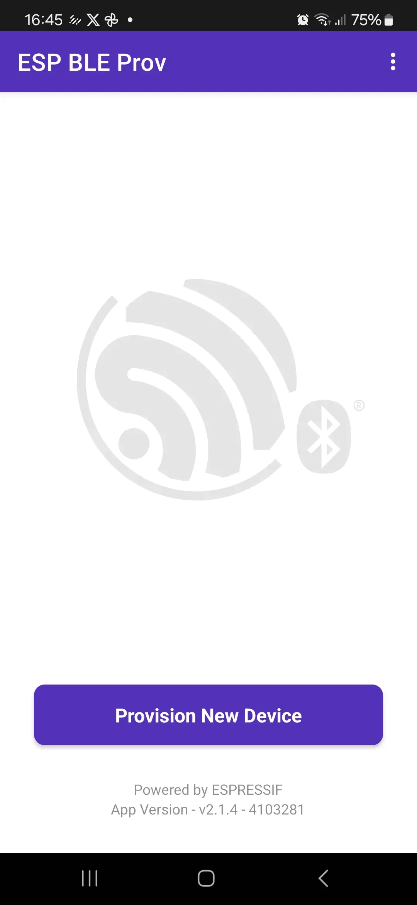
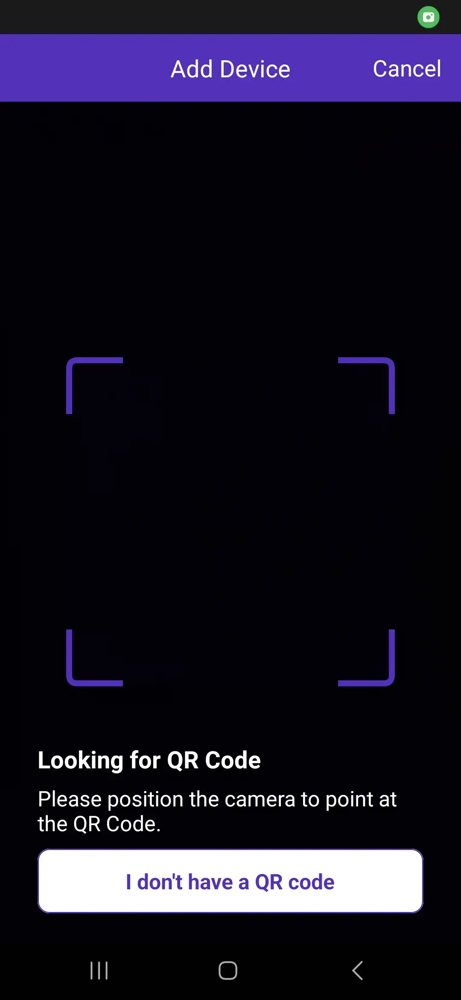

## Assignment 5: Wi-Fi provisioning

Wi-Fi *provisioning* is one of the most important aspects of any IoT device. When you bring home a smart socket, for example, you don't have to download code from the manufacturer and manually change SSID and password, but everything is usually handled through some application that provides all this data to the socket. We usually go through Wi-Fi provisioning only once during the initial setup of our device, but it can also come in handy in situations where, for example, a factory reset occurs.

There are several methods to ensure Wi-Fi provisioning. Some devices can be switched to so-called provisioning mode by pressing a button, others work through the mentioned application or web page, and some support automatic provisioning using another technology, such as Bluetooth Low Energy (BLE).

ESP32 of course also supports this option. You can encounter it in projects such as our [ESP RainMaker](https://rainmaker.espressif.com/).

### Practical demo: How to do Wi-Fi provisioning

In chapter 3, we wrote SSID and password directly into the code, which is the fastest, but also the most complicated variant (with every change we have to compile and upload the entire project).

Storing data in NVS in chapter 4 shows a somewhat more practical version, where the code reads the data from memory itself, but we still have to write it there manually, which is definitely not ideal.

Now we will show how to set Wi-Fi data via BLE (Bluetooth Low Energy) using an Android or iOS mobile phone.

1. **Installing the mobile application**

First you need to download the application for BLE provisioning:

- Android: [ESP BLE Provisioning](https://play.google.com/store/apps/details?id=com.espressif.provble&pcampaignid=web_share)
- iOS: [ESP BLE Provisioning](https://apps.apple.com/us/app/esp-ble-provisioning/id1473590141)

2. **Creating a new project**

We will create a new project using the `provisioning` -> `wifi_prov_mgr` example. It can be created either using the command below:

```bash
idf.py create-project-from-example "espressif/network_provisioning^1.2.0:wifi_prov"
```

...or via GUI:

1. Open ESP-IDF Component Registry
2. Search for `espressif/network_provisioning`
3. Go to the *Examples* tab
4. Select `wifi_prov`
5. And choose `Create Project from this Example`. In the following window, just choose where to save the project.

> For your existing projects, you can use the [espressif/network_provisioning](https://components.espressif.com/components/espressif/network_provisioning) component.
>
> ```bash
> idf.py add-dependency "espressif/network_provisioning^0.2.0"
> ```

3. **Build, flash, and monitor**

We won't change anything in the example, just verify that we have the correct target, **erase flash memory** (with the *Erase Flash* command), build the application and flash it.

> If you added components manually (via CLI), you will need to clean the project first so that everything builds correctly:
>
> `idf.py fullclean`

After building and uploading the application, open `ESP-IDF Serial Monitor`.

4. **Provisioning**

In the `ESP BLE provisioning` app on your mobile phone, follow the steps as shown below:


  
  
  
  
  


The QR code will be printed by your development board to the serial line (open the serial monitor with the *Monitor* command in *ESP-IDF Explorer*).

After the provisioning process is completed, the device will connect to the selected Wi-Fi network.

## Next step

Now that we know how to easily connect to Wi-Fi, let's make it more secure!

[Assignment 6: Protocols](../assignment-6)