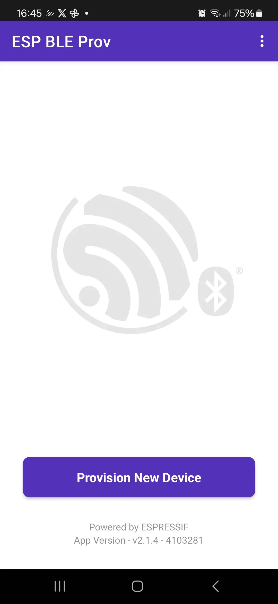
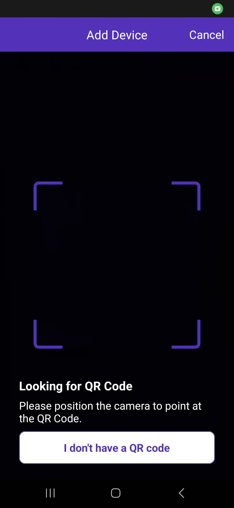
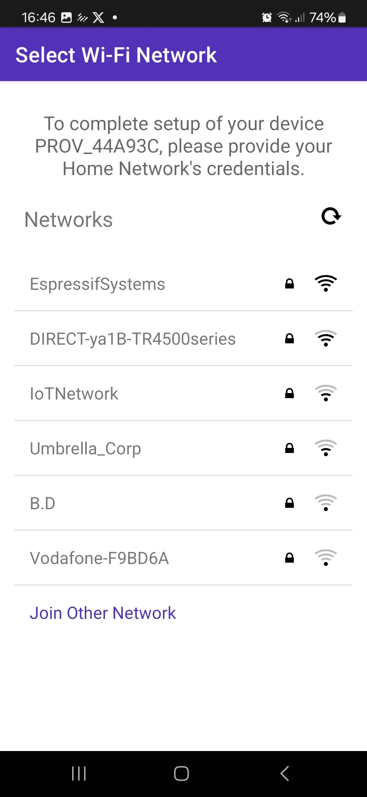
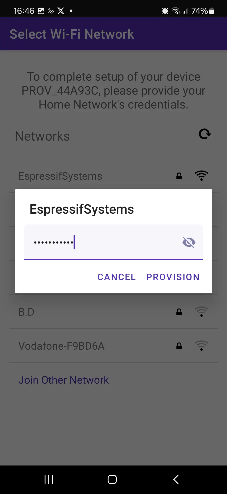
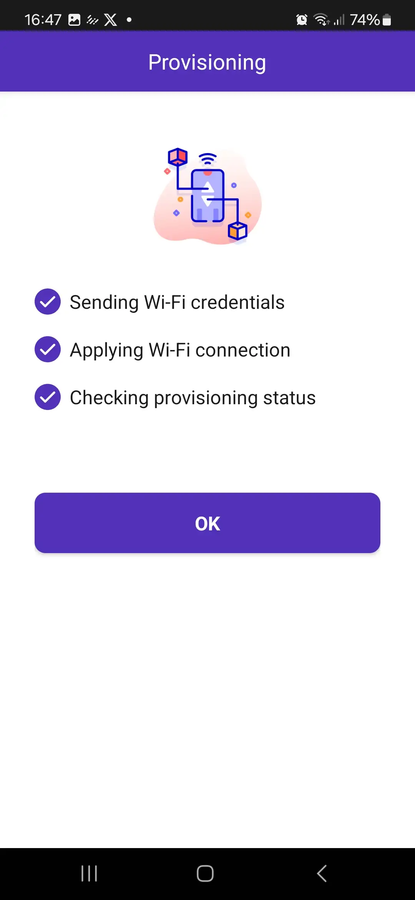

## Assignment 5: Wi-Fi provisioning (EXTRA)

Wi-Fi provisioning is a crucial step in the setup of any IoT device. It involves configuring the device with the necessary credentials, such as SSID and password, to connect to a Wi-Fi network. This process is typically performed once during the initial setup of the device, but it may also be repeated whenever the device needs to connect to a new network.

There are several methods for Wi-Fi provisioning. Some devices use a physical interface, like buttons or switches, to enter provisioning mode. Others use a web-based interface or a mobile app to guide the user through the process. In some cases, devices may also support automatic provisioning through technologies like Bluetooth Low Energy (BLE).

Espressif offers solutions for provisioning. You will find this process being used in some projects like [ESP RainMaker](https://rainmaker.espressif.com/).

### Hands-on with Wi-Fi provisioning

In the NVS assignment, we learned how to set and get the Wi-Fi credentials from the flash memory. This feature is useful but you still need to set the values, which is tedious.

In this assignment, we will use a mobile phone (Android or iOS) to set the Wi-Fi credentials via BLE.

1. **Install the mobile application**

Install the provisioning application on your smartphone.

- Android: [ESP BLE Provisioning](https://play.google.com/store/apps/details?id=com.espressif.provble&pcampaignid=web_share)
- iOS [ESP BLE Provisioning](https://apps.apple.com/us/app/esp-ble-provisioning/id1473590141)

2. **Create a new project from the examples**


For this assignment, we will create a new project based on the example [wifi_prov_mgr](https://github.com/espressif/esp-idf/tree/master/examples/provisioning/wifi_prov_mgr).


Create a new ESP-IDF project using the example `provisioning` -> `wifi_prov_mgr` as starting point.

For existing projects, you can use the component [espressif/network_provisioning](https://components.espressif.com/components/espressif/network_provisioning).

```bash
idf.py add-dependency "espressif/network_provisioning^0.2.0"
```

3. **Build, flash, and monitor**

Now you can build and flash (run) the example to your device.

> You might need to full clean your project before building if you have added the files and the component manually. For this, run:
>
> `idf.py fullclean`

Before flashing, make sure to do a **flash erase** to avoid connecting to the Wi-Fi with the wrong credentials.

After building your application, open the `ESP-IDF Serial Monitor`.

1. **Provisioning**

In the provisioning application, follow the steps to **Provision New Device** using BLE.


  
  
  
  
  


You will need to scan the QRCode or use the **I don't have a QR code** option. Please make sure the device you are provisioning is *yours*.

After completing the provisioning process, the device will connect to the selected network.

## Next step

Now you can easily connect to Wi-Fi, let's try to talk in a secure way!

[Assignment 6: Protocols (EXTRA)](../assignment-6)
