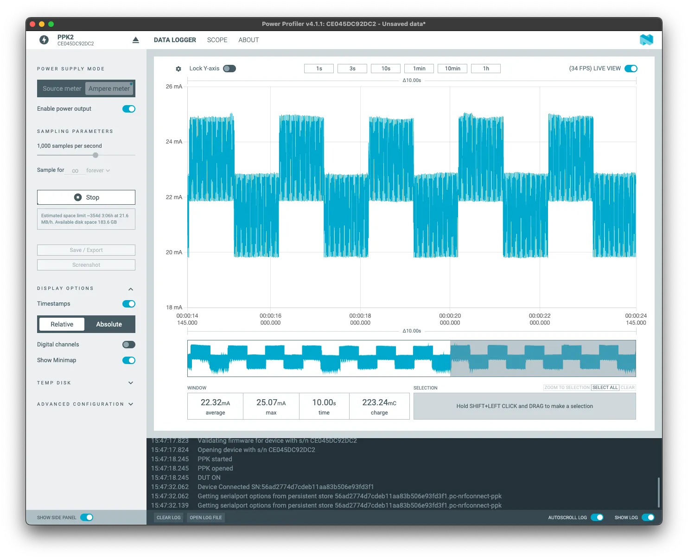

## Assignment 7: Low Power core

---
ESP32-C6 has two cores: a high-power (HP) core for standard use and a low-power (LP) core to minimize consumption.

The second core is often called **Ultra-Low-Power (ULP) core** mainly in English and is designed primarily to handle simple tasks while the main (HP) core is in sleep mode, which significantly reduces electrical energy consumption. This function will certainly be appreciated by those who build battery-powered projects, where it's not so much about performance, but rather about efficiency.

The ULP core can function independently of the HP core, where it can, for example, collect data from sensors and perform their basic processing, or control GPIO, all with absolutely minimal consumption and a 20 MHz clock, which is comparable to, for example, an Arduino UNO. If you are interested in a complete overview of what this core can do, visit the documentation on [ULP LP-Core Coprocessor Programming](https://docs.espressif.com/projects/esp-idf/en/latest/esp32c6/api-reference/system/ulp-lp-core.html#).

### (U)LP core

- 32-bit RISC-V core @20MHz
- 16KB LP SRAM
- RISC-V IMAC instruction set
- Act as a co-processor
- Access to peripherals, including
  - GPIO
  - UART
  - I2C

You can watch the DevCon23 talk [Low-Power Features of ESP32-C6: Target Wake Time + LP Core](https://www.youtube.com/watch?v=FpTwQlGtV0k), which covers some aspects of the LP core and TWT.



#### ULP pinout

The ULP core uses a specific set of pins. If you need to know the details, use the [pin layout](../introduction/#board-layout) to know which pins will work with the LP core.

### Practical work with LP core

In this demo, we will write code that blinks an LED. Once the "big" HP core will take care of the control, the second time the ULP core will do the same job. We will try to compare consumption at the same time.


**For this assignment, we will create a new empty project.** For more detailed instructions, visit chapter 1 (creating a project from the `hello world` example).


1. **Create the `main/ulp` folder and a `main.c` file inside**

```c
#include <stdint.h>
#include <stdbool.h>
#include "ulp_lp_core.h"
#include "ulp_lp_core_utils.h"
#include "ulp_lp_core_gpio.h"
#include "ulp_lp_core_interrupts.h"

#define WAKEUP_PIN LP_IO_NUM_0
#define RED_PIN    LP_IO_NUM_4
#define GREEN_PIN  LP_IO_NUM_5

static uint32_t wakeup_count;
uint32_t start_toggle;

void LP_CORE_ISR_ATTR ulp_lp_core_lp_io_intr_handler(void)
{
    ulp_lp_core_gpio_clear_intr_status();
    wakeup_count++;
}

int main (void)
{
    /* Register interrupt for the wakeup pin */
    ulp_lp_core_intr_enable();
    ulp_lp_core_gpio_intr_enable(WAKEUP_PIN, LP_IO_INTR_POSEDGE);

    int level = 0;
    while (1) {
        /* Toggle the Red LED GPIO */
        ulp_lp_core_gpio_set_level(GREEN_PIN, 0);
        ulp_lp_core_gpio_set_level(RED_PIN, level);
        level = level ? 0 : 1;
        ulp_lp_core_delay_us(1000000);

        /* Wakeup the main processor after 4 toggles of the button */
        if (wakeup_count >= 4) {
            ulp_lp_core_gpio_set_level(RED_PIN, 0);
            ulp_lp_core_wakeup_main_processor();
            wakeup_count = 0;
        }
    }
    /* ulp_lp_core_halt() is called automatically when main exits */
    return 0;
}
```

In this code, we enable interrupts on the LP core using `ulp_lp_core_intr_enable`, while setting `GPIO0` as an input pin, activated by a rising edge (signal transition from LOW to HIGH state). We use the `ulp_lp_core_gpio_intr_enable` function to connect the pin and interrupt. The *Wake up counter* will be handled by the *interrupt handler* `ulp_lp_core_lp_io_intr_handler`.

Now a loop for blinking and *wake up counter* starts. The value of our GPIO is set by the `ulp_lp_core_gpio_set_level` function. If the number of button presses is 4 or more, the HP core is started by the `ulp_lp_core_wakeup_main_processor` function.

2. **Change the `main/CMakeLists.txt` file**

In CMake we need to set the ULP application name, source files and more...

```text
# Set usual component variables
set(app_sources "hello_world_main.c")
idf_component_register(SRCS ${app_sources}
                       REQUIRES ulp
                       WHOLE_ARCHIVE)
#
# ULP support additions to component CMakeLists.txt.
#
# 1. The ULP app name must be unique (if multiple components use ULP).
set(ulp_app_name ulp_${COMPONENT_NAME})
#
# 2. Specify all C and Assembly source files.
#    Files should be placed into a separate directory (in this case, ulp/),
#    which should not be added to COMPONENT_SRCS.
set(ulp_sources "ulp/main.c")
#
# 3. List all the component source files which include automatically
#    generated ULP export file, ${ulp_app_name}.h:
set(ulp_exp_dep_srcs ${app_sources})
#
# 4. Call function to build ULP binary and embed in project using the argument
#    values above.
ulp_embed_binary(${ulp_app_name} "${ulp_sources}" "${ulp_exp_dep_srcs}")

```

3. **Change the `main/hello_world_main.c` file for the HP core**

```c
#include <stdio.h>
#include "esp_sleep.h"
#include "driver/gpio.h"
#include "driver/rtc_io.h"
#include "ulp_lp_core.h"
#include "ulp_main.h"
#include "freertos/FreeRTOS.h"
#include "freertos/task.h"

extern const uint8_t ulp_main_bin_start[] asm("_binary_ulp_main_bin_start");
extern const uint8_t ulp_main_bin_end[]   asm("_binary_ulp_main_bin_end");

static void init_ulp_program(void);

#define WAKEUP_PIN  GPIO_NUM_0
#define RED_PIN     GPIO_NUM_4
#define GREEN_PIN   GPIO_NUM_5

void app_main(void)
{
    /* If user is using USB-serial-jtag then idf monitor needs some time to
    *  re-connect to the USB port. We wait 1 sec here to allow for it to make the reconnection
    *  before we print anything. Otherwise the chip will go back to sleep again before the user
    *  has time to monitor any output.
    */
    vTaskDelay(pdMS_TO_TICKS(1000));

    /* ULP caused wakeup */
    esp_sleep_wakeup_cause_t cause = esp_sleep_get_wakeup_cause();
    if (cause == ESP_SLEEP_WAKEUP_ULP) {
        printf("ULP woke up the main CPU! \n");
        ulp_lp_core_stop();
    }

    printf("In active mode\n");
    printf("Long press the wake button to put the chip to sleep and run the ULP\n");

    /* Initialize selected GPIOs */
    rtc_gpio_init(WAKEUP_PIN);
    rtc_gpio_set_direction(WAKEUP_PIN, RTC_GPIO_MODE_INPUT_ONLY);
    rtc_gpio_pulldown_dis(WAKEUP_PIN);
    rtc_gpio_pullup_dis(WAKEUP_PIN);

    rtc_gpio_init(RED_PIN);
    rtc_gpio_set_direction(RED_PIN, RTC_GPIO_MODE_OUTPUT_ONLY);
    rtc_gpio_pulldown_dis(RED_PIN);
    rtc_gpio_pullup_dis(RED_PIN);

    rtc_gpio_init(GREEN_PIN);
    rtc_gpio_set_direction(GREEN_PIN, RTC_GPIO_MODE_OUTPUT_ONLY);
    rtc_gpio_pulldown_dis(GREEN_PIN);
    rtc_gpio_pullup_dis(GREEN_PIN);

    int gpio_level = 0;
    int previous_gpio_level = 0;
    int cnt = 0;

    while (1) {
        /* Toggle the Green LED GPIO */
        rtc_gpio_set_level(RED_PIN, 0);
        rtc_gpio_set_level(GREEN_PIN, 1);
        vTaskDelay(pdMS_TO_TICKS(1000));
        rtc_gpio_set_level(GREEN_PIN, 0);
        vTaskDelay(pdMS_TO_TICKS(1000));

        /* Read the wakeup pin continuously */
        gpio_level = rtc_gpio_get_level(WAKEUP_PIN);
        if (gpio_level != previous_gpio_level) {
            previous_gpio_level = gpio_level;
            cnt++;
            if (cnt > 1) {
                rtc_gpio_set_level(GREEN_PIN, 0);
                cnt = 0;
                break;
                /* break and run the LP core code */
            }
        }
    }

    /* Load and run the ULP program */
    init_ulp_program();

    /* Go back to sleep, only the ULP will run */
    printf("Entering Deep-sleep mode\n\n");
    printf("Press the wake button at least 3 or 4 times to wake up the main CPU again\n");
    vTaskDelay(10);

    ESP_ERROR_CHECK( esp_sleep_enable_ulp_wakeup());

    esp_deep_sleep_start();
}

static void init_ulp_program(void)
{
    esp_err_t err = ulp_lp_core_load_binary(ulp_main_bin_start, (ulp_main_bin_end - ulp_main_bin_start));
    ESP_ERROR_CHECK(err);

    /* Start the program */
    ulp_lp_core_cfg_t cfg = {
        .wakeup_source = ULP_LP_CORE_WAKEUP_SOURCE_HP_CPU,
    };

    err = ulp_lp_core_run(&cfg);
    ESP_ERROR_CHECK(err);
}
```

4. **Enable the LP core in the configuration**

To enable the LP core and be able to compile for it, we need to set the following configuration parameters in the project configuration.
For example, by creating `sdkconfig.defaults` with the following content:

```text
# Enable ULP
CONFIG_ULP_COPROC_ENABLED=y
CONFIG_ULP_COPROC_TYPE_LP_CORE=y
CONFIG_ULP_COPROC_RESERVE_MEM=4096
# Set log level to Warning to produce clean output
CONFIG_BOOTLOADER_LOG_LEVEL_WARN=y
CONFIG_BOOTLOADER_LOG_LEVEL=2
CONFIG_LOG_DEFAULT_LEVEL_WARN=y
CONFIG_LOG_DEFAULT_LEVEL=2
```

5. **Hardware setup**

For this example, you will also need 2 LEDs and one button connected to the following pins:

- Red LED -> **GPIO4**
- Green LED -> **GPIO5**
- Button (pull-down, active high) -> **GPIO0**. In other words, we connect one "side" of the button to **3.3V** and the other to **GPIO0**. Additionally, we connect a resistor between **GPIO0** and **GND**.



6. **Build, flash, and monitor output from the board**

Check that you are using the USB port labeled **UART** for uploading and subsequent monitoring of output. You won't break anything by erasing the flash memory (command *Erase Flash*) before we upload this example.

#### What should happen...

After flashing, the green LED should start blinking every second with the following output:

```text
In active mode
Long press the wake button to put the chip to sleep and run the ULP
```

If we press and hold the button for a few seconds, the LP core should be activated and the HP core should switch to *Deep-sleep mode*. The red LED starts blinking at a frequency of one second with the following output:

```text
Entering Deep-sleep mode
Press the wake button at least 3 or 4 times to wake up the main CPU again
```

To wake up from *Deep-sleep mode*, press the push button four times:

```text
ULP woke up the main CPU!
In active mode
Long press the wake button to put the chip to sleep and run the ULP
```

For power consumption measurement, we use the exposed J5 connector and a suitable tool, such as [JouleScope](https://www.joulescope.com/) [PPK2](https://www.nordicsemi.com/Products/Development-hardware/Power-Profiler-Kit-2).

**LED blinking with HP core**

Using the "big" HP core, the average consumption over 10 seconds is approximately **22.32mA**.



**LED blinking with LP core**

But if we transfer the application to the LP core, the average power consumption in a 10 seconds window lowers by the order of magnitude: **2.97mA**.


When we switch cores, we achieve savings of (up to) **86.7%** for the same task. However, the example is only indicative and the actual values will of course differ.

More examples with LP core (in English):

- [LP Core simple example with GPIO Polling](https://github.com/espressif/esp-idf/tree/master/examples/system/ulp/lp_core/gpio)
- [LP Core Pulse Counting Example](https://github.com/espressif/esp-idf/tree/master/examples/system/ulp/lp_core/gpio_intr_pulse_counter)
- [LP-Core example with interrupt triggered from HP-Core](https://github.com/espressif/esp-idf/tree/master/examples/system/ulp/lp_core/interrupt)
- [LP I2C Example](https://github.com/espressif/esp-idf/tree/master/examples/system/ulp/lp_core/lp_i2c)
- [LP UART Examples](https://github.com/espressif/esp-idf/tree/master/examples/system/ulp/lp_core/lp_uart)

## Conclusion

Thank you very much for participating in our workshop and we hope it brought you something useful!

During the workshop, we went through several different topics:

- **Assignment 1**: We successfully installed ESP-IDF and learned the basics of its use.
- **Assignment 2**: We learned how to create a new project, what components are and how to work with them.
- **Assignment 3**: We connected to Wi-Fi, which is probably the most important step in the entire IoT world.
- **Assignment 4**: We tried NVS (Non-Volatile Storage) and working with persistent data. We also talked about what a *partition table* is and how to modify it.
- **Assignment 5**: We tried *Wi-Fi provisioning* and learned how to take Wi-Fi configuration on our devices to the next level.
- **Assignment 6**: We dove into some of the protocols that ESP32-C6 supports, including TLS certificates for secure communication.
- **Assignment 7**: We tried the LP core and learned how to control consumption.

Even though we went through several quite diverse topics, we barely scratched the surface. Both ESP32 and ESP-IDF offer much more. However, we all hope that with this workshop we have given you a solid foundation on which you will be able to continue working and developing your projects on your own.

Thank you once again for participating and we look forward to your projects!