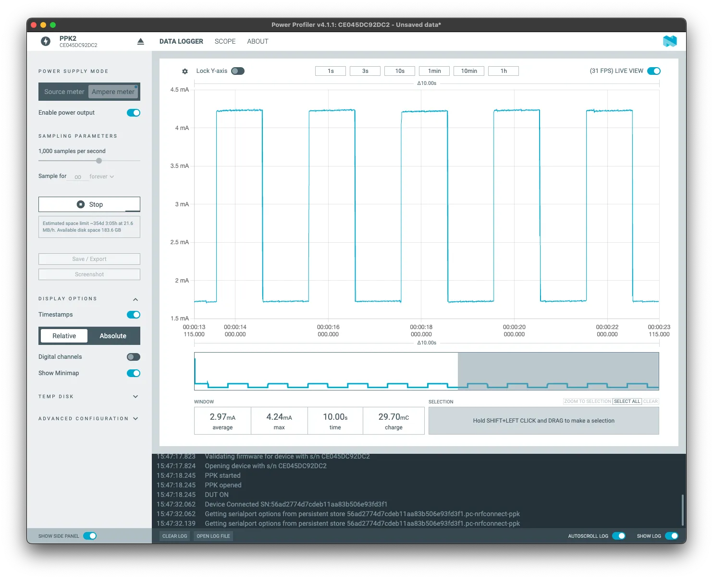
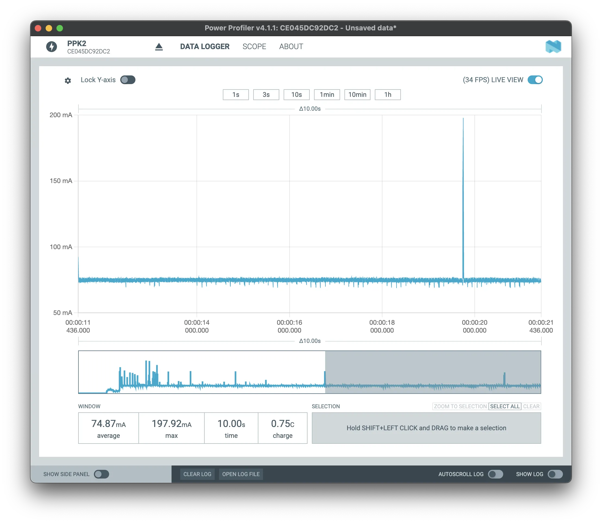
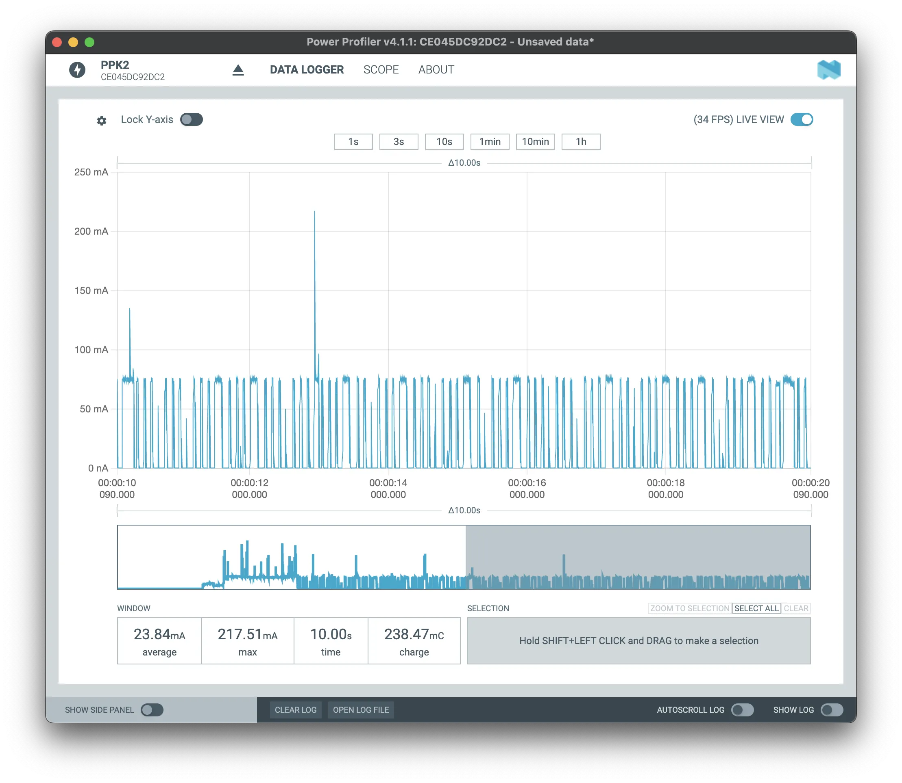
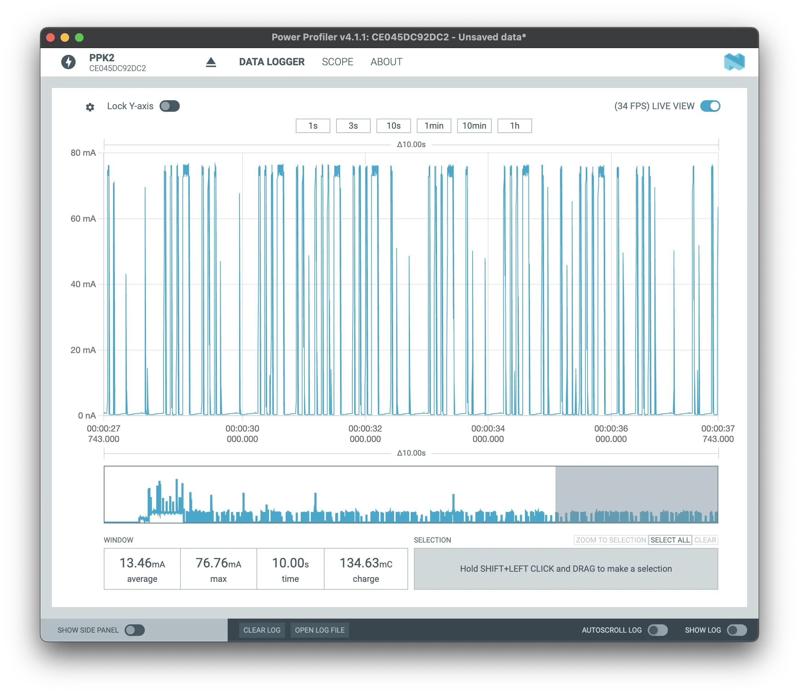

## Assignment 7: Try using the Low Power core

---

The ESP32-C6 has 2 cores, the high-power (HP) core and the low-power (LP) core.

Usually called **Ultra-Low-Power (ULP)**, the second core is designed to handle simple tasks while the HP core is in a sleep mode, which significantly reduces power consumption. This feature is particularly beneficial for battery-powered IoT devices where energy efficiency is critical.

The ULP LP core can operate independently of the main HP core, performing tasks such as sensor data acquisition and processing, as well as controlling GPIOs with minimal power consumption. For the complete API reference, please go to the guide [ULP LP-Core Coprocessor Programming](https://docs.espressif.com/projects/esp-idf/en/latest/esp32c6/api-reference/system/ulp-lp-core.html#).

### The LP core

- 32-bit RISC-V core @20MHz
- 16KB LP SRAM
- RISC-V IMAC instruction set
- Act as a co-processor
- Access to peripherals, including
  - GPIO
  - UART
  - I2C

You can watch the DevCon23 talk [Low-Power Features of ESP32-C6: Target Wake Time + LP Core](https://www.youtube.com/watch?v=FpTwQlGtV0k), which covers the LP features and the TWT. Please save to watch later as a complementary material.



#### ULP pinout

Note that the ULP uses a specific set of pins. Please use the [board pin layout](../introduction/#board-pin-layout) to know which pins you can use to access the ULP LP core.

### Hands-on with the LP core

---

For this hands-on, we will walk through the ULP programming to create a blink program to run on the HP core and on the LP core to compare the power consumption on a similar task.

**This hands-on requires the [ESP-IDF v5.4](https://github.com/espressif/esp-idf/tree/master) (master branch) and some additional hardware (LED and button)**


For this assignment, you will need to create a new blank project.


1. **Create the `main/ulp` folder and `main.c` file**

```c
#include <stdint.h>
#include <stdbool.h>
#include "ulp_lp_core.h"
#include "ulp_lp_core_utils.h"
#include "ulp_lp_core_gpio.h"
#include "ulp_lp_core_interrupts.h"

#define WAKEUP_PIN LP_IO_NUM_0
#define RED_PIN    LP_IO_NUM_4
#define GREEN_PIN  LP_IO_NUM_5

static uint32_t wakeup_count;
uint32_t start_toggle;

void LP_CORE_ISR_ATTR ulp_lp_core_lp_io_intr_handler(void)
{
    ulp_lp_core_gpio_clear_intr_status();
    wakeup_count++;
}

int main (void)
{
    /* Register interrupt for the wakeup pin */
    ulp_lp_core_intr_enable();
    ulp_lp_core_gpio_intr_enable(WAKEUP_PIN, LP_IO_INTR_POSEDGE);

    int level = 0;
    while (1) {
        /* Toggle the Red LED GPIO */
        ulp_lp_core_gpio_set_level(GREEN_PIN, 0);
        ulp_lp_core_gpio_set_level(RED_PIN, level);
        level = level ? 0 : 1;
        ulp_lp_core_delay_us(1000000);

        /* Wakeup the main processor after 4 toggles of the button */
        if (wakeup_count >= 4) {
            ulp_lp_core_gpio_set_level(RED_PIN, 0);
            ulp_lp_core_wakeup_main_processor();
            wakeup_count = 0;
        }
    }
    /* ulp_lp_core_halt() is called automatically when main exits */
    return 0;
}
```

In this code, the interrupt for the push button (wakeup) will be enabled on the LP core by the function `ulp_lp_core_intr_enable` and the GPIO0 will be set as the input pin, triggered by the positive edge (when the state goes from low to high) and attached to the interrupt by the function `ulp_lp_core_gpio_intr_enable`. The wake up counter will be handled by the interrupt handler `ulp_lp_core_lp_io_intr_handler`.

Now the loop for the blink and the wakeup counter check will start. The GPIO level is set by the function `ulp_lp_core_gpio_set_level`. If the number of pushes is 4 or higher, the HP core will wake up by the function `ulp_lp_core_wakeup_main_processor`.

2. **Change the `CMakeLists.txt`**

You need to set the ULP application name, source files, etc.

```text
# Set usual component variables
set(app_sources "main.c")

idf_component_register(SRCS ${app_sources}
                       REQUIRES ulp
                       WHOLE_ARCHIVE)
#
# ULP support additions to component CMakeLists.txt.
#
# 1. The ULP app name must be unique (if multiple components use ULP).
set(ulp_app_name ulp_${COMPONENT_NAME})
#
# 2. Specify all C and Assembly source files.
#    Files should be placed into a separate directory (in this case, ulp/),
#    which should not be added to COMPONENT_SRCS.
set(ulp_sources "ulp/main.c")
#
# 3. List all the component source files which include automatically
#    generated ULP export file, ${ulp_app_name}.h:
set(ulp_exp_dep_srcs ${app_sources})
#
# 4. Call function to build ULP binary and embed in project using the argument
#    values above.
ulp_embed_binary(${ulp_app_name} "${ulp_sources}" "${ulp_exp_dep_srcs}")

```

3. **Change the `main.c` for the HP core**

```c
#include <stdio.h>
#include "esp_sleep.h"
#include "driver/gpio.h"
#include "driver/rtc_io.h"
#include "ulp_lp_core.h"
#include "ulp_main.h"
#include "freertos/FreeRTOS.h"
#include "freertos/task.h"

extern const uint8_t ulp_main_bin_start[] asm("_binary_ulp_main_bin_start");
extern const uint8_t ulp_main_bin_end[]   asm("_binary_ulp_main_bin_end");

static void init_ulp_program(void);

#define WAKEUP_PIN  GPIO_NUM_0
#define RED_PIN     GPIO_NUM_4
#define GREEN_PIN   GPIO_NUM_5

void app_main(void)
{
    /* If user is using USB-serial-jtag then idf monitor needs some time to
    *  re-connect to the USB port. We wait 1 sec here to allow for it to make the reconnection
    *  before we print anything. Otherwise the chip will go back to sleep again before the user
    *  has time to monitor any output.
    */
    vTaskDelay(pdMS_TO_TICKS(1000));

    /* ULP caused wakeup */
    esp_sleep_wakeup_cause_t cause = esp_sleep_get_wakeup_cause();
    if (cause == ESP_SLEEP_WAKEUP_ULP) {
        printf("ULP woke up the main CPU! \n");
        ulp_lp_core_stop();
    }

    printf("In active mode\n");
    printf("Long press the wake button to put the chip to sleep and run the ULP\n");

    /* Initialize selected GPIOs */
    rtc_gpio_init(WAKEUP_PIN);
    rtc_gpio_set_direction(WAKEUP_PIN, RTC_GPIO_MODE_INPUT_ONLY);
    rtc_gpio_pulldown_dis(WAKEUP_PIN);
    rtc_gpio_pullup_dis(WAKEUP_PIN);

    rtc_gpio_init(RED_PIN);
    rtc_gpio_set_direction(RED_PIN, RTC_GPIO_MODE_OUTPUT_ONLY);
    rtc_gpio_pulldown_dis(RED_PIN);
    rtc_gpio_pullup_dis(RED_PIN);

    rtc_gpio_init(GREEN_PIN);
    rtc_gpio_set_direction(GREEN_PIN, RTC_GPIO_MODE_OUTPUT_ONLY);
    rtc_gpio_pulldown_dis(GREEN_PIN);
    rtc_gpio_pullup_dis(GREEN_PIN);

    int gpio_level = 0;
    int previous_gpio_level = 0;
    int cnt = 0;

    while (1) {
        /* Toggle the Green LED GPIO */
        rtc_gpio_set_level(RED_PIN, 0);
        rtc_gpio_set_level(GREEN_PIN, 1);
        vTaskDelay(pdMS_TO_TICKS(1000));
        rtc_gpio_set_level(GREEN_PIN, 0);
        vTaskDelay(pdMS_TO_TICKS(1000));

        /* Read the wakeup pin continuously */
        gpio_level = rtc_gpio_get_level(WAKEUP_PIN);
        if (gpio_level != previous_gpio_level) {
            previous_gpio_level = gpio_level;
            cnt++;
            if (cnt > 1) {
                rtc_gpio_set_level(GREEN_PIN, 0);
                cnt = 0;
                break;
                /* break and run the LP core code */
            }
        }
    }

    /* Load and run the ULP program */
    init_ulp_program();

    /* Go back to sleep, only the ULP will run */
    printf("Entering in deep sleep\n\n");
    printf("Press the wake button at least 3 or 4 times to wakeup the main CPU again\n");
    vTaskDelay(10);

    ESP_ERROR_CHECK( esp_sleep_enable_ulp_wakeup());

    esp_deep_sleep_start();
}

static void init_ulp_program(void)
{
    esp_err_t err = ulp_lp_core_load_binary(ulp_main_bin_start, (ulp_main_bin_end - ulp_main_bin_start));
    ESP_ERROR_CHECK(err);

    /* Start the program */
    ulp_lp_core_cfg_t cfg = {
        .wakeup_source = ULP_LP_CORE_WAKEUP_SOURCE_HP_CPU,
    };

    err = ulp_lp_core_run(&cfg);
    ESP_ERROR_CHECK(err);
}
```

4. **Enable the ULP on the SDK configuration**

To enable the ULP, we need to set the following configurations in the `sdkconfig`. You can create the `sdkconfig.defaults` with the following content:

```text
# Enable ULP
CONFIG_ULP_COPROC_ENABLED=y
CONFIG_ULP_COPROC_TYPE_LP_CORE=y
CONFIG_ULP_COPROC_RESERVE_MEM=4096
# Set log level to Warning to produce clean output
CONFIG_BOOTLOADER_LOG_LEVEL_WARN=y
CONFIG_BOOTLOADER_LOG_LEVEL=2
CONFIG_LOG_DEFAULT_LEVEL_WARN=y
CONFIG_LOG_DEFAULT_LEVEL=2
```

5. **Hardware setup**

For this example, you will need 2 LEDs and one push button connected as follows:

- Red LED -> **GPIO4**
- Green LED -> **GPIO5**
- Push button (pull-down, active high) -> **GPIO0**

6. **Build, flash, and monitor the log output**

For the ULP flashing and monitoring, please use the USB port labeled as **UART**. We recommend you do **Erase Flash** before flashing this example.

#### Expected results on the ULP assignment

After flashing, the green LED will start blinking every 1 second with the following log output.

```text
In active mode
Long press the wake button to put the chip to sleep and run the ULP
```

Now to enter deep sleep and activate the ULP, long-press the push button, then the red LED will start blinking every 1 second with the following log output:

```text
Entering in deep sleep
Press the wake button at least 3 or 4 times to wakeup the main CPU again
```

To wake up from deep sleep, press the push button 4 times.

```text
ULP woke up the main CPU!
In active mode
Long press the wake button to put the chip to sleep and run the ULP
```

To measure the power consumption, we use the **J5** jumper and a power analysis tool, like the [JouleScope](https://www.joulescope.com/) or the [PPK2](https://www.nordicsemi.com/Products/Development-hardware/Power-Profiler-Kit-2).

**LED blink running on HP core**

Running on the HP core, the average power consumption in a 10 seconds window is: **22.32mA**.


  


**LED blink running on the LP core**

Running on the LP core, the average power consumption in a 10 seconds window is: **2.97mA**.


  


When switching from the HP core to the LP core, the power reduces approximately by **86.7%** for a similar task.

You can explore more examples for the ULP, including:

- [LP Core simple example with GPIO Polling](https://github.com/espressif/esp-idf/tree/master/examples/system/ulp/lp_core/gpio)
- [LP Core Pulse Counting Example](https://github.com/espressif/esp-idf/tree/master/examples/system/ulp/lp_core/gpio_intr_pulse_counter)
- [LP-Core example with interrupt triggered from HP-Core](https://github.com/espressif/esp-idf/tree/master/examples/system/ulp/lp_core/interrupt)
- [LP I2C Example](https://github.com/espressif/esp-idf/tree/master/examples/system/ulp/lp_core/lp_i2c)
- [LP UART Examples](https://github.com/espressif/esp-idf/tree/master/examples/system/ulp/lp_core/lp_uart)

#### Extra: Power Management

If you are not using Wi-Fi 6, you can still reduce power consumption between the beacon packages.

The new power management logic present on all Wi-Fi capable SoCs allows you to reduce power consumption on Wi-Fi connection when using the DTIM1. By enabling this feature, the HP core will sleep between the beacon packets.

1. **Create a new project using the power management example**

Create a new project based on the example `wifi/power_save`.

2. **Set the SDK configuration**

Change the `sdkconfig` file to set the Wi-Fi credentials and the power save mode.

3. **Build, flash, and monitor**

Now build and flash the application.

4. **Results**

You can use the **J5** jumper to measure the power consumption using your favorite power measurement tool.

Here you can see the power consumption in three different modes.

**Power save mode: none**

Average power consumption in this mode: **74.87mA**


  


**Power save mode: minimum modem**

Average power consumption in this mode: **23.84mA**


  


**Power save mode: maximum modem**

Average power consumption in this mode: **13.46mA**


  


This power save option can be used to reduce the power consumption on battery operated devices, when the Wi-Fi 6 TWT is not an option. You can use this feature on any ESP32 with the Wi-Fi capability.

## Conclusion

Thank you for participating in this workshop about ESP-IDF and the ESP32-C6. We hope you found the sessions informative and the assignments engaging.

Throughout this workshop, we covered a range of essential skills:

- **Assignment 1**: You successfully installed the Espressif-IDE to have all necessary tools to start development.
- **Assignment 2**: You learned how to create a new project with components, which is crucial for structuring and managing your projects effectively.
- **Assignment 3**: You connected to Wi-Fi, a fundamental step for many IoT applications.
- **Assignment 4**: You tried using NVS (Non-Volatile Storage) and gained the ability to manage persistent data.
- **Assignment 5 (EXTRA)**: You explored Wi-Fi provisioning and gained insights into setting up and configuring Wi-Fi networks.
- **Assignment 6 (EXTRA)**: You delved into various communication protocols supported by the ESP32-C6, including implementing the TSL certificate bundle for secure communications.
- **Assignment 7**: You utilized the LP core and learned how to manage power consumption efficiently using the low-power core.

By completing these assignments, you have gained a comprehensive understanding of the ESP32-C6 SoC and the ESP-IDF. This knowledge will serve as a solid foundation for building efficient and powerful IoT applications.

We hope that the skills and insights you have gained will inspire you to create innovative solutions with the ESP32-C6 SoC and the ESP-IDF. Your time and engagement in this workshop are greatly appreciated, and we look forward to seeing the impressive projects you will develop in the future.

Thank you once again for your participation!
