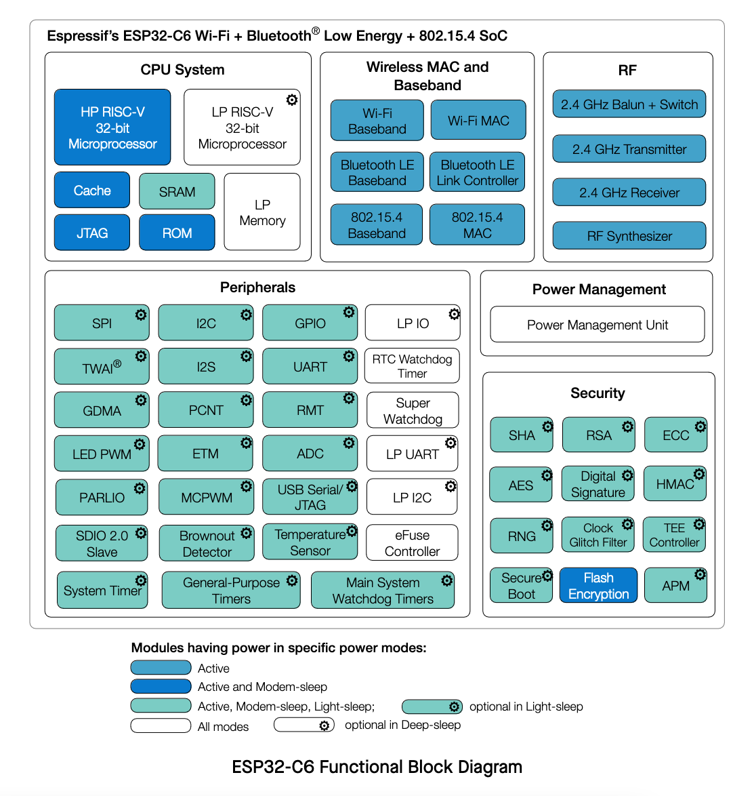

Welcome to the Espressif IoT Development Framework (ESP-IDF) workshop!

## About this workshop

On this workshop, you will have an introdution to the ESP-IDF development using the Espressif IDE and the ESP32-C6. From the IDE installation, you will be guided to setup your system, create the first project, build, flash and debug.

After the initial steps, you will be guided on how to use the components, blink the addressable RGB LED, work with the SDK configuration, connect to the WiFi network and finally, explore the low-power features on the ESP32-C6.

> This workshop is not limited to the ESP32-C6, however, some of the features explored on this workshop is only available on this SoC.

This workshop will be divided in X different assignments. Please see the workshop agenda below:

### Agenda

- [ESP-IDF introduction](#the-esp-idf)
- [ESP32-C6 introduction](#introduction-to-the-esp32-c6)
- [Assignment 1: Installing the Espressif IDE](#assignmnent-installing-the-espressif-ide)
- [Assignment 2: Creating a project with Components](#assignmnent-creating-a-project-with-components)
- [Assignment 3: Using KConfig and SDKConfig](#assignmnent-using-kconfig-and-sdkconfig)
- [Assignment 4: Connecting to WiFi](#assignmnent-connecting-to-wifi)
- [Assignment 5: Using the LP core](#assignmnent-using-the-lp-core)
- [Demos](#demos)
- [Conclusion](#conclusion)
- [Next steps](#next-steps)

## Prerequisites

To follow this workshop, make sure you will meet the prerequisites, as described below.

### Hardware Prerequisites

- ESP32-C6-DevKit-C or ESP32-C6-DevKit-M
- USB cable compatible with your development board

### Software Prerequisites

- Windows, Linux, or macOS computer
- [ESP-IDF v5.3](https://github.com/espressif/esp-idf/tree/release/v5.3)
- [Espressif IDE 3.0.0](https://github.com/espressif/idf-eclipse-plugin/releases/tag/v3.0.0)

### Extra resources



### Effort


**Estimated completition time: 120 min**


## The ESP-IDF

> TODO: Include one explanatiom about the ESP-IDF and some images.

## Introduction to the ESP32-C6

The ESP32-C6 is a Ultra-low-power SoC with RISC-V single-core microprocessor, 2.4 GHz Wi-Fi 6 (802.11ax), Bluetooth® 5 (LE), Zigbee and Thread (802.15.4). It has an optional 4 MB flash in the chip’s package,30 or 22 GPIOs, rich set of peripherals including:



- 30 GPIOs (QFN40), or 22 GPIOs (QFN32)
- 5 strapping GPIOs
- 6 GPIOs needed for in-package flash
- **Analog interfaces:**
  - 12-bit SAR ADC, up to 7 channels
  - Temperature sensor
- **Digital interfaces:**
  - Two UARTs
  - Low-power (LP) UART
  - Two SPI ports for communication with flash
  - General purpose SPI port
  - I2C
  - Low-power (LP) I2C
  - I2S
  - Pulse count controller
  - USB Serial/JTAG controller
  - Two TWAI® controllers, compatible with ISO 11898-1 (CAN Specification 2.0)
  - SDIO 2.0 slave controller
  - LED PWM controller, up to 6 channels
  - Motor Control PWM (MCPWM)
  - Remote control peripheral (TX/RX)
  - Parallel IO interface (PARLIO)
  - General DMA controller, with 3 transmit channels and 3 receive channels
  - Event task matrix (ETM)
- **Timers:**
  - 52-bit system timer
  - Two 54-bit general-purpose timers
  - Three digital watchdog timers
  - Analog watchdog timer

For more details, please see the product [ESP32-C6 Datasheet](https://www.espressif.com/sites/default/files/documentation/esp32-c6_datasheet_en.pdf).

### WiFi6 (IEEE 802.11ax)

WiFi6, also known as IEEE 802.11ax, represents the latest generation of WiFi technology, designed to improve efficiency, capacity, and performance in various environments. Key features of WiFi6, as seen in devices like the ESP32-C6, include:

- **20 MHz-only Non-AP Mode**: This mode operates in a non-access point capacity, utilizing a 20 MHz channel width.
- **MCS0 ~ MCS9**: Support for modulation and coding schemes ranging from MCS0 to MCS9, which dictate data rates and signal robustness.
- **Uplink and Downlink OFDMA**: Orthogonal Frequency Division Multiple Access enables efficient simultaneous connections, particularly beneficial in high-density environments such as stadiums or large office buildings.
- **Downlink MU-MIMO**: Multi-user, multiple input, multiple output technology increases network capacity by allowing the transmission of data to multiple devices at the same time.
- **Beamformee**: This feature enhances signal quality by focusing the WiFi signal towards the receiving device.
- **Channel Quality Indication (CQI)**: Provides real-time feedback on the channel conditions, aiding in dynamic adjustments for optimal performance.
- **DCM (Dual Carrier Modulation)**: Enhances link robustness by using dual carriers, reducing the likelihood of signal degradation.
- **Spatial Reuse**: Maximizes parallel transmissions by allowing multiple devices to communicate simultaneously on the same frequency without significant interference.
- **Target Wake Time (TWT)**: Optimizes power-saving mechanisms by scheduling specific times for devices to wake up and communicate, extending battery life, especially for IoT devices.

These advanced features make WiFi6 a robust and efficient choice for modern wireless communication needs, ensuring better performance, reliability, and energy efficiency.

**WiFi MAC support for the 802.11ax:**
- Target wake time (TWT) requester
- Multiple BSSIDs
- Triggered response scheduling
- Uplink power headroom
- Operating mode
- Buffer status report
- Multi-user Request-to-Send (MU-RTS), Multi-user Block ACK Request (MU-BAR), and Multi-STA Block ACK (M-BA) frame
- Intra-PPDU power saving mechanism
- Two network allocation vectors (NAV)
- BSS coloring
- Spatial reuse
- Uplink power headroom
- Operating mode control
- Buffer status report
- TXOP duration RTS threshold
- UL-OFDMA random access (UORA)

### Resources

- [ESP32-C6 Datasheet](https://www.espressif.com/sites/default/files/documentation/esp32-c6_datasheet_en.pdf)
- [ESP32-C6 Documentation](https://docs.espressif.com/projects/esp-idf/en/release-v5.2/esp32c6/index.html)
- [ESP32-C6-DevKit-C Documentation](https://docs.espressif.com/projects/espressif-esp-dev-kits/en/latest/esp32c6/esp32-c6-devkitc-1/user_guide.html)
- [ESP32-C6-DevKit-C Schematic](https://docs.espressif.com/projects/espressif-esp-dev-kits/en/latest/_static/esp32-c6-devkitc-1/schematics/esp32-c6-devkitc-1-schematics_v1.2.pdf)

## Introduction to the ESP32-C6-DevKit-C

The ESP32-C6-DevKitC-1 is a beginner-friendly development board featuring the ESP32-C6-WROOM-1(U) module, which includes an 8 MB SPI flash. This board offers comprehensive Wi-Fi, Bluetooth LE, Zigbee, and Thread capabilities.

To facilitate easy interfacing, most of the I/O pins are accessible through pin headers on both sides. Developers can connect peripherals using jumper wires or mount the ESP32-C6-DevKitC-1 on a breadboard.
### Features

Here is the development board feature list:

- ESP32-C6-WROOM-1 module
- Pin Header
- 5 V to 3.3 V LDO
- 3.3 V Power On LED
- USB-to-UART Bridge
- ESP32-C6 USB Type-C Port for flashing and debug
- Boot Button
- Reset Button
- USB Type-C to UART Port
- RGB LED connected to the GPIO8
- J5 jumper used for current measurement.

#### Board description


#### Board diagram


#### Board pinout


#### J1 connector

| No. | Name | Type | Function |
|---|---|---|---|
| 1 | 3V3 | P | 3.3 V power supply |
| 2 | RST | I | High: enables the chip; Low: disables the chip. |
| 3 | 4 | I/O/T | MTMS [3]_, GPIO4, LP_GPIO4, LP_UART_RXD, ADC1_CH4, FSPIHD |
| 4 | 5 | I/O/T | MTDI [3]_, GPIO5, LP_GPIO5, LP_UART_TXD, ADC1_CH5, FSPIWP |
| 5 | 6 | I/O/T | MTCK, GPIO6, LP_GPIO6, LP_I2C_SDA, ADC1_CH6, FSPICLK |
| 6 | 7 | I/O/T | MTDO, GPIO7, LP_GPIO7, LP_I2C_SCL, FSPID |
| 7 | 0 | I/O/T | GPIO0, XTAL_32K_P, LP_GPIO0, LP_UART_DTRN, ADC1_CH0 |
| 8 | 1 | I/O/T | GPIO1, XTAL_32K_N, LP_GPIO1, LP_UART_DSRN, ADC1_CH1 |
| 9 | 8 | I/O/T | GPIO8 [2]_ [3]_ |
| 10 | 10 | I/O/T | GPIO10 |
| 11 | 11 | I/O/T | GPIO11 |
| 12 | 2 | I/O/T | GPIO2, LP_GPIO2, LP_UART_RTSN, ADC1_CH2, FSPIQ |
| 13 | 3 | I/O/T | GPIO3, LP_GPIO3, LP_UART_CTSN, ADC1_CH3 |
| 14 | 5V | P | 5 V power supply |
| 15 | G | G | Ground |
| 16 | NC | – | No connection |

#### J3 connector

| No. | Name | Type | Function |
|---|---|---|---|
| 1 | G | G | Ground |
| 2 | TX | I/O/T | U0TXD, GPIO16, FSPICS0 |
| 3 | RX | I/O/T | U0RXD, GPIO17, FSPICS1 |
| 4 | 15 | I/O/T | GPIO15 [3]_ |
| 5 | 23 | I/O/T | GPIO23, SDIO_DATA3 |
| 6 | 22 | I/O/T | GPIO22, SDIO_DATA2 |
| 7 | 21 | I/O/T | GPIO21, SDIO_DATA1, FSPICS5 |
| 8 | 20 | I/O/T | GPIO20, SDIO_DATA0, FSPICS4 |
| 9 | 19 | I/O/T | GPIO19, SDIO_CLK, FSPICS3 |
| 10 | 18 | I/O/T | GPIO18, SDIO_CMD, FSPICS2 |
| 11 | 9 | I/O/T | GPIO9 [3]_ |
| 12 | G | G | Ground |
| 13 | 13 | I/O/T | GPIO13, USB_D+ |
| 14 | 12 | I/O/T | GPIO12, USB_D- |
| 15 | G | G | Ground |
| 16 | NC | – | No connection |

## Assignmnent: Installing the Espressif IDE

---

To get started and perform all the workshop assignments, you will need to install the [Espressif IDE](https://github.com/espressif/idf-eclipse-plugin/releases/tag/v3.0.0). This IDE will be used to create the project, flash and debug the code.

> As alternative, you can use the VSCode extension for ESP-IDF or you can do directly by the Commamnd Line Interface (CLI), however, this workshop is based on the Espressif IDE and all the assignments will follow the steps using the IDE.

### Installing the ESP-IDE

This process can be done by the following tutorial: [Getting Started with IDEs Workshop](../espressif-ide/).

You will need to:

- Install all the necessary drivers for Windows
- Install the Espressif IDE
- Install the tools using the Tools Manager

### Assignmnent: Blink project

---

> TODO: Create a new project usint the blink as template.

#### Project configuration

> TODO: Setup the project using the SDKConfig.

#### Building the project

> TODO: Build.

#### Flash to the device

> TODO: Flash.

#### Monitoring the serial output

> TODO: Monitor.

#### Debugging

> TODO: Debug.

### Assignmnent: Creating a project with Components

---

On this assignment, we will show on how to use components to accelerate your development.
Components are similar to libraries, adding new features like sensors drivers, protocols, and any other feature that is not part of the ESP-IDF. Some components are already part of some examples and the ESP-IDF also uses the external component approach to make the ESP-IDF more modular.

Using components not only makes your project easier to maintain but also improve the development speed by reusing and sharing components accross different projects.

If you want to create and publish your own component, we recooment you to watch [DevCon23 - Developing, Publishing, and Maintaining Components for ESP-IDF](https://www.youtube.com/watch?v=D86gQ4knUnc) talk.



You can also find components using our [ESP Registry](https://components.espressif.com) platform.

To show how to use components, we will create a new project from the scratch and add the component LED strip.

#### Hands-on

This hands on will use a component for the RGB LED (WS2812) connected on the ```GPIO8``` and the [Remote Control Transceiver]([https://docs.espressif.com/projects/esp-idf/en/release-v5.2/esp32c6/api-reference/peripherals/rmt.html) (RMT) peripheral to control the data transfer to the addressable LEDs.

1. Create a new project blank project.

To create the project form the command line interface (CLI), you can use the following command. Make sure you have your ESP-IDF installed.

```bash
idf.py create-project my-workshop-project
cd my-workshop-project
```

Now you can set the SoC target by the following command:


```bash
idf.py set-target esp32c6
```

This command will set the target for this project and it will build for the specified target only.

The next step is to add the component [espressif/led_strip](https://components.espressif.com/components/espressif/led_strip/versions/2.5.3). This component will add all the necessary drivers for the addressable LED (board LED).

```bash
idf.py add-dependency "espressif/led_strip^2.5.3"
```

You will note that a new file, **idf_component.yml** will be created inside the main folder, after adding the dependency. On the first build, the folder **managed_components** will be created and the component will be downloaded inside this folder.


## IDF Component Manager Manifest File
dependencies:
  espressif/led_strip: "^2.5.3"
  ## Required IDF version
  idf:
    version: ">=4.1.0"


You can also change this file manually to include dependencies to your project.

> TODO: Describe the folder structure.

#### Steps

For this assignment, please follow the steps.

  1. **Create a function to configure the LEDs and the RMT peripheral driver**

Include the ```led_strip.h``` header file.


#include "led_strip.h"


and create the function to configure the LED.


led_strip_handle_t configure_led(void)
{
    // Your code goes here
}


You will use this function for the following 3 steps.

2. **Configure the LED strip**

Use the ```led_strip_config_t``` structure to configure the LED strip. For the **ESP32-C6-DevKit-C**, the LED model is the WS2812.


    led_strip_config_t strip_config = {
        // Set the GPIO8 that the LED is connected
        .strip_gpio_num = 8,
        // Set the number of connected LEDs, 1
        .max_leds = 1,
        // Set the pixel format of your LED strip
        .led_pixel_format = LED_PIXEL_FORMAT_GRB,
        // LED model
        .led_model = LED_MODEL_WS2812,
        // In some cases, the logic is inverted
        .flags.invert_out = false,                
    };


3. **Configure the RMT driver**

Use the ```led_strip_rmt_config_t``` structure to configure the RMT peripheral driver.


    led_strip_rmt_config_t rmt_config = {
        // Set the clock source
        .clk_src = RMT_CLK_SRC_DEFAULT,
        // Set the RMT counter clock
        .resolution_hz = LED_STRIP_RMT_RES_HZ,
        // Set the DMA feature (not supported on the ESP32-C6)
        .flags.with_dma = false,
    };


4. **Create the RMT device**


led_strip_new_rmt_device(&strip_config, &rmt_config, &led_strip);


5. Create the LED strip handle.


led_strip = configure_led();


6. **Set the LED RGB color**


led_strip_set_pixel(led_strip, 0, 20, 0, 0);


Where the arguments are:

- 0 is the LED number (in this case 0 because we have only one)
- 20 is the RED that could be from 0 to 255 (max brightness)
- 0 is the GREEN that could be from 0 to 255 (max brightness)
- 0 is the BLUE that could be from 0 to 255 (max brightness)

> You can try and change the RGB values to vary the color!

7. **Refresh the LED strip**

This function must be called to update the LED pixel color.


led_strip_refresh(led_strip);


To clear the RBG LED (off), you can use the function ```led_strip_clear(led_strip)```.

#### Assignment Code

Here you can find the full code for this assignment:


#include <stdio.h>
#include "led_strip.h"

// 10MHz resolution, 1 tick = 0.1us (led strip needs a high resolution)
#define LED_STRIP_RMT_RES_HZ  (10 * 1000 * 1000)

led_strip_handle_t led_strip;

void configure_led(void)
{
    // LED strip general initialization, according to your led board design
    led_strip_config_t strip_config = {
        // Set the GPIO that the LED is connected
        .strip_gpio_num = 8,
        // Set the number of connected LEDs in the strip
        .max_leds = 1,
        // Set the pixel format of your LED strip
        .led_pixel_format = LED_PIXEL_FORMAT_GRB,
        // LED strip model
        .led_model = LED_MODEL_WS2812,
        // In some cases, the logic is inverted
        .flags.invert_out = false,                
    };

    // LED strip backend configuration: RMT
    led_strip_rmt_config_t rmt_config = {
        // Set the clock source
        .clk_src = RMT_CLK_SRC_DEFAULT,
        // Set the RMT counter clock
        .resolution_hz = LED_STRIP_RMT_RES_HZ,
        // Set the DMA feature (not supported on the ESP32-C6)
        .flags.with_dma = false,
    };

    // LED Strip object handle
    led_strip_new_rmt_device(&strip_config, &rmt_config, &led_strip);
}

void app_main(void)
{
    configure_led();
    led_strip_set_pixel(led_strip, 0, 20, 0, 0);
    led_strip_refresh(led_strip);
}


#### Expected result

The LED should turn on in RED in mid brigthness.

> TODO: Add asciinema.

#### Extra

  1. Create a FreeRTOS task to blink the LED using different color or fade.
  2. Use the component [espressif/button](https://components.espressif.com/components/espressif/button/versions/3.2.0) and 


### Assignmnent: Using KConfig and SDKConfig

---

The ESP-IDF use a method to configure the SDK based on the kconfiglib, a Python extension of the [Kconfig](https://docs.kernel.org/kbuild/kconfig-language.html) system, called [esp-idf-kconfig](https://docs.espressif.com/projects/esp-idf/en/release-v5.2/esp32c6/api-reference/kconfig.html?highlight=kconfig).
This configuration method can be used by the command or via the Espressif IDE GUI:

```bash
idf.py menuconfig
```

This configuration can be performed by the IDE GUI.

> TODO: Add printscreen

#### ESP-IDF configuration

This is one of the most important steps before flashing your application into the device. You will need to change some of the default configurations in order to better fit the SoC or module in use to the SDK.

A good example of a setting you will probably need to change is the flash memory size. As default, some SoCs cames with the 2MB flash size selected. To change that, you will need to use the SDK configuration.



To make your project easier to configure, there are different ways to set default configurations or to create custom menus for the SDK configuration tool.

#### Hands-on

For this hands-on, we will create a new configuration menu to set the WiFi credentials (SSID and password). We will also understand how to pre-define some configurations as default, improving the configuration process by avoiding configuration mistakes.

  1. **Creating a new configuration menu**

First, we need to create a new file called ```Kconfig.projbuild``` inside the **main** folder.

```text
menu "WiFi Configuration"

    config ESP_WIFI_SSID
        string "WiFi SSID"
        default "default_ssid"
        help
            SSID (network name) to connect to.

    config ESP_WIFI_PASSWORD
        string "WiFi Password"
        default "default_password"
        help
            WiFi password (WPA, WPA2, or WPA3).
endmenu
```

Where the menu name will be ```WiFi Configuration``` with 2 configurations:

- Config **ESP_WIFI_SSID** with ```string``` data type named "WiFi SSID" with the default value of **"default_ssid"**.
- Config **ESP_WIFI_PASSWORD** with ```string``` data type named "WiFi Password" with the default value of **"default_password"**.

There are more data types, such as ```bool``` and ```int```.
This file will be used by this project when calling the SDK configuration interface.

To use the new configuration entries, you can do:


#define WIFI_SSID CONFIG_ESP_WIFI_SSID
#define WIFI_PASS CONFIG_ESP_WIFI_PASSWORD


As you can see, you will need to include the prefix ```CONFIG_```to the config name.

Now run the configuration menu to see the recently created menu for the WiFi credentials. If you are not able to see the menu, you can try to run this command.

```bash
idf.py reconfigure
```

> Every time you change the SDK configuration, the build system will rebuild and it might take a while depending on your system.
> Important: This configuration menu will be used for the next assignment.

  2. **Setting the default configuration**

You might noticed that you will need to change the new configuration entries manually, if you are not going to define as your default values. To overcome this, you can define the default SDK configuration values.
This is valid for all the configuration values, not only for those you have just created.

To do this, create the ```sdkconfig.defaults``` file, in the same folder as you have the ```sdkconfig``` file.
We do not recommend you to change the ```sdkconfig``` file manually, so the way to define your own default configuration values is by the ```sdkconfig.defaults``` file.

```text
CONFIG_ESPTOOLPY_FLASHSIZE_8MB
CONFIG_ESP_WIFI_SSID="EspressifWorkshop"
CONFIG_ESP_WIFI_PASSWORD="espressifsummit"
```

When you run the SDK configuration for the first time, the values from the defaults file will be applied. You can also use the ```reconfigure```to apply again the default values or you can delete the ```sdkconfig``` file manually.

If you have different targets, you can define default configuration files based on the selected target. To do that, the file name should contain the target name: ```sdkconfig.defaults.esp32c6``` for example on the ESP32-C6.

### Assignmnent: Connecting to WiFi

---

Now it's time to connect the ESP32-C6 to the WiFi network. The ESP32-C6 supports both WiFi4 and WiFi6 on 2.4GHz.

[WiFi connectivity](https://docs.espressif.com/projects/esp-idf/en/release-v5.2/esp32c6/api-reference/network/esp_wifi.html) is one of most desired features for most of the smart and IoT devices. With WiFi, you can connect the device to the Internet and perform many operations, such as over-the-air updates (OTA), cloud connectivity, remote monitoring and so on.

The ESP32's supports both Station and SoftAP modes.

For this assignment, we will set up the station mode WiFi driver and connect to a WiFi4/WiFi6 network, using the same project as used on the [Creating a project with Components](#assignmnent-creating-a-project-with-components) assignment.

#### Hands-on

To get started with the WiFi, we need to setup the WiFi driver in order to connect to a WiFi network, using the access credentials (SSID and password). Once we successfuly 

  1. Add all the necessary includes.


#include "freertos/FreeRTOS.h"
#include "freertos/task.h"
#include "freertos/event_groups.h"
#include "esp_system.h"
#include "esp_wifi.h"
#include "esp_event.h"
#include "esp_log.h"
#include "nvs_flash.h"
#include "lwip/err.h"
#include "lwip/sys.h"


  2. Create the WiFi initialization

To initializate the WiFi, we need to perform the following steps:
  
- Initialize the TCP/IP stack:


esp_netif_init();
esp_event_loop_create_default();
esp_netif_create_default_wifi_sta();


- Initialize and allocate the resources for WiFi driver:


wifi_init_config_t cfg = WIFI_INIT_CONFIG_DEFAULT();
esp_wifi_init(&cfg);


- Registry the event handler for ```WIFI_EVENT```and ```IP_EVENT```:


    esp_event_handler_instance_t instance_any_id;
    esp_event_handler_instance_t instance_got_ip;
    esp_event_handler_instance_register(WIFI_EVENT,
            ESP_EVENT_ANY_ID,
            &event_handler,
            NULL,
            &instance_any_id);
    esp_event_handler_instance_register(IP_EVENT,
            IP_EVENT_STA_GOT_IP,
            &event_handler,
            NULL,
            &instance_got_ip);


- Set the WiFi mode as station using ```WIFI_MODE_STA```:


    esp_wifi_set_mode(WIFI_MODE_STA);


- Set the WiFi configuration:

Using the struct ```wifi_config_t```, setup the WiFi as ```sta```:


    wifi_config_t wifi_config = {
        .sta = {
            // Set the newtork name
            .ssid = WIFI_SSID,
            // Set the network pass key
            .password = WIFI_PASS,
            // Set WPA2 or WPA3 with Pre-Shared Key (PSK) as the authentication mode
            .threshold.authmode = WIFI_AUTH_WPA2_WPA3_PSK,
            // Set Simultaneous Authentication (SAE) and Password Element (PWE) derivation method
            .sae_pwe_h2e = WPA3_SAE_PWE_BOTH,
            // Set the password identifier for H2E (Hash-to-Element)
            .sae_h2e_identifier = "",
        },
    };


Then the network **ssid** and **password** as:


#define WIFI_SSID CONFIG_ESP_WIFI_SSID
#define WIFI_PASS CONFIG_ESP_WIFI_PASSWORD


- Now you can call ```esp_wifi_set_config``` function.


    esp_wifi_set_config(WIFI_IF_STA, &wifi_config);


- Start the WiFi on the selected mode with the configuration defined:


    esp_wifi_start();


- Finally, wait for the ```WIFI_CONNECTED_BIT```or ```WIFI_FAIL_BIT```.


    EventBits_t bits = xEventGroupWaitBits(s_wifi_event_group,
            WIFI_CONNECTED_BIT | WIFI_FAIL_BIT,
            pdFALSE,
            pdFALSE,
            portMAX_DELAY);

    if (bits & WIFI_CONNECTED_BIT) {
        ESP_LOGI(TAG, "Connected!");
    } else if (bits & WIFI_FAIL_BIT) {
        ESP_LOGE(TAG, "Failed to connect!");
    }


This is not mandatory, however it is useful.

#### Code Block


void wifi_init_sta(void)
{
    s_wifi_event_group = xEventGroupCreate();

    ESP_ERROR_CHECK(esp_netif_init());
    ESP_ERROR_CHECK(esp_event_loop_create_default());
    esp_netif_create_default_wifi_sta();

    wifi_init_config_t cfg = WIFI_INIT_CONFIG_DEFAULT();
    ESP_ERROR_CHECK(esp_wifi_init(&cfg));

    esp_event_handler_instance_t instance_any_id;
    esp_event_handler_instance_t instance_got_ip;
    ESP_ERROR_CHECK(esp_event_handler_instance_register(WIFI_EVENT,
            ESP_EVENT_ANY_ID,
            &event_handler,
            NULL,
            &instance_any_id));
    ESP_ERROR_CHECK(esp_event_handler_instance_register(IP_EVENT,
            IP_EVENT_STA_GOT_IP,
            &event_handler,
            NULL,
            &instance_got_ip));

    wifi_config_t wifi_config = {
        .sta = {
            .ssid = WIFI_SSID,
            .password = WIFI_PASS,
            .threshold.authmode = WIFI_AUTH_WPA2_WPA3_PSK,
            .sae_pwe_h2e = WPA3_SAE_PWE_BOTH,
            .sae_h2e_identifier = "",
        },
    };

    ESP_ERROR_CHECK(esp_wifi_set_mode(WIFI_MODE_STA) );
    ESP_ERROR_CHECK(esp_wifi_set_config(WIFI_IF_STA, &wifi_config) );
    ESP_ERROR_CHECK(esp_wifi_start() );

    EventBits_t bits = xEventGroupWaitBits(s_wifi_event_group,
            WIFI_CONNECTED_BIT | WIFI_FAIL_BIT,
            pdFALSE,
            pdFALSE,
            portMAX_DELAY);

    if (bits & WIFI_CONNECTED_BIT) {
        ESP_LOGI(TAG, "Connected!");
    } else if (bits & WIFI_FAIL_BIT) {
        ESP_LOGE(TAG, "Failed to connect!");
    }
}


3. Create the WiFi event handler

#### Code Block


static void event_handler(void* arg, esp_event_base_t event_base,
                                int32_t event_id, void* event_data)
{
    if (event_base == WIFI_EVENT && event_id == WIFI_EVENT_STA_START) {
        esp_wifi_connect();
    } else if (event_base == WIFI_EVENT && event_id == WIFI_EVENT_STA_DISCONNECTED) {
        if (s_retry_num < 10) {
            esp_wifi_connect();
            s_retry_num++;
            ESP_LOGW(TAG, "Trying to connect to WiFi");
        } else {
            xEventGroupSetBits(s_wifi_event_group, WIFI_FAIL_BIT);
        }
        ESP_LOGE(TAG, "Failed to connect to WiFi");
    } else if (event_base == IP_EVENT && event_id == IP_EVENT_STA_GOT_IP) {
        ip_event_got_ip_t* event = (ip_event_got_ip_t*) event_data;
        ESP_LOGI(TAG, "got ip:" IPSTR, IP2STR(&event->ip_info.ip));
        s_retry_num = 0;
        xEventGroupSetBits(s_wifi_event_group, WIFI_CONNECTED_BIT);
    }
}


4. Check the NVS initialization


    esp_err_t ret = nvs_flash_init();
    if (ret == ESP_ERR_NVS_NO_FREE_PAGES || ret == ESP_ERR_NVS_NEW_VERSION_FOUND) {
      ESP_ERROR_CHECK(nvs_flash_erase());
      ret = nvs_flash_init();
    }
    ESP_ERROR_CHECK(ret);


5. Init WiFi


wifi_init_sta();


#### Assignment Code

Here you can find the full code for this assignment:


#include <stdio.h>
#include "led_strip.h"

#include "freertos/FreeRTOS.h"
#include "freertos/task.h"
#include "freertos/event_groups.h"
#include "esp_system.h"
#include "esp_wifi.h"
#include "esp_event.h"
#include "esp_log.h"
#include "nvs_flash.h"

#include "lwip/err.h"
#include "lwip/sys.h"

#define WIFI_SSID CONFIG_ESP_WIFI_SSID
#define WIFI_PASS CONFIG_ESP_WIFI_PASSWORD

#define WIFI_CONNECTED_BIT BIT0
#define WIFI_FAIL_BIT      BIT1

#define LED_STRIP_RMT_RES_HZ  (10 * 1000 * 1000)

led_strip_handle_t led_strip;

static EventGroupHandle_t s_wifi_event_group;
static int s_retry_num = 0;

static const char *TAG = "workshop";


static void event_handler(void* arg, esp_event_base_t event_base,
                                int32_t event_id, void* event_data)
{
    if (event_base == WIFI_EVENT && event_id == WIFI_EVENT_STA_START) {
        esp_wifi_connect();
    } else if (event_base == WIFI_EVENT && event_id == WIFI_EVENT_STA_DISCONNECTED) {
        if (s_retry_num < 10) {
            esp_wifi_connect();
            s_retry_num++;
            ESP_LOGW(TAG, "Trying to connect to WiFi");
            led_strip_set_pixel(led_strip, 0, 0, 0, 25);
            led_strip_refresh(led_strip);
        } else {
            xEventGroupSetBits(s_wifi_event_group, WIFI_FAIL_BIT);
        }
        ESP_LOGE(TAG, "Failed to connect to WiFi");
        led_strip_set_pixel(led_strip, 0, 25, 0, 0);
        led_strip_refresh(led_strip);
    } else if (event_base == IP_EVENT && event_id == IP_EVENT_STA_GOT_IP) {
        ip_event_got_ip_t* event = (ip_event_got_ip_t*) event_data;
        ESP_LOGI(TAG, "got ip:" IPSTR, IP2STR(&event->ip_info.ip));
        led_strip_set_pixel(led_strip, 0, 0, 25, 0);
        led_strip_refresh(led_strip);
        s_retry_num = 0;
        xEventGroupSetBits(s_wifi_event_group, WIFI_CONNECTED_BIT);
    }
}

void wifi_init_sta(void)
{
    s_wifi_event_group = xEventGroupCreate();

    ESP_ERROR_CHECK(esp_netif_init());
    ESP_ERROR_CHECK(esp_event_loop_create_default());
    esp_netif_create_default_wifi_sta();

    wifi_init_config_t cfg = WIFI_INIT_CONFIG_DEFAULT();
    ESP_ERROR_CHECK(esp_wifi_init(&cfg));

    esp_event_handler_instance_t instance_any_id;
    esp_event_handler_instance_t instance_got_ip;
    ESP_ERROR_CHECK(esp_event_handler_instance_register(WIFI_EVENT,
            ESP_EVENT_ANY_ID,
            &event_handler,
            NULL,
            &instance_any_id));
    ESP_ERROR_CHECK(esp_event_handler_instance_register(IP_EVENT,
            IP_EVENT_STA_GOT_IP,
            &event_handler,
            NULL,
            &instance_got_ip));

    wifi_config_t wifi_config = {
        .sta = {
            .ssid = WIFI_SSID,
            .password = WIFI_PASS,
            .threshold.authmode = WIFI_AUTH_WPA2_WPA3_PSK,
            .sae_pwe_h2e = WPA3_SAE_PWE_BOTH,
            .sae_h2e_identifier = "",
        },
    };

    ESP_ERROR_CHECK(esp_wifi_set_mode(WIFI_MODE_STA) );
    ESP_ERROR_CHECK(esp_wifi_set_config(WIFI_IF_STA, &wifi_config) );
    ESP_ERROR_CHECK(esp_wifi_start() );

    EventBits_t bits = xEventGroupWaitBits(s_wifi_event_group,
            WIFI_CONNECTED_BIT | WIFI_FAIL_BIT,
            pdFALSE,
            pdFALSE,
            portMAX_DELAY);

    if (bits & WIFI_CONNECTED_BIT) {
        ESP_LOGI(TAG, "Connected!");
    } else if (bits & WIFI_FAIL_BIT) {
        ESP_LOGE(TAG, "Failed to connect!");
    }
}

void configure_led(void)
{
    led_strip_config_t strip_config = {
        .strip_gpio_num = 8,
        .max_leds = 1,
        .led_pixel_format = LED_PIXEL_FORMAT_GRB,
        .led_model = LED_MODEL_WS2812,
        .flags.invert_out = false,                
    };

    led_strip_rmt_config_t rmt_config = {

        .clk_src = RMT_CLK_SRC_DEFAULT,
        .resolution_hz = LED_STRIP_RMT_RES_HZ,
        .flags.with_dma = false,
    };

    led_strip_new_rmt_device(&strip_config, &rmt_config, &led_strip);
}

void app_main(void)
{
    configure_led();
    led_strip_set_pixel(led_strip, 0, 0, 0, 25);
    led_strip_refresh(led_strip);

    esp_err_t ret = nvs_flash_init();
    if (ret == ESP_ERR_NVS_NO_FREE_PAGES || ret == ESP_ERR_NVS_NEW_VERSION_FOUND) {
      ESP_ERROR_CHECK(nvs_flash_erase());
      ret = nvs_flash_init();
    }
    ESP_ERROR_CHECK(ret);

    wifi_init_sta();
}


#### Extra

  1. Modify your code to change the RGB LED color according to the WiFi connection state. Light it blue for the connecting, green for connected and red for failed to connet.

  2. Add the [espressif/console_cmd_wifi](https://components.espressif.com/components/espressif/console_cmd_wifi/versions/1.0.1) to add the functionality to control the WiFi connection vit the terminal console.

  3. Use the SNTP to get the time from an NTP server.

  4. Certificate bundle for HTTPS.

### Assignmnent: Using the LP core

---

Reducing the power consumption on WiFi devices is a challenge. Here we will show you some of the techniques that can be applied to the ESP32-C6 in order to reduce the power consumption on WiFi applicatons.

Another talk form the DevCon23, is the [Low-Power Features of ESP32-C6: Target Wake Time + LP Core](https://www.youtube.com/watch?v=FpTwQlGtV0k), witch cover the LP features and the TWT. Please save to watch later as a complementary material.



### WiFi6 feature: TWT

---

One of the advantages of the WiFi6, is the Target Wake Time, or just TWT.

### Low-power features

---

#### Power Management

If you are not using the WiFi6, you still can reduce the power consumption in between the beacon packages.

The new power management present on all the WiFi capable SoCs, allows you to reduce the power consumption on the WiFi connection when using the DTIM1. By enabling this feature, the HP core will sleep between the beacon packets.

Here you will see on how to change the configuration to enable the power management.

```text
# Use lower CPU frequency
CONFIG_ESP_DEFAULT_CPU_FREQ_MHZ_80=y
# Enable support for power management
CONFIG_PM_ENABLE=y
# Enable tickless idle mode
CONFIG_FREERTOS_USE_TICKLESS_IDLE=y
# Put related source code in IRAM
CONFIG_PM_SLP_IRAM_OPT=y
CONFIG_PM_RTOS_IDLE_OPT=y
# Disable all GPIO at light sleep
CONFIG_GPIO_ESP32_SUPPORT_SWITCH_SLP_PULL=y
CONFIG_PM_SLP_DISABLE_GPIO=y
# Enable wifi sleep iram optimization
CONFIG_ESP_WIFI_SLP_IRAM_OPT=y
# Use 1000Hz freertos tick to lower sleep time threshold
CONFIG_FREERTOS_HZ=1000
```

> TODO Add PPK power consumption comparison.

#### Low-power core

LP-blink

> Steps for the LP-GPIO blink

I2C sensor read

### Demos

---

#### PARLIO Logic Analyzer

> TODO

#### iTWT

> TODO

### Conclusion

---

### Next steps

---