Welcome to the Espressif IoT Development Framework (ESP-IDF) workshop!

## About this workshop

On this workshop, you will have an introduction to the ESP-IDF development using the Espressif IDE and the ESP32-C6. From the IDE installation, you will be guided to setup your system, create the first project, build, flash and debug.

After the initial steps, you will be guided on how to use the components, blink the addressable RGB LED, work with the SDK configuration, connect to the WiFi network and finally, explore the low-power features on the ESP32-C6.

> This workshop is not limited to the ESP32-C6, however, some of the features explored on this workshop is only available on this SoC.

This workshop will be divided in 7 different assignments. Please see the workshop agenda below:

### Agenda

- [ESP-IDF introduction](#the-esp-idf)
- [ESP32-C6 introduction](#introduction-to-the-esp32-c6)
- [Assignment 1: Installing the Espressif IDE](#assignment-1-installing-the-espressif-ide)
- [Assignment 2: Creating a new project with Components](#assignment-2-creating-a-new-project-with-components)
- [Assignment 3: Connecting to WiFi](#assignment-3-connecting-to-wifi)
- [Assignment 4: Working with the NVS](#assignment-4-working-with-the-nvs)
- [Assignment 5: WiFi provisioning (EXTRA)](#assignment-5-wifi-provisioning-extra)
- [Assignment 6: Protocols](#assignment-6-protocols-extra)
- [Assignment 7: Using the LP core](#assignment-7-using-the-ulp)
- [Conclusion](#conclusion)
- [Next steps](#next-steps)

## Prerequisites

To follow this workshop, make sure you will meet the prerequisites, as described below.

### Hardware Prerequisites

- ESP32-C6-DevKit-C or ESP32-C6-DevKit-M
- USB cable compatible with your development board

### Software Prerequisites

- Windows, Linux, or macOS computer
- [ESP-IDF v5.2](https://github.com/espressif/esp-idf/tree/release/v5.2)
- [Espressif IDE 3.0.0](https://github.com/espressif/idf-eclipse-plugin/releases/tag/v3.0.0)

### Effort


**Estimated time: 120 min**


## The ESP-IDF

The ESP-IDF (Espressif IoT Development Framework) is the official operating system and development framework for the ESP32 series of microcontrollers by Espressif Systems. It provides a comprehensive environment for building IoT applications with robust networking, security, and reliability features. 

The framework supports FreeRTOS, allowing developers to create real-time, multitasking applications. With extensive libraries, components, protocols, tools, and documentation, ESP-IDF simplifies the development process, enabling seamless integration with hardware peripherals, Wi-Fi, Bluetooth, Thread, ZigBee, and cloud services. The ESP-IDF includes almost 400 examples, covering a wide range of use cases and helping developers quickly get started on their projects.

### Architecture

### Frameworks

Several other frameworks use ESP-IDF as a base, including:

- **Arduino for ESP32**
- **ESP-ADF** (Audio Development Framework): Designed for audio applications.
- **ESP-WHO** (AI Development Framework): Focused on face detection and recognition.
- **ESP-RainMaker**: Simplifies building connected devices with cloud capabilities.

### Current supported versions

Visit the ESP-IDF project on GitHub to get the updated list of supported versions and the maintenance period.



## Introduction to the ESP32-C6

The ESP32-C6 is a Ultra-low-power SoC with RISC-V single-core microprocessor, 2.4 GHz Wi-Fi 6 (802.11ax), Bluetooth® 5 (LE), Zigbee and Thread (802.15.4). It has an optional 4 MB flash in the chip’s package,30 or 22 GPIOs, rich set of peripherals including:


  


- 30 GPIOs (QFN40), or 22 GPIOs (QFN32)
- 5 strapping GPIOs
- 6 GPIOs needed for in-package flash
- **Analog interfaces:**
  - 12-bit SAR ADC, up to 7 channels
  - Temperature sensor
- **Digital interfaces:**
  - Two UARTs
  - Low-power (LP) UART
  - Two SPI ports for communication with flash
  - General purpose SPI port
  - I2C
  - Low-power (LP) I2C
  - I2S
  - Pulse count controller
  - USB Serial/JTAG controller
  - Two TWAI® controllers, compatible with ISO 11898-1 (CAN Specification 2.0)
  - SDIO 2.0 slave controller
  - LED PWM controller, up to 6 channels
  - Motor Control PWM (MCPWM)
  - Remote control peripheral (TX/RX)
  - Parallel IO interface (PARLIO)
  - General DMA controller, with 3 transmit channels and 3 receive channels
  - Event task matrix (ETM)
- **Timers:**
  - 52-bit system timer
  - Two 54-bit general-purpose timers
  - Three digital watchdog timers
  - Analog watchdog timer

For more details, please see the product [ESP32-C6 Datasheet](https://www.espressif.com/sites/default/files/documentation/esp32-c6_datasheet_en.pdf).

### WiFi6 (IEEE 802.11ax)

WiFi6, also known as IEEE 802.11ax, represents the latest generation of WiFi technology, designed to improve efficiency, capacity, and performance in various environments. Key features of WiFi6, as seen in devices like the ESP32-C6, include:

- **20 MHz-only Non-AP Mode**: This mode operates in a non-access point capacity, utilizing a 20 MHz channel width.
- **MCS0 ~ MCS9**: Support for modulation and coding schemes ranging from MCS0 to MCS9, which dictate data rates and signal robustness.
- **Uplink and Downlink OFDMA**: Orthogonal Frequency Division Multiple Access enables efficient simultaneous connections, particularly beneficial in high-density environments such as stadiums or large office buildings.
- **Downlink MU-MIMO**: Multi-user, multiple input, multiple output technology increases network capacity by allowing the transmission of data to multiple devices at the same time.
- **Beamforming**: This feature enhances signal quality by focusing the WiFi signal towards the receiving device.
- **Channel Quality Indication (CQI)**: Provides real-time feedback on the channel conditions, aiding in dynamic adjustments for optimal performance.
- **DCM (Dual Carrier Modulation)**: Enhances link robustness by using dual carriers, reducing the likelihood of signal degradation.
- **Spatial Reuse**: Maximizes parallel transmissions by allowing multiple devices to communicate simultaneously on the same frequency without significant interference.
- **Target Wake Time (TWT)**: Optimizes power-saving mechanisms by scheduling specific times for devices to wake up and communicate, extending battery life, especially for IoT devices.

These advanced features make WiFi6 a robust and efficient choice for modern wireless communication needs, ensuring better performance, reliability, and energy efficiency.

**WiFi MAC support for the 802.11ax:**

- Target wake time (TWT) requester
- Multiple BSSIDs
- Triggered response scheduling
- Uplink power headroom
- Operating mode
- Buffer status report
- Multi-user Request-to-Send (MU-RTS), Multi-user Block ACK Request (MU-BAR), and Multi-STA Block ACK (M-BA) frame
- Intra-PPDU power saving mechanism
- Two network allocation vectors (NAV)
- BSS coloring
- Spatial reuse
- Uplink power headroom
- Operating mode control
- Buffer status report
- TXOP duration RTS threshold
- UL-OFDMA random access (UORA)

### Resources

- [ESP32-C6 Datasheet](https://www.espressif.com/sites/default/files/documentation/esp32-c6_datasheet_en.pdf)
- [ESP32-C6 Documentation](https://docs.espressif.com/projects/esp-idf/en/release-v5.2/esp32c6/index.html)
- [ESP32-C6-DevKit-C Documentation](https://docs.espressif.com/projects/espressif-esp-dev-kits/en/latest/esp32c6/esp32-c6-devkitc-1/user_guide.html)
- [ESP32-C6-DevKit-C Schematic](https://docs.espressif.com/projects/espressif-esp-dev-kits/en/latest/_static/esp32-c6-devkitc-1/schematics/esp32-c6-devkitc-1-schematics_v1.2.pdf)

## Introduction to the ESP32-C6-DevKit-C

The ESP32-C6-DevKitC-1 is a beginner-friendly development board featuring the ESP32-C6-WROOM-1(U) module, which includes an 8 MB SPI flash. This board offers comprehensive Wi-Fi, Bluetooth LE, Zigbee, and Thread capabilities.

To facilitate easy interfacing, most of the I/O pins are accessible through pin headers on both sides. Developers can connect peripherals using jumper wires or mount the ESP32-C6-DevKitC-1 on a breadboard.

### Features

Here is the development board feature list:

- ESP32-C6-WROOM-1 module
- Pin Header
- 5 V to 3.3 V LDO
- 3.3 V Power On LED
- USB-to-UART Bridge
- ESP32-C6 USB Type-C Port for flashing and debug
- Boot Button
- Reset Button
- USB Type-C to UART Port
- RGB LED connected to the GPIO8
- J5 jumper used for current measurement.

#### Board description


  
  


#### Board pin-layout


  


#### J1 connector

| No. | Name | Type | Function |
|---|---|---|---|
| 1 | 3V3 | P | 3.3 V power supply |
| 2 | RST | I | High: enables the chip; Low: disables the chip. |
| 3 | 4 | I/O/T | MTMS, GPIO4, **LP_GPIO4**, **LP_UART_RXD**, ADC1_CH4, FSPIHD |
| 4 | 5 | I/O/T | MTDI, GPIO5, **LP_GPIO5**, **LP_UART_TXD**, ADC1_CH5, FSPIWP |
| 5 | 6 | I/O/T | MTCK, GPIO6, **LP_GPIO6**, **LP_I2C_SDA**, ADC1_CH6, FSPICLK |
| 6 | 7 | I/O/T | MTDO, GPIO7, **LP_GPIO7**, **LP_I2C_SCL**, FSPID |
| 7 | 0 | I/O/T | GPIO0, XTAL_32K_P, **LP_GPIO0**, **LP_UART_DTRN**, ADC1_CH0 |
| 8 | 1 | I/O/T | GPIO1, XTAL_32K_N, **LP_GPIO1**, **LP_UART_DSRN**, ADC1_CH1 |
| 9 | 8 | I/O/T | GPIO8 |
| 10 | 10 | I/O/T | GPIO10 |
| 11 | 11 | I/O/T | GPIO11 |
| 12 | 2 | I/O/T | GPIO2, **LP_GPIO2**, **LP_UART_RTSN**, ADC1_CH2, FSPIQ |
| 13 | 3 | I/O/T | GPIO3, **LP_GPIO3**, **LP_UART_CTSN**, ADC1_CH3 |
| 14 | 5V | P | 5 V power supply |
| 15 | G | G | Ground |
| 16 | NC | – | No connection |

#### J3 connector

| No. | Name | Type | Function |
|---|---|---|---|
| 1 | G | G | Ground |
| 2 | TX | I/O/T | U0TXD, GPIO16, FSPICS0 |
| 3 | RX | I/O/T | U0RXD, GPIO17, FSPICS1 |
| 4 | 15 | I/O/T | GPIO15 |
| 5 | 23 | I/O/T | GPIO23, SDIO_DATA3 |
| 6 | 22 | I/O/T | GPIO22, SDIO_DATA2 |
| 7 | 21 | I/O/T | GPIO21, SDIO_DATA1, FSPICS5 |
| 8 | 20 | I/O/T | GPIO20, SDIO_DATA0, FSPICS4 |
| 9 | 19 | I/O/T | GPIO19, SDIO_CLK, FSPICS3 |
| 10 | 18 | I/O/T | GPIO18, SDIO_CMD, FSPICS2 |
| 11 | 9 | I/O/T | GPIO9 |
| 12 | G | G | Ground |
| 13 | 13 | I/O/T | GPIO13, USB_D+ |
| 14 | 12 | I/O/T | GPIO12, USB_D- |
| 15 | G | G | Ground |
| 16 | NC | – | No connection |

## Assignment 1: Installing the Espressif IDE

---

To get started and perform all the workshop assignments, you will need to install the [Espressif IDE](https://github.com/espressif/idf-eclipse-plugin/releases/tag/v3.0.0). This IDE will be used to create the project, flash and debug the code.

> As alternative, you can use the VSCode extension for ESP-IDF or you can do directly by the Command-Line-Interface (CLI), however, this workshop is based on the Espressif IDE and all the assignments will follow the steps using this IDE.

### Installing the ESP-IDE

This assignment will be done by the following tutorial: [Getting Started with IDEs Workshop](../espressif-ide/).

You will need to:

- Install all the necessary drivers for Windows
- Install the Espressif IDE
- Install the tools using the Tools Manager

## Assignment 2: Creating a new project with Components

---

On this assignment, we will show on how to use components to accelerate your development.
Components are similar to libraries, adding new features like sensors drivers, protocols, board support package, and any other feature that is not included on the ESP-IDF as default. Some components are already part of some examples and the ESP-IDF also uses the external component approach to make the ESP-IDF more modular.

Using components not only makes your project easier to maintain but also improve the development speed by reusing and sharing components with different projects.

If you want to create and publish your own component, we recommend you to watch [DevCon23 - Developing, Publishing, and Maintaining Components for ESP-IDF](https://www.youtube.com/watch?v=D86gQ4knUnc) talk.



You can also find components using our [ESP Registry](https://components.espressif.com) platform.

To show how to use components, we will create a new project from the scratch and add the component LED strip, later, we will change the approach to work with the Board Support Packages (BSP).

### Hands-on with components

This hands on will use a component for the RGB LED (WS2812) connected on the ```GPIO8``` and the [Remote Control Transceiver](https://docs.espressif.com/projects/esp-idf/en/release-v5.2/esp32c6/api-reference/peripherals/rmt.html) (RMT) peripheral to control the data transfer to the addressable LEDs.

1. **Create a new project blank project**

Create a new project using the Espressif IDE.

**Command Line Interface**

To create the project form the command line interface (CLI), you can use the following command. Make sure you have your ESP-IDF installed.

```bash
idf.py create-project my-workshop-project
cd my-workshop-project
```

Now you can set the SoC target by the following command:

```bash
idf.py set-target esp32c6
```

This command will set the target for this project and it will build for the specified target only.

The next step is to add the component [espressif/led_strip](https://components.espressif.com/components/espressif/led_strip/versions/2.5.3). This component will add all the necessary drivers for the addressable LED (board LED).

2. **Add the component**

```bash
idf.py add-dependency "espressif/led_strip^2.5.3"
```

You will note that a new file, **idf_component.yml** will be created inside the main folder, after adding the dependency. On the first build, the folder **managed_components** will be created and the component will be downloaded inside this folder.

```yaml
dependencies:
  espressif/led_strip: "^2.5.3"
  idf:
    version: ">=4.1.0"
```

You can also change this file manually to include dependencies to your project.

For this assignment, please follow the steps.

3. **Create a function to configure the LEDs and the RMT peripheral driver**

Include the ```led_strip.h``` header file.

```c
#include "led_strip.h"
```

and create the function to configure the LED.

```c
led_strip_handle_t configure_led(void)
{
    // Your code goes here
}
```

You will use this function for the following 3 steps.

4. **Configure the LED strip**

Use the ```led_strip_config_t``` structure to configure the LED strip. For the **ESP32-C6-DevKit-C**, the LED model is the WS2812.

```c
    led_strip_config_t strip_config = {
        // Set the GPIO8 that the LED is connected
        .strip_gpio_num = 8,
        // Set the number of connected LEDs, 1
        .max_leds = 1,
        // Set the pixel format of your LED strip
        .led_pixel_format = LED_PIXEL_FORMAT_GRB,
        // LED model
        .led_model = LED_MODEL_WS2812,
        // In some cases, the logic is inverted
        .flags.invert_out = false,
    };
```

5. **Configure the RMT driver**

Use the ```led_strip_rmt_config_t``` structure to configure the RMT peripheral driver.

```c
    led_strip_rmt_config_t rmt_config = {
        // Set the clock source
        .clk_src = RMT_CLK_SRC_DEFAULT,
        // Set the RMT counter clock
        .resolution_hz = LED_STRIP_RMT_RES_HZ,
        // Set the DMA feature (not supported on the ESP32-C6)
        .flags.with_dma = false,
    };
```

6. **Create the RMT device**

```c
led_strip_new_rmt_device(&strip_config, &rmt_config, &led_strip);
```

7 Create the LED strip handle.

```c
led_strip = configure_led();
```

8. **Set the LED RGB color**

```c
led_strip_set_pixel(led_strip, 0, 20, 0, 0);
```

Where the arguments are:

- 0 is the LED number (in this case 0 because we have only one)
- 20 is the RED that could be from 0 to 255 (max brightness)
- 0 is the GREEN that could be from 0 to 255 (max brightness)
- 0 is the BLUE that could be from 0 to 255 (max brightness)

> You can try and change the RGB values to vary the color!

9. **Refresh the LED strip**

This function must be called to update the LED pixel color.

```c
led_strip_refresh(led_strip);
```

To clear the RBG LED (off), you can use the function ```led_strip_clear(led_strip)```.

#### Assignment Code

Here you can find the full code for this assignment:

```c
#include <stdio.h>
#include "led_strip.h"

// 10MHz resolution, 1 tick = 0.1us (led strip needs a high resolution)
#define LED_STRIP_RMT_RES_HZ  (10 * 1000 * 1000)

led_strip_handle_t led_strip;

void configure_led(void)
{
    // LED strip general initialization, according to your led board design
    led_strip_config_t strip_config = {
        // Set the GPIO that the LED is connected
        .strip_gpio_num = 8,
        // Set the number of connected LEDs in the strip
        .max_leds = 1,
        // Set the pixel format of your LED strip
        .led_pixel_format = LED_PIXEL_FORMAT_GRB,
        // LED strip model
        .led_model = LED_MODEL_WS2812,
        // In some cases, the logic is inverted
        .flags.invert_out = false,
    };

    // LED strip backend configuration: RMT
    led_strip_rmt_config_t rmt_config = {
        // Set the clock source
        .clk_src = RMT_CLK_SRC_DEFAULT,
        // Set the RMT counter clock
        .resolution_hz = LED_STRIP_RMT_RES_HZ,
        // Set the DMA feature (not supported on the ESP32-C6)
        .flags.with_dma = false,
    };

    // LED Strip object handle
    led_strip_new_rmt_device(&strip_config, &rmt_config, &led_strip);
}

void app_main(void)
{
    configure_led();
    led_strip_set_pixel(led_strip, 0, 20, 0, 0);
    led_strip_refresh(led_strip);
}
```

#### Expected results

The LED should turn on in RED.

#### Hands-on with BSP

Now you know how to add a new component to your project, we will introduce the concept of working with BSP.

The Board Support Package (BSP) is a package that describes the supported peripherals in a particular board. For example, the **ESP32-C6-DevKit** has one button connected to the **GPIO9** and one addressable LED connected to the **GPIO8**. In the BSP for this development kit, we can assume that the configuration for both peripherals will be handled by the BSP and we do not need to set the GPIOs or to add any extra component for handling the peripherals.

This development kit is quite simple for a BSP, but if we consider a more complex board, like the **ESP32-S3-BOX-3**, the BSP will handle all the peripherals, including the display, sensors, audio codecs, and LEDs for example.

Some of the advantages of using a BSP includes:

- Easy initial configuration for the board features.
- Code reuse across projects with the same board.
- Reduces the board configuration mistakes.
- Ensures that all the dependencies will be included on the project.

For this hands-on, we will also show how to create a new project from the component example. The component to be used on this hands-on is the: [espressif/esp_bsp_generic](https://components.espressif.com/components/espressif/esp_bsp_generic/).
Some of the components includes examples that shows on how to use the component. You can create a new project based on this example following these steps:

1. **Create a new project from the example**

To create a new project from a component example, we will need to do that using the terminal and not the Espressif IDE. This feature is not yet implemented inside the IDE.

Let's get the generic BSP [examples/generic_button_led](https://components.espressif.com/components/espressif/esp_bsp_generic/versions/1.2.0/examples/generic_button_led?language=en) and create a new project using the terminal.

```bash
idf.py create-project-from-example "espressif/esp_bsp_generic^1.2.0:generic_button_led"
```

This command will create all the necessary files with the example code ready to be configured.

*Alternative way:* The alternative way to use the BSP is to create a blank project using the Espressif IDE and create the manifest file manually.

To do that, create a new blank project for the ESP32-C6 and inside the `main` folder create the file `idf_component.yml` with the following content:

```yaml
## IDF Component Manager Manifest File
dependencies:
  espressif/esp_bsp_generic: "^1.2.0"
  ## Required IDF version
  idf:
    version: ">=4.1.0"
```

2. **Setup the peripherals**

Since we are using the generic BSP, we need to set the configuration using the configuration menu.

  - LED connected to the **GPIO8** via RMT (addressable)

Open the file `sdkconfig` to open the configuration. If the file is not in the project folder, you will need build the project before.

On the SDK Configuration, go to `Component config` -> `Board Support Package (generic)`

- **Buttons**
  - Set `Number of buttons in BSP` to `0`
- **LEDs**
  - Set `LED type` to `Addressable RGB LED`
  - Set `Number of LEDs in BSP` to `1`
  - Set `Addressable RGB LED GPIO` to `8`
  - Set `Addressable RGB LED backend peripheral` to `RMT`

3. **Build and flash**

Copy this code to the `main.c` file.

```c
#include <stdio.h>
#include "bsp/esp-bsp.h"
#include "led_indicator_blink_default.h"

static led_indicator_handle_t leds[BSP_LED_NUM];

void app_main(void)
{
    ESP_ERROR_CHECK(bsp_led_indicator_create(leds, NULL, BSP_LED_NUM));
    led_indicator_set_rgb(leds[0], SET_IRGB(0, 0x20, 0x0, 0x0));
}
```

Now you can build and flash (run) the example to your device.

> You might need to full clean your project before building if you have added the files and the component manually.

#### Extra

To see the functionalities from this BSP, you can run the following code. You might need to change the configuration to add the button.

```c
#include <stdio.h>
#include "bsp/esp-bsp.h"
#include "esp_log.h"
#include "led_indicator_blink_default.h"

static const char *TAG = "example";

#if CONFIG_BSP_LEDS_NUM > 0
static int example_sel_effect = BSP_LED_BREATHE_SLOW;
static led_indicator_handle_t leds[BSP_LED_NUM];
#endif

#if CONFIG_BSP_BUTTONS_NUM > 0
static void btn_handler(void *button_handle, void *usr_data)
{
    int button_pressed = (int)usr_data;
    ESP_LOGI(TAG, "Button pressed: %d. ", button_pressed);

#if CONFIG_BSP_LEDS_NUM > 0
    led_indicator_stop(leds[0], example_sel_effect);

    if (button_pressed == 0) {
        example_sel_effect++;
        if (example_sel_effect >= BSP_LED_MAX) {
            example_sel_effect = BSP_LED_ON;
        }
    }

    ESP_LOGI(TAG, "Changed LED blink effect: %d.", example_sel_effect);
    led_indicator_start(leds[0], example_sel_effect);
#endif
}
#endif

void app_main(void)
{
#if CONFIG_BSP_BUTTONS_NUM > 0
    /* Init buttons */
    button_handle_t btns[BSP_BUTTON_NUM];
    ESP_ERROR_CHECK(bsp_iot_button_create(btns, NULL, BSP_BUTTON_NUM));
    for (int i = 0; i < BSP_BUTTON_NUM; i++) {
        ESP_ERROR_CHECK(iot_button_register_cb(btns[i], BUTTON_PRESS_DOWN, btn_handler, (void *) i));
    }
#endif

#if CONFIG_BSP_LEDS_NUM > 0
    /* Init LEDs */
    ESP_ERROR_CHECK(bsp_led_indicator_create(leds, NULL, BSP_LED_NUM));

    /* Set LED color for first LED (only for addressable RGB LEDs) */
    led_indicator_set_rgb(leds[0], SET_IRGB(0, 0x00, 0x64, 0x64));

    /*
    Start effect for each LED
    (predefined: BSP_LED_ON, BSP_LED_OFF, BSP_LED_BLINK_FAST, BSP_LED_BLINK_SLOW, BSP_LED_BREATHE_FAST, BSP_LED_BREATHE_SLOW)
    */
    led_indicator_start(leds[0], BSP_LED_BREATHE_SLOW);
#endif
}
```

## Assignment 3: Connecting to WiFi

---

Now it's time to connect the ESP32-C6 to the WiFi network. The ESP32-C6 supports both WiFi4 and WiFi6 on 2.4GHz.

[WiFi connectivity](https://docs.espressif.com/projects/esp-idf/en/release-v5.2/esp32c6/api-reference/network/esp_wifi.html) is one of most desired features for most of the smart and IoT devices. With WiFi, you can connect the device to the Internet and perform many operations, such as over-the-air updates (OTA), cloud connectivity, remote monitoring and so on.

The ESP32's supports both Station and SoftAP modes.

For this assignment, we will set up the station mode WiFi driver and connect to a WiFi4/WiFi6 network, using the same project as used on the [Creating a project with Components](#) with BSP assignment.

#### Hands-on WiFi

To get started with the WiFi, we need to setup the WiFi driver in order to connect to a WiFi network, using the access credentials (SSID and password).

  1. **Add all the necessary includes.**

  2. **Create the WiFi initialization**

To initialize the WiFi, we need to perform the following steps:
  
- Initialize the TCP/IP stack:

```c
    esp_netif_init();
    esp_event_loop_create_default();
    esp_netif_create_default_wifi_sta();
```

- Initialize and allocate the resources for WiFi driver:

```c
    wifi_init_config_t cfg = WIFI_INIT_CONFIG_DEFAULT();
    esp_wifi_init(&cfg);
```

- Registry the event handler for ```WIFI_EVENT```and ```IP_EVENT```:

```c
    esp_event_handler_instance_t instance_any_id;
    esp_event_handler_instance_t instance_got_ip;
    esp_event_handler_instance_register(WIFI_EVENT,
            ESP_EVENT_ANY_ID,
            &event_handler,
            NULL,
            &instance_any_id);
    esp_event_handler_instance_register(IP_EVENT,
            IP_EVENT_STA_GOT_IP,
            &event_handler,
            NULL,
            &instance_got_ip);
```

- Set the WiFi mode as station using ```WIFI_MODE_STA```:

```c
    esp_wifi_set_mode(WIFI_MODE_STA);
```

- Set the WiFi configuration:

Using the struct ```wifi_config_t```, setup the WiFi as ```sta```:

```c
    wifi_config_t wifi_config = {
        .sta = {
            // Set the newtork name
            .ssid = WIFI_SSID,
            // Set the network pass key
            .password = WIFI_PASS,
            // Set WPA2 or WPA3 with Pre-Shared Key (PSK) as the authentication mode
            .threshold.authmode = WIFI_AUTH_WPA2_WPA3_PSK,
            // Set Simultaneous Authentication (SAE) and Password Element (PWE) derivation method
            .sae_pwe_h2e = WPA3_SAE_PWE_BOTH,
            // Set the password identifier for H2E (Hash-to-Element)
            .sae_h2e_identifier = "",
        },
    };
```

Then the network **ssid** and **password** as:

```c
#define WIFI_SSID "network-ssid"
#define WIFI_PASS "network-pass"
```

- Now you can call ```esp_wifi_set_config``` function.

```c
    esp_wifi_set_config(WIFI_IF_STA, &wifi_config);
```

- Start the WiFi on selected mode with the configuration defined:

```c
    esp_wifi_start();
```

- Finally, wait for the ```WIFI_CONNECTED_BIT```or ```WIFI_FAIL_BIT```.

```c
    EventBits_t bits = xEventGroupWaitBits(s_wifi_event_group,
            WIFI_CONNECTED_BIT | WIFI_FAIL_BIT,
            pdFALSE,
            pdFALSE,
            portMAX_DELAY);

    if (bits & WIFI_CONNECTED_BIT) {
        ESP_LOGI(TAG, "Connected!");
    } else if (bits & WIFI_FAIL_BIT) {
        ESP_LOGE(TAG, "Failed to connect!");
    }
```

This is not mandatory, however it is useful.

3. Create the WiFi event handler

```c
static void event_handler(void* arg, esp_event_base_t event_base,
                                int32_t event_id, void* event_data)
{
    if (event_base == WIFI_EVENT && event_id == WIFI_EVENT_STA_START) {
        esp_wifi_connect();
    } else if (event_base == WIFI_EVENT && event_id == WIFI_EVENT_STA_DISCONNECTED) {
        if (s_retry_num < 10) {
            esp_wifi_connect();
            s_retry_num++;
            ESP_LOGW(TAG, "Trying to connect to WiFi");
        } else {
            xEventGroupSetBits(s_wifi_event_group, WIFI_FAIL_BIT);
        }
        ESP_LOGE(TAG, "Failed to connect to WiFi");
    } else if (event_base == IP_EVENT && event_id == IP_EVENT_STA_GOT_IP) {
        ip_event_got_ip_t* event = (ip_event_got_ip_t*) event_data;
        ESP_LOGI(TAG, "got ip:" IPSTR, IP2STR(&event->ip_info.ip));
        s_retry_num = 0;
        xEventGroupSetBits(s_wifi_event_group, WIFI_CONNECTED_BIT);
    }
}
```

4. Check the NVS initialization

```c
    esp_err_t ret = nvs_flash_init();
    if (ret == ESP_ERR_NVS_NO_FREE_PAGES || ret == ESP_ERR_NVS_NEW_VERSION_FOUND) {
      ESP_ERROR_CHECK(nvs_flash_erase());
      ret = nvs_flash_init();
    }
    ESP_ERROR_CHECK(ret);
```

5. Init WiFi

```c
wifi_init_sta();
```

#### Assignment Code

Here you can find the full code for this assignment:

```c
#include <stdio.h>
#include "bsp/esp-bsp.h"
#include "led_indicator_blink_default.h"
#include "freertos/FreeRTOS.h"
#include "freertos/task.h"
#include "freertos/event_groups.h"
#include "esp_system.h"
#include "esp_wifi.h"
#include "esp_event.h"
#include "esp_log.h"
#include "nvs_flash.h"
#include "lwip/err.h"
#include "lwip/sys.h"

#define WIFI_SSID "network-ssid"
#define WIFI_PASS "network-pass"

#define WIFI_CONNECTED_BIT BIT0
#define WIFI_FAIL_BIT      BIT1

static led_indicator_handle_t leds[BSP_LED_NUM];

static EventGroupHandle_t s_wifi_event_group;
static int s_retry_num = 0;

static const char *TAG = "workshop";

static void event_handler(void* arg, esp_event_base_t event_base,
                                int32_t event_id, void* event_data)
{
    if (event_base == WIFI_EVENT && event_id == WIFI_EVENT_STA_START) {
        esp_wifi_connect();
    } else if (event_base == WIFI_EVENT && event_id == WIFI_EVENT_STA_DISCONNECTED) {
        if (s_retry_num < 30) {
            esp_wifi_connect();
            s_retry_num++;
            ESP_LOGW(TAG, "Trying to connect to WiFi");
			led_indicator_set_rgb(leds[0], SET_IRGB(0, 0x0, 0x0, 0x20));
        } else {
            xEventGroupSetBits(s_wifi_event_group, WIFI_FAIL_BIT);
        }
        ESP_LOGE(TAG, "Failed to connect to WiFi");
		led_indicator_set_rgb(leds[0], SET_IRGB(0, 0x20, 0x0, 0x0));
    } else if (event_base == IP_EVENT && event_id == IP_EVENT_STA_GOT_IP) {
        ip_event_got_ip_t* event = (ip_event_got_ip_t*) event_data;
        ESP_LOGI(TAG, "got ip:" IPSTR, IP2STR(&event->ip_info.ip));
		led_indicator_set_rgb(leds[0], SET_IRGB(0, 0x0, 0x20, 0x0));
        s_retry_num = 0;
        xEventGroupSetBits(s_wifi_event_group, WIFI_CONNECTED_BIT);
    }
}

void wifi_init_sta(void)
{
    s_wifi_event_group = xEventGroupCreate();

    ESP_ERROR_CHECK(esp_netif_init());
    ESP_ERROR_CHECK(esp_event_loop_create_default());
    esp_netif_create_default_wifi_sta();

    wifi_init_config_t cfg = WIFI_INIT_CONFIG_DEFAULT();
    ESP_ERROR_CHECK(esp_wifi_init(&cfg));

    esp_event_handler_instance_t instance_any_id;
    esp_event_handler_instance_t instance_got_ip;
    ESP_ERROR_CHECK(esp_event_handler_instance_register(WIFI_EVENT,
            ESP_EVENT_ANY_ID,
            &event_handler,
            NULL,
            &instance_any_id));
    ESP_ERROR_CHECK(esp_event_handler_instance_register(IP_EVENT,
            IP_EVENT_STA_GOT_IP,
            &event_handler,
            NULL,
            &instance_got_ip));

    wifi_config_t wifi_config = {
        .sta = {
            .ssid = WIFI_SSID,
            .password = WIFI_PASS,
            .threshold.authmode = WIFI_AUTH_WPA2_WPA3_PSK,
            .sae_pwe_h2e = WPA3_SAE_PWE_BOTH,
            .sae_h2e_identifier = "",
        },
    };

    ESP_ERROR_CHECK(esp_wifi_set_mode(WIFI_MODE_STA) );
    ESP_ERROR_CHECK(esp_wifi_set_config(WIFI_IF_STA, &wifi_config) );
    ESP_ERROR_CHECK(esp_wifi_start() );

    EventBits_t bits = xEventGroupWaitBits(s_wifi_event_group,
            WIFI_CONNECTED_BIT | WIFI_FAIL_BIT,
            pdFALSE,
            pdFALSE,
            portMAX_DELAY);

    if (bits & WIFI_CONNECTED_BIT) {
        ESP_LOGI(TAG, "Connected!");
    } else if (bits & WIFI_FAIL_BIT) {
        ESP_LOGE(TAG, "Failed to connect!");
    }
}

void app_main(void)
{

    esp_err_t ret = nvs_flash_init();
    if (ret == ESP_ERR_NVS_NO_FREE_PAGES || ret == ESP_ERR_NVS_NEW_VERSION_FOUND) {
      ESP_ERROR_CHECK(nvs_flash_erase());
      ret = nvs_flash_init();
    }
    ESP_ERROR_CHECK(ret);

    ESP_ERROR_CHECK(bsp_led_indicator_create(leds, NULL, BSP_LED_NUM));
    led_indicator_set_rgb(leds[0], SET_IRGB(0, 0x0, 0x0, 0x20));

    wifi_init_sta();
}
```

#### Extra

1. Change your code to use the [common_components/protocol_examples_common](https://github.com/espressif/esp-idf/tree/release/v5.2/examples/common_components/protocol_examples_common) component to handle the WiFi connection.

## Assignment 4: Working with the NVS

As you can see from the last assignment, the WiFi credentials were stored hard-coded. This is not the ideal solution for storing this kind of data, because mainly you can not change easily and adds vulnerability to your project.

On this assignment, we will see how to store data to the [Non-Volatile-Storage (NVS)](https://docs.espressif.com/projects/esp-idf/en/release-v5.2/esp32/api-reference/storage/nvs_flash.html). The NVS is often called as emulated EEPROM but in the ESP32 the NVS uses the flash and the ESP32 does not have any embedded EEPROM.

The NVS library was designed to store small key-value, including `integer`, `string`, and `blob` types.

> String values are currently limited to 4000 bytes. This includes the null terminator. Blob values are limited to 508,000 bytes or 97.6% of the partition size - 4000 bytes, whichever is lower.

This library can be used to store several different configurations or values you will need to persist on the flash memory.

### Hands-on NVS

For this hands-on, we will need to prepare the project for the NVS, create the NVS data file with the WiFi credentials, set the default values, add the NVS code and change the example to read the WiTi credentials from the NVS.

1. **Create the partition file**

To create the partition table file, use the Partition Table Editor from the Espressif IDE. To open the editor, right click on the project, `ESP-IDF` -> `Partition Table Editor`:


  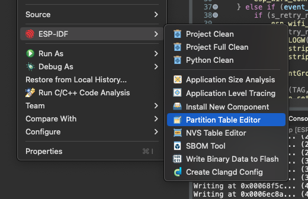


Leave the default values and click `Save and Quit`.


  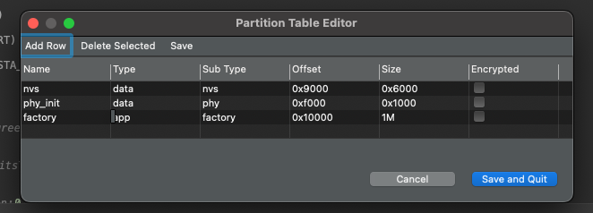


The default `partitions.csv` will be created with the following structure:

```text
# ESP-IDF Partition Table
# Name,   Type, SubType, Offset,  Size,   Flags
nvs,      data, nvs,     0x9000,  0x6000,
phy_init, data, phy,     0xf000,  0x1000,
factory,  app,  factory, 0x10000, 1M,
```

You can change later the partitions according to your needs.

2. **Create the NVS data file**

For the NVS editor, you will need to open the editor by the `ESP-IDF` -> `NVS Table Editor`


  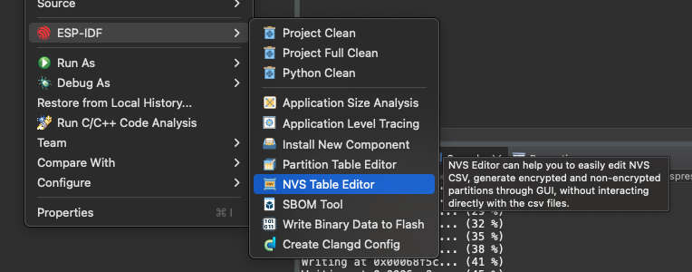


and add the namespace `storage` and the keys `SSID` and `password` then `Save and Quit`.


  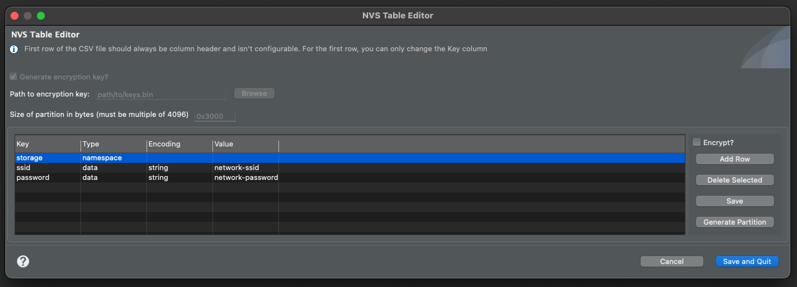


Set the `Size of partition in bytes` to `0x6000`(same value of the `partitions.csv` file) and add the following:

- **storage** type `namespace`,
- **ssid** type `data`, encoding `string` and value `network-ssid`
- **password** type `data`, encoding `string` and value `network-password`

> Please change the SSID and password values according to the workshop network or the network you will connect.

After the NVS table created, the file `nvs.csv`will be added to the project with the content:

```text
key,type,encoding,value
storage,namespace,,
ssid,data,string,"network-ssid"
password,data,string,"network-password"

```

3. **Include the NVS code**

After the NVS initialization, the partition can be opened

```c
    ESP_LOGI(TAG, "Opening Non-Volatile Storage (NVS) handle");
    nvs_handle_t my_handle;
    ret = nvs_open_from_partition("nvs", "storage", NVS_READWRITE, &my_handle);
    if (ret != ESP_OK) {
        ESP_LOGE(TAG, "Error (%s) opening NVS handle!\n", esp_err_to_name(ret));
        return;
    }
    ESP_LOGI(TAG, "The NVS handle successfully opened");
```

and the values from the NVS can be read

```c

char ssid[32];
char password[64];

esp_err_t get_wifi_credentials(void){
	
	esp_err_t err;
	
	ESP_LOGI(TAG, "Opening Non-Volatile Storage (NVS) handle");
    nvs_handle_t nvs_mem_handle;
    err = nvs_open_from_partition("nvs", "storage", NVS_READWRITE, &nvs_mem_handle);
    if (err != ESP_OK) {
		led_strip_set_pixel(led_strip, 0, 25, 0, 0);
    	led_strip_refresh(led_strip);
        ESP_LOGE(TAG, "Error (%s) opening NVS handle!\n", esp_err_to_name(err));
        return err;
    }
    ESP_LOGI(TAG, "The NVS handle successfully opened");
	
	size_t ssid_len = sizeof(ssid);
	size_t pass_len = sizeof(password);
	
    err = nvs_get_str(nvs_mem_handle, "ssid", ssid, &ssid_len);
    ESP_ERROR_CHECK(err);

    err = nvs_get_str(nvs_mem_handle, "password", password, &pass_len);
    ESP_ERROR_CHECK(err);

    nvs_close(nvs_mem_handle);
    return ESP_OK;	
}
```

Now you need to change the WiFi config to get the NVS values:

```c
    wifi_config_t wifi_config = {
        .sta = {
            .ssid = "",
            .password = "",
            .threshold.authmode = WIFI_AUTH_WPA2_WPA3_PSK,
            .sae_pwe_h2e = WPA3_SAE_PWE_BOTH,
            .sae_h2e_identifier = "",
        },
    };
    
    strncpy((char*)wifi_config.sta.ssid, ssid, sizeof(wifi_config.sta.ssid));
    strncpy((char*)wifi_config.sta.password, password, sizeof(wifi_config.sta.password));
```

Call the `get_wifi_credentials` before `wifi_init_sta` in the `app_main` function:

```c
ESP_ERROR_CHECK(get_wifi_credentials());
```

4. **Change the build to include the NVS**

Now you will need to change the file `main/CMakeLists.txt` to add the `nvs_create_partition_image`.

```c
idf_component_register(
    SRCS main.c         # list the source files of this component
    INCLUDE_DIRS        # optional, add here public include directories
    PRIV_INCLUDE_DIRS   # optional, add here private include directories
    REQUIRES            # optional, list the public requirements (component names)
    PRIV_REQUIRES       # optional, list the private requirements
)
nvs_create_partition_image(nvs ../nvs.csv FLASH_IN_PROJECT)
```

5. **Change the default configuration file to change the SDKConfig**

If you do not hame the file `sdkconfig.defaults`create one in the same level of the `sdkconfig` file and add the following configuration:

```c
CONFIG_PARTITION_TABLE_CUSTOM=y
CONFIG_PARTITION_TABLE_CUSTOM_FILENAME="partitions.csv"
CONFIG_PARTITION_TABLE_FILENAME="partitions.csv"
```

This will trigger the binary creation with the predefined values from the `nvs.csv` file.

Now you can handle and change the **SSID** and **password** as you prefer directly from the NVS.

#### Assignment Code

```c
#include <stdio.h>
#include "bsp/esp-bsp.h"
#include "led_indicator_blink_default.h"
#include "freertos/FreeRTOS.h"
#include "freertos/task.h"
#include "freertos/event_groups.h"
#include "esp_system.h"
#include "esp_wifi.h"
#include "esp_event.h"
#include "esp_log.h"
#include "nvs.h"
#include "nvs_flash.h"
#include "lwip/err.h"
#include "lwip/sys.h"

#define WIFI_CONNECTED_BIT BIT0
#define WIFI_FAIL_BIT      BIT1

char ssid[32];
char password[64];

static led_indicator_handle_t leds[BSP_LED_NUM];

static EventGroupHandle_t s_wifi_event_group;
static int s_retry_num = 0;

static const char *TAG = "workshop";

static void event_handler(void* arg, esp_event_base_t event_base,
                                int32_t event_id, void* event_data)
{
    if (event_base == WIFI_EVENT && event_id == WIFI_EVENT_STA_START) {
        esp_wifi_connect();
    } else if (event_base == WIFI_EVENT && event_id == WIFI_EVENT_STA_DISCONNECTED) {
        if (s_retry_num < 30) {
            esp_wifi_connect();
            s_retry_num++;
            ESP_LOGW(TAG, "Trying to connect to WiFi");
			led_indicator_set_rgb(leds[0], SET_IRGB(0, 0x0, 0x0, 0x20));
        } else {
            xEventGroupSetBits(s_wifi_event_group, WIFI_FAIL_BIT);
        }
        ESP_LOGE(TAG, "Failed to connect to WiFi");
		led_indicator_set_rgb(leds[0], SET_IRGB(0, 0x20, 0x0, 0x0));
    } else if (event_base == IP_EVENT && event_id == IP_EVENT_STA_GOT_IP) {
        ip_event_got_ip_t* event = (ip_event_got_ip_t*) event_data;
        ESP_LOGI(TAG, "got ip:" IPSTR, IP2STR(&event->ip_info.ip));
		led_indicator_set_rgb(leds[0], SET_IRGB(0, 0x0, 0x20, 0x0));
        s_retry_num = 0;
        xEventGroupSetBits(s_wifi_event_group, WIFI_CONNECTED_BIT);
    }
}

void wifi_init_sta(void)
{
    s_wifi_event_group = xEventGroupCreate();

    ESP_ERROR_CHECK(esp_netif_init());
    ESP_ERROR_CHECK(esp_event_loop_create_default());
    esp_netif_create_default_wifi_sta();

    wifi_init_config_t cfg = WIFI_INIT_CONFIG_DEFAULT();
    ESP_ERROR_CHECK(esp_wifi_init(&cfg));

    esp_event_handler_instance_t instance_any_id;
    esp_event_handler_instance_t instance_got_ip;
    ESP_ERROR_CHECK(esp_event_handler_instance_register(WIFI_EVENT,
            ESP_EVENT_ANY_ID,
            &event_handler,
            NULL,
            &instance_any_id));
    ESP_ERROR_CHECK(esp_event_handler_instance_register(IP_EVENT,
            IP_EVENT_STA_GOT_IP,
            &event_handler,
            NULL,
            &instance_got_ip));

	wifi_config_t wifi_config = {
        .sta = {
            .ssid = "",
            .password = "",
            .threshold.authmode = WIFI_AUTH_WPA2_WPA3_PSK,
            .sae_pwe_h2e = WPA3_SAE_PWE_BOTH,
            .sae_h2e_identifier = "",
        },
    };
    
    strncpy((char*)wifi_config.sta.ssid, ssid, sizeof(wifi_config.sta.ssid));
    strncpy((char*)wifi_config.sta.password, password, sizeof(wifi_config.sta.password));

    ESP_ERROR_CHECK(esp_wifi_set_mode(WIFI_MODE_STA) );
    ESP_ERROR_CHECK(esp_wifi_set_config(WIFI_IF_STA, &wifi_config) );
    ESP_ERROR_CHECK(esp_wifi_start() );

    EventBits_t bits = xEventGroupWaitBits(s_wifi_event_group,
            WIFI_CONNECTED_BIT | WIFI_FAIL_BIT,
            pdFALSE,
            pdFALSE,
            portMAX_DELAY);

    if (bits & WIFI_CONNECTED_BIT) {
        ESP_LOGI(TAG, "Connected!");
    } else if (bits & WIFI_FAIL_BIT) {
        ESP_LOGE(TAG, "Failed to connect!");
    }
}

esp_err_t get_wifi_credentials(void){
	
	esp_err_t err;
	
	ESP_LOGI(TAG, "Opening Non-Volatile Storage (NVS) handle");
    nvs_handle_t nvs_mem_handle;
    err = nvs_open_from_partition("nvs", "storage", NVS_READWRITE, &nvs_mem_handle);
    if (err != ESP_OK) {
        ESP_LOGE(TAG, "Error (%s) opening NVS handle!\n", esp_err_to_name(err));
        return err;
    }
    
    ESP_LOGI(TAG, "The NVS handle successfully opened");
	
	size_t ssid_len = sizeof(ssid);
	size_t pass_len = sizeof(password);
	
    err = nvs_get_str(nvs_mem_handle, "ssid", ssid, &ssid_len);
    ESP_ERROR_CHECK(err);

    err = nvs_get_str(nvs_mem_handle, "password", password, &pass_len);
    ESP_ERROR_CHECK(err);

    nvs_close(nvs_mem_handle);
    return ESP_OK;	
}

void app_main(void)
{

    esp_err_t ret = nvs_flash_init();
    if (ret == ESP_ERR_NVS_NO_FREE_PAGES || ret == ESP_ERR_NVS_NEW_VERSION_FOUND) {
      ESP_ERROR_CHECK(nvs_flash_erase());
      ret = nvs_flash_init();
    }
    ESP_ERROR_CHECK(ret);

    ESP_ERROR_CHECK(bsp_led_indicator_create(leds, NULL, BSP_LED_NUM));
    led_indicator_set_rgb(leds[0], SET_IRGB(0, 0x0, 0x0, 0x20));

	ESP_ERROR_CHECK(get_wifi_credentials());

    wifi_init_sta();
}
```

## Assignment 5: WiFi provisioning (EXTRA)

WiFi provisioning is a crucial step in the setup of any IoT device. It involves configuring the device with the necessary credentials (like SSID and password) to connect to a WiFi network. This process is typically performed once during the initial setup of the device, but it may also be repeated whenever the device needs to connect to a new network.

There are several methods for WiFi provisioning. Some devices use a physical interface, like buttons or switches, to enter provisioning mode. Others use a web-based interface or a mobile app to guide the user through the process. In some cases, devices may also support automatic provisioning through technologies like Bluetooth Low Energy (BLE).

Espressif offers solutions for provisioning. You will find this process being used in some projects like [ESP RainMaker](https://rainmaker.espressif.com/).

### Hands-on WiFi provisioning

From the NVS assignment, you can see how to set and get the WiFi credentials from the flash memory. This feature is useful but still you will need to set the values somehow.

On this assignment we will show you how to use the mobile phone (Android or iOS) to set the WiFi credentials via BLE.

1. **Install the mobile application**

Install the provisioning application on your smartphone.

- Android: [ESP BLE Provisioning](https://play.google.com/store/apps/details?id=com.espressif.provble&pcampaignid=web_share)
- iOS [ESP BLE Provisioning](https://apps.apple.com/us/app/esp-ble-provisioning/id1473590141)

2. **Create a new project from the examples**

Create a new ESP-IDF project using the example `provisioning` -> `wifi_prov_mgr`.

For existing projects, you can use the component [espressif/network_provisioning](https://components.espressif.com/components/espressif/network_provisioning).

```bash
idf.py add-dependency "espressif/network_provisioning^0.2.0"
```

3. **Build, flash, and monitor**

Now you can build and flash (run) the example to your device.

> You might need to full clean your project before building if you have added the files and the component manually.

After building your application, open the `ESP-IDF Serial Monitor`.

4. **Provisioning**

In the provisioning application, follow the steps to **Provision New Device** using BLE.


  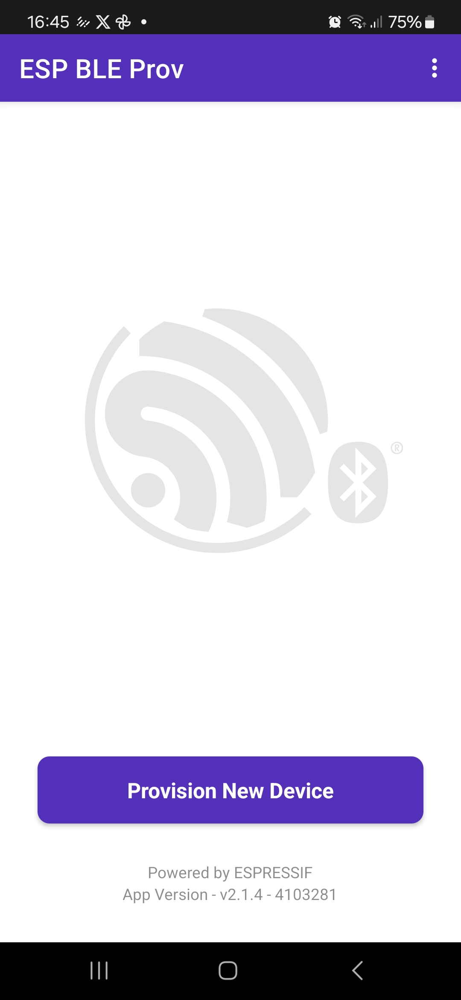
  
  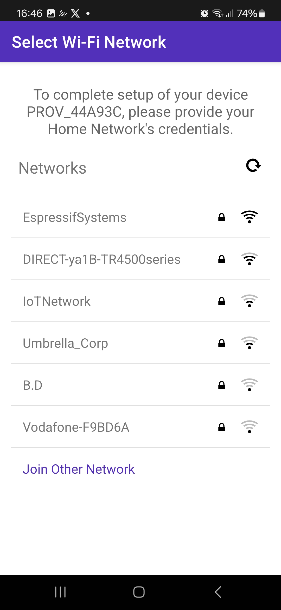
  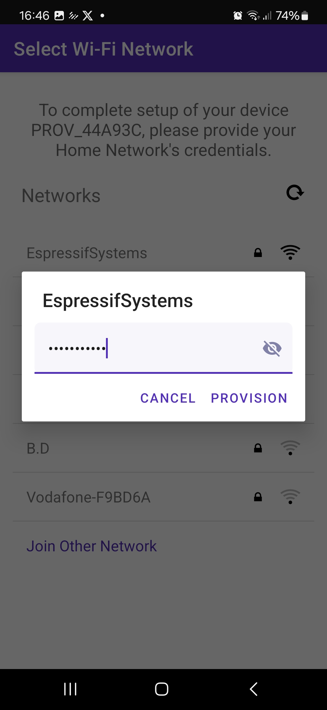
  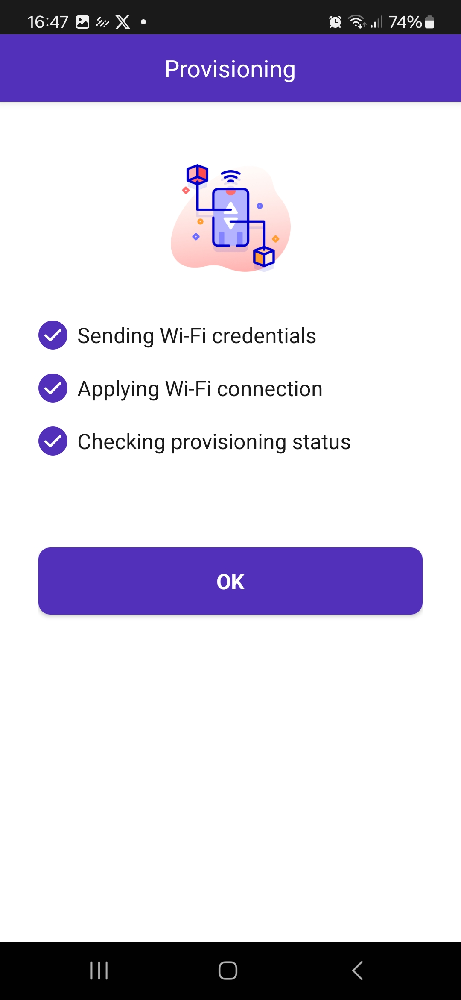


You will need to scan the QRCode or to use the **I don't have a QR code** option. Please make sure you are provisioning your device.

After completing the provisioning process, the device will connect to the selected network.

## Assignment 6: Protocols (EXTRA)

Currently, the ESP-IDF supports a variety of protocols including but not limited to.

- HTTP and HTTPS
- ICMP
- CoAP
- MQTT and MQTT5
- PPP (Point-to-Point Protocol) including PPPoS
- Sockets
- Modbus
- SMTP
- SNTP

You can explore the protocols directly on [ESP-IDF examples](https://github.com/espressif/esp-idf/tree/master/examples), [esp-protocols](https://github.com/espressif/esp-protocols) or on the [ESP Registry](https://components.espressif.com) (Component Manager).

### Hands-on protocols

On this hands-on, we will show how to use the x509 certificate bundle and make your development easier when dealing with some protocols that requires certificate for the secure connection, including HTTPS.

The [ESP x509 Certificate Bundle API](https://docs.espressif.com/projects/esp-idf/en/release-v5.3/esp32/api-reference/protocols/esp_crt_bundle.html?highlight=bundle#esp-x509-certificate-bundle) provide a collection of certificates for TLS server verification, automatically generated from the from [Mozilla's NSS root certificate store](https://wiki.mozilla.org/CA/Included_Certificates). This bundle contains more than 130 certificates and it's constantly updated.

By using the certificate bundle to make a secure a HTTPS connection using TLS (ESP-TLS), you do not need to load the root certificate manually or to update in case of expired certificates.

1. **Open the WiFi connection assignment project**

For this assignment we will continue editing the WiFi project. Open the project and make sure the project is building and the WiFi connection is working.

> This assignment will require Internet connection.

2. **Edit the SDK configuration**

Go to the SDK configuration and check the certificate bundle settings.

`Component config` -> `mbedTLS` -> `Certificate Bundle`

- Check `Enable trusted root certificate bundle`
- Select `Use the full default certificate bundle` on the `Default certificate bundle options`

3. **Code for TLS connection**

Add the includes:

```c
#include "lwip/err.h"
#include "lwip/sockets.h"
#include "lwip/sys.h"
#include "lwip/netdb.h"
#include "lwip/dns.h"
#include "esp_tls.h"
#include "esp_crt_bundle.h"
```

Defines and the URL list that we will try to connect using the bundle:

```c
#define MAX_URLS    4

static const char *web_urls[MAX_URLS] = {
    "https://www.github.com",
    "https://espressif.com",
    "https://youtube.com",
    "https://acesso.gov.br",
};
```

You can modify this list to include your URLs to test the connection.

4. **Create a task to try to connect to the given URLs**

This task will try to connect on each URL.

```c
static void event_handler(void* arg, esp_event_base_t event_base,
                                int32_t event_id, void* event_data)
{
    if (event_base == WIFI_EVENT && event_id == WIFI_EVENT_STA_START) {
        esp_wifi_connect();
    } else if (event_base == WIFI_EVENT && event_id == WIFI_EVENT_STA_DISCONNECTED) {
        if (s_retry_num < 100) {
            esp_wifi_connect();
            s_retry_num++;
            ESP_LOGW(TAG, "Trying to connect to WiFi");
			led_indicator_set_rgb(leds[0], SET_IRGB(0, 0x0, 0x0, 0x20));
        } else {
            xEventGroupSetBits(s_wifi_event_group, WIFI_FAIL_BIT);
        }
        ESP_LOGE(TAG, "Failed to connect to WiFi");
		led_indicator_set_rgb(leds[0], SET_IRGB(0, 0x20, 0x0, 0x0));
    } else if (event_base == IP_EVENT && event_id == IP_EVENT_STA_GOT_IP) {
        ip_event_got_ip_t* event = (ip_event_got_ip_t*) event_data;
        ESP_LOGI(TAG, "got ip:" IPSTR, IP2STR(&event->ip_info.ip));
		led_indicator_set_rgb(leds[0], SET_IRGB(0, 0x0, 0x20, 0x0));
        s_retry_num = 0;
        xEventGroupSetBits(s_wifi_event_group, WIFI_CONNECTED_BIT);
    }
}
```

Create the task after the `wifi_init_sta`:

```c
xTaskCreate(&https_get_task, "https_get_task", 8192, NULL, 5, NULL);
```

#### Assignment Code

```c
#include <stdio.h>
#include "bsp/esp-bsp.h"
#include "led_indicator_blink_default.h"
#include "freertos/FreeRTOS.h"
#include "freertos/task.h"
#include "freertos/event_groups.h"
#include "esp_system.h"
#include "esp_wifi.h"
#include "esp_event.h"
#include "esp_log.h"
#include "nvs.h"
#include "nvs_flash.h"
#include "lwip/err.h"
#include "lwip/sys.h"

#include "lwip/err.h"
#include "lwip/sockets.h"
#include "lwip/sys.h"
#include "lwip/netdb.h"
#include "lwip/dns.h"

#include "esp_tls.h"
#include "esp_crt_bundle.h"

#define WIFI_CONNECTED_BIT BIT0
#define WIFI_FAIL_BIT      BIT1

#define MAX_URLS    4

static const char *web_urls[MAX_URLS] = {
    "https://www.github.com",
    "https://espressif.com",
    "https://youtube.com",
    "https://acesso.gov.br",
};

char ssid[32];
char password[64];

static led_indicator_handle_t leds[BSP_LED_NUM];

static EventGroupHandle_t s_wifi_event_group;
static int s_retry_num = 0;

static const char *TAG = "workshop";

static void event_handler(void* arg, esp_event_base_t event_base,
                                int32_t event_id, void* event_data)
{
    if (event_base == WIFI_EVENT && event_id == WIFI_EVENT_STA_START) {
        esp_wifi_connect();
    } else if (event_base == WIFI_EVENT && event_id == WIFI_EVENT_STA_DISCONNECTED) {
        if (s_retry_num < 100) {
            esp_wifi_connect();
            s_retry_num++;
            ESP_LOGW(TAG, "Trying to connect to WiFi");
			led_indicator_set_rgb(leds[0], SET_IRGB(0, 0x0, 0x0, 0x20));
        } else {
            xEventGroupSetBits(s_wifi_event_group, WIFI_FAIL_BIT);
        }
        ESP_LOGE(TAG, "Failed to connect to WiFi");
		led_indicator_set_rgb(leds[0], SET_IRGB(0, 0x20, 0x0, 0x0));
    } else if (event_base == IP_EVENT && event_id == IP_EVENT_STA_GOT_IP) {
        ip_event_got_ip_t* event = (ip_event_got_ip_t*) event_data;
        ESP_LOGI(TAG, "got ip:" IPSTR, IP2STR(&event->ip_info.ip));
		led_indicator_set_rgb(leds[0], SET_IRGB(0, 0x0, 0x20, 0x0));
        s_retry_num = 0;
        xEventGroupSetBits(s_wifi_event_group, WIFI_CONNECTED_BIT);
    }
}

void wifi_init_sta(void)
{
    s_wifi_event_group = xEventGroupCreate();

    ESP_ERROR_CHECK(esp_netif_init());
    ESP_ERROR_CHECK(esp_event_loop_create_default());
    esp_netif_create_default_wifi_sta();

    wifi_init_config_t cfg = WIFI_INIT_CONFIG_DEFAULT();
    ESP_ERROR_CHECK(esp_wifi_init(&cfg));

    esp_event_handler_instance_t instance_any_id;
    esp_event_handler_instance_t instance_got_ip;
    ESP_ERROR_CHECK(esp_event_handler_instance_register(WIFI_EVENT,
            ESP_EVENT_ANY_ID,
            &event_handler,
            NULL,
            &instance_any_id));
    ESP_ERROR_CHECK(esp_event_handler_instance_register(IP_EVENT,
            IP_EVENT_STA_GOT_IP,
            &event_handler,
            NULL,
            &instance_got_ip));

	wifi_config_t wifi_config = {
        .sta = {
            .ssid = "",
            .password = "",
            .threshold.authmode = WIFI_AUTH_WPA2_WPA3_PSK,
            .sae_pwe_h2e = WPA3_SAE_PWE_BOTH,
            .sae_h2e_identifier = "",
        },
    };
    
    strncpy((char*)wifi_config.sta.ssid, ssid, sizeof(wifi_config.sta.ssid));
    strncpy((char*)wifi_config.sta.password, password, sizeof(wifi_config.sta.password));

    ESP_ERROR_CHECK(esp_wifi_set_mode(WIFI_MODE_STA) );
    ESP_ERROR_CHECK(esp_wifi_set_config(WIFI_IF_STA, &wifi_config) );
    ESP_ERROR_CHECK(esp_wifi_start() );

    EventBits_t bits = xEventGroupWaitBits(s_wifi_event_group,
            WIFI_CONNECTED_BIT | WIFI_FAIL_BIT,
            pdFALSE,
            pdFALSE,
            portMAX_DELAY);

    if (bits & WIFI_CONNECTED_BIT) {
        ESP_LOGI(TAG, "Connected!");
    } else if (bits & WIFI_FAIL_BIT) {
        ESP_LOGE(TAG, "Failed to connect!");
    }
}

esp_err_t get_wifi_credentials(void){
	
	esp_err_t err;
	
	ESP_LOGI(TAG, "Opening Non-Volatile Storage (NVS) handle");
    nvs_handle_t nvs_mem_handle;
    err = nvs_open_from_partition("nvs", "storage", NVS_READWRITE, &nvs_mem_handle);
    if (err != ESP_OK) {
        ESP_LOGE(TAG, "Error (%s) opening NVS handle!\n", esp_err_to_name(err));
        return err;
    }
    
    ESP_LOGI(TAG, "The NVS handle successfully opened");
	
	size_t ssid_len = sizeof(ssid);
	size_t pass_len = sizeof(password);
	
    err = nvs_get_str(nvs_mem_handle, "ssid", ssid, &ssid_len);
    ESP_ERROR_CHECK(err);

    err = nvs_get_str(nvs_mem_handle, "password", password, &pass_len);
    ESP_ERROR_CHECK(err);

    nvs_close(nvs_mem_handle);
    return ESP_OK;	
}

static void https_get_task(void *pvParameters)
{
    while (1) {
        int conn_count = 0;
        ESP_LOGI(TAG, "Connecting to %d URLs", MAX_URLS);

        for (int i = 0; i < MAX_URLS; i++) {
            esp_tls_cfg_t cfg = {
                .crt_bundle_attach = esp_crt_bundle_attach,
            };

            esp_tls_t *tls = esp_tls_init();
            if (!tls) {
                ESP_LOGE(TAG, "Failed to allocate esp_tls handle!");
                goto end;
            }

            if (esp_tls_conn_http_new_sync(web_urls[i], &cfg, tls) == 1) {
                ESP_LOGI(TAG, "Connection established to %s", web_urls[i]);
                conn_count++;
            } else {
                ESP_LOGE(TAG, "Could not connect to %s", web_urls[i]);
            }

            esp_tls_conn_destroy(tls);
end:
            vTaskDelay(1000 / portTICK_PERIOD_MS);
        }

        ESP_LOGI(TAG, "Completed %d connections", conn_count);
        ESP_LOGI(TAG, "Starting over again...");
    }
}

void app_main(void)
{

    esp_err_t ret = nvs_flash_init();
    if (ret == ESP_ERR_NVS_NO_FREE_PAGES || ret == ESP_ERR_NVS_NEW_VERSION_FOUND) {
      ESP_ERROR_CHECK(nvs_flash_erase());
      ret = nvs_flash_init();
    }
    ESP_ERROR_CHECK(ret);

    ESP_ERROR_CHECK(bsp_led_indicator_create(leds, NULL, BSP_LED_NUM));
    led_indicator_set_rgb(leds[0], SET_IRGB(0, 0x0, 0x0, 0x20));

	ESP_ERROR_CHECK(get_wifi_credentials());

    wifi_init_sta();
    
    xTaskCreate(&https_get_task, "https_get_task", 8192, NULL, 5, NULL);
}
```

## Assignment 7: Using the ULP

---

The ESP32-C6 has 2 cores, the high-power (HP) core and the low-power (LP) core.

Usually called **Ultra-Low-Power (ULP)**, this second core, is designed to handle simple tasks while the HP-core is in sleep mode, significantly reducing power consumption. This feature is particularly advantageous for battery-powered IoT devices where energy efficiency is critical.

The LP-core can operate independently of the main HP-core, performing tasks such as sensor data acquisition and processing, and controlling GPIOs with minimal power consumption. For the complete API reference, please go to the [ULP LP-Core Coprocessor Programming](https://docs.espressif.com/projects/esp-idf/en/latest/esp32c6/api-reference/system/ulp-lp-core.html#) guide.

### The LP-core

- 32-bit RISC-V core @20MHz
- 16KB LP SRAM
- RISC-V IMAC instruction set
- Act as a co-processor
- Access to peripherals, including
  - GPIO
  - UART
  - I2C

You can watch the talk form the DevCon23, [Low-Power Features of ESP32-C6: Target Wake Time + LP Core](https://www.youtube.com/watch?v=FpTwQlGtV0k), witch cover the LP features and the TWT. Please save to watch later as a complementary material.



#### ULP pinout

Note that the ULP uses a specific set of pins. Please use the [board pin layout](#board-pin-layout) to know the pins you can use for the ULP.

### Hands-on LP core

---

For this hands-on, we will walkthrough the ULP programming to create a blink program to run on the HP and on the LP core to compare the power consumption on a similar task.


**This hands-on requires the ESP-IDF v5.4 (master branch) and some additional hardware (LED and button)**


1. **Create the `main/ulp` folder and `main.c` file**

```c
#include <stdint.h>
#include <stdbool.h>
#include "ulp_lp_core.h"
#include "ulp_lp_core_utils.h"
#include "ulp_lp_core_gpio.h"
#include "ulp_lp_core_interrupts.h"

#define WAKEUP_PIN LP_IO_NUM_0
#define RED_PIN    LP_IO_NUM_4
#define GREEN_PIN  LP_IO_NUM_5

static uint32_t wakeup_count;
uint32_t start_toggle;

void LP_CORE_ISR_ATTR ulp_lp_core_lp_io_intr_handler(void)
{
    ulp_lp_core_gpio_clear_intr_status();
    wakeup_count++;
}

int main (void)
{
    /* Register interrupt for the wakeup pin */
    ulp_lp_core_intr_enable();
    ulp_lp_core_gpio_intr_enable(WAKEUP_PIN, LP_IO_INTR_POSEDGE);

    int level = 0;
    while (1) {
        /* Toggle the Red LED GPIO */
        ulp_lp_core_gpio_set_level(GREEN_PIN, 0);
        ulp_lp_core_gpio_set_level(RED_PIN, level);
        level = level ? 0 : 1;
        ulp_lp_core_delay_us(1000000);

        /* Wakeup the main processor after 4 toggles of the button */
        if (wakeup_count >= 4) {
            ulp_lp_core_gpio_set_level(RED_PIN, 0);
            ulp_lp_core_wakeup_main_processor();
            wakeup_count = 0;
        }
    }
    /* ulp_lp_core_halt() is called automatically when main exits */
    return 0;
}
```

On this code, the interrupt for the push button (wakeup) will be enabled on the LP-core by the function `ulp_lp_core_intr_enable` and the GPIO0 will be set as the input pin, triggered by the positive edge (when the state goes from low to high) and attached to the interrupt by the function `ulp_lp_core_gpio_intr_enable`. The wake up counter will be handled by the interrupt handler `ulp_lp_core_lp_io_intr_handler`.

Now the loop for the blink and the wakeup counter check will start. The GPIO level is set by the function `ulp_lp_core_gpio_set_level`. If the number of pushes is 4 or higher, the HP-core will wake up by the function `ulp_lp_core_wakeup_main_processor`.

2. **Change the `CMakeLists.txt`**

You need to set the ULP application name, source files, etc.

```text
# Set usual component variables
set(app_sources "main.c")

idf_component_register(SRCS ${app_sources}
                       REQUIRES ulp
                       WHOLE_ARCHIVE)
#
# ULP support additions to component CMakeLists.txt.
#
# 1. The ULP app name must be unique (if multiple components use ULP).
set(ulp_app_name ulp_${COMPONENT_NAME})
#
# 2. Specify all C and Assembly source files.
#    Files should be placed into a separate directory (in this case, ulp/),
#    which should not be added to COMPONENT_SRCS.
set(ulp_sources "ulp/main.c")
#
# 3. List all the component source files which include automatically
#    generated ULP export file, ${ulp_app_name}.h:
set(ulp_exp_dep_srcs ${app_sources})
#
# 4. Call function to build ULP binary and embed in project using the argument
#    values above.
ulp_embed_binary(${ulp_app_name} "${ulp_sources}" "${ulp_exp_dep_srcs}")

```

3. **Change the `main.c` for the HP-core**

```c
#include <stdio.h>
#include "esp_sleep.h"
#include "driver/gpio.h"
#include "driver/rtc_io.h"
#include "ulp_lp_core.h"
#include "ulp_main.h"
#include "freertos/FreeRTOS.h"
#include "freertos/task.h"

extern const uint8_t ulp_main_bin_start[] asm("_binary_ulp_main_bin_start");
extern const uint8_t ulp_main_bin_end[]   asm("_binary_ulp_main_bin_end");

static void init_ulp_program(void);

#define WAKEUP_PIN  GPIO_NUM_0
#define RED_PIN     GPIO_NUM_4
#define GREEN_PIN   GPIO_NUM_5

void app_main(void)
{
    /* If user is using USB-serial-jtag then idf monitor needs some time to
    *  re-connect to the USB port. We wait 1 sec here to allow for it to make the reconnection
    *  before we print anything. Otherwise the chip will go back to sleep again before the user
    *  has time to monitor any output.
    */
    vTaskDelay(pdMS_TO_TICKS(1000));

    /* ULP caused wakeup */
    esp_sleep_wakeup_cause_t cause = esp_sleep_get_wakeup_cause();
    if (cause == ESP_SLEEP_WAKEUP_ULP) {
        printf("ULP woke up the main CPU! \n");
        ulp_lp_core_stop();
    }

    printf("In active mode\n");
    printf("Long press the wake button to put the chip to sleep and run the ULP\n");

    /* Initialize selected GPIOs */
    rtc_gpio_init(WAKEUP_PIN);
    rtc_gpio_set_direction(WAKEUP_PIN, RTC_GPIO_MODE_INPUT_ONLY);
    rtc_gpio_pulldown_dis(WAKEUP_PIN);
    rtc_gpio_pullup_dis(WAKEUP_PIN);

    rtc_gpio_init(RED_PIN);
    rtc_gpio_set_direction(RED_PIN, RTC_GPIO_MODE_OUTPUT_ONLY);
    rtc_gpio_pulldown_dis(RED_PIN);
    rtc_gpio_pullup_dis(RED_PIN);

    rtc_gpio_init(GREEN_PIN);
    rtc_gpio_set_direction(GREEN_PIN, RTC_GPIO_MODE_OUTPUT_ONLY);
    rtc_gpio_pulldown_dis(GREEN_PIN);
    rtc_gpio_pullup_dis(GREEN_PIN);

    int gpio_level = 0;
    int previous_gpio_level = 0;
    int cnt = 0;

    while (1) {
        /* Toggle the Green LED GPIO */
        rtc_gpio_set_level(RED_PIN, 0);
        rtc_gpio_set_level(GREEN_PIN, 1);
        vTaskDelay(pdMS_TO_TICKS(1000));
        rtc_gpio_set_level(GREEN_PIN, 0);
        vTaskDelay(pdMS_TO_TICKS(1000));

        /* Read the wakeup pin continuously */
        gpio_level = rtc_gpio_get_level(WAKEUP_PIN);
        if (gpio_level != previous_gpio_level) {
            previous_gpio_level = gpio_level;
            cnt++;
            if (cnt > 1) {
                rtc_gpio_set_level(GREEN_PIN, 0);
                cnt = 0;
                break;
                /* break and run the LP core code */
            }
        }
    }

    /* Load and run the ULP program */
    init_ulp_program();

    /* Go back to sleep, only the ULP will run */
    printf("Entering in deep sleep\n\n");
    printf("Press the wake button at least 3 or 4 times to wakeup the main CPU again\n");
    vTaskDelay(10);

    ESP_ERROR_CHECK( esp_sleep_enable_ulp_wakeup());

    esp_deep_sleep_start();
}

static void init_ulp_program(void)
{
    esp_err_t err = ulp_lp_core_load_binary(ulp_main_bin_start, (ulp_main_bin_end - ulp_main_bin_start));
    ESP_ERROR_CHECK(err);

    /* Start the program */
    ulp_lp_core_cfg_t cfg = {
        .wakeup_source = ULP_LP_CORE_WAKEUP_SOURCE_HP_CPU,
    };

    err = ulp_lp_core_run(&cfg);
    ESP_ERROR_CHECK(err);
}
```

4. **Enable the ULP on the SDK configuration**

To enable the ULP, we need to set the following configurations on the SDKConfig. You can create the `sdkconfig.defaults` with the following content:

```text
# Enable ULP
CONFIG_ULP_COPROC_ENABLED=y
CONFIG_ULP_COPROC_TYPE_LP_CORE=y
CONFIG_ULP_COPROC_RESERVE_MEM=4096
# Set log level to Warning to produce clean output
CONFIG_BOOTLOADER_LOG_LEVEL_WARN=y
CONFIG_BOOTLOADER_LOG_LEVEL=2
CONFIG_LOG_DEFAULT_LEVEL_WARN=y
CONFIG_LOG_DEFAULT_LEVEL=2
```

5. **Hardware setup**

For this example, you will need 2 LEDs and one push button connected as following:

- Red LED -> **GPIO4**
- Green LED -> **GPIO5**
- Push button (pull-down, active high) -> **GPIO0**

6. **Build, flash and monitor the log output**

For the ULP flashing and monitoring, please use the USB port labeled as **UART**. We recommend to do a **Erase Flash** before flashing this example.

#### Expected results on the ULP assignment

After flashing, the green LED will start blinking every 1 second with the following log output.

```text
In active mode
Long press the wake button to put the chip to sleep and run the ULP
```

Now to enter to the deep sleep and activate the ULP, long-press the push button and then the red LED will start blinking every 1 second with the following log output:

```text
Entering in deep sleep
Press the wake button at least 3 or 4 times to wakeup the main CPU again
```

To go back from the deep sleep, press the push button 4 times.

```text
ULP woke up the main CPU! 
In active mode
Long press the wake button to put the chip to sleep and run the ULP
```

To measure the power consumption, we use the **J5** jumper and a power analysis tool, like the [JouleScope](https://www.joulescope.com/) or the [PPK2](https://www.nordicsemi.com/Products/Development-hardware/Power-Profiler-Kit-2).

**LED blink running on HP-core**

Running on the HP-core, the average power consumption in a 10 seconds window is: **22.32mA**.


  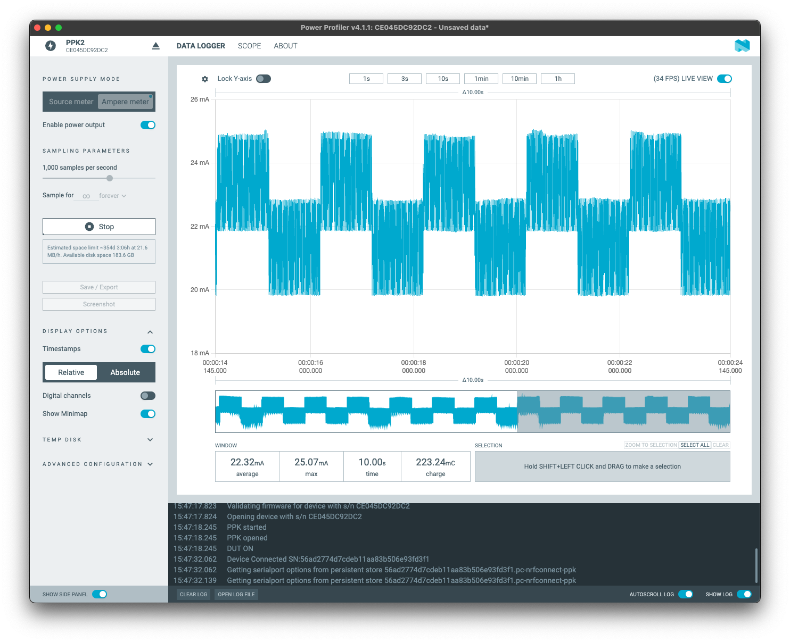


**LED blink running on the LP-core**

Running on the LP-core, the average power consumption in a 10 seconds window is: **2.97mA**.


  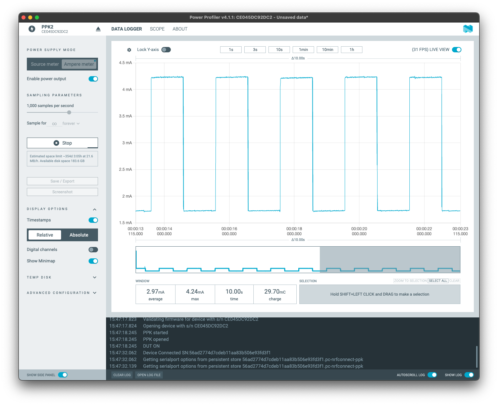


The power reduction when switching from the HP-core to the LP-core is approximately **86.7%** for a similar task.

You can explore more examples for the ULP, including:

- [LP Core simple example with GPIO Polling](https://github.com/espressif/esp-idf/tree/master/examples/system/ulp/lp_core/gpio)
- [LP Core Pulse Counting Example](https://github.com/espressif/esp-idf/tree/master/examples/system/ulp/lp_core/gpio_intr_pulse_counter)
- [LP-Core example with interrupt triggered from HP-Core](https://github.com/espressif/esp-idf/tree/master/examples/system/ulp/lp_core/interrupt)
- [LP I2C Example](https://github.com/espressif/esp-idf/tree/master/examples/system/ulp/lp_core/lp_i2c)
- [LP UART Examples](https://github.com/espressif/esp-idf/tree/master/examples/system/ulp/lp_core/lp_uart)

#### Extra: Power Management

If you are not using the WiFi6, you still can reduce the power consumption in between the beacon packages.

The new power management present on all the WiFi capable SoCs, allows you to reduce the power consumption on the WiFi connection when using the DTIM1. By enabling this feature, the HP core will sleep between the beacon packets.

1. **Create a new project using the power management example**

Create a new project based on the example `wifi/power_save`.

2. **Set the SDK configuration**

Change the `sdkconfig` file to set the WiFi credentials, and the power save mode.

3. **Build, flash, and monitor**

Now build and flash the application.

4. **Results**

You can use the **J5** jumper to measure the power consumption using your favorite power measurement tool.

Here you can see the power consumption on the 3 different modes.

**Power save mode: none**

Average power consumption on this mode: **74.87mA**


  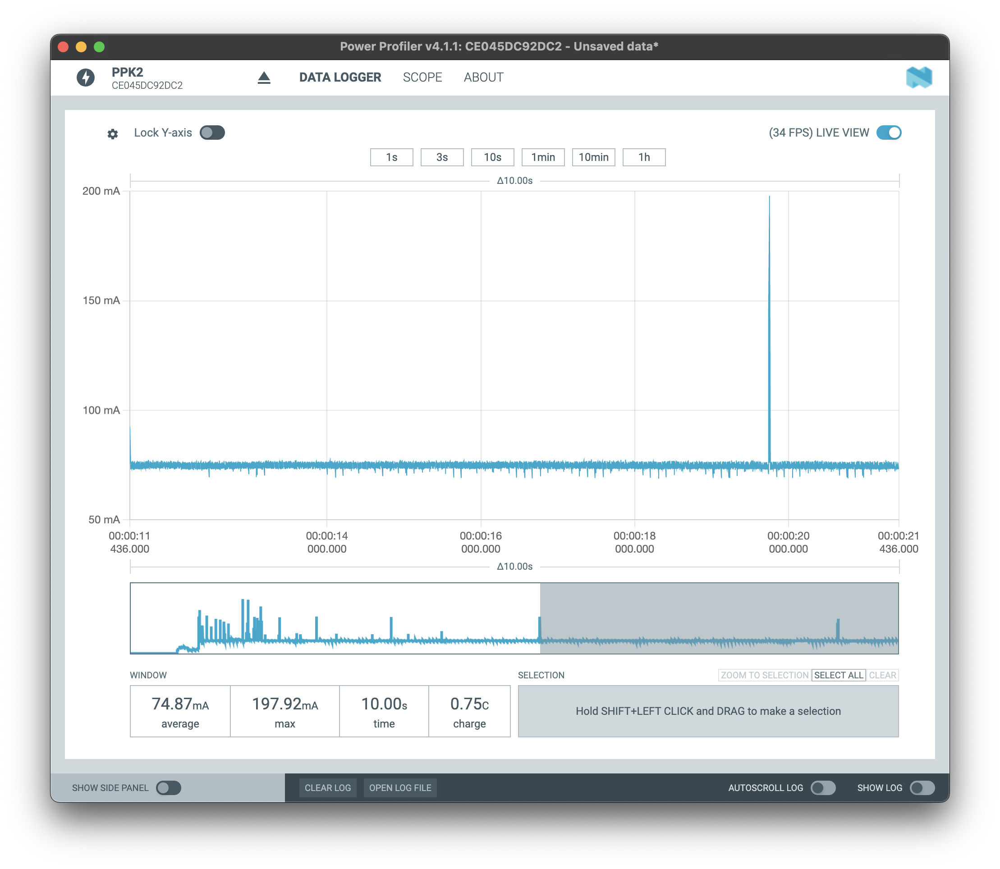


**Power save mode: minimum modem**

Average power consumption on this mode: **23.84mA**


  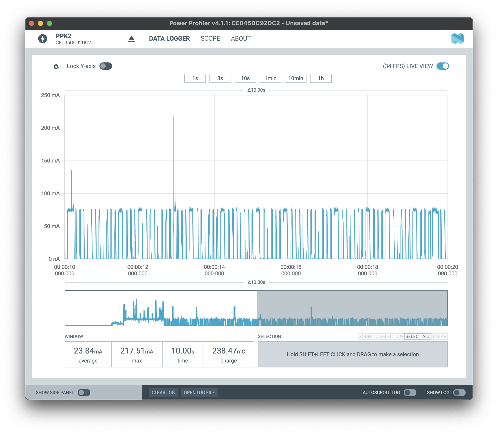


**Power save mode: maximum modem**

Average power consumption on this mode: **13.46mA**


  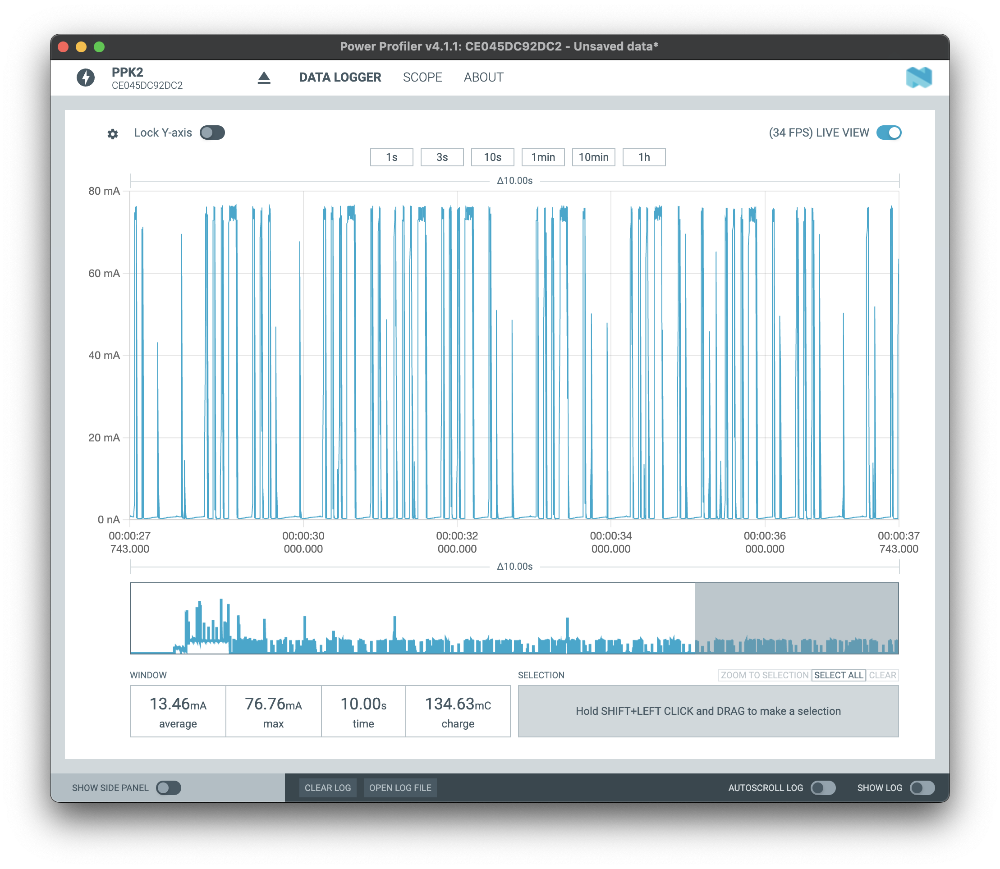


This power save option can be used to reduce the power consumption on battery operated devices, when the WiFi6 TWT is not an option. You can use this feature on any ESP32 with WiFi capability.

## Conclusion

---

Throughout this workshop, we've explored several key topics and hands-on assignments to deepen our understanding of the Espressif IoT Development Framework (ESP-IDF) and the ESP32-C6 System on Chip (SoC).

We began with an introduction to ESP-IDF, providing a foundation for using this powerful development framework. We then moved on to an introduction to the ESP32-C6, highlighting its capabilities and features.

The practical assignments covered a range of essential skills:

- **Assignment 1**: Installing the Espressif IDE, ensuring we have the necessary tools to start development.
- **Assignment 2**: Creating a new project with Components, teaching us how to structure and manage our projects effectively.
- **Assignment 3**: Connecting to WiFi, a crucial step for many IoT applications.
- **Assignment 4**: Working with the NVS (Non-Volatile Storage), allowing us to manage persistent data.
- **Assignment 5 (EXTRA)**: WiFi provisioning, providing insights into setting up and configuring WiFi networks.
- **Assignment 6 (EXTRA)**: Protocols, where we explored various communication protocols supported by the ESP32-C6, including the implementation of the TSL certificate bundle for secure communications.
- **Assignment 7**: Using the LP core, demonstrating how to utilize the low-power core for efficient energy management.

By participating in this workshop, you’ve gained a comprehensive understanding of the ESP32-C6 SoC and the ESP-IDF, and how they can be leveraged to build efficient and powerful IoT applications. We hope this knowledge serves as a solid foundation for your future projects.

Thank you for your time and engagement in this workshop. We look forward to seeing the innovative solutions you’ll create with the ESP32-C6 SoC and the ESP-IDF.

## Next steps

If you have any feedback for this workshop, please star a new [discussion on GitHub](https://github.com/espressif/developer-portal/discussions).

---
