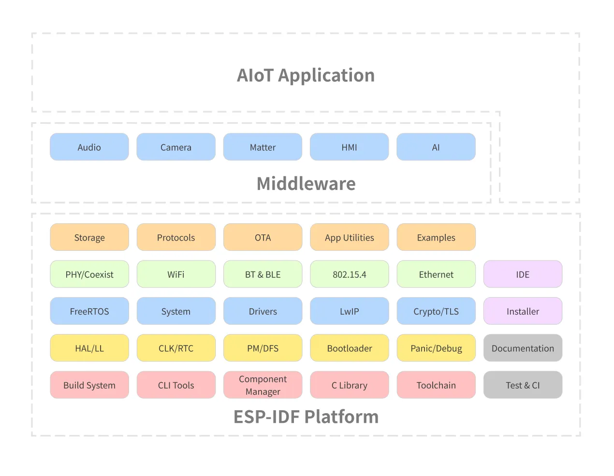
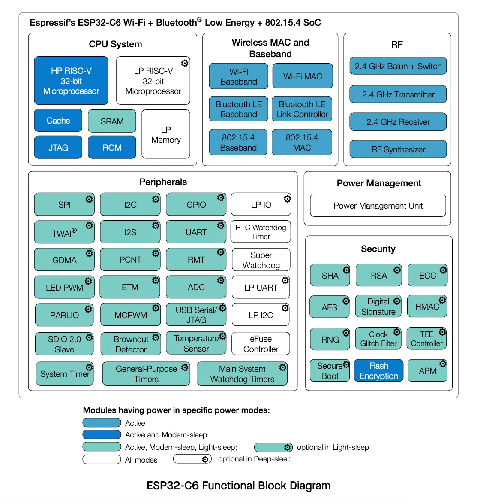
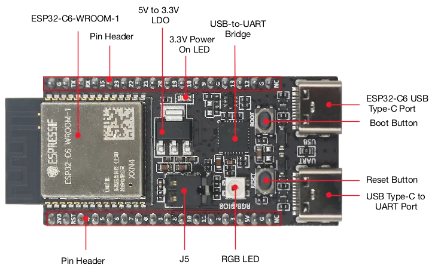
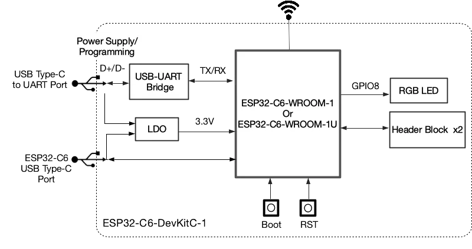
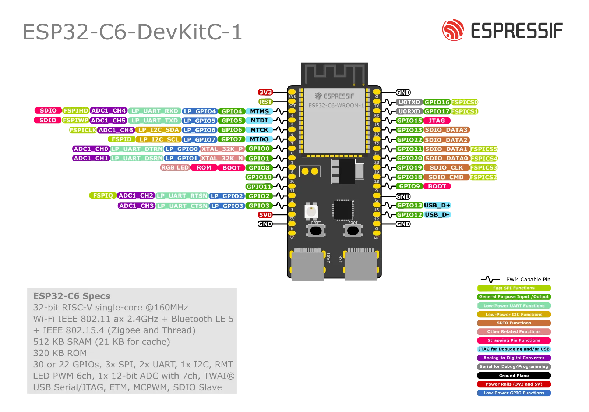

## Lecture: ESP-IDF Introduction

The ESP-IDF (Espressif IoT Development Framework) is the official operating system and development framework for the ESP32 series of microcontrollers by Espressif Systems. It provides a comprehensive environment for building IoT applications with robust networking, security, and reliability features.

ESP-IDF framework includes FreeRTOS that allows developers to create real-time, multitasking applications. With extensive libraries, components, protocols, tools, and documentation, ESP-IDF simplifies the development process enabling seamless integration with hardware peripherals, such as Wi-Fi, Bluetooth, Thread, ZigBee, and cloud services.

ESP-IDF includes almost 400 examples, covering a wide range of use cases and helping developers quickly get started on their projects.

### Architecture

The ESP-IDF platform architecture is mainly divided into 3 layers:

- **ESP-IDF platform**
  - Contains the core components required and all the operating system. Includes the FreeRTOS, drivers, build system, protocols, etc.
- **Middleware**
  - Adds new featured to the ESP-IDF, for example the audio framework and HMI.
- **AIoT Application**
  - This is your application.


  


All the necessary blocks for building your application will be included on the ESP-IDF platform.

### Frameworks

Several other frameworks use ESP-IDF as a base, including:

- **Arduino for ESP32**
- **ESP-ADF** (Audio Development Framework): Designed for audio applications.
- **ESP-WHO** (AI Development Framework): Focused on face detection and recognition.
- **ESP-RainMaker**: Simplifies building connected devices with cloud capabilities.
- **ESP-Matter SDK**: Espressif's SDK for Matter is the official Matter development framework for ESP32 series SoCs.

To see all the supported frameworks, please visit our [GitHub organization page](https://github.com/espressif).

### Current supported versions

Visit the ESP-IDF project on GitHub to get the updated list of supported versions and the maintenance period.



## Introduction to the ESP32-C6

The ESP32-C6 is a Ultra-low-power SoC with RISC-V single-core microprocessor, 2.4 GHz Wi-Fi 6 (802.11ax), Bluetooth® 5 (LE), Zigbee and Thread (802.15.4). It has an optional 4 MB flash in the chip’s package,30 or 22 GPIOs, rich set of peripherals including:


  


- 30 GPIOs (QFN40), or 22 GPIOs (QFN32)
- 5 strapping GPIOs
- 6 GPIOs needed for in-package flash
- **Analog interfaces:**
  - 12-bit SAR ADC, up to 7 channels
  - Temperature sensor
- **Digital interfaces:**
  - Two UARTs
  - Low-power (LP) UART
  - Two SPI ports for communication with flash
  - General purpose SPI port
  - I2C
  - Low-power (LP) I2C
  - I2S
  - Pulse count controller
  - USB Serial/JTAG controller
  - Two TWAI® controllers, compatible with ISO 11898-1 (CAN Specification 2.0)
  - SDIO 2.0 slave controller
  - LED PWM controller, up to 6 channels
  - Motor Control PWM (MCPWM)
  - Remote control peripheral (TX/RX)
  - Parallel IO interface (PARLIO)
  - General DMA controller, with 3 transmit channels and 3 receive channels
  - Event task matrix (ETM)
- **Timers:**
  - 52-bit system timer
  - Two 54-bit general-purpose timers
  - Three digital watchdog timers
  - Analog watchdog timer

For more details, please see the product [ESP32-C6 Datasheet](https://www.espressif.com/sites/default/files/documentation/esp32-c6_datasheet_en.pdf).

### Wi-Fi 6 (IEEE 802.11ax)

Wi-Fi 6, also known as IEEE 802.11ax, represents the latest generation of Wi-Fi technology, designed to improve efficiency, capacity, and performance in various environments. Key features of Wi-Fi 6, as seen in devices like the ESP32-C6, include:

- **20 MHz-only Non-AP Mode**: This mode operates in a non-access point capacity, utilizing a 20 MHz channel width.
- **MCS0 ~ MCS9**: Support for modulation and coding schemes ranging from MCS0 to MCS9, which dictate data rates and signal robustness.
- **Uplink and Downlink OFDMA**: Orthogonal Frequency Division Multiple Access enables efficient simultaneous connections, particularly beneficial in high-density environments such as stadiums or large office buildings.
- **Downlink MU-MIMO**: Multi-user, multiple input, multiple output technology increases network capacity by allowing the transmission of data to multiple devices at the same time.
- **Beamforming**: This feature enhances signal quality by focusing the Wi-Fi signal towards the receiving device.
- **Channel Quality Indication (CQI)**: Provides real-time feedback on the channel conditions, aiding in dynamic adjustments for optimal performance.
- **DCM (Dual Carrier Modulation)**: Enhances link robustness by using dual carriers, reducing the likelihood of signal degradation.
- **Spatial Reuse**: Maximizes parallel transmissions by allowing multiple devices to communicate simultaneously on the same frequency without significant interference.
- **Target Wake Time (TWT)**: Optimizes power-saving mechanisms by scheduling specific times for devices to wake up and communicate, extending battery life, especially for IoT devices.

These advanced features make Wi-Fi 6 a robust and efficient choice for modern wireless communication needs, ensuring better performance, reliability, and energy efficiency.

**Wi-Fi MAC support for the 802.11ax:**

- Target wake time (TWT) requester
- Multiple BSSIDs
- Triggered response scheduling
- Uplink power headroom
- Operating mode
- Buffer status report
- Multi-user Request-to-Send (MU-RTS), Multi-user Block ACK Request (MU-BAR), and Multi-STA Block ACK (M-BA) frame
- Intra-PPDU power saving mechanism
- Two network allocation vectors (NAV)
- BSS coloring
- Spatial reuse
- Uplink power headroom
- Operating mode control
- Buffer status report
- TXOP duration RTS threshold
- UL-OFDMA random access (UORA)

### Resources

- [ESP32-C6 Datasheet](https://www.espressif.com/sites/default/files/documentation/esp32-c6_datasheet_en.pdf)
- [ESP32-C6 Documentation](https://docs.espressif.com/projects/esp-idf/en/release-v5.2/esp32c6/index.html)
- [ESP32-C6-DevKit-C Documentation](https://docs.espressif.com/projects/espressif-esp-dev-kits/en/latest/esp32c6/esp32-c6-devkitc-1/user_guide.html)
- [ESP32-C6-DevKit-C Schematic](https://docs.espressif.com/projects/espressif-esp-dev-kits/en/latest/_static/esp32-c6-devkitc-1/schematics/esp32-c6-devkitc-1-schematics_v1.2.pdf)

## Introduction to the ESP32-C6-DevKit-C

The ESP32-C6-DevKitC-1 is a beginner-friendly development board featuring the ESP32-C6-WROOM-1(U) module, which includes an 8 MB SPI flash. This board offers comprehensive Wi-Fi, Bluetooth LE, Zigbee, and Thread capabilities.

To facilitate easy interfacing, most of the I/O pins are accessible through pin headers on both sides. Developers can connect peripherals using jumper wires or mount the ESP32-C6-DevKitC-1 on a breadboard.

### Features

Here is the development board feature list:

- ESP32-C6-WROOM-1 module
- Pin Header
- 5 V to 3.3 V LDO
- 3.3 V Power On LED
- USB-to-UART Bridge
- ESP32-C6 USB Type-C Port for flashing and debug
- Boot Button
- Reset Button
- USB Type-C to UART Port
- RGB LED connected to the GPIO8
- J5 jumper used for current measurement.

#### Board description


  
  


#### Board pin-layout


  


#### J1 connector

| No. | Name | Type | Function |
|---|---|---|---|
| 1 | 3V3 | P | 3.3 V power supply |
| 2 | RST | I | High: enables the chip; Low: disables the chip. |
| 3 | 4 | I/O/T | MTMS, GPIO4, **LP_GPIO4**, **LP_UART_RXD**, ADC1_CH4, FSPIHD |
| 4 | 5 | I/O/T | MTDI, GPIO5, **LP_GPIO5**, **LP_UART_TXD**, ADC1_CH5, FSPIWP |
| 5 | 6 | I/O/T | MTCK, GPIO6, **LP_GPIO6**, **LP_I2C_SDA**, ADC1_CH6, FSPICLK |
| 6 | 7 | I/O/T | MTDO, GPIO7, **LP_GPIO7**, **LP_I2C_SCL**, FSPID |
| 7 | 0 | I/O/T | GPIO0, XTAL_32K_P, **LP_GPIO0**, **LP_UART_DTRN**, ADC1_CH0 |
| 8 | 1 | I/O/T | GPIO1, XTAL_32K_N, **LP_GPIO1**, **LP_UART_DSRN**, ADC1_CH1 |
| 9 | 8 | I/O/T | GPIO8 |
| 10 | 10 | I/O/T | GPIO10 |
| 11 | 11 | I/O/T | GPIO11 |
| 12 | 2 | I/O/T | GPIO2, **LP_GPIO2**, **LP_UART_RTSN**, ADC1_CH2, FSPIQ |
| 13 | 3 | I/O/T | GPIO3, **LP_GPIO3**, **LP_UART_CTSN**, ADC1_CH3 |
| 14 | 5V | P | 5 V power supply |
| 15 | G | G | Ground |
| 16 | NC | – | No connection |

#### J3 connector

| No. | Name | Type | Function |
|---|---|---|---|
| 1 | G | G | Ground |
| 2 | TX | I/O/T | U0TXD, GPIO16, FSPICS0 |
| 3 | RX | I/O/T | U0RXD, GPIO17, FSPICS1 |
| 4 | 15 | I/O/T | GPIO15 |
| 5 | 23 | I/O/T | GPIO23, SDIO_DATA3 |
| 6 | 22 | I/O/T | GPIO22, SDIO_DATA2 |
| 7 | 21 | I/O/T | GPIO21, SDIO_DATA1, FSPICS5 |
| 8 | 20 | I/O/T | GPIO20, SDIO_DATA0, FSPICS4 |
| 9 | 19 | I/O/T | GPIO19, SDIO_CLK, FSPICS3 |
| 10 | 18 | I/O/T | GPIO18, SDIO_CMD, FSPICS2 |
| 11 | 9 | I/O/T | GPIO9 |
| 12 | G | G | Ground |
| 13 | 13 | I/O/T | GPIO13, USB_D+ |
| 14 | 12 | I/O/T | GPIO12, USB_D- |
| 15 | G | G | Ground |
| 16 | NC | – | No connection |

## Next step

After this introduction, it's time to get started and install the development environment.

[Assignment 1: Install the Espressif-IDE](../assignment-1)
