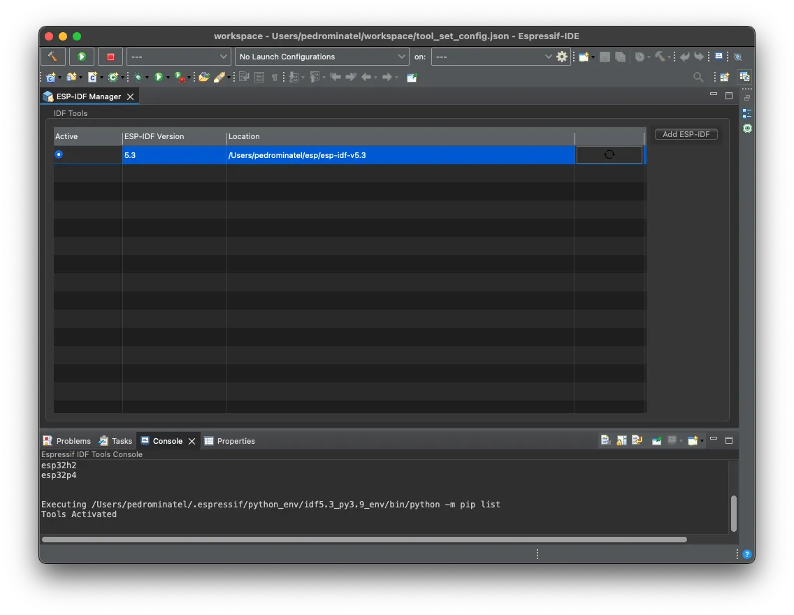
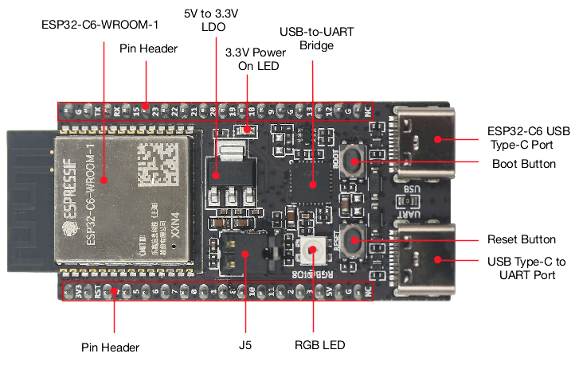

This hands-on series of workshops introduces the Espressif IoT Development Framework (ESP-IDF) through the Integrated Development Environments (IDE). After this workshop, you will be able to use the IDEs to enhance the development performance of your projects.

## Espressif-IDE

We will learn how to install and configure the Espressif-IDE on various operating systems, including Windows, Linux, and macOS. The workshop also covers the hardware prerequisites, such as the ESP32 board with a USB to serial interface and/or debug port, and software prerequisites, including Java, Python, Git, and specific versions of Espressif-IDE and ESP-IDF.

The workshop is estimated to take between 30 to 45 minutes to complete. It is designed to be interactive and engaging, providing participants with practical skills and knowledge that they can apply in their own IoT development projects.

In this part, the Eclipse bundle, **Espressif-IDE**, will be introduced.

### Prerequisites

To follow this workshop, ensure you meet the prerequisites described below.

#### Hardware Prerequisites

- Computer running Windows, Linux, or macOS
- ESP32 board with a USB to serial interface and/or debug port
  - USB CDC/JTAG
- USB cable (data + power) compatible with your development board

#### Software prerequisites

*Required for manual installation*

- [UsbDriverTool](https://visualgdb.com/UsbDriverTool/)
- [Java 17 or above](https://www.oracle.com/technetwork/java/javase/downloads/index.html)
- [Python 3.6 or above](https://www.python.org/downloads/)
- [Git](https://git-scm.com/downloads)
- [Espressif-IDE 3.0.0](https://github.com/espressif/idf-eclipse-plugin/releases/tag/v3.0.0)
- [ESP-IDF v5.2.2](https://github.com/espressif/esp-idf/releases/tag/v5.2.2)

#### Downloads

- [ESP-IDF Offline Installer for Windows](https://dl.espressif.com/dl/esp-idf/) (recommended for Windows users)
- [Espressif-IDE v3.0.0 macOS aarch64](https://dl.espressif.com/dl/idf-eclipse-plugin/ide/Espressif-IDE-macosx-cocoa-aarch64-v3.0.0.dmg)
- [Espressif-IDE v3.0.0 macOS x86-64](https://dl.espressif.com/dl/idf-eclipse-plugin/ide/Espressif-IDE-macosx-cocoa-x86_64-v3.0.0.dmg)
- [Espressif-IDE v3.0.0 Windows](https://dl.espressif.com/dl/idf-eclipse-plugin/ide/Espressif-IDE-3.0.0-win32.win32.x86_64.zip)
- [Espressif-IDE v3.0.0 Linux](https://dl.espressif.com/dl/idf-eclipse-plugin/ide/Espressif-IDE-3.0.0-linux.gtk.x86_64.tar.gz)

#### Extra resources



#### Completion time


**Estimated completion time: 30 to 45 min**


### Installation

Now it's time to install the Espressif-IDE. Please follow the instructions according to your operating system.

#### Windows

For Windows, the recommended method is to install using the [ESP-IDF offline installer](https://dl.espressif.com/dl/esp-idf/). If you already have the ESP-IDF installed on your system and you are currently working with it, you can reuse the installation and proceed directly with the [Espressif-IDE installation](https://dl.espressif.com/dl/idf-eclipse-plugin/ide/Espressif-IDE-3.0.0-win32.win32.x86_64.zip).

Please follow the instructions in the step-by-step guide:

#### Linux and macOS

If your system is Linux or macOS, you can install the Espressif-IDE using the links provided in the [downloads section](#downloads).

Make sure to install all [prerequisites](#software-prerequisites) before continuing with the Espressif-IDE installation.

#### Installing ESP-IDF

To install the ESP-IDF, you can do it in two different ways:

- Manual installation
- ESP-IDF Manager (Espressif-IDE tool)

Depending on your operating system, we recommend installing via the offline installer. If your operating system does not support it, then the installation can be done via the ESP-IDF Manager inside the Espressif-IDE.

The manual installation can also be used as an alternative solution.

For this workshop, we will skip the manual installation, however, you can see how it works in our [Get Started Guide](https://docs.espressif.com/projects/esp-idf/en/release-v5.3/esp32c6/get-started/index.html#manual-installation).

After the installation process is completed, you will be able to open the Espressif-IDE.

The first step is to select your workspace folder. This folder is where all your projects will be stored.


  


Once you have selected it, you can proceed by clicking on the `Launch` button. If everything is running as expected, you will see the welcome screen.


  



#### Installing, upgrading or downgrading ESP-IDF versions

Before creating the first project, we need to install ESP-IDF.

Go to `Espressif` -> `ESP-IDF Manager`


  


Select `Add ESP-IDF` to install the SDK.


  


Now you can select how and where ESP-IDF will be installed or selected from the existing installation.


  


If you are installing a new SDK, you can select the version and the path to which it will be installed.


  


You can install ESP-IDF by selecting the version you want to install or you can use a pre-existing installation.


  


However, if you want to use the existing ESP-IDF, select the path where it is located. Click on `Finish` to start the installation process.


  


The installer will download and install all pre-requisites.


  


After the installation process completes, you will see the installed version in the ESP-IDF Manager list.


  


If you decide to install multiple versions, the list will show all the installed versions. You can select only one version at once.


  


### Creating a new project

To create a new project, go to `File` -> `New` -> `Project`.


  


On the **New Project** screen, select `Espressif` -> `Espressif IDF Project` and click `Finish`.


  


Now we need to set the option `Create a project using one of the templates` and select the **blink** project.


  


Select the target for this project, in this case, the **ESP32-C6**.


  


Click `Finish` to create the project in the selected workspace.

### Building the Project

Building the project is done by clicking the button with a hammer icon, as shown in the next image.


  


By clicking the build button, the build process will start. This operation can take a while depending on your operating system.


  


After the build is complete, you will be able to flash the application to the device.

### Project Configuration

If you need to change any project or ESP-IDF configuration, this can be done by opening the `sdkconfig` file. After opening this file, you will see the SDK configuration interface, as shown in the image.


  


> Please note that if you change anything in this file, the build process will rebuild everything.

#### Creating a new configuration menu

ESP-IDF uses a method to configure the SDK based on the kconfiglib, a Python extension of the [Kconfig](https://docs.kernel.org/kbuild/kconfig-language.html) system, called [esp-idf-kconfig](https://docs.espressif.com/projects/esp-idf/en/release-v5.2/esp32c6/api-reference/kconfig.html?highlight=kconfig).

#### ESP-IDF configuration

This is one of the most important steps before flashing your application onto the device. You will need to change some of the default configurations in order to better fit the SoC or module in use to the SDK.

A good example of a setting you will probably need to change is the flash memory size. As default, some SoCs come with the 2MB flash size selected. To change that, you will need to use the SDK configuration.

To make your project easier to configure, there are different ways to set default configurations or to create custom menus for the SDK configuration tool.

#### Hands-on session

For this hands-on session, we will create a new configuration menu to set the Wi-Fi credentials (SSID and password). We will also understand how to pre-define some configurations as default, improving the configuration process by avoiding configuration mistakes.

1. **Creating a new configuration menu**

First, we need to create a new file called `Kconfig.projbuild` inside the **main** folder.

```text
menu "WiFi Configuration"

    config ESP_WIFI_SSID
        string "WiFi SSID"
        default "default_ssid"
        help
            SSID (network name) to connect to.

    config ESP_WIFI_PASSWORD
        string "WiFi Password"
        default "default_password"
        help
            WiFi password (WPA, WPA2, or WPA3).
endmenu
```

Here the menu name is `WiFi Configuration` with 2 configuration parameters:

- Config **ESP_WIFI_SSID** with `string` data type named "WiFi SSID" with the default value of **"default_ssid"**.
- Config **ESP_WIFI_PASSWORD** with `string` data type named "WiFi Password" with the default value of **"default_password"**.

There are more data types, such as `bool` and `int`.
This file will be used by this project when calling the SDK configuration interface.

To use the new configuration entries, you can do:


    #define WIFI_SSID CONFIG_ESP_WIFI_SSID
    #define WIFI_PASS CONFIG_ESP_WIFI_PASSWORD


As you can see, you will need to include the prefix `CONFIG_` to the config name.

Now, run the configuration menu to see the recently created menu for the Wi-Fi credentials. If you are not able to see the menu, you can try to do a `Project Full Clean` and build again.

> Every time you change the SDK configuration, the build system will rebuild and it might take a while depending on your system.
> Important: This configuration menu will be used for the next assignment.

2. **Setting the default configuration**

You might have noticed that you will need to change the new configuration entries manually, if you are not going to define your default values. To overcome this, you can define the default SDK configuration values.
This is valid for all the configuration values, not only for those you have just created.

To do this, in the folder where you have the `sdkconfig` file, create the `sdkconfig.defaults` file.
We do not recommend that you change the `sdkconfig` file manually, so the way to define your own default configuration values is through the `sdkconfig.defaults` file.

```text
CONFIG_ESPTOOLPY_FLASHSIZE_8MB
CONFIG_ESP_WIFI_SSID="EspressifWorkshop"
CONFIG_ESP_WIFI_PASSWORD="espressifsummit"
```

When you run the SDK configuration for the first time, the values from the defaults file will be applied. You can also use the `reconfigure` to apply again the default values or you can delete the `sdkconfig` file manually.

If you have different targets, you can define default configuration files based on the selected target. To do that, the file name should contain the target name. For example, for the ESP32-C6 chip, the file name should be `sdkconfig.defaults.esp32c6`.

### Flashing the Device

Before flashing the device, we need to define the communication port by clicking the gear icon.


  


If your board is already connected to your computer, and the operating system is able to recognize it, you will see the available COM ports in the drop-down menu.


**If you have a devkit with more than one port, make sure you are using the one labeled `USB`**


You can also debug using an external JTAG, like [ESP-PROG](https://docs.espressif.com/projects/esp-dev-kits/en/latest/other/esp-prog/user_guide.html).

Please select the one recognized as `USB JTAG/serial debug unit`.


  


Once you select the correct communication port, the board will be detected as shown in the image.


  


Now to flash, you can click on the green orb with a "play" icon labeled as `Launch in 'run' mode`.


  


After a successful flashing procedure, you will see the message in the console output:


  


If everything worked correctly, you will see the RGB LED blinking in white color.

> TODO: Add a gif with the board blinking.

### Monitoring the Serial Output

In this project, the application will print some log output from the USB serial interface.


  



  


### Debugging

Debugging is a crucial part of software development. It allows you to find and fix issues in your code. When working with the ESP32, the Espressif-IDE provides a built-in debugger that can be used to debug your applications.

Some ESP32 SoCs come with a build-in USB JTAG and USB CDC interfaces. On the ESP32-C6 devkit, the USB JTAG port is the USB port with the label `USB`. Make sure you are using a good quality USB cable with data.


  


You can use an external compatible JTAG, like [ESP-PROG](https://docs.espressif.com/projects/esp-dev-kits/en/latest/other/esp-prog/user_guide.html) or build your own using the [ESP USB Bridge](https://github.com/espressif/esp-usb-bridge) with an ESP32-S2 or ESP32-S3.

#### Hands-on debugging

1. **Change the mode and the configuration to debug**

The first step before debugging is to change the **Launch Mode** to `Debug` and set **Launch Configuration** to `blink Configuration`.


  



  


2. **Change the default debug configuration**

Now open the debug `Edit Configuration` by clicking the gear icon in **Launch Configuration**.

- On the tab `Main` select the application to be debugged on the `C/C++ Application`. Select the `blink.elf` on the `Search Project...` button.


  


- On the tab `Debugger`, check if the correct SoC and the board debug device are selected.


  


- On the tab `Startup`, clear the `Flash every time with application binaries` box. This is done to avoid building the application and flashing the device again.


  


3. **Launch in 'Debug' mode**

Once the project is built, you can start a debugging session by clicking on the bug icon in the IDE. This will launch the debugger and attach it to your ESP32 device. There is an option to build and flash every time you start debugging, however, we will disable this option for this workshop to save time.


  


4. **Debug**

During a debugging session, you can control the execution of your program by setting breakpoints, stepping through your code, inspecting variables, and watching expressions. Breakpoints can be set by clicking in the margin of the code editor next to the line of code where you want the breakpoint.

When the program execution hits a breakpoint, it will pause, and you can inspect the current state of your program. The IDE provides several views to inspect the state of your program, such as the *Variables* view, the *Call Stack* view, and the *Watch* view.

Remember, debugging is a powerful tool that can help you understand how your code is executing and where problems may be occurring.

#### Troubleshooting

If you have issues debugging, please read our Espressif-IDE's [Troubleshooting](https://docs.espressif.com/projects/espressif-ide/en/latest/troubleshooting.html) guide.

### Tools

#### Partition table editor

...

#### NVS editor

...

#### Components

...

### Conclusion

In this workshop, we have walked through the process of setting up and using the Espressif-IDE for ESP32 development. We've covered the installation process, project creation, building and flashing the project to the device, and using the built-in debugger to troubleshoot your code.

We've also briefly touched on some of the additional tools provided by the IDE, such as the partition table editor and component manager/registry. These tools further enhance the development experience by providing more control and customization options for your IoT projects.

By now, you should have a solid understanding of how to use the Espressif-IDE for your ESP32 projects. Remember, the key to mastering any new tool is practice. Don't hesitate to experiment with different settings and features, and always be on the lookout for ways to improve your workflow.

Thank you for participating in this workshop. We hope you found it informative and helpful. Happy coding!

### Next steps

- [ESP-IDF Workshop](../esp-idf-with-esp32-c6)
