Welcome to the IoT workshop with [ESP RainMaker](https://rainmaker.espressif.com/). The ESP RainMaker was designed to empower you to build, develop, and deploy customized AIoT solutions effortlessly. ESP RainMaker ensures you can achieve your goals with minimal coding and maximum security.


  


Join us as we explore how ESP RainMaker can transform your AIoT projects, offering a seamless blend of innovation, security, and scalability. Whether you are looking to streamline maintenance, enhance security, or scale your operations, this workshop will equip you with the knowledge and tools to harness the full potential of ESP RainMaker.

## About this workshop

On this workshop, you will have an introduction to the ESP RainMaker with 6 assignments that cover a range of essential skills:

<!-- no toc -->
- [Assignment 1: Install the Espressif-IDE](#assignment-1-install-the-espressif-ide) -- installation of necessary tools to start development
- [Assignment 2: Install ESP RainMaker](#assignment-2-install-esp-rainmaker) -- installation of the SDK itself and the mobile phone application to deploy and control devices
- [Assignment 3: Build the IoT device](#assignment-3-build-the-iot-device) -- this device will be controlled locally or via the cloud integration with the mobile application
- [Assignment 4: Google Home integration](#assignment-4-google-home-integration) -- set up the Voice Assistant to control your devices via Google Home
- [Assignment 5: Over-the-air update](#assignment-5-over-the-air-update) -- update the device firmware remotely using OTA
- [Assignment 6: Introduction to Matter](#assignment-6-introduction-to-matter) -- brief overview of the Matter protocol for connected home devices

By participating in this workshop, you will gain comprehensive understanding of ESP RainMaker, and how to build powerful AIoT applications. We hope this knowledge will form a solid foundation for your future projects.

Thank you for your time and engagement in this workshop. We look forward to seeing the innovative solutions you’ll create with the ESP RainMaker.

## Prerequisites

To follow this workshop, make sure you meet the prerequisites described below.

### Hardware Prerequisites

- Computer running Windows, Linux, or macOS
- ESP32-C6-DevKit-C or ESP32-C6-DevKit-M development board
- USB cable (data + power) compatible with your development board

### Software Prerequisites

- [ESP-IDF v5.2.2](https://github.com/espressif/esp-idf/releases/tag/v5.2.2)
- [Espressif-IDE 3.0.0](https://github.com/espressif/idf-eclipse-plugin/releases/tag/v3.0.0)
- [ESP RainMaker](https://github.com/espressif/esp-rainmaker/) (GitHub)

### Effort


**Estimated time: 180 min**


---

## RainMaker introduction

The [ESP RainMaker](https://rainmaker.espressif.com/) is a cloud-based end-to-end solution that provides an easy-to-use platform for IoT devices.

From the device side, the open-source SDK provides easy-to-use APIs to build your devices, such as switches, lights, fans, and more. Check the project repository for examples on how to use and develop your ESP RainMaker based product.

ESP RainMaker also provides two types of phone apps: ESP RainMaker App and the Nova Home App.

You can use ESP RainMaker for free for a small number of nodes. For commercial use, please contact [Espressif Sales](https://www.espressif.com/en/contact-us/sales-questions).

### Basic concepts

The backend is built using AWS serverless architecture, which offers unparalleled flexibility and scalability in terms of computing, data storage and transmission capacity.


  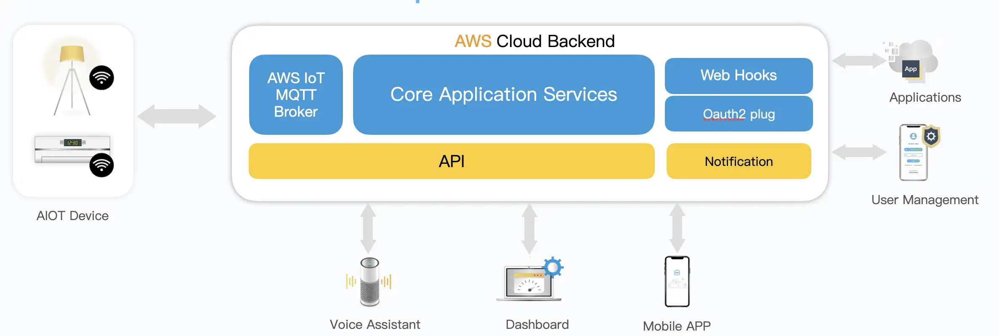



  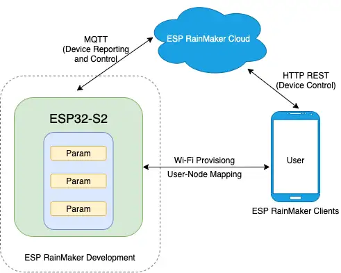


The RainMaker SDK is built on top of ESP-IDF and provides simple APIs to build applications based on ESP RainMaker.


  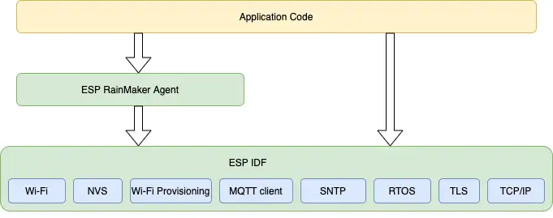


#### Node

A node is a single ESP32-based product. It has an associated identifier (Node ID) and a set of credentials provided by the Claiming Service.


  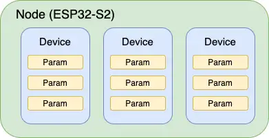


You can give a friendly name to the node. A single node can have exposure to multiple devices.

*Node Attributes*

Node Attributes are optional and exist as custom metadata for a given node, something like a serial number.

#### Device

A device is a logical user-controllable entity like Switch, Lightbulb, Thermostat, Temperature Sensor, etc. A simple node generally has a single device. However, an ESP32 may also have multiple devices.

For example, it might integrate two switches on a single board, or act as a bridge for other devices such as BLE sensors. Each device must have a unique name within the node, and, optionally, a type.

*Device Attributes*

Similar to node attributes, device attributes are name-value pairs that act as metadata for the device. These name-value pairs are additional, user-defined, and read-only that can include information such as firmware version, serial number.

Device attributes are particularly useful when there are multiple devices bridged to the node, such as Wi-Fi to wired network, BLE, Zigbee, etc.

#### Parameters

Parameters are monitoring parameters of a device, such as the ON/OFF power state, brightness, current/target temperature, etc. All such parameters must have a unique name within the device.

They can also have additional fields like value, type, bounds, UI information, etc. The parameter values can be boolean, integer, float, or string.

See the full list of supported [device types](https://docs.rainmaker.espressif.com/docs/product_overview/concepts/terminologies#devices).

#### Services

A service is an entity very similar to a device in terms of its structure. The main difference is that services are designed for operations that the user might not necessarily need to interact with.

A typical example of this is the OTA Firmware Upgrade Service, which can have parameters like url, status, etc.

### Cloud

For the cloud, you can get access to the devices via the [RainMaker dashboard](https://dashboard.rainmaker.espressif.com), where you can:

- See all the nodes
- Create node groups
- Manage the firmware updates (OTA)
- Manage keys

With the RainMaker dashboard, you can't control the device parameters. This is only possible with the RainMaker mobile application, CLI, or via REST [APIs](https://swaggerapis.rainmaker.espressif.com/).

[Client Cloud Communication](https://rainmaker.espressif.com/docs/spec-client-cloud)


### Related documents

- [ESP RainMaker](https://rainmaker.espressif.com/) website
- [ESP RainMaker](https://github.com/espressif/esp-rainmaker) GitHub repository
- [RainMaker documentation](https://rainmaker.espressif.com/docs/intro/)
- [RainMaker Programming Guide](https://docs.espressif.com/projects/esp-rainmaker/en/latest/esp32/index.html)
- [RainMaker dashboard](https://dashboard.rainmaker.espressif.com)

You can also use the phone apps, supported on Android and iOS.

- [RainMaker Android App](https://play.google.com/store/apps/details?id=com.espressif.rainmaker)
- [RainMaker iOS App](https://apps.apple.com/us/app/esp-rainmaker/id1497491540?platform=iphone)

---

## Assignment 1: Install the Espressif-IDE

To get started and perform all the workshop assignments, you will need to install the [Espressif-IDE](https://github.com/espressif/idf-eclipse-plugin/releases/tag/v3.0.0). This IDE will be used to create the project, then flash and debug the code.

> As an alternative, you can use the VS Code extension for ESP-IDF or you can use the Command-Line-Interface (CLI) directly, however, this workshop is based on the Espressif-IDE and all the assignments will follow the steps using this IDE.

### Install the Espressif-IDE

This assignment will be done by the following tutorial: [Getting Started with IDEs Workshop](../espressif-ide/).

You will need to:

- Install all the necessary drivers for Windows
- Install the Espressif-IDE
- Install the ESP-IDF
- Create the first project
- Build
- Flash
- Debug

Now that you know how to use the Espressif-IDE, let's get started with ESP-IDF and create a new RainMaker project.

---

## Assignment 2: Install ESP RainMaker

After installing the Espressif-IDE and ESP-IDF, we need to clone the RainMaker repository. Right now there are no ways to install it directly from the Espressif-IDE.

To manually install, you will need to clone the [esp-rainmaker](https://github.com/espressif/esp-rainmaker) repository on GitHub.

**Clone the repository**

```bash
$ git clone --recursive https://github.com/espressif/esp-rainmaker.git
```

Clone this repository in the same folder as ESP-IDF. Usually `c:/esp` or at your home directory. **Avoid long paths!**

**Install the mobile phone application**

- [Android App](https://play.google.com/store/apps/details?id=com.espressif.rainmaker)
- [iOS App](https://apps.apple.com/us/app/esp-rainmaker/id1497491540?platform=iphone)

---

## Assignment 3: Build the IoT device

To get started with ESP RainMaker, we will build the application in 3 steps:

1. LED light bulb
2. Switch
3. Thermostat

**LED light bulb**: This device represents the LED light bulb where you can set `Name`, `Power`, `Brightness`, `Color Temperature`, `Hue`, `Saturation`, `Intensity`, `Light Mode`.

**Switch**: This device is the light switch and you will need to set `Name` and `Power` parameters. The power parameter is a `boolean` type and represents the on and off state.

**Thermostat** This device is a thermostat and you will need to set `Name`, `Setpoint Temperature`, `Temperature`, `AC Mode`, and `Power` parameters.

### Steps

The typical code for any ESP RainMaker based application is as follows:

1. Initialize Wi-Fi (`app_wifi_init()`), which also initializes the MAC address that will act as the unique node identifier (`node_id`) for self-claiming.
2. Initialize the ESP RainMaker node (`esp_rmaker_node_init()`) by passing to it a configuration (`esp_rmaker_config_t`), node name, and type.
3. Create a device (`esp_rmaker_device_create()`). The RainMaker node in itself has no specific value, unless it has a device under it. In our example, we create a device named "Switch", for which we also provide a write callback. The callback will be invoked if a write request is received for any parameter under the Switch device.
4. Add parameters and other metadata. A switch device, at the minimum, will have at least the standard power parameter. Marking some parameter as primary gives it prominence in the phone apps.
5. Add the device to the node.
6. Start the RainMaker Agent (`esp_rmaker_start()`). This will start the RainMaker core task which will wait for Wi-Fi, do the claiming (if required), connect to the RainMaker cloud over MQTT, report the node configuration, report the values of parameters, and then wait for commands.
7. Start Wi-Fi (`app_wifi_start()`). If the ESP32 is already provisioned, it will join the configured Wi-Fi network. Else, it will start the Wi-Fi provisioning. Note that rainmaker should be initialized and started before this call.

### Node

To create the node, we need to set the following parameters in the `esp_rmaker_node_init` function:

- **config**: Configuration to be used by the ESP RainMaker, set as the structure `rainmaker_cfg`.
- **name**: Name of the node set as "Espressif Workshop Light".
- **type**: Type of the node set as "Lightbulb".

Example:

```c
esp_rmaker_node_t *node = esp_rmaker_node_init(&rainmaker_cfg, "Espressif Workshop Light", "Lightbulb");
```

Call the function `esp_rmaker_node_init` to initialize the node.

Function [esp_rmaker_node_init](https://docs.espressif.com/projects/esp-rainmaker/en/latest/esp32/c-api-reference/rainmaker_core.html?highlight=esp_rmaker_node_init#_CPPv420esp_rmaker_node_initPK19esp_rmaker_config_tPKcPKc) reference.

### Device

To create the light bulb device, you can use the function `esp_rmaker_lightbulb_device_create` which will facilitate the device creation. You will see later how to create the device manually.

Example:

```c
esp_rmaker_device_t *light_device;
light_device = esp_rmaker_lightbulb_device_create("Light", NULL, DEFAULT_POWER);
esp_rmaker_device_add_bulk_cb(light_device, bulk_write_cb, NULL);
```

See the reference [here](https://docs.espressif.com/projects/esp-rainmaker/en/latest/esp32/c-api-reference/rainmaker_standard_types.html?highlight=esp_rmaker_lightbulb_device_create#_CPPv434esp_rmaker_lightbulb_device_createPKcPvb).

### Parameters

Once you create the device, it's time to create the device parameters. The device parameters will be created to control the functionalities, like brightness, hue, and saturation.

It's important to mention that on this example, the LED (WS2812) control will be handled by `app_driver.c`.

Example:

```c
esp_rmaker_device_add_param(light_device, esp_rmaker_brightness_param_create(ESP_RMAKER_DEF_BRIGHTNESS_NAME, DEFAULT_BRIGHTNESS));
esp_rmaker_device_add_param(light_device, esp_rmaker_hue_param_create(ESP_RMAKER_DEF_HUE_NAME, DEFAULT_HUE));
esp_rmaker_device_add_param(light_device, esp_rmaker_saturation_param_create(ESP_RMAKER_DEF_SATURATION_NAME, DEFAULT_SATURATION));
```

The function `esp_rmaker_device_add_param` will add parameter to the `light_device`, including the param name and default value.

After adding all the parameters, you can add the device to the node.

Example:

```c
esp_rmaker_node_add_device(node, light_device);
```

### Custom device

To create the device manually, you will need to call different functions.

1. Create the device by calling `esp_rmaker_device_create`.
2. Add the callback function to handle the received command using the function `esp_rmaker_device_add_cb`.
3. Set the parameters with `esp_rmaker_device_add_param` then `esp_rmaker_param_create`.
4. Add the UI (`esp_rmaker_param_add_ui_type`) type to be used with the RainMaker application and assign the primary parameter with `esp_rmaker_device_assign_primary_param`.
5. Define the parameter limits (boundary) with `esp_rmaker_param_add_bounds` if applicable to the parameter.

In this example, the device is a light with 2 parameters, the on/off with a toggle widget and the brightness with a slider that goes from 0 to 100 in steps of 1.

```c
esp_rmaker_device_t *device = esp_rmaker_device_create("Light", NULL, NULL);
esp_rmaker_device_add_cb(device, write_cb, NULL);

esp_rmaker_device_add_param(device, esp_rmaker_param_create("name", NULL, esp_rmaker_str("Light"),
            PROP_FLAG_READ | PROP_FLAG_WRITE | PROP_FLAG_PERSIST));

esp_rmaker_param_t *power_param = esp_rmaker_param_create("power", NULL, esp_rmaker_bool(true),
            PROP_FLAG_READ | PROP_FLAG_WRITE);

esp_rmaker_param_add_ui_type(power_param, ESP_RMAKER_UI_TOGGLE);
esp_rmaker_device_add_param(device, power_param);
esp_rmaker_device_assign_primary_param(device, power_param);

esp_rmaker_param_t *brightness_param = esp_rmaker_param_create("brightness", NULL, esp_rmaker_int(100),
            PROP_FLAG_READ | PROP_FLAG_WRITE);
esp_rmaker_param_add_ui_type(brightness_param, ESP_RMAKER_UI_SLIDER);
esp_rmaker_param_add_bounds(brightness_param, esp_rmaker_int(0), esp_rmaker_int(100), esp_rmaker_int(1));
esp_rmaker_device_add_param(device, brightness_param);
```

#### Hands on session to create a device

Let's now create the device!

First, you will need to import the project into your Espressif IDE workspace. Go to `File` -> `Import` -> `Espressif` -> `Existing IDF Project` and select the `workshop-rainmaker` located inside the workshop shared folder or in the [ESP Workshop](https://github.com/pedrominatel/esp-workshops/tree/main/workshop-iot-rainmaker/assignment/workshop-rainmaker) repository.

1. Open the project and change the `CMakeLists.txt` to point to your RainMaker folder:

```c
# The following lines of boilerplate have to be in your project's CMakeLists
# in this exact order for cmake to work correctly
cmake_minimum_required(VERSION 3.5)

if(DEFINED ENV{RMAKER_PATH})
  set(RMAKER_PATH $ENV{RMAKER_PATH})
else()
  set(RMAKER_PATH <PATH-TO-RAINMAKER-FOLDER>/esp-rainmaker)
endif(DEFINED ENV{RMAKER_PATH})

# Add RainMaker components and other common application components
set(EXTRA_COMPONENT_DIRS ${RMAKER_PATH}/components/esp-insights/components ${RMAKER_PATH}/components ${RMAKER_PATH}/examples/common)

set(PROJECT_VER "1.0")
include($ENV{IDF_PATH}/tools/cmake/project.cmake)
project(workshop-rainmaker)
```

2. Change the `app_main.c` file and add the RainMaker code to the `app_main`:

```c
void app_main()
{

    esp_rmaker_console_init();
    app_driver_init();

    /* Initialize NVS. */
    esp_err_t err = nvs_flash_init();
    if (err == ESP_ERR_NVS_NO_FREE_PAGES || err == ESP_ERR_NVS_NEW_VERSION_FOUND) {
        ESP_ERROR_CHECK(nvs_flash_erase());
        err = nvs_flash_init();
    }
    ESP_ERROR_CHECK( err );

    app_wifi_init();

    esp_rmaker_config_t rainmaker_cfg = {
        .enable_time_sync = false,
    };

    esp_rmaker_node_t *node = esp_rmaker_node_init(&rainmaker_cfg, "Espressif Workshop Light", "Lightbulb");
    if (!node) {
        ESP_LOGE(TAG, "Could not initialise node. Aborting!!!");
        vTaskDelay(5000/portTICK_PERIOD_MS);
        abort();
    }

    // Enable the OTA with the default configuration
    esp_rmaker_ota_enable_default();
    // Enable the timezone service to get the correct time at the given timezone
    esp_rmaker_timezone_service_enable();
    // Enable the scheduling service
    esp_rmaker_schedule_enable();
    // Enable the scenes service
    esp_rmaker_scenes_enable();
    // Start RainMaker
    esp_rmaker_start();
    // Start WiFi
    err = app_wifi_start(POP_TYPE_RANDOM);
    if (err != ESP_OK) {
        ESP_LOGE(TAG, "Could not start Wifi. Aborting!!!");
        vTaskDelay(5000/portTICK_PERIOD_MS);
        abort();
    }
}
```

3. Add the light bulb device:

```c
esp_rmaker_device_t *light_device;

void device_create_lightbulb(esp_rmaker_node_t *node)
{

    light_device = esp_rmaker_lightbulb_device_create("Light", NULL, DEFAULT_POWER);
    esp_rmaker_device_add_bulk_cb(light_device, bulk_write_cb, NULL);

    esp_rmaker_device_add_param(light_device,
                esp_rmaker_brightness_param_create(ESP_RMAKER_DEF_BRIGHTNESS_NAME, DEFAULT_BRIGHTNESS));
    esp_rmaker_device_add_param(light_device,
                esp_rmaker_hue_param_create(ESP_RMAKER_DEF_HUE_NAME, DEFAULT_HUE));
    esp_rmaker_device_add_param(light_device,
                esp_rmaker_saturation_param_create(ESP_RMAKER_DEF_SATURATION_NAME, DEFAULT_SATURATION));

    esp_rmaker_node_add_device(node, light_device);
}
```

Also, add the callback function to handle the light bulb:

```c
static esp_err_t bulk_write_cb(const esp_rmaker_device_t *device, const esp_rmaker_param_write_req_t write_req[],
        uint8_t count, void *priv_data, esp_rmaker_write_ctx_t *ctx)
{
    if (ctx) {
        ESP_LOGI(TAG, "Received write request via : %s", esp_rmaker_device_cb_src_to_str(ctx->src));
    }

    ESP_LOGI(TAG, "Light received %d params in write", count);
    for (int i = 0; i < count; i++) {
        const esp_rmaker_param_t *param = write_req[i].param;
        esp_rmaker_param_val_t val = write_req[i].val;
        const char *device_name = esp_rmaker_device_get_name(device);
        const char *param_name = esp_rmaker_param_get_name(param);
        if (strcmp(param_name, ESP_RMAKER_DEF_POWER_NAME) == 0) {
            ESP_LOGI(TAG, "Received value = %s for %s - %s",
                    val.val.b? "true" : "false", device_name, param_name);
            app_light_set_power(val.val.b);
        } else if (strcmp(param_name, ESP_RMAKER_DEF_BRIGHTNESS_NAME) == 0) {
            ESP_LOGI(TAG, "Received value = %d for %s - %s",
                    val.val.i, device_name, param_name);
            app_light_set_brightness(val.val.i);
        } else if (strcmp(param_name, ESP_RMAKER_DEF_HUE_NAME) == 0) {
            ESP_LOGI(TAG, "Received value = %d for %s - %s",
                    val.val.i, device_name, param_name);
            app_light_set_hue(val.val.i);
        } else if (strcmp(param_name, ESP_RMAKER_DEF_SATURATION_NAME) == 0) {
            ESP_LOGI(TAG, "Received value = %d for %s - %s",
                    val.val.i, device_name, param_name);
            app_light_set_saturation(val.val.i);
        } else {
            ESP_LOGI(TAG, "Updating for %s", param_name);
        }
        esp_rmaker_param_update(param, val);
    }
    return ESP_OK;
}
```

4. Add the switch device as a custom device for multi-device feature:

```c
void device_create_switch(esp_rmaker_node_t *node)
{

    esp_rmaker_device_t *switch_device = esp_rmaker_device_create("Switch", ESP_RMAKER_DEVICE_SWITCH, NULL);
    esp_rmaker_device_add_cb(switch_device, write_cb, NULL);

    esp_rmaker_param_t *power_param = esp_rmaker_param_create("Power", ESP_RMAKER_PARAM_POWER, esp_rmaker_bool(false),
    			PROP_FLAG_READ | PROP_FLAG_WRITE);

    esp_rmaker_param_add_ui_type(power_param, ESP_RMAKER_UI_TOGGLE);
    esp_rmaker_device_add_param(switch_device, power_param);

    esp_rmaker_node_add_device(node, switch_device);
}
```

5. Add the thermostat device:

```c
void device_create_thermostat(esp_rmaker_node_t *node)
{

    esp_rmaker_device_t *thermo_device = esp_rmaker_device_create("Thermostat", ESP_RMAKER_DEVICE_THERMOSTAT, NULL);
    esp_rmaker_device_add_cb(thermo_device, write_cb, NULL);

    esp_rmaker_param_t *power_param = esp_rmaker_param_create("Power", ESP_RMAKER_PARAM_POWER, esp_rmaker_bool(false),
				PROP_FLAG_READ | PROP_FLAG_WRITE);

    esp_rmaker_param_add_ui_type(power_param, ESP_RMAKER_UI_TOGGLE);
    esp_rmaker_device_add_param(thermo_device, power_param);

	esp_rmaker_param_t *temp_param = esp_rmaker_param_create(ESP_RMAKER_DEF_TEMPERATURE_NAME, ESP_RMAKER_PARAM_TEMPERATURE,
                esp_rmaker_float(20.0),
	            PROP_FLAG_READ);
	esp_rmaker_param_add_ui_type(temp_param, ESP_RMAKER_UI_TEXT);
	esp_rmaker_device_add_param(thermo_device, temp_param);

	esp_rmaker_param_t *setpoint_param = esp_rmaker_param_create("Temperature Set", ESP_RMAKER_PARAM_TEMPERATURE,
                esp_rmaker_int(20),
	            PROP_FLAG_READ | PROP_FLAG_WRITE);
	esp_rmaker_param_add_ui_type(setpoint_param, ESP_RMAKER_UI_SLIDER);
	esp_rmaker_param_add_bounds(setpoint_param, esp_rmaker_int(15), esp_rmaker_int(30), esp_rmaker_int(1));
	esp_rmaker_device_add_param(thermo_device, setpoint_param);

    esp_rmaker_node_add_device(node, thermo_device);
}
```

6. Create the callback function for the custom devices:

```c
static esp_err_t write_cb(const esp_rmaker_device_t *device, const esp_rmaker_param_t *param,
            const esp_rmaker_param_val_t val, void *priv_data, esp_rmaker_write_ctx_t *ctx)
{
    if (ctx) {
        ESP_LOGI(TAG, "Received write request via : %s", esp_rmaker_device_cb_src_to_str(ctx->src));
    }
    return ESP_OK;
}
```

For the final assignment code, please use the [workshop-rainmaker-final](https://github.com/pedrominatel/esp-workshops/tree/main/workshop-iot-rainmaker/assignment-final/workshop-rainmaker-final)

**Extra**

Create a function to update the temperature values for the thermostat parameter.

```c
static void device_thermo_temp_update(esp_rmaker_device_t *device, float temp)
{
    esp_rmaker_param_update_and_report(
            esp_rmaker_device_get_param_by_type(device, ESP_RMAKER_PARAM_TEMPERATURE),
            esp_rmaker_float(temp));
}
```

### Wi-Fi provisioning

After configuring the node, device, and parameters, you can call `esp_rmaker_start` to trigger the claiming process, establish Wi-Fi and then MQTT connection, and report the node parameters, values, and configuration.

To do the claiming/provisioning, we will use the RainMaker mobile phone application.


    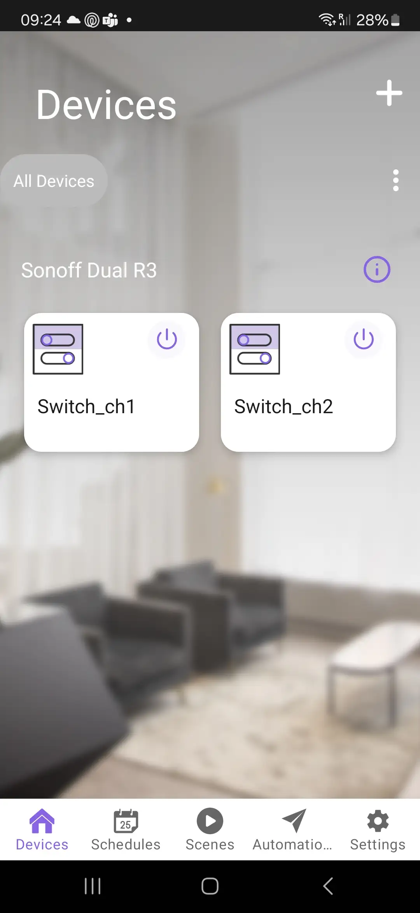
    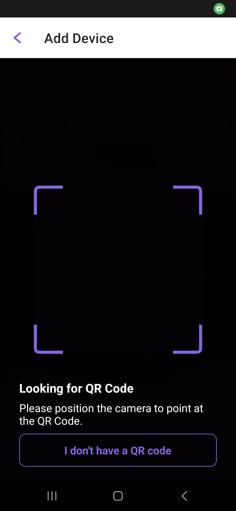
    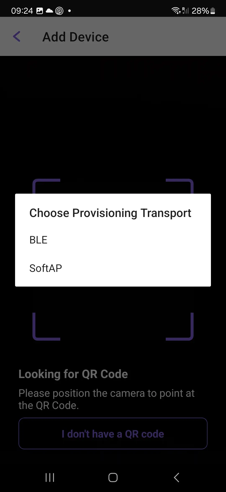
    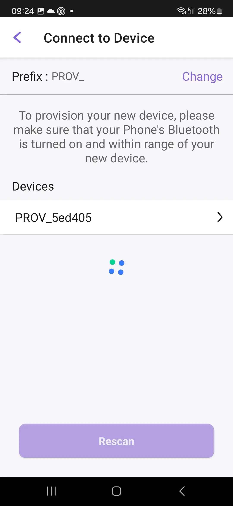
    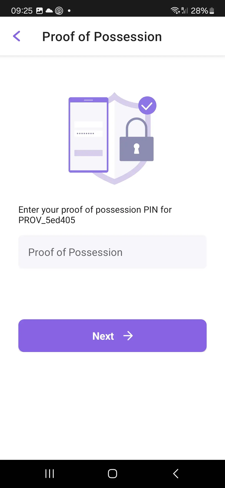
    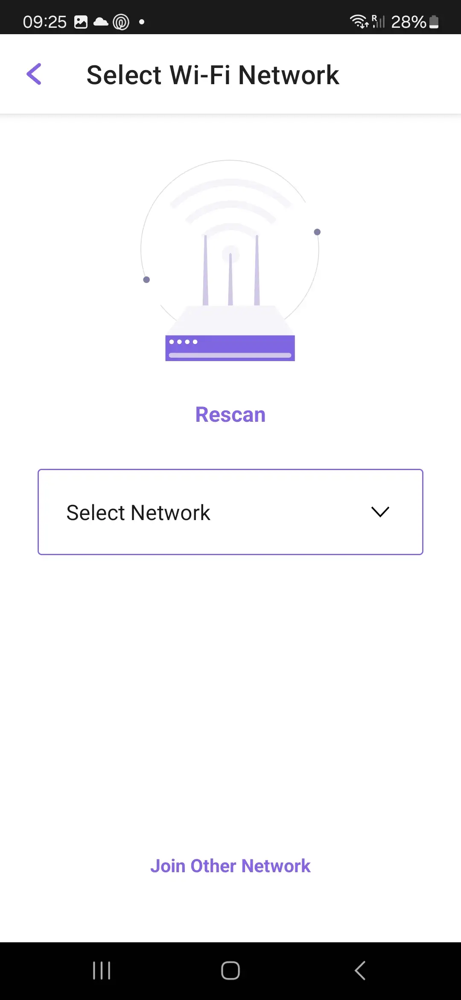
    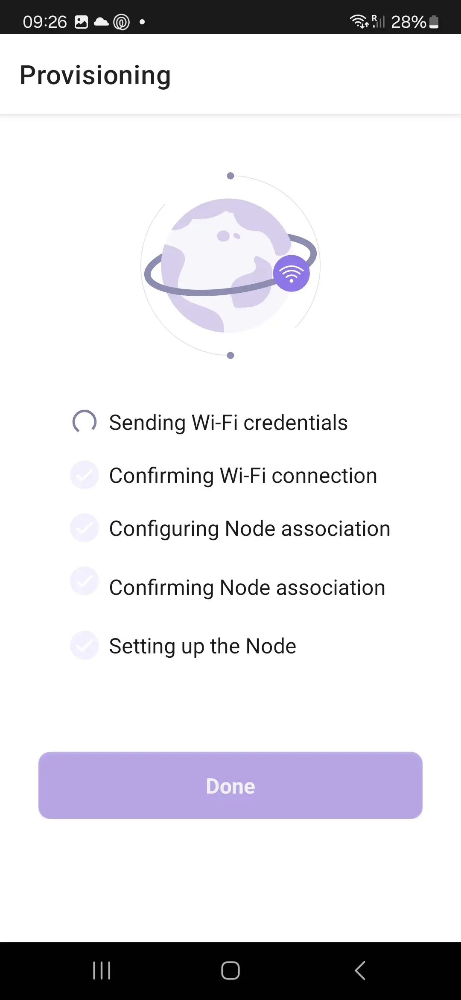
    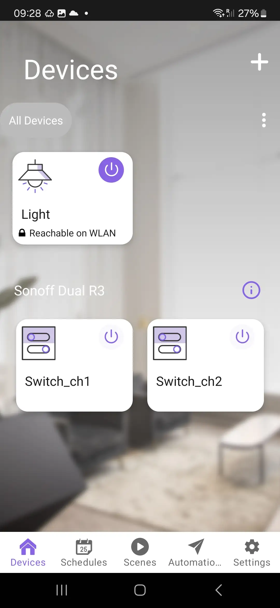


After the provisioning process, you can reset to factory mode by pressing and holding the `BOOT` button on the DevKit-C.

### ESP Insights

The RainMaker is integrated with [ESP Insights](https://insights.espressif.com/).

> ESP Insights allows developers to view stack back-traces and register dumps for firmware running on devices.

With Insights you can:

- **Track Metrics**: Pre-defined system metrics or record your own custom metrics.
- **Crash Backtraces**: Inspect device crashes with detailed backtraces.
- **Device Logs**: Check all kinds of logs like Errors, Warnings, Reboots, etc.

To enable the ESP Insights you need to:

1. Call `app_insights_enable`:

```c
app_insights_enable();
```

2. In `sdkconfig`, set `Enable ESP Insights`:

In `Component config` -> `ESP Insights`, set `Enable ESP Insights `.

Now you will have access to see the device metrics in the [ESP Insights Dashboard](https://dashboard.insights.espressif.com).


  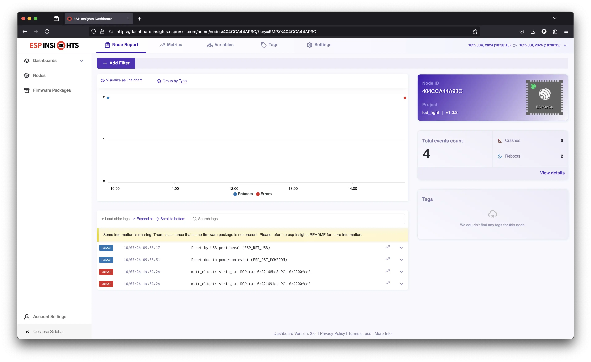



  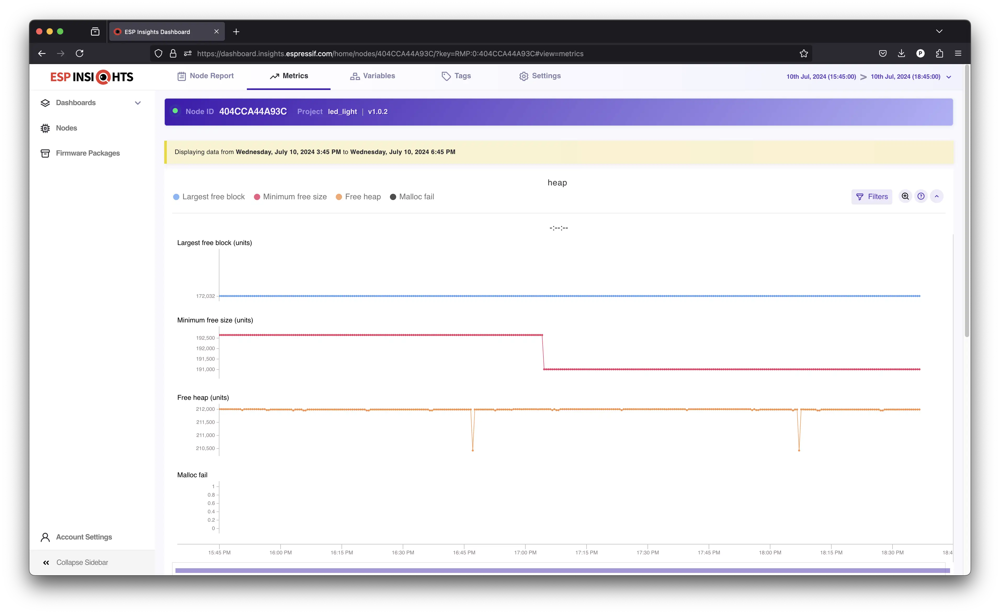



  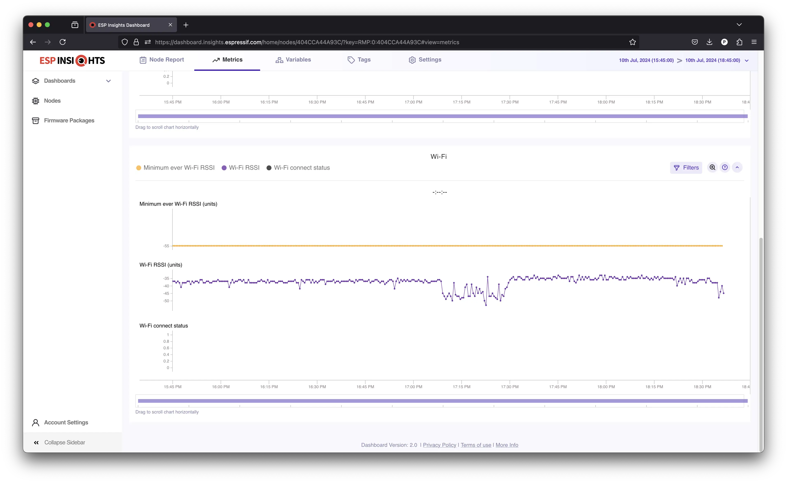



  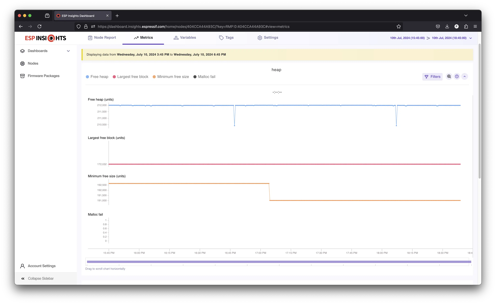


---

## Assignment 4: Google Home integration

One important features for an IoT device user experience is the ecosystem integration. This is important to keep all the controls in just on place.

If you are using Google Voice Assistant or Alexa to control your devices, RainMaker offers the integration that will allow you to control and do the automations via the voice assistant application.

To configure the integration with Google Home application, follow the steps below.

1. On your mobile phone, open the **Google Home** app.
1. Tap on `+` -> `Set up Device`.
1. Select the option `Works with Google` meant for devices that are already set up.
1. Search for ESP RainMaker and sign in using your RainMaker credentials.
1. Once the Account linking is successful, your RainMaker devices will show up and you can start using them.

For Alexa, please use this documentation: [Enabling Alexa](https://docs.rainmaker.espressif.com/docs/dev/firmware/fw_usage_guides/voice-assistant-usage/#enabling-alexa).

After linking your RainMaker account with the Google Home app, you will be able to see and control all devices in your RainMaker account.

---

## Assignment 5: Over-the-air update

If your device is connected, you must be able to update it remotely.

In a connected world, devices can fail, and security breaches can be discovered. If you have issues with your firmware in the field, you must be able to fix and update the devices without physical intervention.

To do that, Over-The-Air (OTA) updates solves this issue.

RainMaker supports OTA with just one line of code:

```c
esp_rmaker_ota_enable_default();
```

Then on the backend side, you can upload the firmware image and create a new OTA task and trigger the OTA update.


1. Go to `Firmware Images` -> `Add Image`.


  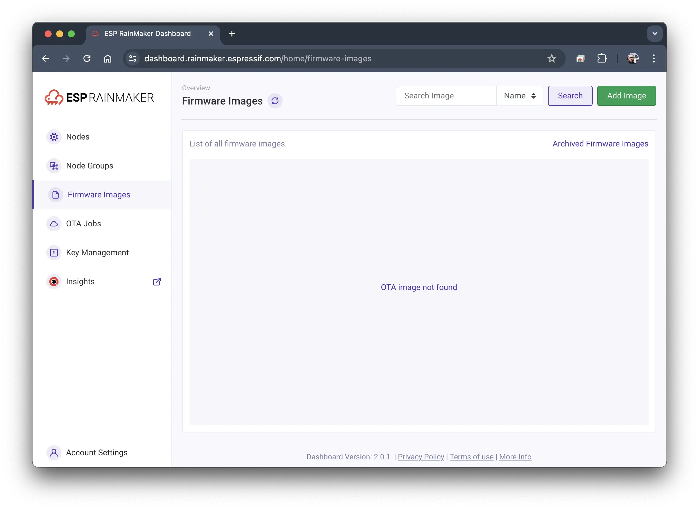


2. Fill out the image name, type, and select the image file (.bin).
3. In the `Advanced` section, you can also define the secure sign keys, bootloader file, firmware version, and model.


  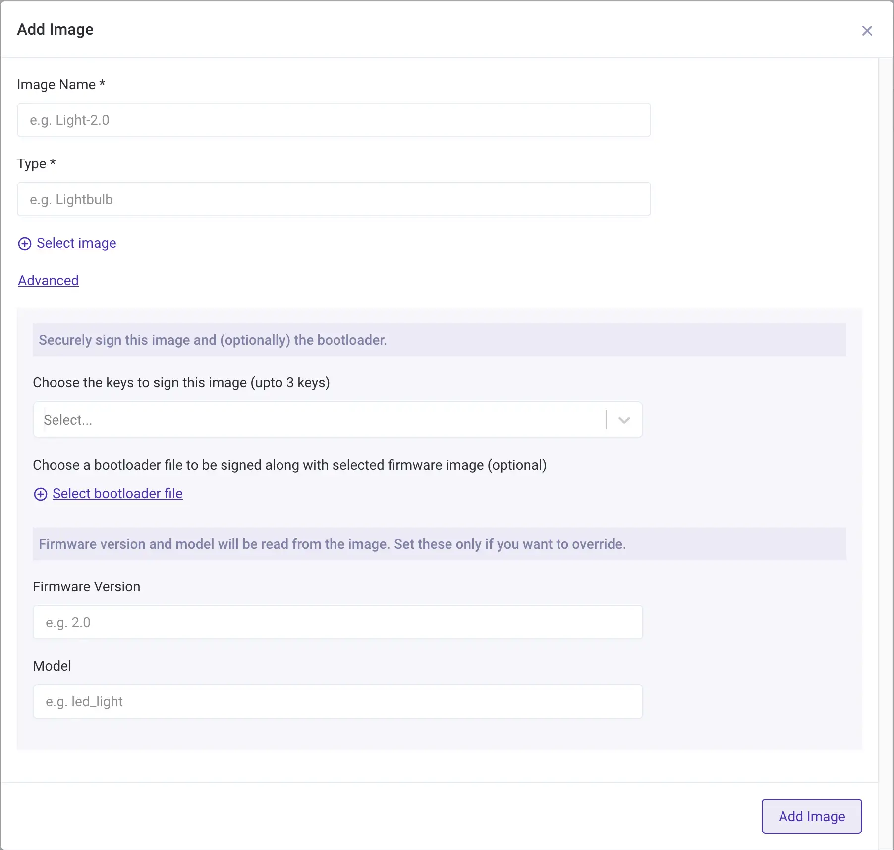


Once you add the image to the RainMaker backend, you can create the OTA job.

1. In the list of uploaded images, select `Start OTA` in the selected image.
2. Enter the job name.
3. Select the node group or nodes that will be updated.
4. Check `Force Push` if you need to run the OTA right away.
5. Start OTA.

You can use the `Advanced` option to schedule the OTA.

If everything if properly configured, the firmware update will start and this action will take a while to complete.

You can check the task progress in the `OTA Jobs`. Once the OTA is completed, you can check the firmware version in the `Nodes` list.

---

## Assignment 6: Introduction to Matter

Espressif’s SDK for Matter has been developed over the open-source Matter SDK to provide a simplified API and the required tools for building Matter-compatible devices with Espressif SoCs. This SDK defines periodic releases and support structures that ensure maintaining the in-field devices effectively.

Making your devices Matter-compatible with ESP-ZeroCode Modules is as simple as just adding these modules to your devices.


  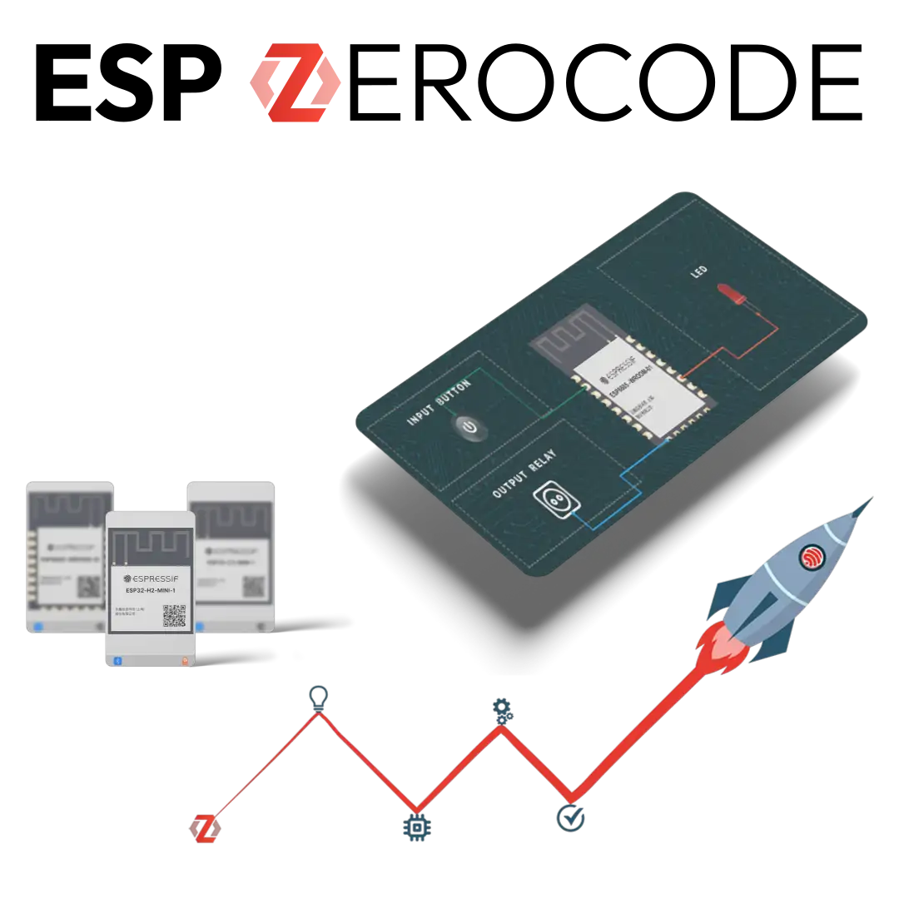


ESP ZeroCode supports different kinds of products like lightbulbs, lighting fixtures, led strips, sockets, switches, roller blinds, refrigerator, laundry washer, thermostat and more.

Choose any Espressif module from the ESP32-C2, ESP32-C3, ESP32-C6 and ESP32-H2 series.

Make changes as per your hardware configurations and visualize them on your selected module.

Validate your end-user workflow by testing it directly on your hardware.

Order modules pre-programmed with Matter-certified firmware as per your configuration. Mount the modules on your PCBs and launch.

1. Create [ESP ZeroCode](https://zerocode.espressif.com/) account
1. Create product
1. Flash using [ESP Launchpad](https://espressif.github.io/esp-launchpad/)
1. Provision using Google Home mobile application

> In order to use the Espressif vendor for development purpose, you need to enable your Google account as developer and create the Matter device types into your account using the console.

[Google Matter](https://developers.home.google.com/matter?hl=en)
[Developer Console](https://console.home.google.com/projects)

## Feedback

If you have any feedback for this workshop, please start a new [discussion on GitHub](https://github.com/espressif/developer-portal/discussions).
